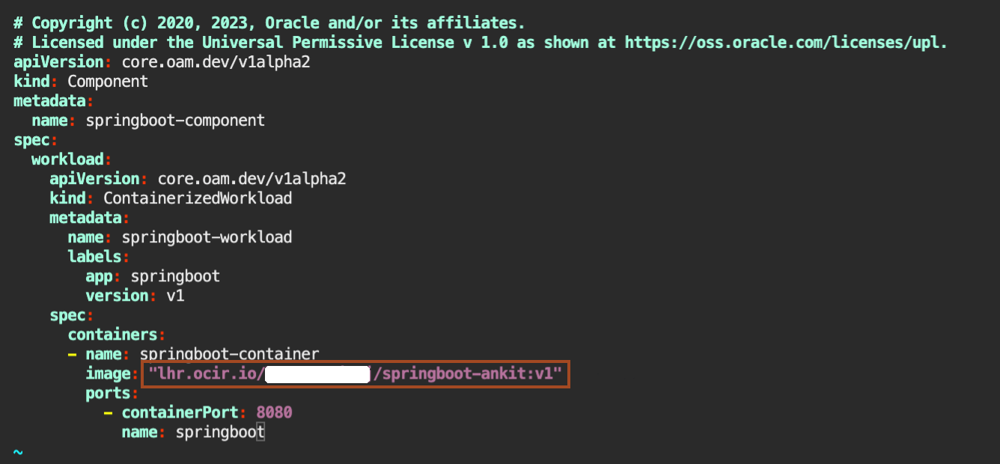

# Deploy Springboot Application on Verrazzano

## Introduction

This lab walks you through the process of deploying the springboot application docker image to OKE.

Estimated Time: 10 minutes

### Verrazzano and Application Deployment

Verrazzano supports application definition using [Open Application Model (OAM)](https://oam.dev/). Verrazzano applications are composed of components and application configurations.

When you deploy applications with Verrazzano, the platform sets up connections, and network policies, ingresses in the service mesh, and wires up a monitoring stack to capture the metrics, logs, and traces. Verrazzano employs OAM components to define the functional units of a system that are then assembled and configured by defining associated application configurations.

### Verrazzano components

A Verrazzano OAM component is a [Kubernetes Custom Resource](https://kubernetes.io/docs/concepts/extend-kubernetes/api-extension/custom-resources/) describing an application’s general composition and environment requirements.

The following code shows a simple springboot application component for tomcat sample application used in this lab. This resource describes a component which is implemented by a single Docker image containing a springboot application exposing a single endpoint.

```yaml
apiVersion: core.oam.dev/v1alpha2
kind: Component
metadata:
  name: springboot-component
spec:
  workload:
    apiVersion: core.oam.dev/v1alpha2
    kind: ContainerizedWorkload
    metadata:
      name: springboot-workload
      labels:
        app: springboot
        version: v1
    spec:
      containers:
      - name: springboot-container
        image: "EndpointOfYourRegion/TenancyNamespace/springboot-your_firstname:v1"
        ports:
          - containerPort: 8080
            name: springboot
```

A brief description of each field of the component:

* **apiVersion** - Version of the component custom resource definition
* **kind** - Standard name of the component custom resource definition
* **metadata.name** - The name used to create the component’s custom resource
* **spec.workload.kind** - ContainerizedWorkload defines a stateless workload of Kubernetes
* **spec.workload.spec.containers.ports.containerPort** - Ports exposed by the container

### Verrazzano Application Configurations

A Verrazzano application configuration is a Kubernetes Custom Resource which provides environment-specific customizations. The following code shows the application configuration for the Springboot application example used in this lab. This resource specifies the deployment of the application to the springboot namespace.

Additional runtime features are specified using traits, or runtime overlays that augment the workload. For example, the ingress trait specifies the ingress host and path, while the metrics trait provides the Prometheus scraper used to obtain the application-related metrics.

```yaml
apiVersion: core.oam.dev/v1alpha2
kind: ApplicationConfiguration
metadata:
  name: springboot-appconf
  annotations:
    version: v1.0.0
    description: "Spring Boot application"
spec:
  components:
    - componentName: springboot-component
      traits:
        - trait:
            apiVersion: oam.verrazzano.io/v1alpha1
            kind: MetricsTrait
            spec:
              scraper: verrazzano-system/vmi-system-prometheus-0
              path: "/actuator/prometheus"
        - trait:
            apiVersion: oam.verrazzano.io/v1alpha1
            kind: IngressTrait
            metadata:
              name: springboot-ingress
            spec:
              rules:
                - paths:
                    - path: "/"
                      pathType: Prefix
```

A brief description of each field in the application configuration:

* **apiVersion** - Version of the ApplicationConfiguration custom resource definition
* **kind** - Standard name of the application configuration custom resource definition
* **metadata.name** - The name used to create this application configuration resource
* **spec.components** - Reference to the application’s components leveraged to specify runtime configuration
* **spec.components[].traits** - The traits specified for the application’s components

To explore traits, we can examine the fields of an ingress trait:

* **apiVersion** - Version of the OAM trait custom resource definition
* **kind** - IngressTrait is the name of the OAM application ingress trait custom resource definition
* **spec.rules.paths** - The context paths for accessing the application


### Objectives

In this lab, you will:

* Deploy the springboot application.
* Verify the deployment of the springboot application.

### Prerequisites

To run this lab, you must have:

* Kubernetes (OKE) cluster running on the Oracle Cloud Infrastructure.
* Verrazzano installation started on a Kubernetes (OKE) cluster.
* Container packaged *`springboot-your_firstname`* application available in a container registry.


## Task 1: Deploy the Tomcat sample application 


1. Create a `springboot` namespace for the springboot application. We will keep all Kubernetes artefacts in a separate namespace.

    ```bash
    <copy>kubectl create namespace springboot</copy>
    ```

    >Namespaces are a way to organize clusters into virtual sub-clusters. We can have any number of namespaces within a cluster, each logically separated from others but with the ability to communicate with each other.

2. We need to make Verrazzano aware that we store in that namespace Verrazzano artifacts. So we need to add a label identifying the `springboot` namespace as managed by Verrazzano. Labels are intended to be used to specify identifying attributes of objects that are meaningful and relevant to users.

    Here, for the `springboot` namespace, we are attaching a label to it, which marks this namespace as managed by Verrazzano. The *istio-injection=enabled*, enables an Istio "sidecar", and as such, helps establish an Istio proxy. With an Istio proxy, we can access other Istio services like an Istio gateway. To add the label to the `springboot` namespace with the previously mentioned attributes, copy the following command and run it in the Cloud Shell:

    ```bash
    <copy>kubectl label namespace springboot verrazzano-managed=true istio-injection=enabled</copy>
    ```


3. In *~/springboot-app*, we have the configuration file for springboot application. As part of Lab 2, we built a new Docker image for the application component. Also, we pushed that Docker image to the Oracle Cloud Container Registry repository. Now, in this lab, we will modify the *springboot-comp.yaml* file so that it takes the new Docker image from the Oracle Cloud Container Registry repository. To modify the *springboot-comp.yaml* file, copy the following command and paste it in the *Cloud Shell*.

    ```bash
    <copy>vi ~/springboot-app/springboot-comp.yaml</copy>
    ```

4. As part of Lab 2, you saved your Docker image full name. You need to copy the following line and paste it in your text file. Then, you need to replace `docker image full name` with your Docker image name. Then copy the modified line and press *i* to insert the text in the `*springboot-comp.yaml*` file. Paste the output at line number **19** (make sure you keep the indentation), then press *Esc* and then type *:wq* to save the file.

    ```bash
    <copy>image:  `docker image full name`</copy>
    ```

     

5. Now, we want to deploy springboot containerized application on *cluster1*. For this, we need a Kubernetes deployment configuration. This deployment instructs the Kubernetes to create and update instances for the springboot application. Here, we have the `springboot-comp.yaml` file, which instructs Kubernetes.

    To deploy the springboot application, copy and paste the following two commands as shown. The `springboot-comp.yaml` file contains definitions of various OAM components, where, an OAM component is a Kubernetes Custom Resource describing an application’s general composition and environment requirements.
    ```bash
    <copy>kubectl apply -f ~/springboot-app/springboot-comp.yaml -n springboot</copy>
    ```
    The `springboot-app.yaml` file is a Verrazzano application configuration file, which provides environment-specific customizations.
    ```bash
    <copy>kubectl apply -f ~/springboot-app/springboot-app.yaml -n springboot</copy>
    ```

6. Wait for the pods to be in *Running* status. Use this *kubectl* command to wait for all the pods to be in the *Running* state within the *springboot* namespace. It takes around 1-2 minutes.

    ```bash
    <copy>kubectl wait --for=condition=Ready pods --all -n springboot --timeout=600s</copy>
    ```

    When the pods are ready you can see a similar response:

    ```bash
    $ kubectl wait --for=condition=Ready pods --all -n kubectl wait --for=condition=Ready pods --all -n springboot --timeout=600s --timeout=600s
    pod/springboot-workload-5c4ffc8954-mbgbb condition met
    pod/springboot-workload-bfb9d487-dwp7q condition met
    ```
    You can also list the pods directly to check their status:
    ```bash
    <copy>kubectl  get po -n springboot</copy>
    ```

    ```bash
    $ kubectl  get po -n springboot
    NAME                                 READY   STATUS    RESTARTS   AGE
    springboot-workload-bfb9d487-dwp7q   2/2     Running   0          68s
    $
    ```


## Task 2: Verify the Successful Deployment of the Springboot Application


1. Verify the `/sample-webapp/` endpoint. To determine the URL that was constructed from the external/load balancer IP and application configuration, execute the following command:

    ```bash
    <copy>echo https://$(kubectl get gateways.networking.istio.io springboot-springboot-appconf-gw -n springboot -o jsonpath={.spec.servers[0].hosts[0]})/facts</copy>
    ```

    This will print the proper URL to your REST endpoint, for example:

    ```bash
    https://springboot-appconf.springboot.xx.xx.xx.xx.nip.io/facts
    ```

2. Paste the URL in the browser and click on *Refresh* button in the browser. Every time, you click on Refresh button, it provides you a random fact about Verrazzano. 
  
     

You may now **proceed to the next lab**.


## Acknowledgements

* **Author** -  Ankit Pandey
* **Contributors** - Maciej Gruszka, Sid Joshi
* **Last Updated By/Date** - Ankit Pandey, April 2023