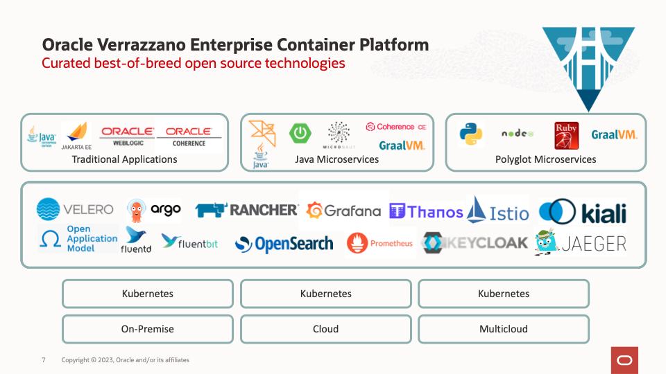

# Introduction

## About this Workshop

In this workshop, we will explore how to deploy Spring Boot applications to an Oracle Kubernetes Engine (OKE) cluster using Verrazzano.

In today's digital age, businesses are seeking ways to develop and deploy applications faster and more efficiently. Kubernetes has become the de facto standard for container orchestration, enabling organizations to deploy, manage, and scale containerized applications. Oracle Kubernetes Engine (OKE) provides a managed Kubernetes service that simplifies the deployment and management of containerized applications on Oracle Cloud Infrastructure (OCI).

Spring Boot is a popular Java-based framework used to build web applications and microservices. It offers a streamlined development experience with a convention-over-configuration approach, making it an excellent choice for building and deploying containerized applications on Kubernetes.

Verrazzano is an open-source, Kubernetes-native platform that provides a complete end-to-end solution for deploying and managing cloud-native applications. It simplifies the deployment of complex, multi-component applications by providing a unified view of the application topology, as well as a set of integrated tools for deployment, monitoring, and management.

This workshop is designed to be as self-explanatory as possible, but feel free to ask for clarification or assistance along the way.

Estimated Time: 90 minutes

### Objectives

* Set up your Oracle Cloud Free Tier account (if you haven't done so already).
* Setting up an OKE cluster on OCI
* Installing and configuring Verrazzano on the cluster
* Building a container image for a Spring Boot application
* Deploying the application to the OKE cluster using Verrazzano
* Monitoring and managing the application using Verrazzano's integrated tools

### Prerequisites

* You must have an [Oracle Cloud Infrastructure](https://cloud.oracle.com/en_US/cloud-infrastructure) enabled account.

## Learn More

**About Springboot**

Spring Boot is a popular Java-based framework used to build web applications and microservices. It offers a streamlined development experience with a convention-over-configuration approach, making it an excellent choice for building and deploying containerized applications on Kubernetes.

Spring Boot provides a variety of features that make it easy to build and deploy applications quickly, such as embedded servers, auto-configuration, and a wide range of libraries and tools for building web applications, messaging systems, and data-driven applications. It also offers a rich set of tools for testing and debugging, making it easier to write robust and reliable code.

One of the key benefits of Spring Boot is its ability to easily integrate with other technologies and frameworks, including database systems, message queues, and caching systems. This allows developers to build complex, distributed systems that can handle large-scale workloads and meet the demands of modern, cloud-based applications.

With its focus on simplicity and ease of use, Spring Boot has become a popular choice among developers and organizations looking to build modern, cloud-native applications. It has a vibrant community of contributors and users, and is continuously evolving to meet the changing needs of the industry.

**About Verrazzano**

Verrazzano is an end-to-end enterprise container platform for deploying cloud-native and traditional applications in multi-cloud and hybrid environments. It is made up of a curated set of open source components – many that you may already use and trust, and some that were written specifically to pull together all of the pieces that make Verrazzano a cohesive and easy-to-use platform.

Verrazzano includes the following capabilities:
- Hybrid and multicluster workload management
- Special handling for WebLogic, Coherence, and Helidon applications
- Multicluster infrastructure management
- Integrated and pre-wired application monitoring
- Integrated security
- DevOps and GitOps enablement

* [https://spring.io/](https://spring.io/)
* [https://verrazzano.io/](https://verrazzano.io/)

## Acknowledgements

* **Author** -  Ankit Pandey
* **Contributors** - Maciej Gruszka, Sid Joshi
* **Last Updated By/Date** - Ankit Pandey, April 2023
