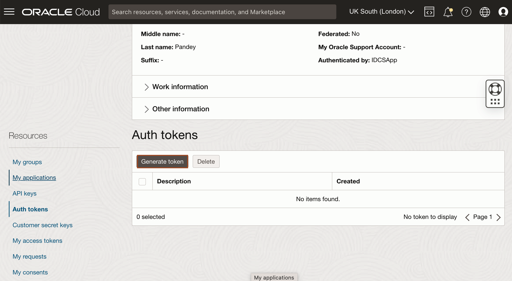

# Push Tomcat Application Image to Oracle Cloud Container Registry

## Introduction

In this lab, you will build a Docker image with your tomcat application and push that image to a repository inside the Oracle Cloud Container Registry.

Estimated Time: 10 minutes

### Objectives

* Build and package your application using Docker.
* Generate an Authentication Token to log in to the Oracle Cloud Container Registry.
* Push tomcat application Docker image to your Oracle Cloud Container Registry repository.

### Prerequisites

* Docker
* Oracle Cloud Account

## Task 1: Download the application source code

1. Copy and paste the following command to download the source code for this workshop.
    ```bash
    <copy>curl -LSs https://objectstorage.uk-london-1.oraclecloud.com/p/5DhoxZ22MseWaoSjG3EoBRf6DF5JbQ1QyR7tHa2qem-7IHb7nNEymF1ZSm2eA1ix/n/lrv4zdykjqrj/b/ankit-bucket/o/tomcat-examples.zip >~/tomcat-examples.zip</copy>
    ```

2. Copy and paste the following command to unzip the source code and change the current directory to application folder.
    ```bash
    <copy>unzip ~/tomcat-examples.zip
    cd ~/tomcat-examples/</copy>
    ```


## Task 2: Build the Tomcat Application Docker Image

We'll start by preparing the Docker image that you will use to deploy on Verrazzano.

We are creating a Docker image, which you will upload to the Oracle Cloud Container Registry that belongs to your OCI account. To do so you need to create an image name which reflects your registry coordinates.

You need the following information:

* Region Name
* Tenancy Namespace
* Endpoint for the Region
    >Copy this information to a text editor so that you can refer to it throughout the lab.


1. Locate your *Region Name*. <br>
Your *Region Name* is located in the top right corner of the Oracle Cloud Console, in this example, it is shown as *UK South (London)*. Yours may be different.

    

2. Locate the *Tenancy Namespace*. <br>
In the Console, open the navigation menu and click **Developer Services**. Under **Containers & Artifacts**, click **Container Registry**.
    

    > The tenancy namespace is listed in the compartment. Copy and save it in a text editor. You will use this information in the next lab, too.
    

3. Locate the *Endpoint for Your Region*. <br>
Refer to the table documented at this URL [https://docs.oracle.com/en-us/iaas/Content/Registry/Concepts/registryprerequisites.htm#Availab](https://docs.oracle.com/en-us/iaas/Content/Registry/Concepts/registryprerequisites.htm#Availab). In the example shown, the endpoint for the region is *UK South (London)* (as the region name) and its endpoint is *lhr.ocir.io*. Locate the endpoint for your own *Region Name* and save it in the text editor. You will also need it for the next lab.

    

    >Now you have both the tenancy namespace and endpoint for your region.

4. Copy the following command and paste it into your text editor. Then replace the *`ENDPOINT_OF_YOUR_REGION`* with the endpoint of your region name, *`NAMESPACE_OF_YOUR_TENANCY`* with your tenancy's namespace and *`your_first_name`* with your's first name.

    ```bash
    <copy>docker build -t ENDPOINT_OF_YOUR_REGION/NAMESPACE_OF_YOUR_TENANCY/tomcat-example-your_first_name:v1 .</copy>
    ```
    When the command is ready then run in the Cloud Shell from the `~/tomcat-examples/` directory. The build will produce the following result:

    ```bash
    $ cd ~/tomcat-examples/
    $ $ docker build -t lhr.ocir.io/tenancy-namespace/tomcat-example-ankit:v1 .
    Sending build context to Docker daemon  1.097MB
    Step 1/10 : FROM tomcat:8.0-alpine
    Trying to pull repository docker.io/library/tomcat ... 
    8.0-alpine: Pulling from docker.io/library/tomcat
    4fe2ade4980c: Pull complete 
    6fc58a8d4ae4: Pull complete 
    7d9bd64c803b: Pull complete 
    a22aedc5ac11: Pull complete 
    5bde63ae3587: Pull complete 
    69cb0c9b940a: Pull complete 
    Digest: sha256:d02a16c0147fcae13d812fa670a4b3c9944f5328b10a5a463ad697d2aa5bb063
    Status: Downloaded newer image for tomcat:8.0-alpine
    ---> 624fb61775c3
    Step 2/10 : LABEL maintainer="ankit.x.pandey@oracle.com"
    ---> Running in 20cc23726499
    Removing intermediate container 20cc23726499
    ---> 50245c696fb6
    Step 3/10 : ADD sample-webapp.war /usr/local/tomcat/webapps/
    ---> 727c55f91bb5
    Step 4/10 : RUN mkdir /data
    ---> Running in f3129a859e11
    Removing intermediate container f3129a859e11
    ---> 9ce0f5674f51
    Step 5/10 : ADD jmx_prometheus_javaagent-0.17.0.jar /data/jmx_prometheus_javaagent-0.17.0.jar
    ---> f03cc9ee1bee
    Step 6/10 : ADD prometheus-jmx-config.yaml /data/prometheus-jmx-config.yaml
    ---> 50c51ae6a148
    Step 7/10 : ENV JAVA_OPTS="-javaagent:/data/jmx_prometheus_javaagent-0.17.0.jar=8088:/data/prometheus-jmx-config.yaml"
    ---> Running in 5e9effd5d494
    Removing intermediate container 5e9effd5d494
    ---> 85ca06fcd965
    Step 8/10 : EXPOSE 8088
    ---> Running in 795325f82526
    Removing intermediate container 795325f82526
    ---> 19dfc6fd903c
    Step 9/10 : EXPOSE 8080
    ---> Running in 43be96f20275
    Removing intermediate container 43be96f20275
    ---> 7d9bcaa7a271
    Step 10/10 : CMD ["catalina.sh", "run"]
    ---> Running in 3e25cd78ab88
    Removing intermediate container 3e25cd78ab88
    ---> 516065fe1bf5
    Successfully built 516065fe1bf5
    Successfully tagged lhr.ocir.io/tenancynamespace/tomcat-example-ankit:v1
    $
    ```

5. This creates the Docker image, which you can check in your local repository.

    ```bash
    $ docker images
    REPOSITORY                           TAG IMAGE ID      CREATED       SIZE
    lhr.ocir.io/name/tomcat-example-ankit v1 516065fe1bf5 2 minutes ago  147MB
    tomcat                       8.0-alpine  624fb61775c3 4 years ago    147MB
    ```
    Copy to your text editor the replaced full image name `ENDPOINT_OF_YOUR_REGION/NAMESPACE_OF_YOUR_TENANCY/tomcat-example-ankit:v1` because you will need it later.

## Task 3: Generate an Authentication Token to log in to the Oracle Cloud Container Registry

In this step, we are going to generate an *Authentication Token*, that we will use to log in to the Oracle Cloud Container Registry.

1. Select the User Icon in the top right corner and then select *My Profile*.

    

2. Scroll down and select *Auth Tokens*.

    

3. Click *Generate Token*.

    

4. Copy *`tomcat-example-your_first_name`* and paste it in the *Description* box and click *Generate Token*.

    

5. Select *Copy* under Generated Token and paste it in the text editor. We cannot copy it later. Then click *Close*.

    

## Task 4: Push the tomcat Application Docker Image to your Container Registry Repository

1. In Task 1 of this lab, you opened a URL [https://docs.oracle.com/en-us/iaas/Content/Registry/Concepts/registryprerequisites.htm#Availab](https://docs.oracle.com/en-us/iaas/Content/Registry/Concepts/registryprerequisites.htm#Availab) and determined the endpoint for your Region name and copied it to a text editor. In our example, the Region Name is UK South (London). You will need this information for this task.
    

2. Copy the following command and paste it into your text editor and then replace the `ENDPOINT_OF_REGION_NAME` with the endpoint of your region.

    >In our example the Region Name is *UK South (London)* and the endpoint is *lhr.ocir.io*. You will need your specific information for this task.

    ```bash
    <copy>docker login ENDPOINT_OF_REGION_NAME</copy>
    ```

3. In the previous step, you also determined the tenancy namespace.
Enter the Username as follows: `NAMESPACE_OF_YOUR_TENANCY`/`YOUR_ORACLE_CLOUD_USERNAME`. <br>
    * Replace `NAMESPACE_OF_YOUR_TENANCY` with your tenancy's namespace
    * Replace `YOUR_ORACLE_CLOUD_USERNAME` with your Oracle Cloud Account user name and then copy the replaced username from your text editor and paste it into the *Cloud Shell*.
    * For Password, copy and paste the Authentication Token from your text editor (or wherever you saved it.)

    ```bash
    $ docker login lhr.ocir.io
    Username: NAMESPACE_OF_YOUR_TENANCY/YOUR_ORACLE_CLOUD_USERNAME
    Password:
    Login Succeeded
    ```
4. Navigate back to the Container Registry. In the Console, open the navigation menu and click **Developer Services**. Under **Containers & Artifacts**, click **Container Registry**.
    

5. Select the compartment and then click **Create Repository**.
    

6. Select the compartment and enter *`tomcat-example-your_first_name`* as the Repository Name, then choose Access as **Public** and click **Create Repository**.

    

7. To push your Docker image into your repository inside the Oracle Cloud Container Registry, copy and paste the following command in your text editor and then replace `ENDPOINT_OF_YOUR_REGION_NAME`/`NAMESPACE_OF_YOUR_TENANCY`/tomcat-example-your_first_name:1.0 with Docker image full name, which you saved earlier.

    ```bash
    <copy>docker push ENDPOINT_OF_YOUR_REGION_NAME/NAMESPACE_OF_YOUR_TENANCY/tomcat-example-ankit:v1</copy>
    ```
    The result should look like this:
    ```bash
    $ docker push lhr.ocir.io/tenancynamespace/tomcat-example-ankit:v1
    The push refers to repository [lhr.ocir.io/tenancynamespace/tomcat-example-ankit]
    4b193f4c616d: Pushed 
    0469528628db: Pushed 
    cce8193c4190: Pushed 
    ca36c0db4673: Pushed 
    0136a6a85859: Pushed 
    98a0db77a14c: Pushed 
    9072514c7af0: Pushed 
    f6146a44a7d3: Pushed 
    0c3170905795: Pushed 
    df64d3292fd6: Pushed 
    v1: digest: sha256:65b562a7117870540f1807e0d796fe964e6428bda0ae290b8a6389bf637d1aba size: 2405
    $ 
    ```

8. After the *docker push* command runs successfully, expand the *`tomcat-example-ankit:v1`* repository and you will notice a new image has been uploaded to this repository.

    

You may now **proceed to the next lab**.

## Acknowledgements

* **Author** -  Ankit Pandey
* **Contributors** - Maciej Gruszka, Sid Joshi
* **Last Updated By/Date** - Ankit Pandey, March 2023
