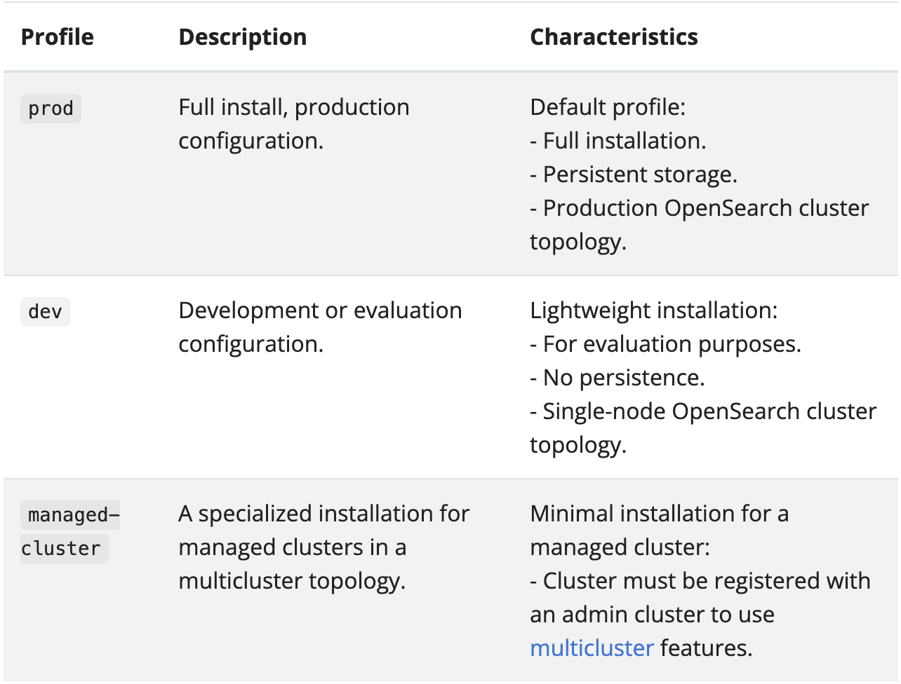
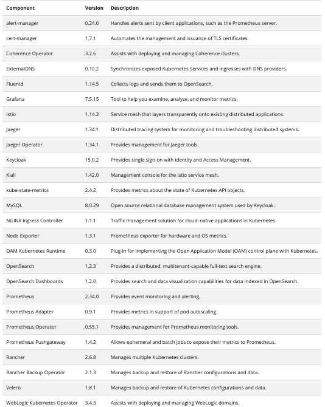

# Install Verrazzano

## Introduction

This lab walks you through the steps to install Verrazzano on a Kubernetes cluster in the Oracle Cloud Infrastructure.

Estimated time: 20 minutes

### About Product/Technology

Verrazzano is an end-to-end enterprise container platform for deploying cloud-native and traditional applications in multicloud and hybrid environments. It is made up of a curated set of open source components – many that you may already use and trust, and some that were written specifically to pull together all of the pieces that make Verrazzano a cohesive and easy to use platform.

Verrazzano includes the following capabilities:

* Hybrid and multicluster workload management
* Special handling for WebLogic, Coherence, and Helidon applications
* Multicluster infrastructure management
* Integrated and pre-wired application monitoring
* Integrated security
* DevOps and GitOps enablement

### Objectives

In this lab, you will:

* Install the Verrazzano command-line tool.
* Install the development (`dev`) profile of Verrazzano.
* Verify the successful Verrazzano installation.

### Prerequisites

Verrazzano requires the following:

* A Kubernetes cluster and a compatible `kubectl`.
* At least 2 CPUs, 100GB disk storage, and 16GB RAM available on the Kubernetes worker nodes. This is sufficient to install the development profile of Verrazzano. Depending on the resource requirements of the applications you deploy, this may or may not be sufficient for deploying your applications.

<if type="freetier">
In Lab 1, you created a Kubernetes cluster on the Oracle Cloud Infrastructure. You will use that Kubernetes cluster, *cluster1*, for installing the development profile of Verrazzano.
</if>

<if type="livelabs">
In Lab 1, you created configuration file to access Kubernetes cluster on the Oracle Cloud Infrastructure. You will use that Kubernetes cluster, *cluster1*, for installing the development profile of Verrazzano.
</if>

## Task 1: Install the vz CLI


1. Download the latest vz CLI.

    ```bash
    <copy>curl -LO https://github.com/verrazzano/verrazzano/releases/download/v1.5.2/verrazzano-1.5.2-linux-amd64.tar.gz</copy>
    ```
    The output should be similar to the following:
    ```bash
    % Total    % Received % Xferd  Average Speed   Time    Time     Time  Current
                                 Dload  Upload   Total   Spent    Left  Speed
  0     0    0     0    0     0      0      0 --:--:-- --:--:-- --:--:--     0
100 39.7M  100 39.7M    0     0  23.6M      0  0:00:01  0:00:01 --:--:-- 32.7M
    ```

2. Download the checksum file.

    ```bash
    <copy>curl -LO https://github.com/verrazzano/verrazzano/releases/download/v1.5.2/verrazzano-1.5.2-linux-amd64.tar.gz.sha256</copy>
    ```

  The output should be similar to the following:

    ```bash
    % Total    % Received % Xferd  Average Speed   Time    Time     Time  Current
                                 Dload  Upload   Total   Spent    Left  Speed
  0     0    0     0    0     0      0      0 --:--:-- --:--:-- --:--:--     0
100   102  100   102    0     0    218      0 --:--:-- --:--:-- --:--:--   218
    ```

3. Validate the binary against the checksum file.

    ```bash
    <copy>sha256sum -c verrazzano-1.5.2-linux-amd64.tar.gz.sha256</copy>
    ```

    The output should be similar to the following:
    ```bash
    verrazzano-1.5.2-linux-amd64.tar.gz: OK
    ```

4. Unpack and move to the vz binary directory,

    ```bash
    <copy>tar xvf verrazzano-1.5.2-linux-amd64.tar.gz
    cd ~/verrazzano-1.5.2/bin/</copy>
    ```

5. Test to ensure that the version you installed is up-to-date.

    ```bash
    <copy>./vz version</copy>
    ```

    The output should be similar to the following:
    ```bash
    Version: v1.5.2
    BuildDate: 2023-03-15T23:56:21Z
    GitCommit: 0326ee67fb4bf559024537e77be65213ab230c5e
    ```


## Task 2: Installation of the Verrazzano development profile

An installation profile is a well-known configuration of Verrazzano settings that can be referenced by name, which can then be customized as needed.

Verrazzano supports the following installation profiles: development (`dev`), production (`prod`), and managed cluster (`managed-cluster`).

The following image describes the Verrazzano installation profiles.


To change profiles in any of the following commands, set the *VZ_PROFILE* environment variable to the name of the profile you want to install.

For a complete description of Verrazzano configuration options, see the [Verrazzano Custom Resource Definition](https://verrazzano.io/docs/reference/api/verrazzano/verrazzano/).

In this lab, we are going to install the *development profile of Verrazzano*, which has the following characteristics:

* Wildcard (nip.io) DNS
* Self-signed certificates
* Shared observability stack used by the system components and all applications
* Ephemeral storage for the observability stack (if the pods are restarted, you lose all of your logs and metrics)
* It has a lightweight installation.
* It is for evaluation purposes.
* Single-node Opensearch cluster topology.

Verrazzano installs a curated set of open source components. The following table lists each component, its version, and a brief description.



According to our DNS choice, we can use nip.io (wildcard DNS) or [Oracle OCI DNS](https://docs.cloud.oracle.com/en-us/iaas/Content/DNS/Concepts/dnszonemanagement.htm). In this lab, we are going to install using nip.io (wildcard DNS).

An ingress controller is something that helps provide access to Docker containers to the outside world (by providing an IP address). The ingress routes the IP address to different clusters.

1. Install using the nip.io DNS Method. Copy the following command and paste it in the *Cloud Shell* to install Verrazzano.

    ```bash
    <copy>./vz install -f - <<EOF
    apiVersion: install.verrazzano.io/v1beta1
    kind: Verrazzano
    metadata:
      name: example-verrazzano
    spec:
      profile: dev
    EOF
    </copy>
    ```

    The output should be similar to the following:
    ```bash
    Installing Verrazzano version v1.5.2
    Applying the file https://github.com/verrazzano/verrazzano/releases/download/v1.5.2/verrazzano-platform-operator.yaml
    customresourcedefinition.apiextensions.k8s.io/verrazzanos.install.verrazzano.io created
    namespace/verrazzano-install created
    serviceaccount/verrazzano-platform-operator created
    clusterrole.rbac.authorization.k8s.io/verrazzano-managed-cluster created
    clusterrolebinding.rbac.authorization.k8s.io/verrazzano-platform-operator created
    service/verrazzano-platform-operator created
    service/verrazzano-platform-operator-webhook created
    deployment.apps/verrazzano-platform-operator created
    deployment.apps/verrazzano-platform-operator-webhook created
    mutatingwebhookconfiguration.admissionregistration.k8s.io/verrazzano-mysql-backup created
    validatingwebhookconfiguration.admissionregistration.k8s.io/verrazzano-platform-operator-webhook created
    validatingwebhookconfiguration.admissionregistration.k8s.io/verrazzano-platform-mysqlinstalloverrides created
    validatingwebhookconfiguration.admissionregistration.k8s.io/verrazzano-platform-requirements-validator created
    Waiting for verrazzano-platform-operator to be ready before starting install - 23 seconds
    2023-03-21T09:48:40.827Z info Reconciling Verrazzano resource default/example-verrazzano, generation 1, version 
    2023-03-21T09:48:41.065Z info Starting EventSource
    2023-03-21T09:48:41.065Z info Starting EventSource
    2023-03-21T09:48:41.065Z info Starting EventSource
    ```

    <if type="freetier">
    > It takes around 15 to 20 minutes to complete the installation. This command installs the Verrazzano platform operator and applies the Verrazzano custom resource.
    </if>

    <if type="livelabs">
    > It takes around 8 to 10 minutes to complete the installation. This command installs the Verrazzano platform operator and applies the Verrazzano custom resource.
    </if>


2. Wait for the installation to complete. Installation logs will be streamed to the command window until the installation has completed or until the default timeout (30m) has been reached.


## Task 3: Verification of a successful Verrazzano installation

Verrazzano installs multiple objects in multiple namespaces. Verrazzano components are installed in the namespace *verrazzano-system*.

1. Please verify that all the pods associated with the multiple objects have a *Running* status. You will have 14 pods in the *Running* state.

    ```bash
    <copy>kubectl get pods -n verrazzano-system</copy>
    ```

    The output should be similar to the following:

    ```bash
    $   kubectl get pods -n verrazzano-system
    NAME                                    READY   STATUS  RESTARTS AGE
    coherence-operator-b5dc669c6-rk2sm      1/1     Running   1       23m
    fluentd-54f5x                           2/2     Running   1       11m
    fluentd-h7mgh                           2/2     Running   1       11m
    fluentd-xcdfz                           2/2     Running   0       11m
    oam-kubernetes-runtime-5b48f944b-cx7b9  1/1     Running   0       24m
    verrazzano-application-operator-665c5   1/1     Running   0       22m
    verrazzano-application-operator-webhook 1/1     Running   0       22m
    verrazzano-authproxy-67776ff58b-8l      3/3     Running   0       21m
    verrazzano-cluster-operator-67dc5695    1/1     Running   0       14m
    verrazzano-cluster-operator-webhook     1/1     Running   0       14m
    verrazzano-console-7d95c98cb9-9ql2      2/2     Running   0       20m
    verrazzano-monitoring-operator-59f      2/2     Running   0       21m
    vmi-system-es-master-0                  2/2     Running   0       19m
    vmi-system-grafana-7fd956b585-2tbgl     3/3     Running   0       19m
    vmi-system-kiali-dd87546d6-ddxss        2/2     Running   0       22m
    vmi-system-osd-7687d6fccf-nm7kt         2/2     Running   0       14m
    weblogic-operator-54979449f4-njgrq      2/2     Running   0       22m
    weblogic-operator-webhook-f7ff8c8cf     1/1     Running   0       22m
    ```

You may now **proceed to the next lab**.

## Acknowledgements

* **Author** -  Ankit Pandey
* **Contributors** - Maciej Gruszka, Sid Joshi
* **Last Updated By/Date** - Ankit Pandey,  March 2023
