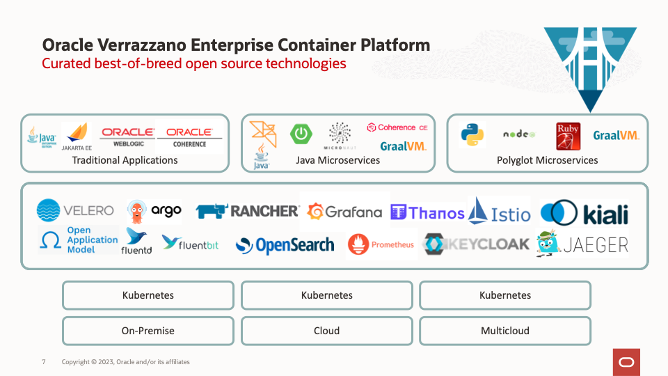

# Introduction

## About this Workshop

Deploying a Tomcat application on a Kubernetes cluster can be a complex process that involves managing multiple containers, configuring networking, and ensuring high availability and scalability. To simplify this process, many organizations are turning to containerization technologies such as Docker and Kubernetes.

Docker allows for the creation of portable container images that can be deployed on any platform, while Kubernetes provides a powerful orchestration engine that can manage the deployment and scaling of containers.

Oracle Verrazzano is a cloud-native platform that provides a unified management experience for deploying and operating containerized applications on Kubernetes clusters. It simplifies the deployment of complex applications by providing a consistent set of tools and APIs that can be used to manage and monitor applications across multiple clusters.

In this workshop, we will explore the process of deploying a Tomcat application Docker image to an Oracle Kubernetes cluster using Verrazzano. We will cover the steps involved in creating a Docker image, configuring Verrazzano, deploying the application, and monitoring its performance. 

By the end of this workshop, you will have a clear understanding of how to deploy containerized applications on an Oracle Kubernetes cluster using Verrazzano.

This workshop is designed to be as self-explanatory as possible, but feel free to ask for clarification or assistance along the way.

Estimated Time: 90 minutes

### Objectives

* Set up your Oracle Cloud Free Tier account (if you haven't done so already).
* Set up an Oracle Kubernetes Engine instance on the Oracle Cloud Infrastructure.
* Install the Verrazzano production profile.
* Create sample tomcat application docker image.
* Deploy tomcat application to OKE using Verrazzano.
* Explore Grafana, Prometheus and OpenSearch Dashboard console.

### Prerequisites

* You must have an [Oracle Cloud Infrastructure](https://cloud.oracle.com/en_US/cloud-infrastructure) enabled account.

## Learn More

**About Tomcat**

Apache Tomcat is an open-source web server and servlet container that is widely used to deploy Java-based web applications. Tomcat is designed to be lightweight, efficient, and easy to use, and it provides a rich set of features for managing and deploying web applications. 

**About Verrazzano**

Verrazzano is an end-to-end enterprise container platform for deploying cloud-native and traditional applications in multi-cloud and hybrid environments. It is made up of a curated set of open source components – many that you may already use and trust, and some that were written specifically to pull together all of the pieces that make Verrazzano a cohesive and easy-to-use platform.

Verrazzano includes the following capabilities:
- Hybrid and multicluster workload management
- Special handling for WebLogic, Coherence, and Helidon applications
- Multicluster infrastructure management
- Integrated and pre-wired application monitoring
- Integrated security
- DevOps and GitOps enablement

* [https://tomcat.apache.org/](https://tomcat.apache.org/)
* [https://verrazzano.io/](https://verrazzano.io/)

## Acknowledgements

* **Author** -  Ankit Pandey
* **Contributors** - Maciej Gruszka, Sid Joshi
* **Last Updated By/Date** - Ankit Pandey, March 2023
