# Access the Bobby's Books sample application Explore Verrazzano, Grafana and Kiali Console

## Introduction

In Lab 3, we deployed the Bobby's Book application. In this lab, we will access the application and verify that it is working. Later, we will explore the Verrazzano and Grafana consoles.

Estimated time: 10 minutes

### Objectives

In this lab, you will:

* Access the Bobby's Book application.
* Explore the Verrazzano console.
* Explore the Grafana console.

### Prerequisites

<if type="freetier">
* Run Lab 1, which creates an OKE cluster on the Oracle Cloud Infrastructure.
</if>

<if type="livelabs">
* Run Lab 1, which configure kubectl to access an OKE cluster on the Oracle Cloud Infrastructure.
</if>

* Run Lab 2, which installs Verrazzano on a Kubernetes cluster.
* Run Lab 3, which deploys the Bobby's Book application.
* You should have a text editor, where you can paste the commands and URLs and modify them, as per your environment. Then you can copy and paste the modified commands for running them in the *Cloud Shell*.
* We recommend to use Firefox for opening the URLs of Bobby's Books application, Verrazano, Grafana and Kiali Console. However, if you want to use Chrome, then you need to use the undocumented 'thisisunsafe' workaround to allow chrome to accept the cert.

## Task 1: Access the Bobby's Book application

1. We need an `EXTERNAL_IP` address through which we can access the Bobby's Book application. To get the `EXTERNAL_IP` address of the istio-ingressgateway service, copy the following command and paste it in the *Cloud Shell*.

      ```bash
      <copy> kubectl get service \
      -n "istio-system" "istio-ingressgateway" \
      -o jsonpath={.status.loadBalancer.ingress[0].ip}; echo</copy>
      ```

   The output should be similar to the following:
      ```bash
         $ kubectl get service \
         > -n "istio-system" "istio-ingressgateway" \
         > -o jsonpath={.status.loadBalancer.ingress[0].ip}; echo
         XX.XX.XX.XX
      ```
2. To open the Robert's Book Store Home Page, copy the following URL and replace *XX.XX.XX.XX* with your *EXTERNAL_IP* address which we got in the last step, as shown in the following image.

      ```bash
      <copy>https://bobs-books.bobs-books.XX.XX.XX.XX.nip.io/</copy>
      ```

   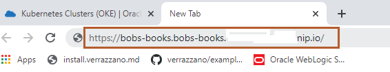

3. Click *Advanced*, as shown:

   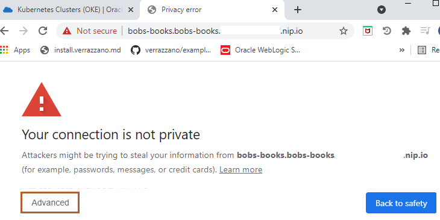


4. Select *Proceed to bobs-books.bobs-books. EXTERNAL_IP .nip.io(unsafe)* to access the application. If you are the not getting this option for proceed, just type *thisisunsafe* without any space anywhere inside this chrome browser window. As you are typing in the chrome browser window, you can't see it, but as soon as you finish typing *thisisunsafe*, you can see application page immediately. You can find more details [here](https://verrazzano.io/latest/docs/faq/faq/#enable-google-chrome-to-accept-self-signed-verrazzano-certificates).

   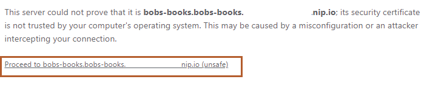
   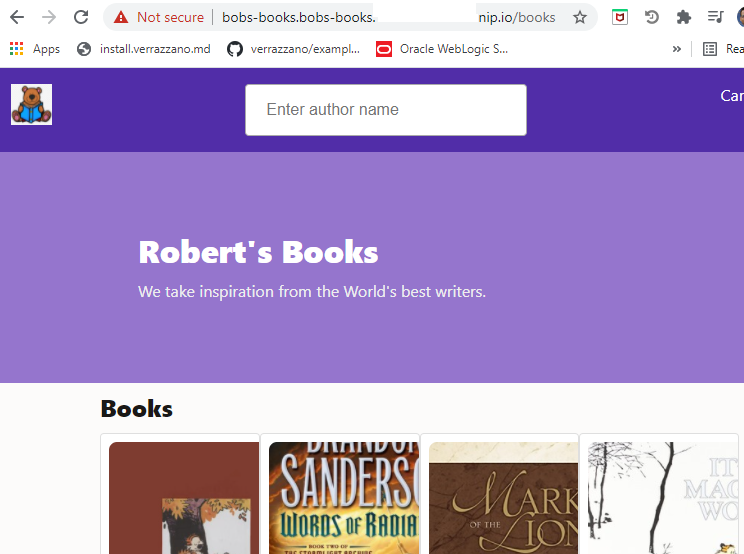

5. To open the Bobby's Book Store Home page, open a new tab and copy the following URL and replace *XX.XX.XX.XX* with your `EXTERNAL_IP` address, as shown in the following image.

      ```bash
      <copy>https://bobs-books.bobs-books.XX.XX.XX.XX.nip.io/bobbys-front-end/</copy>
      ```

      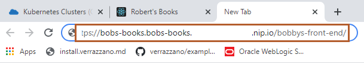

      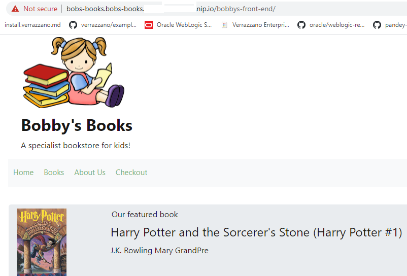

      > Leave this page open  because we will use it in Lab 8.

6. To open the Bobby's Book Order Manager UI, open a new tab and copy the following URL and replace *XX.XX.XX.XX* with your *EXTERNAL_IP* address as shown in the following image.

      ```bash
      <copy>https://bobs-books.bobs-books.XX.XX.XX.XX.nip.io/bobs-bookstore-order-manager/orders</copy>
      ```

   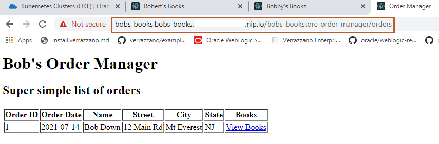

7. Go Back to the *Bobby's Books* page and let's purchase a book. Click *Books* as shown in the following image.

   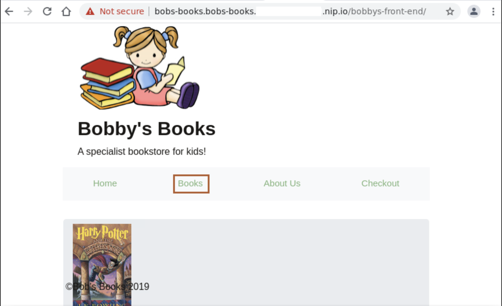

8. Select the image for the *Twilight* Book, as shown in the following image.

   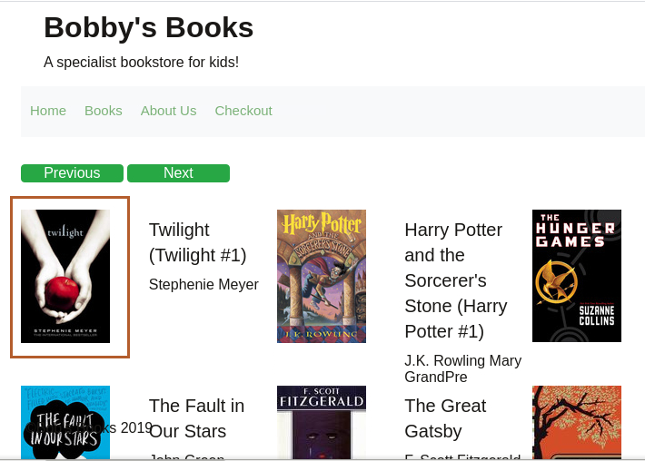

9. First, click *Add to cart* and then *Checkout* as shown in the following image.

   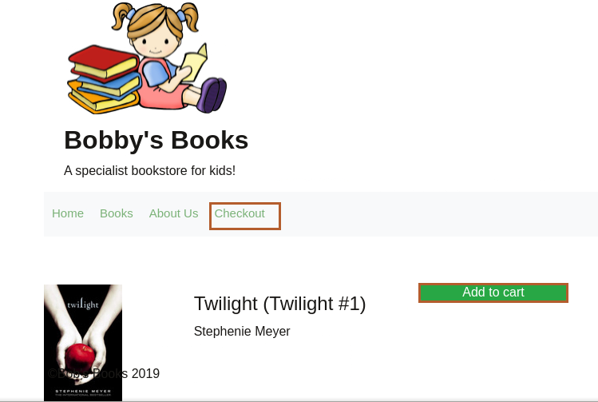

10. Enter the details for purchasing the book. For *Your State*, enter your two digit state code and then click *Submit Order*.

   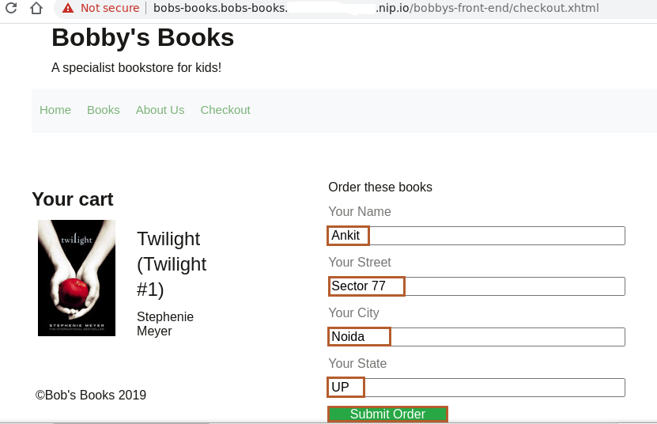
11. Go back to the *Order Manager* page and select the *Refresh* button to check if your order is successfully recorded in the order manager.

   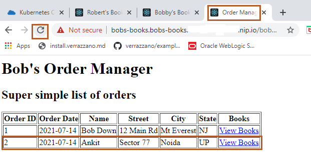

## Task 2: Explore the Verrazzano Console

Verrazzano installs several consoles. The endpoints for an installation are stored in the `Status` field of the installed Verrazzano Custom Resource.

1. You can get the endpoints for these consoles by using the following command:

      ```bash
      <copy>kubectl get vz -o jsonpath="{.items[].status.instance}" | jq .</copy>
      ```

   The output should be similar to the following:
      ```bash
      $ kubectl get vz -o jsonpath="{.items[].status.instance}" | jq .
      {
      "consoleUrl": "https://verrazzano.default.XX.XX.XX.XX.nip.io",
      "elasticUrl": "https://elasticsearch.vmi.system.default.XX.XX.XX.XX.nip.io",
      "grafanaUrl": "https://grafana.vmi.system.default.XX.XX.XX.XX.nip.io",
      "keyCloakUrl": "https://keycloak.default.XX.XX.XX.XX.nip.io",
      "kialiUrl": "https://kiali.vmi.system.default.XX.XX.XX.XX.nip.io",
      "kibanaUrl": "https://kibana.vmi.system.default.XX.XX.XX.XX.nip.io",
      "prometheusUrl": "https://prometheus.vmi.system.default.1XX.XX.XX.XX.nip.io",
      "rancherUrl": "https://rancher.default.XX.XX.XX.XX.nip.io"
      }
      $
      ```
    Click the links to open the *Verrazzano* Console.

2. Click *Advanced*.

   

3. Select *Proceed to verrazzano default XX.XX.XX.XX.nip.io(unsafe)*. If you are the not getting this option for proceed, just type *thisisunsafe* without any space. Do the same for opening other URLs of Verrazzano Consoles. You can find more details [here](https://verrazzano.io/latest/docs/faq/faq/#enable-google-chrome-to-accept-self-signed-verrazzano-certificates).


   

4. Because it redirects to the Keycloak console  URL for authentication, again on this page, click *Advanced*.

   

5. Select *Proceed to Keycloak default XX.XX.XX.XX.nip.io(unsafe)*. If you are the not getting this option for proceed, just type *thisisunsafe* without any space.

   

6. Now we need the user name and password for the Verrazzano console. *Username* is *verrazzano* and to find out the password, go back to the *Cloud Shell* and paste the following command to find out the password for the *Verrazzano Console*.

      ```bash
      <copy>kubectl get secret --namespace verrazzano-system verrazzano -o jsonpath={.data.password} | base64 --decode; echo</copy>
      ```

   The output should be similar to the following:
      ```bash
      $ kubectl get secret --namespace verrazzano-system verrazzano -o jsonpath={.data.password} | base64 --decode; echo
      aBsNxxZnl1ea3Vzp
      $
      ```

7. Copy the password and go back to the browser, where the *Verrazzano Console* is open.

   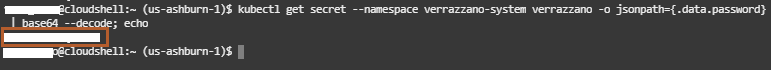

8. Paste the password in the *Password* field and enter *verrazzano* as *Username* and then click *Sign In*.

   

   In the Home Page of the Verrazzano Console, you can see *System Telemetry* and because we installed the *Development Profile* of Verrazzano, you can see it in the *General Information* section.

   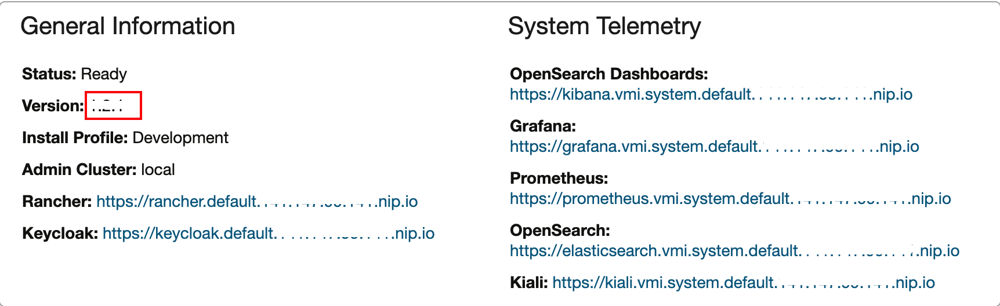

9. Because we have deployed the Bobby's Book application, you can see it under *OAM Applications*. Select *bobs-books* to view different components of this application.

   

   There are 10 components for this application as you can see under *Components*.

10. To explore the configuration for a particular component, first select the *Sort by* drop-down menu and select *Name*, then select the *bobby-coh* component as shown:

    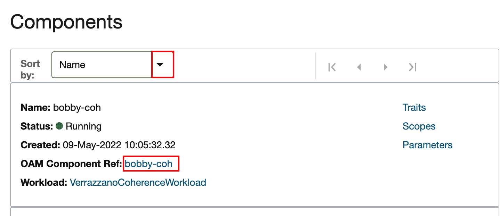

11. You can see *General Information* for this component. To learn about the *Workload Spec*, select *bobby-coh* as shown:

    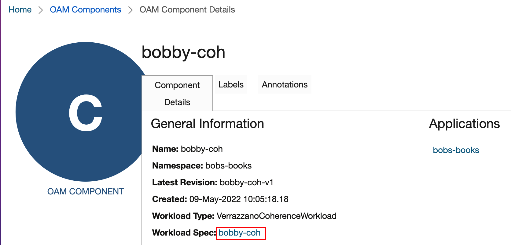

12. Here you can see the configuration details for the *bobby-coh* component. Click *Close*.

    

## Task 3: Explore the Grafana Console

1. Select *Home* to go back to Verrazzano Console Home Page.

    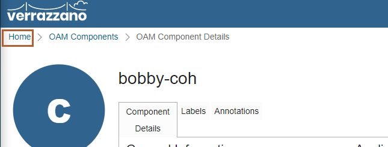

2. In this page, you'll see the link for opening the *Grafana console*. Select the link for the *Grafana Console* as shown:

    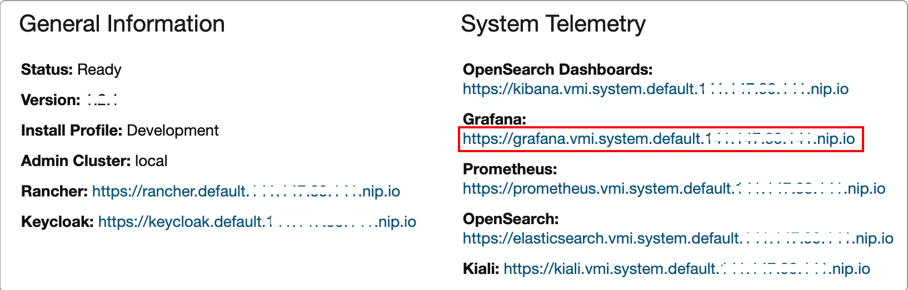

3. Click *Advanced*.

    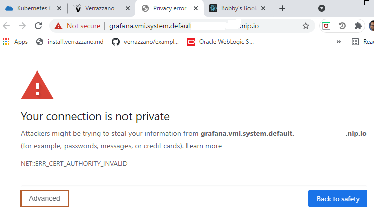

4. Select *grafana.vmi.system.default.XX.XX.XX.XX.nip.io(unsafe)*. If you are the not getting this option for proceed, just type *thisisunsafe* without any space.

    

5. The Grafana Home Page opens. Select *Home*  at the top left.

    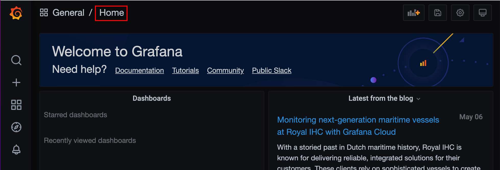

6. Type *WebLogic* and you will see *WebLogic Server Dashboard* under *General*. Select *WebLogic Server Dashboard*.

    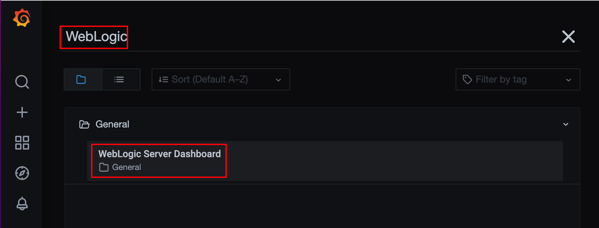

    Here you can observe the two domains under *Domain* and Running Servers, Deployed Applications, Server Name and their Status, Heap Usage, Running Time, JVM Heap. If your application has resources like JDBC and JMS, you can also get details about it here.

    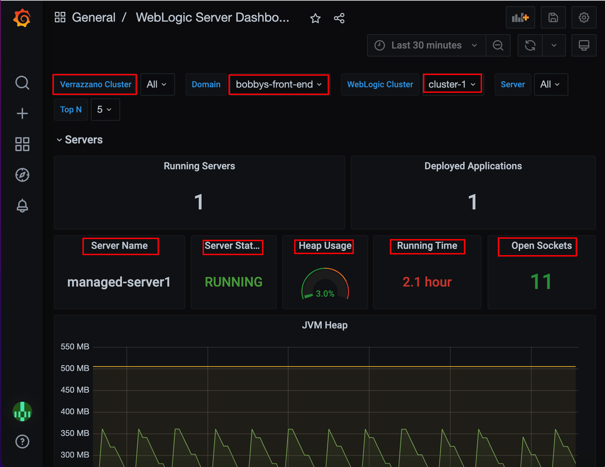

7. Now, select WebLogic Server Dashboard and type *Helidon* and you will see *Helidon Monitoring Dashboard*. Select *Helidon Monitoring Dashboard*.

    

    Here you can see various details like the *Status* of your application and its *Uptime*, Garbage Collector, and Mark Sweep Total and its Time, Thread Count.

    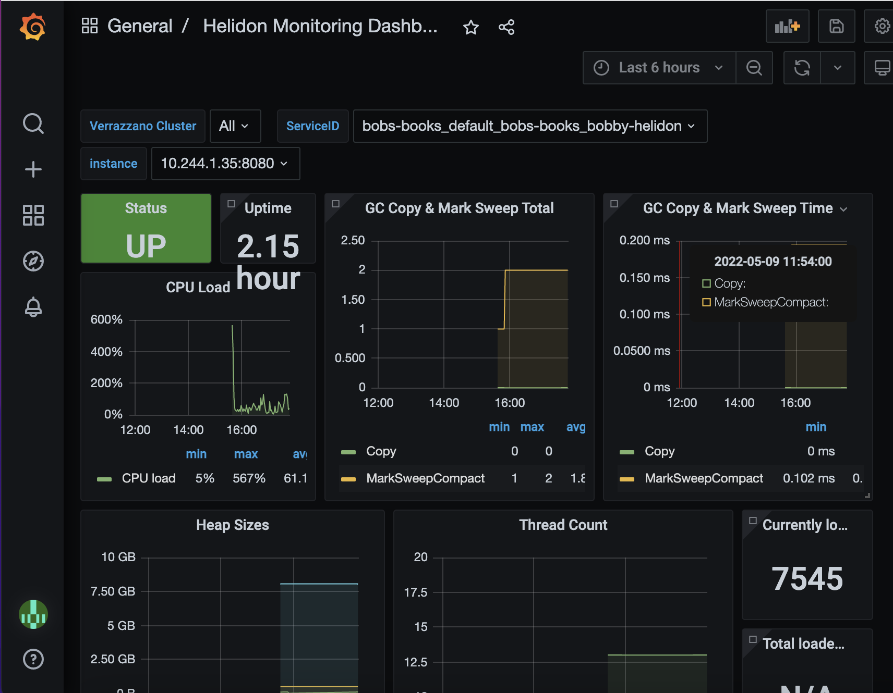

8. Now, select Helidon Monitoring Dashboard and type *Coherence* and you will see *Coherence Dashboard Main*. Select *Coherence Dashboard Main*.

    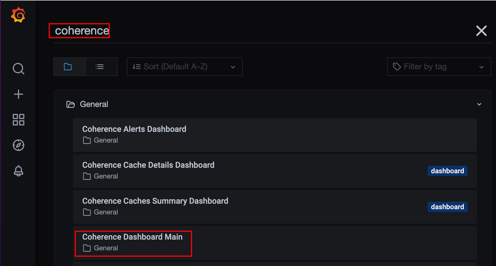

9. Here you can see the details of the *Coherence Cluster*. For the Bobby's Books application, we have two Coherence clusters, one for Bobby's Books and another for Robert's Books. You need to select the drop-down menu for *Cluster Name* to view both the clusters.

    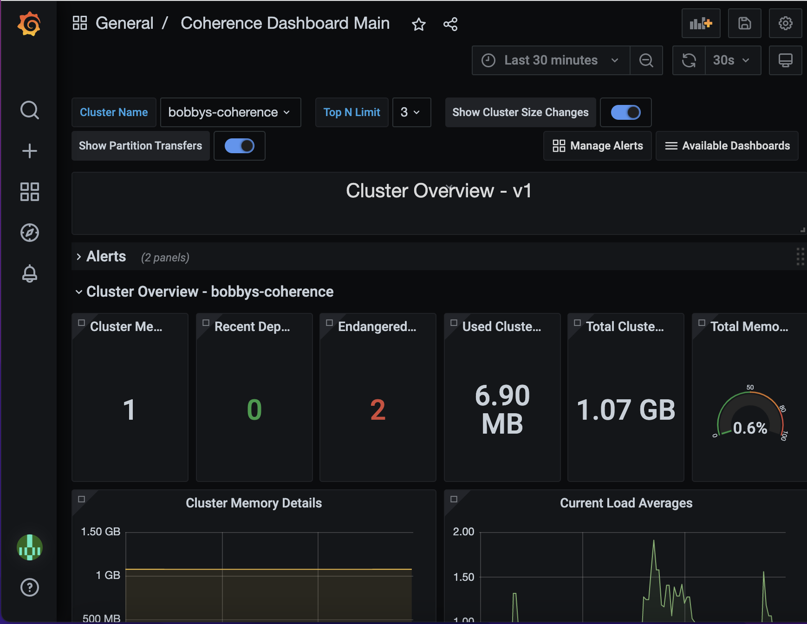

    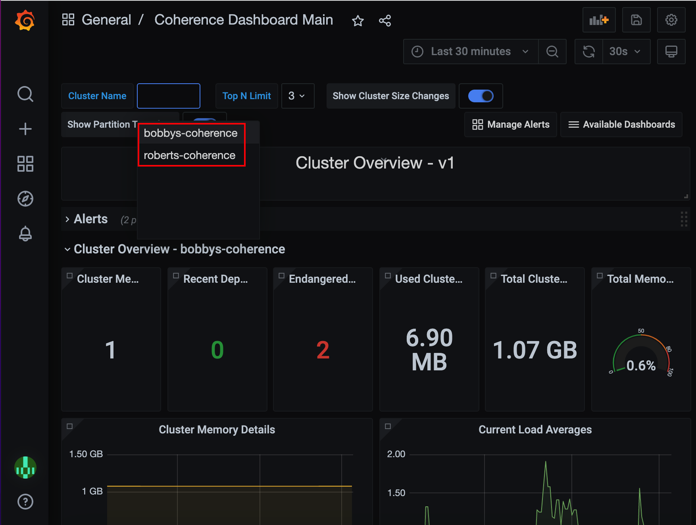

## Task 4: Explore the Kiali Console

1. Go to Verrazzao console and click on the link for Kiali Console.

   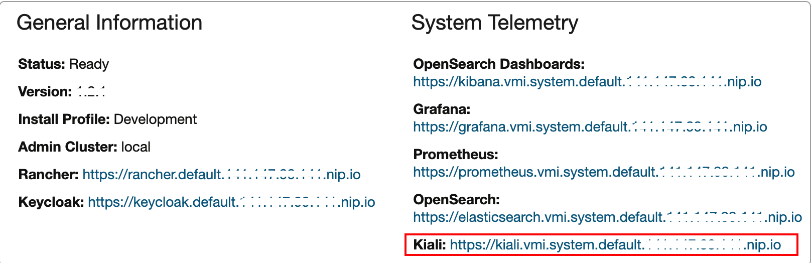

2. On Left side, Click on Graph.

   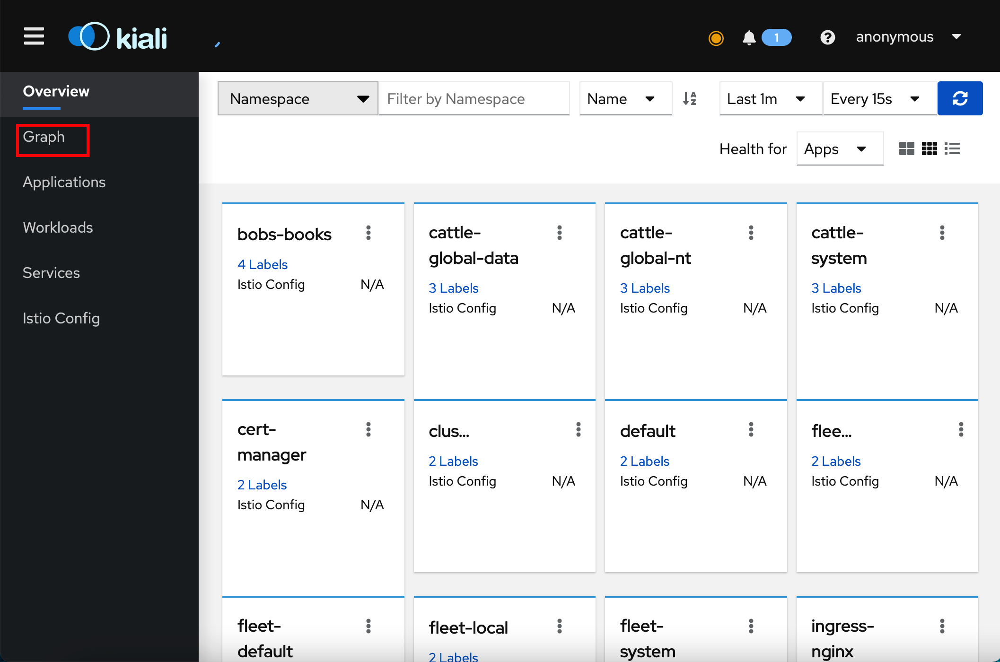

3. In the Namespace dropdown, check the box for *bobs-books* and make the curser move outside the dropdown. 
   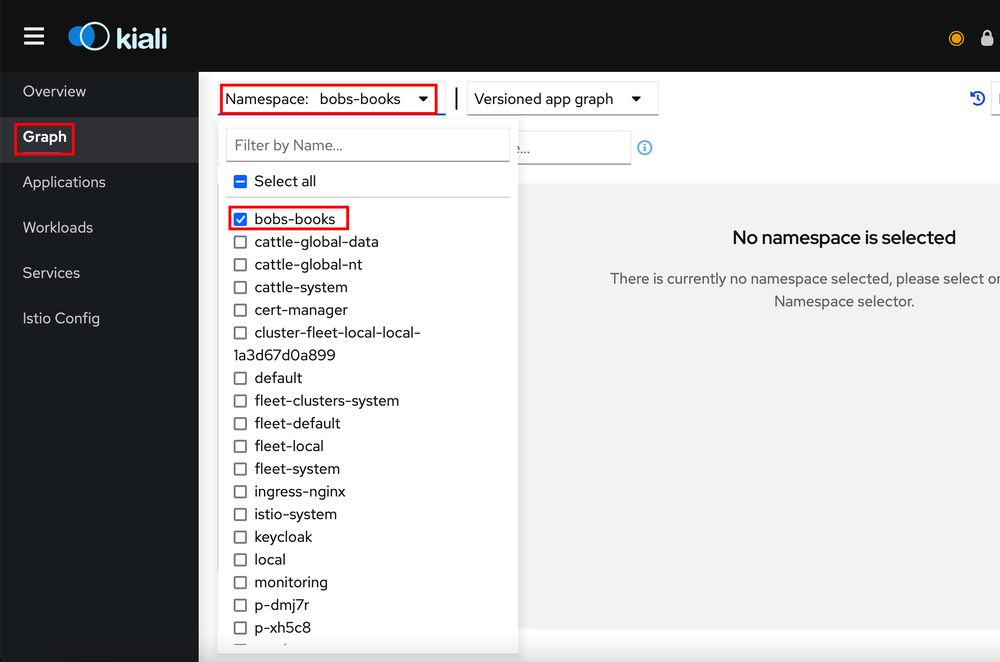

4. You can view the graphical view of *bobs-books* application. Click *Legend* to view the *Legend* view.

   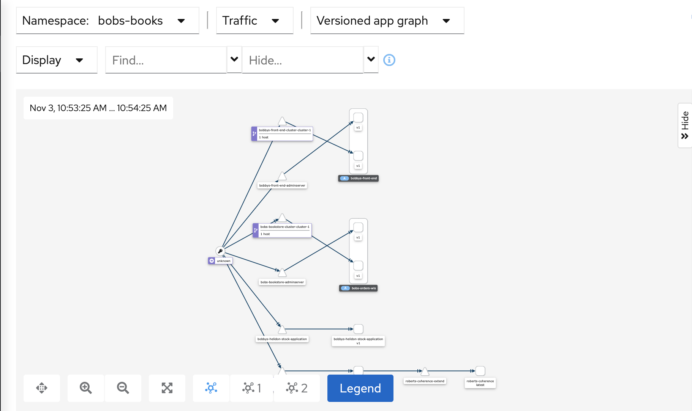

5. Here you can view, what each shapes represents, like circle represents the *Workloads*.

   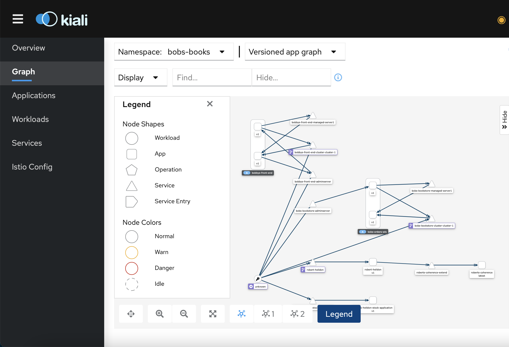

6. On Left side, Click on *Applications*.

   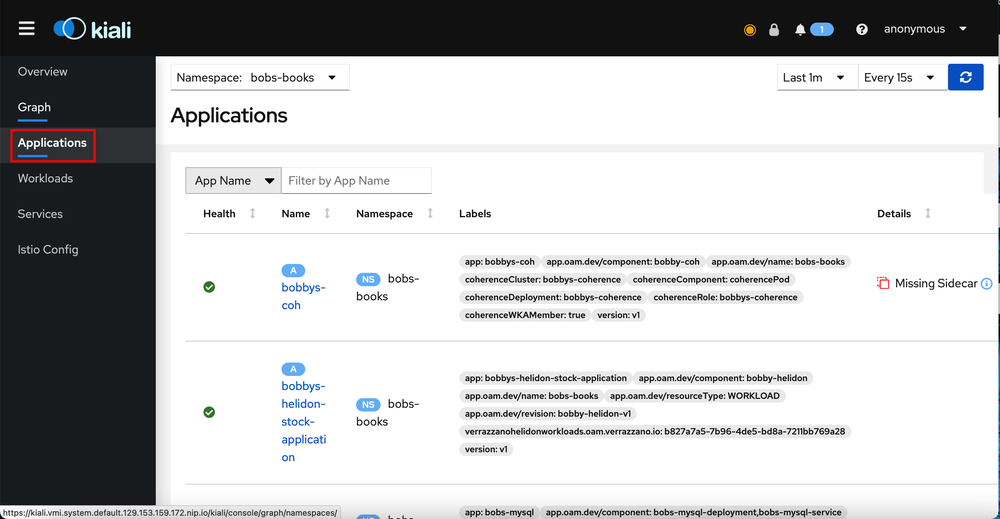


Leave the *Cloud Shell* open; we will use it for upcoming labs.

## Acknowledgements

* **Author** -  Ankit Pandey
* **Contributors** - Maciej Gruszka, Peter Nagy
* **Last Updated By/Date** - Ankit Pandey, May 2022
