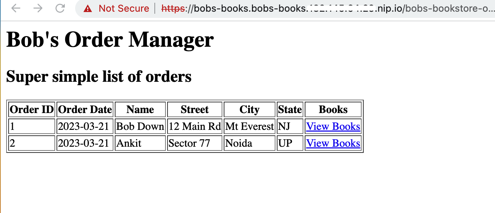
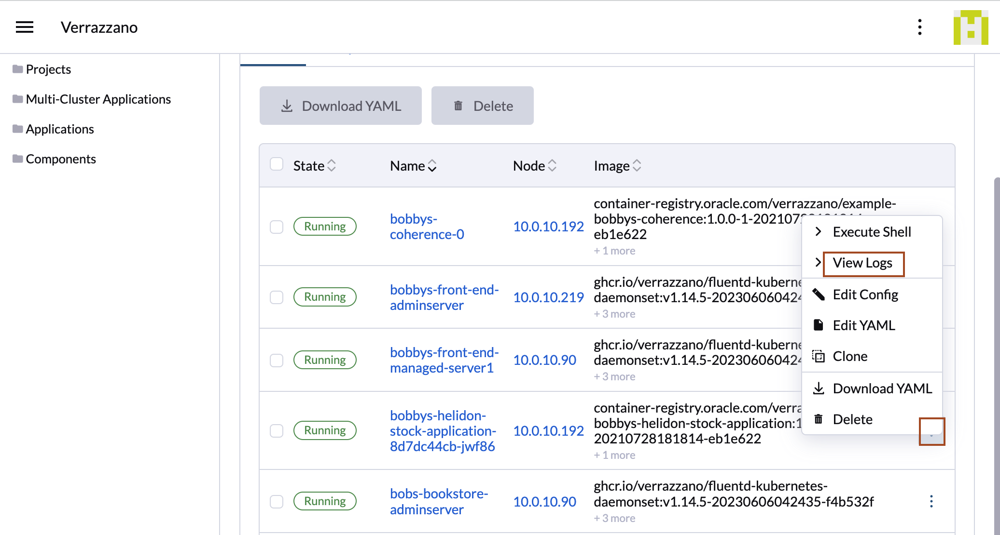
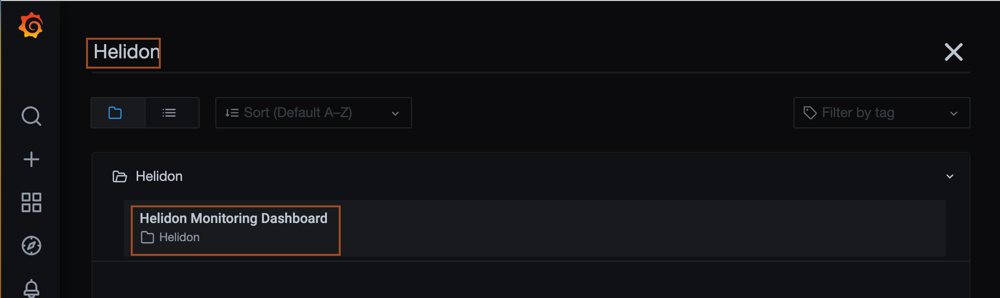
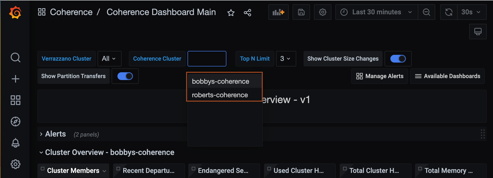
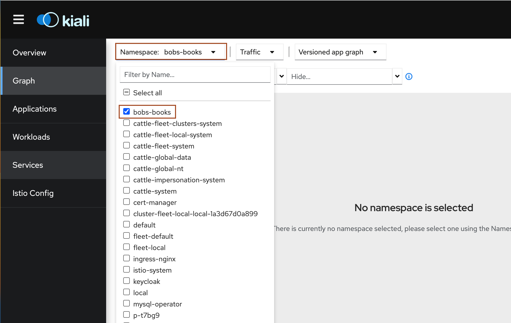
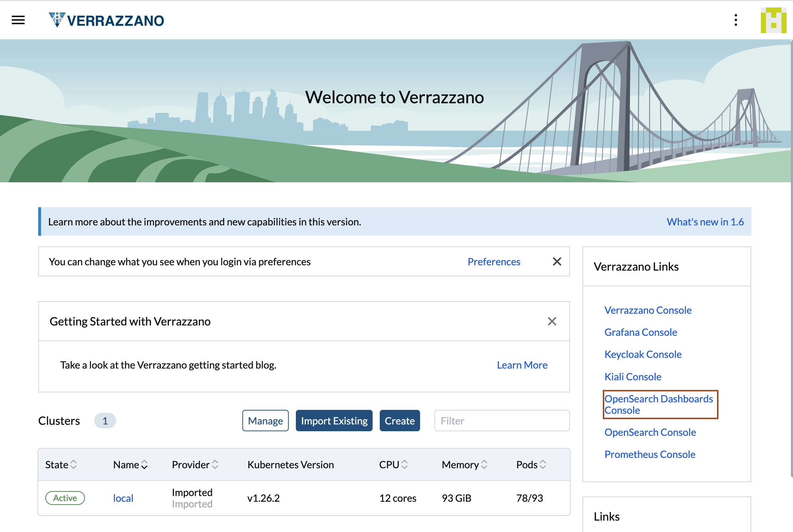
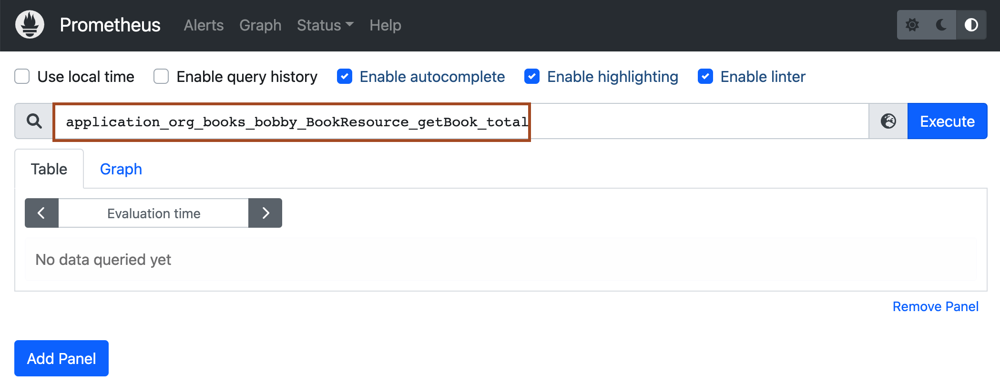

# Access the Bobby's Books sample application Explore Verrazzano, Grafana and Kiali Console

## Introduction

In Lab 3, we deployed the Bobby's Book application. In this lab, we will access the application and verify that it is working. Later, we will explore the Verrazzano and Grafana consoles.

Estimated time: 10 minutes

### Objectives

In this lab, you will:

* Access the Bobby's Book application.
* Explore the Verrazzano console.
* Explore the Grafana console.

### Prerequisites

<if type="freetier">
* Run Lab 1, which creates an OKE cluster on the Oracle Cloud Infrastructure.
</if>

<if type="livelabs">
* Run Lab 1, which configure kubectl to access an OKE cluster on the Oracle Cloud Infrastructure.
</if>

* Run Lab 2, which installs Verrazzano on a Kubernetes cluster.
* Run Lab 3, which deploys the Bobby's Book application.
* You should have a text editor, where you can paste the commands and URLs and modify them, as per your environment. Then you can copy and paste the modified commands for running them in the *Cloud Shell*.
* We recommend to use Firefox for opening the URLs of Bobby's Books application, Verrazano, Grafana and Kiali Console. However, if you want to use Chrome, then you need to use the undocumented 'thisisunsafe' workaround to allow chrome to accept the cert.

## Task 1: Access the Bobby's Book application

1. We need an `EXTERNAL_IP` address through which we can access the Bobby's Book application. To get the `EXTERNAL_IP` address of the istio-ingressgateway service, copy the following command and paste it in the *Cloud Shell*.

      ```bash
      <copy> kubectl get service \
      -n "istio-system" "istio-ingressgateway" \
      -o jsonpath={.status.loadBalancer.ingress[0].ip}; echo</copy>
      ```

   The output should be similar to the following:
      ```bash
         $ kubectl get service \
         > -n "istio-system" "istio-ingressgateway" \
         > -o jsonpath={.status.loadBalancer.ingress[0].ip}; echo
         XX.XX.XX.XX
      ```
2. To open the Robert's Book Store Home Page, copy the following URL and replace *XX.XX.XX.XX* with your *EXTERNAL_IP* address which we got in the last step, as shown in the following image.

      ```bash
      <copy>https://bobs-books.bobs-books.XX.XX.XX.XX.nip.io/</copy>
      ```

   

3. Click *Advanced*, as shown:

   


4. Select *Proceed to bobs-books.bobs-books. EXTERNAL_IP .nip.io(unsafe)* to access the application. If you are the not getting this option for proceed, just type *thisisunsafe* without any space anywhere inside this chrome browser window. As you are typing in the chrome browser window, you can't see it, but as soon as you finish typing *thisisunsafe*, you can see application page immediately. You can find more details [here](https://verrazzano.io/latest/docs/faq/faq/#enable-google-chrome-to-accept-self-signed-verrazzano-certificates).

   
   

5. To open the Bobby's Book Store Home page, open a new tab and copy the following URL and replace *XX.XX.XX.XX* with your `EXTERNAL_IP` address, as shown in the following image.

      ```bash
      <copy>https://bobs-books.bobs-books.XX.XX.XX.XX.nip.io/bobbys-front-end/</copy>
      ```

      

      

      > Leave this page open  because we will use it in Lab 8.

6. To open the Bobby's Book Order Manager UI, open a new tab and copy the following URL and replace *XX.XX.XX.XX* with your *EXTERNAL_IP* address as shown in the following image.

      ```bash
      <copy>https://bobs-books.bobs-books.XX.XX.XX.XX.nip.io/bobs-bookstore-order-manager/orders</copy>
      ```

   

7. Go Back to the *Bobby's Books* page and let's purchase a book. Click *Books* as shown in the following image.

   

8. Select the image for the *Twilight* Book, as shown in the following image.

   

9. First, click *Add to cart* and then *Checkout* as shown in the following image.

   

10. Enter the details for purchasing the book. For *Your State*, enter your two digit state code and then click *Submit Order*.

   
11. Go back to the *Order Manager* page and select the *Refresh* button to check if your order is successfully recorded in the order manager.

   

## Task 2: Explore the Rancher Console

Verrazzano installs several consoles. The endpoints for an installation are stored in the `Status` field of the installed Verrazzano Custom Resource.

1. You can get the endpoints for these consoles by using the following command:

      ```bash
      <copy>kubectl get vz -o jsonpath="{.items[].status.instance}" | jq .</copy>
      ```

   The output should be similar to the following:
      ```bash
      $ kubectl get vz -o jsonpath="{.items[].status.instance}" | jq .
      {
      "consoleUrl": "https://verrazzano.default.xx.xx.xx.xx.nip.io",
      "grafanaUrl": "https://grafana.vmi.system.default.xx.xx.xx.xx.nip.io",
      "keyCloakUrl": "https://keycloak.default.xx.xx.xx.xx.nip.io",
      "kialiUrl": "https://kiali.vmi.system.default.xx.xx.xx.xx.nip.io",
      "openSearchDashboardsUrl": "https://osd.vmi.system.default.xx.xx.xx.xx.nip.io",
      "openSearchUrl": "https://opensearch.vmi.system.default.xx.xx.xx.xx.nip.io",
      "prometheusUrl": "https://prometheus.vmi.system.default.xx.xx.xx.xx.nip.io",
      "rancherUrl": "https://rancher.default.xx.xx.xx.xx.nip.io"
      }
      $
      ```


2. Use the `https://rancher.default.YOUR_UNIQUE_IP.nip.io` to open the Rancher console.

3. Verrazzano *dev* profile use self-signed certificates, so you need to click **Advanced** to accept risk and skip the warning.

      

4. Click **Proceed to rancher default XX.XX.XX.XX.nip.io(unsafe)**. If you are not getting this option for proceeding, just type *thisisunsafe* without any space anywhere inside this chrome browser window. As you are typing in the chrome browser window, you can't see it, but as soon as you finish typing *thisisunsafe*, you can see the next page immediately. You can find more details [here](https://verrazzano.io/latest/docs/faq/faq/#enable-google-chrome-to-accept-self-signed-verrazzano-certificates).

      

5. Click *Log in with Keycloak*.
      

6. Because it redirects to the Keycloak console URL for authentication, click **Advanced**.

      

7. Click **Proceed to Keycloak default XX.XX.XX.XX.nip.io(unsafe)**. If you are not getting this option for proceeding, just type *thisisunsafe* without any space anywhere inside this chrome browser window. As you are typing in the chrome browser window, you can't see it, but as soon as you finish typing *thisisunsafe*, you can see the next page immediately. You can find more details [here](https://verrazzano.io/latest/docs/faq/faq/#enable-google-chrome-to-accept-self-signed-verrazzano-certificates).

      

8. Now we need the username and password for the Verrazzano console. *Username* is *verrazzano* and to find out the password, go back to the *Cloud Shell* and paste the following command to find out the password for the *Rancher Console*.

      ```bash
      <copy>kubectl get secret --namespace verrazzano-system verrazzano -o jsonpath={.data.password} | base64 --decode; echo</copy>
      ```

9. Copy the password and go back to the browser, where the *Rancher Console* is open. Paste the password in the *Password* field and enter *verrazzano* as *Username* and then click **Sign In**.

      

10. From the home page of the rancher console, you can view the Verrazzano Links. Click *Hamburger menu* -> *Verrazzano*.

      

11. Click *Applications*. This section shows all the applications with their namespace and is managed by Verrazzano. Click the *bobs-books* application within the *bobs-books* namespace..
      

12. You can view the pods associated with the application. The pod name contains an auto-generated unique string to identify that particular replica. To view the logs of *bobbys-helidon-stok-application* pods, Click *Three dots* -> *View Logs*.
      
      


13. You can view the application logs for the application. If you can't see the application log then click the **Settings** (blue button with the gear icon) and change the time filter to show all the log entries from the container start. To view the Component associated with the application, click *Components*.
      

14. You can view all the components of the *bobs-books* application here. To view what are the related resources, click *Related Resources*.
      
      

15. Click *Hamburgar menu* -> *local*, to open the *Cluster Explorer*. The *Cluster Explorer* allows you to view and manipulate all of the custom resources and CRDs in a Kubernetes cluster from the Rancher UI.
      


16. The dashboard gives an overview of the cluster and the deployed applications. The number of resources belongs to the *User Namespaces* which is practically almost all the resources including the system too. You can filter by namespace at top of the dashboard, but this is not necessary now. Click on the **Nodes** item in the left side menu to get an overview of the current load of the nodes.

      

17. The whole deployment doesn't have any impact on the OKE cluster. Now click on the **Deployment** item in the left side menu to check deployed applications.

      

18. You can see several deployments.

      

## Task 3: Explore the Grafana Console

1. Click *Hamburgar menu* -> *Home* to open Rancher home page.
      

2. On the home page, you'll see the link for opening the *Grafana console*. Click the link for the **Grafana Console** as shown:

      

3. Click *Advanced*.

    

4. Select *grafana.vmi.system.default.XX.XX.XX.XX.nip.io(unsafe)*. If you are the not getting this option for proceed, just type *thisisunsafe* without any space.

    

5. The Grafana Home Page opens. Select *Home*  at the top left.

    

6. Type *WebLogic* and you will see *WebLogic Server Dashboard* under *General*. Select *WebLogic Server Dashboard*.

    

    Here you can observe the two domains under *Domain* and Running Servers, Deployed Applications, Server Name and their Status, Heap Usage, Running Time, JVM Heap. If your application has resources like JDBC and JMS, you can also get details about it here.

    

7. Now, select WebLogic Server Dashboard and type *Helidon* and you will see *Helidon Monitoring Dashboard*. Select *Helidon Monitoring Dashboard*.

    

    Here you can see various details like the *Status* of your application and its *Uptime*, Garbage Collector, and Mark Sweep Total and its Time, Thread Count.

    

8. Now, select Helidon Monitoring Dashboard and type *Coherence* and you will see *Coherence Dashboard Main*. Select *Coherence Dashboard Main*.

    

9. Here you can see the details of the *Coherence Cluster*. For the Bobby's Books application, we have two Coherence clusters, one for Bobby's Books and another for Robert's Books. You need to select the drop-down menu for *Cluster Name* to view both the clusters.

    

    

## Task 4: Explore the Kiali Console

1. Go back to the Verrazzano home page and click **Kiali** console.

      

2. On Left side, Click on Graph.

   

3. In the Namespace dropdown, check the box for *bobs-books* and make the curser move outside the dropdown. 
   

4. You can view the graphical view of *bobs-books* application. Click *Legend* to view the Legend view.

   

5. Here you can view, what each shapes represents, like circle represents the *Workloads*.

   

6. On Left side, Click on *Applications* to view all the deployed applications.

   


## Task 5: Explore the OpenSearch Dashboards

1. Go back to the Verrazzano home page and click the **OpenSearch Dashboards** console.

      

2. Click *Proceed to ... default XX.XX.XX.XX.nip.io(unsafe)* if necessary.

3. On the OpenSearch homepage click the **Home** -> **Discover**.

      

4. Select the *`verrazzano-applications*`* namespace as shown, then search for *books* and press **Enter** or click **Refresh**. You should get the logs containing *books*. 
       

## Task 6: Explore the Prometheus Console

1. Go back to the Verrazzano home page and click **Prometheus** console.

      

2. Click **Proceed to ... default XX.XX.XX.XX.nip.io(unsafe)** if prompted.

3. On the Prometheus dashboard page type *get* into the search field and click your custom metric *`application_org_books_bobby_BookResource_getBook_total`*.

      

4. Click **Execute** and check the result below. You should see your metric's current value which means how many requests were completed by your endpoint. You can also switch to *Graph* view instead of the *Console* mode.

      

      >You can also add another metric to your dashboard. Discover the available, default metrics in the list.

## Task 7: Explore the Keycloak Console

1. Go back to the Verrazzano home page and click **Keycloak** console.

      

2. Click **Proceed to ... default XX.XX.XX.XX.nip.io(unsafe)** if prompted.

3. On the Welcome to Keycloak page, click *Administration Console*.
      

4. Now we need the username and password for the Keycloak console. *Username* is *keycloakadmin* and to find out the password, go back to the *Cloud Shell* and paste the following command to find out the password for the *Keycloak Console*.

      ```bash
      <copy>kubectl get secret --namespace keycloak keycloak-http -o jsonpath={.data.password} | base64  --decode; echo</copy>
      ```

5. Copy the password and go back to the browser, where the *Keycloak Console* is open. Paste the password in the *Password* field and enter *keycloakadmin* as *Username* and then click **Sign In**.

      

6. Here you can view default configuration done by Verrazzano.
      


## Acknowledgements

* **Author** -  Ankit Pandey
* **Contributors** - Maciej Gruszka, Sid Joshi
* **Last Updated By/Date** - Ankit Pandey, August 2023
