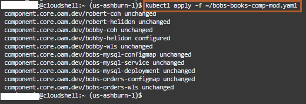

# ALTERNATE VERSION with simplified solution

## Introduction

In this lab, we will use the modified bobbys-helidon-stock-application image. This image is stored in our public repository inside the Oracle Cloud Container Registry. We also use the modified bobs-books-comp-mod.yaml file, which points to the modified bobbys-helidon-stock-application image.

### Objectives

In this lab, you will:

* Download the modified bobs-books-comp-mod.yaml file.
* Apply the Changes using kubectl

### Prerequisites

* Run Lab 1, which creates an OKE cluster on the Oracle Cloud Infrastructure.
* Run Lab 2, which installs Verrazzano on the Kubernetes cluster.
* Run Lab 3, which deploy Bobs-Books application.
* You should have a text editor, where you can paste the commands and URLs and modify them, as per your environment. Then you can copy and paste the modified commands for running them in the *Cloud Shell*.

## Task 1:Download the modified bobs-books-comp-mod.yaml file

1. Run the following command to download the modified bobs-books-comp-mod.yaml file.

    ```bash
    <copy>curl -LSs https://raw.githubusercontent.com/oracle/learning-library/master/developer-library/multicloud/verrazzano/alternate-version/bobs-books-comp-mod.yaml >~/bobs-books-comp-mod.yaml</copy>
    ```

    

## Task 2: Apply the Changes using kubectl

1. To apply the changes, copy and paste the following command in the *Cloud Shell*. When you will apply the change, a new pod will initialize for serving requests for new component, while the pod associated with the old component will continue serving requests. Later, after the new pod will reaches to the *Running* state, then the old pod will begin being *Terminated*. Eventually, only the new pod will be in the *Running* state.

    ```bash
    <copy>kubectl apply -f ~/bobs-books-comp-mod.yaml</copy>
    ```

    

    You can observe in the output; only *component.core.oam.dev/bobby-helidon* is configured and other components are unchanged.

2. To view how the new pod is getting initialized and the old pod gets in the *Terminating* state, copy and paste the following command in the *Cloud Shell*.

    ```bash
    <copy>kubectl get pods -n bobs-books -w</copy>
    ```

    You will see output similar to the following:

    ```bash
    vera_zano@cloudshell:~ (us-ashburn-1)$ kubectl get pods -n bobs-books
    NAME                                               READY  STATUS   RESTARTS  AGE
    bobbys-coherence-0                                 2/2    Running  0         130m
    bobbys-front-end-adminserver                       4/4    Running  0         127m
    bobbys-front-end-managed-server1                   4/4    Running  0         126m
    bobbys-helidon-stock-application-64fb55cd5b-f8zzp  0/2    PodInitializing  0         10s
    bobbys-helidon-stock-application-77867fc8dd-wl8h5  2/2    Running  0         130m
    bobs-bookstore-adminserver                         4/4    Running  0         127m
    bobs-bookstore-managed-server1                     4/4    Running  0         126m
    mysql-65d864bf8c-xf64p                             2/2    Running  0         130m
    robert-helidon-bfdfb58b8-58qfs                     2/2    Running  0         130m
    robert-helidon-bfdfb58b8-lkw8m                     2/2    Running  0         130m
    roberts-coherence-0                                2/2    Running  0         130m
    roberts-coherence-1                                2/2    Running  0         130m
    bobbys-helidon-stock-application-64fb55cd5b-f8zzp  1/2    Running  0         28s
    bobbys-helidon-stock-application-64fb55cd5b-f8zzp  2/2    Running  0         34s
    bobbys-helidon-stock-application-77867fc8dd-wl8h5  2/2    Terminating  0         130m
    bobbys-helidon-stock-application-77867fc8dd-wl8h5  0/2    Terminating  0         130m
    bobbys-helidon-stock-application-77867fc8dd-wl8h5  0/2    Terminating  0         130m
    bobbys-helidon-stock-application-77867fc8dd-wl8h5  0/2    Terminating  0         130m
    vera_zano@cloudshell:~ (us-ashburn-1)$
    ```

    After you see that all the pods are in the *Running* Status, press *CTRL + C* to kill this command.

Leave the *Cloud Shell* open as we also need it for our last lab.

## Acknowledgements

* **Author** -  Ankit Pandey
* **Contributors** - Maciej Gruszka, Peter Nagy
* **Last Updated By/Date** - Ankit Pandey, April 2022