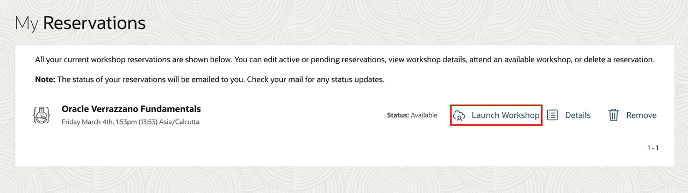
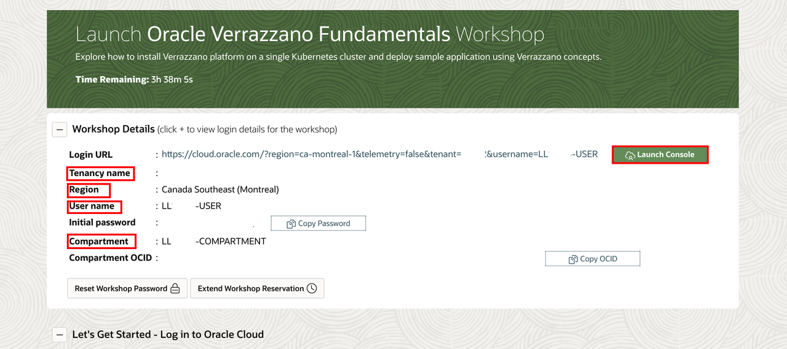
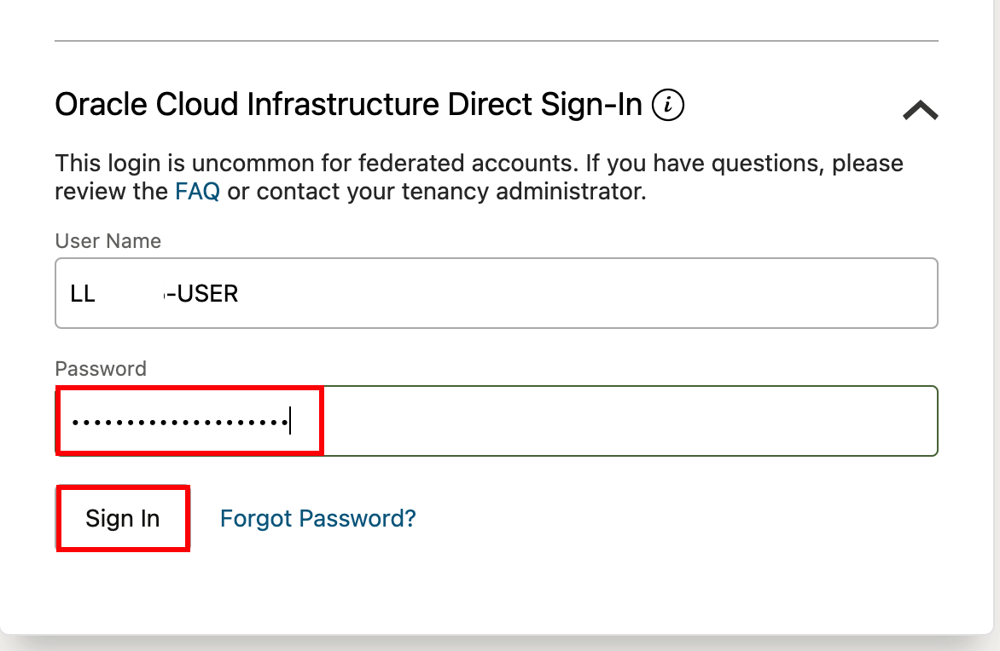
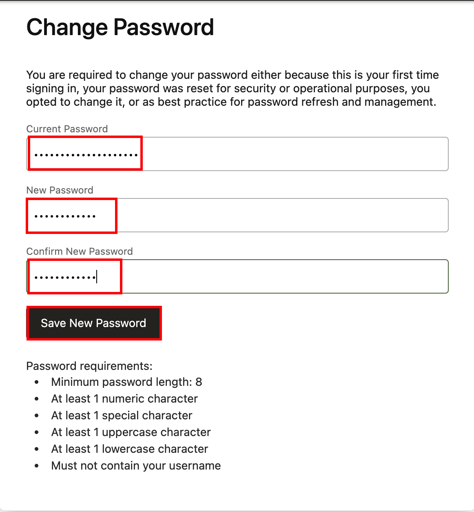
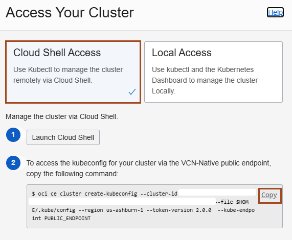

# Configure KUBECTL to interact with the Oracle Container Engine for Kubernetes (OKE) on Oracle Cloud Infrastructure (OCI)

## Introduction

This lab walks you through the steps to create configuration file, which allow access to Kubernetes environment on the Oracle Cloud Infrastructure.

### About Product/Technology

Oracle Cloud Infrastructure Container Engine for Kubernetes is a fully-managed, scalable, and highly available service that you can use to deploy your container applications to the cloud. Use the Container Engine for Kubernetes (sometimes abbreviated OKE) when your development team wants to reliably build, deploy, and manage cloud-native applications. You specify the compute resources that your applications require, and OKE provisions them on the Oracle Cloud Infrastructure in an existing OCI tenancy.

### Objectives

In this lab, you will:

* Open the OCI Cloud Shell and configure `kubectl` to interact with the Kubernetes cluster.

### Prerequisites

* This workshop assumes that you have reservation of this workshop on LiveLabs. Once your environment is ready, Click on *Launch Workshop*.
        
* On this page, you will find your *Tenancy name*, *Region*, *User name* and *Compartment*. We need this information as we proceed further in this workshop. Click on *Copy Password*  and then click *Launch Console*.
        

* Enter the copied password here and click *Sign In*.
        

* Enter the copied password and new password here. Click on *Save New Password*.
        


## Task 1: Configure `kubectl` (Kubernetes Cluster CLI)

Oracle Cloud Infrastructure (OCI) Cloud Shell is a web browser-based terminal, accessible from the Oracle Cloud Console. The Cloud Shell provides access to a Linux shell, with a pre-authenticated Oracle Cloud Infrastructure CLI and other useful tools (*Git, kubectl, helm, OCI CLI*) to complete the Verrazzano tutorials. The Cloud Shell is accessible from the Console. Your Cloud Shell will appear in the Oracle Cloud Console as a persistent frame of the Console, and will stay active as you navigate to different pages of the Console.

You will use the *Cloud Shell* to complete this workshop.

We will use `kubectl` to manage the cluster remotely using the Cloud Shell. It needs a `kubeconfig` file. This will be generated using the OCI CLI which is pre-authenticated, so there’s no setup to do before you can start using it.

1. In the Console, select the *Hamburger Menu -> Developer Services -> Kubernetes Clusters (OKE)* as shown.

    

2. Select the compartment, which is assinged to you. Then click on the *cluster1* cluster.

3. Click *Access Cluster* on your cluster detail page.

    

    > A dialog is displayed from which you can open the Cloud Shell and contains the customized OCI command that you need to run, to create a Kubernetes configuration file.

4. Leave the default *Cloud Shell Access* and first select the *Copy* link to copy the `oci ce...` command to the Cloud Shell.

    

5. Now, click *Launch Cloud Shell* to open the built in console. Then close the configuration dialog before you paste the command into the *Cloud Shell*.

    

6. Copy the command from the clipboard (Ctrl+V or right click and copy) into the Cloud Shell and run the command.

    For example, the command looks like the following:

    ```bash
    oci ce cluster create-kubeconfig --cluster-id ocid1.cluster.oc1.phx.aaaaaaaaaezwen..................zjwgm2tqnjvgc2dey3emnsd --file $HOME/.kube/config --region us-phoenix-1 --token-version 2.0.0
    ```

    

7. Now check that `kubectl` is working, for example, using the `get node` command. you may need to run this command several times until you see the output similar to following.

    ```bash
    <copy>kubectl get node</copy>
    ```

    ```bash
    $ kubectl get node
    NAME          STATUS   ROLES   AGE   VERSION
    10.0.10.17    Ready    node    11m   v1.21.5
    10.0.10.184   Ready    node    11m   v1.21.5
    10.0.10.31    Ready    node    11m   v1.21.5
    ```

    > If you see the node's information, then the configuration was successful.

8. You can minimize and restore the terminal size at any time using the controls at the top right corner of the Cloud Shell.

    

Leave this *Cloud Shell* open; we will use it for further labs.

## Acknowledgements

* **Author** -  Ankit Pandey
* **Contributors** - Maciej Gruszka, Peter Nagy
* **Last Updated By/Date** - Ankit Pandey, April 2022
