# Deploy Bobby's Books sample application

## Introductions

### About Bobby's Books Application

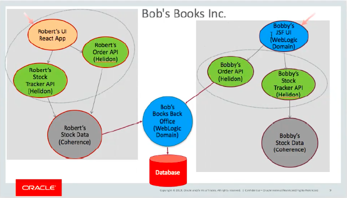

[Bobby’s Books](https://verrazzano.io/docs/samples/bobs-books/) consists of three main parts:

* A back-end *“order processing”* application, which is a Java EE application with REST services and a very simple JSP UI, which stores data in a MySQL database. This application runs on WebLogic Server.
* A front-end web store *“Robert’s Books”*, which is a general book seller. This is implemented as a Helidon microservice, which gets book data from Coherence, uses a Coherence cache store to persist data for the order manager, and has a React web UI.
* A front-end web store *“Bobby’s Books”*, which is a specialty children’s book store. This is implemented as a Helidon microservice, which gets book data from a (different) Coherence cache store, interfaces directly with the order manager, and has a JSF web UI running on WebLogic Server.

For more information and the source code of this application, see the [Verrazzano Examples](https://github.com/verrazzano/examples).

### Verrazzano and Application Deployment

Verrazzano supports application definition using [Open Application Model (OAM)](https://oam.dev/). Verrrazzano applications are composed of components and application configurations.

When you deploy applications with Verrazzano, the platform sets up connections, network policies, and ingresses in the service mesh, and wires up a monitoring stack to capture the metrics, logs, and traces. Verrazzano employs OAM components to define the functional units of a system that are then assembled and configured by defining associated application configurations.

### Verrazzano components

A Verrazzano OAM component is a [Kubernetes Custom Resource](https://kubernetes.io/docs/concepts/extend-kubernetes/api-extension/custom-resources/) describing an application’s general composition and environment requirements.

The following code shows the one component for the Bobby's Books example application used in this lab. This resource describes a component which is implemented by a single Docker image containing a Helidon application exposing a single endpoint.

```bash
apiVersion: core.oam.dev/v1alpha2
kind: Component
metadata:
  name: bobby-helidon
  namespace: bobs-books
spec:
  workload:
    apiVersion: oam.verrazzano.io/v1alpha1
    kind: VerrazzanoHelidonWorkload
    metadata:
      name: bobbys-helidon-stock-application
      labels:
        app: bobbys-helidon-stock-application
    spec:
      deploymentTemplate:
        metadata:
          name: bobbys-helidon-stock-application
        podSpec:
          containers:
            - name: bobbys-helidon-stock-application
              image: container-registry.oracle.com/verrazzano/example-bobbys-helidon-stock-application:0.1.12-1-20210624160519-017d358
              imagePullPolicy: IfNotPresent
              ports:
                - containerPort: 8080
                  name: http
              env:
                - name: BACKEND_PORT
                  value: "8001"
                - name: BACKEND_HOSTNAME
                  value: bobs-bookstore-cluster-cluster-1.bobs-books.svc.cluster.local
                - name: COH_CLUSTER
                  value: bobbys-coherence
                - name: COH_CACHE_CONFIG
                  value: coherence-cache-config.xml
                - name: COH_POF_CONFIG
                  value: pof-config.xml
          imagePullSecrets:
            - name: bobs-books-repo-credentials
```

A brief description of each field of the component:

* **apiVersion** - Version of the component custom resource definition
* **kind** - Standard name of the component custom resource definition
* **metadata.name** - The name used to create the component’s custom resource
* **metadata.namespace** - The namespace used to create this component’s custom resource
* **spec.workload.kind** - VerrazzanoHelidonWorkload defines a stateless workload of Kubernetes
* **spec.workload.spec.deploymentTemplate.podSpec.metadata.name** - The name used to create the stateless workload of Kubernetes
* **spec.workload.spec.deploymentTemplate.podSpec.containers** - The implementation containers
* **spec.workload.spec.deploymentTemplate.podSpec.containers.ports** - Ports exposed by the container

You can find the complete component description for Bobbys' books application in [bobs-books-comp.yaml](https://github.com/verrazzano/verrazzano/blob/master/examples/bobs-books/bobs-books-comp.yaml) file.

### Verrazzano Application Configurations

A Verrazzano application configuration is a Kubernetes Custom Resource which provides environment specific customizations. The following code shows the application configuration for the Bob's Books example used in this lab. This resource specifies the deployment of the application to the bobs-books namespace.

Additional runtime features are specified using traits, or runtime overlays that augment the workload. For example, the ingress trait specifies the ingress host and path, while the metrics trait provides the Prometheus scraper used to obtain the application related metrics.

```bash
apiVersion: core.oam.dev/v1alpha2
kind: ApplicationConfiguration
metadata:
  name: bobs-books
  namespace: bobs-books
  annotations:
    version: v1.0.0
    description: "Bob's Books"
spec:
  components:
    - componentName: robert-helidon
      traits:
        - trait:
            apiVersion: core.oam.dev/v1alpha2
            kind: ManualScalerTrait
            spec:
              replicaCount: 2
        - trait:
            apiVersion: oam.verrazzano.io/v1alpha1
            kind: IngressTrait
            spec:
              rules:
                - paths:
                    - path: "/"
                      pathType: Prefix
    - componentName: robert-coh
    - componentName: bobby-coh
    - componentName: bobby-helidon
    - componentName: bobby-wls
      traits:
        - trait:
            apiVersion: oam.verrazzano.io/v1alpha1
            kind: IngressTrait
            spec:
              rules:
                - paths:
                    - path: "/bobbys-front-end"
                      pathType: Prefix
    - componentName: bobs-orders-wls
      traits:
        - trait:
            apiVersion: oam.verrazzano.io/v1alpha1
            kind: IngressTrait
            spec:
              rules:
                - paths:
                    - path: "/bobs-bookstore-order-manager/orders"
                      pathType: Prefix
    - componentName: bobs-orders-configmap
    - componentName: bobs-mysql-deployment
    - componentName: bobs-mysql-service
    - componentName: bobs-mysql-configmap
```

A brief description of each field in the application configuration:

* **apiVersion** - Version of the ApplicationConfiguration custom resource definition
* **kind** - Standard name of the application configuration custom resource definition
* **metadata.name** - The name used to create this application configuration resource
* **metadata.namespace** - The namespace used for this application configuration custom resource
* **spec.components** - Reference to the application’s components leveraged to specify runtime configuration
* **spec.components[].traits** - The traits specified for the application’s components

To explore traits, we can examine the fields of an ingress trait:

* **apiVersion** - Version of the OAM trait custom resource definition
* **kind** - IngressTrait is the name of the OAM application ingress trait custom resource definition
* **spec.rules.paths** - The context paths for accessing the application

This lab walks you through the process of deploying the Bobby's Books sample application.

Estimated time: 10 minutes

### Objectives

In this lab, you will:

* Accept the license to download the images from the repositories in the Oracle Container Registry.
* Deploy the Bobby's Books sample application.
* Verify the successful deployment of the Bobby's Books sample application.

### Prerequisites

To run Lab 3, you must have:
<if type="freetier">
* Run Lab 1, which creates an OKE cluster on the Oracle Cloud Infrastructure.
</if>

<if type="livelabs">
* Run Lab 1, which configure kubectl to access an OKE cluster on the Oracle Cloud Infrastructure.
</if>

* Run Lab 2, which installs Verrazzano on the Kubernetes cluster.
* A text editor, where you can paste the commands and URLs and modify them, as per your environment. Then you can copy and paste the modified commands for running them in the *Cloud Shell*.

## Task 1: Accept the license agreement to download the images from the repositories in the Oracle Container Registry

For the deployment of the *Bobby's Books* sample application, we will use the example images. Because these images contain Oracle products, you will need to accept the license agreement before using these images in your bobs-books file, `bobs-books-comp.yaml`.

1. Click the link for the Oracle Container Registry [https://container-registry.oracle.com/](https://container-registry.oracle.com/) and sign in. For this, you need an Oracle Account.

    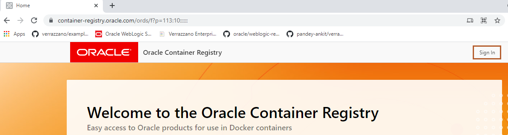

2. Enter your *Oracle Account Credentials* in the Username and Password fields, and then click *Sign In*. We will later use these credentials to create secret in Kubernetes.

    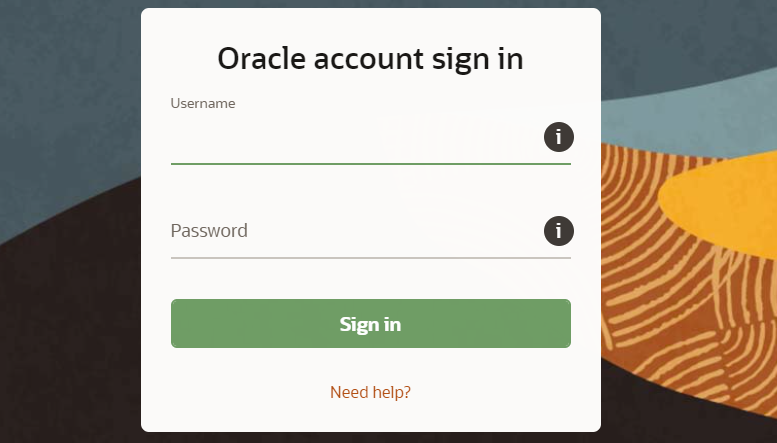

3. On the Home Page, select *Verrazzano*.

    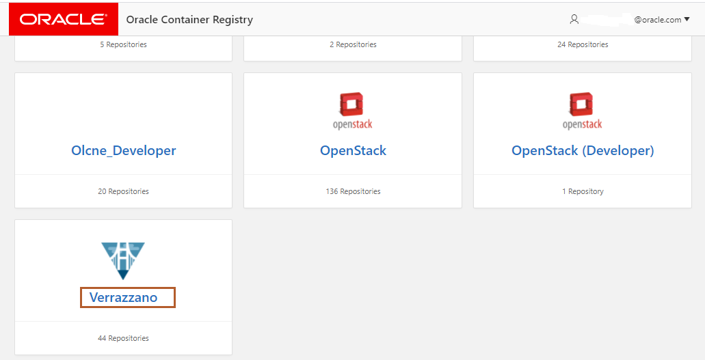

4. For example-bobbys-coherence, example-bobbys-front-end, example-bobs-books-order-manager, and example-roberts-coherence repository , select *English* as the language, then click *Continue*.

    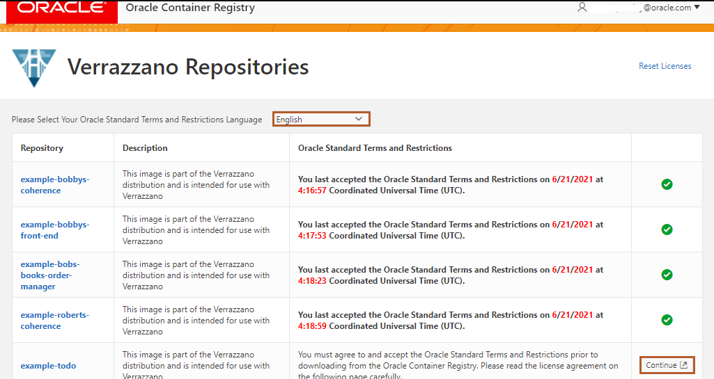

5. Click *Accept* to accept the license agreement.

    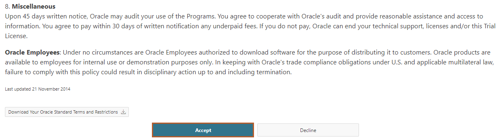

6. Verify that you accepted license agreement for the repositories related to Verrazzano as shown in the following image.

    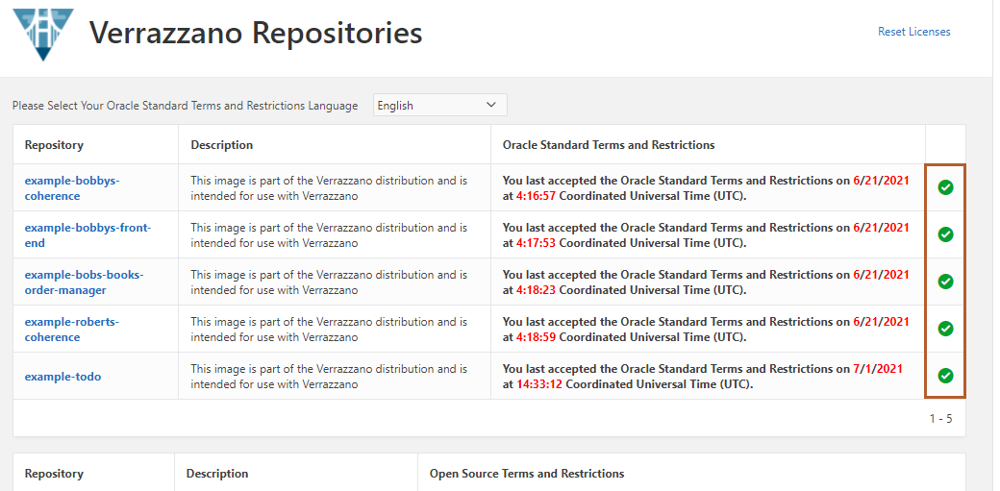

7. In the Home page of Oracle Container Registry, Search for *weblogic*
   
    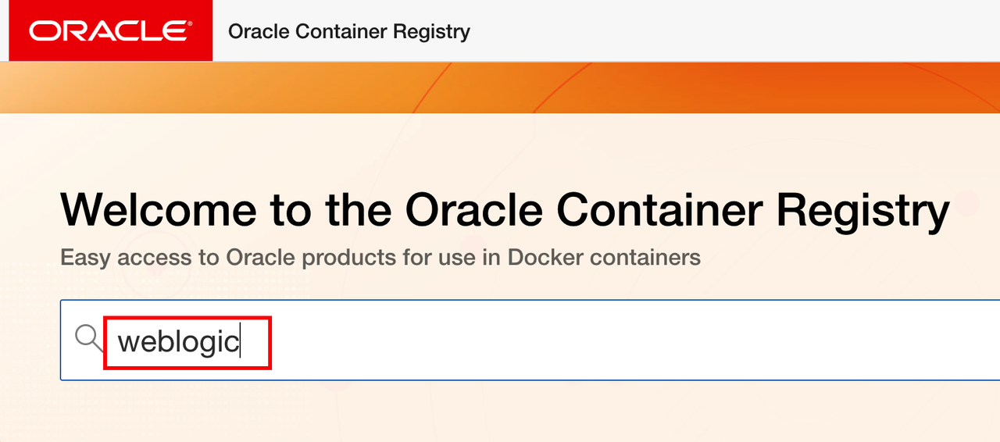

8. Click *weblogic* as shown and accept the license as you did for Verrazzano imagaes.

    
    
## Task 2: Deploy the Bobby's Books application

We need to download the source code, where we have configuration files, `bobs-books-app.yaml` and `bobs-books-comp.yaml`.

1. Download the Verrazzano OAM component yaml file and Verrazzano Application Configuration files of Bobby's Book example. Click *Copy* and paste the command in the Cloud Shell as shown:

    ```bash
    <copy>
    curl -LSs  https://raw.githubusercontent.com/verrazzano/verrazzano/v1.2.1/examples/bobs-books/bobs-books-app.yaml >~/bobs-books-app.yaml
    curl -LSs https://raw.githubusercontent.com/verrazzano/verrazzano/v1.2.1/examples/bobs-books/bobs-books-comp.yaml >~/bobs-books-comp.yaml
    cd ~
    </copy>
    ```

2. We will keep all Kubernetes artifacts in the separate namespace. Create a namespace for the Bob's Books example application. Namespaces are a way to organize clusters into virtual sub-clusters. We can have any number of namespaces within a cluster, each logically separated from others but with the ability to communicate with each other.
Also we need to make Verrazzano aware that we store in that namespace Verrazzano artifacts. So we need to add a a label identifying the bobs-books namespace as managed by Verrazzano. Labels are intended to be used to specify identifying attributes of objects that are meaningful and relevant to users. Here, for the bobs-book namespace, we are attaching a label to it, which marks this namespace as managed by Verrazzano. The *istio-injection=enabled*, enables an Istio "sidecar", and as such, helps establish an Istio proxy. With an Istio proxy, we can access other Istio services like an Istio gateway and such. To add the label to the bobs-books namespace with the previously mentioned attributes, copy the following command and run it in the *Cloud Shell*
    ```bash
    <copy>
    kubectl create namespace bobs-books
    kubectl label namespace bobs-books verrazzano-managed=true istio-injection=enabled
    </copy>
    ```
    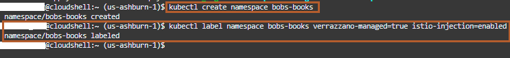

3. Copy the following command to download the script. This script authenticate the user for Oracle Container Registry. If authentication is successful, then it creates the docker registry secret. The Docker registry  is a way to store and version images, like GitHub for normal code but for containers (which Kubernetes can pull). Here, we will create a docker-registry secret to enable pulling the Bobby's Books example image from the Oracle Container Registry. Click *Copy* on the following command, and paste it in any text editor of your choice and replace username and password with the email ID and password respectively which you used in Task 1, for accepting the license agreement for downloading images from the Oracle Container Registry. Then, in the Cloud Shell, paste the modified command as shown:

    ```bash
    <copy>
    curl -LSs https://raw.githubusercontent.com/oracle/learning-library/master/developer-library/multicloud/verrazzano/deploy-bobsbook/create_secret.sh >~/create_secret.sh
    chmod 777 create_secret.sh
    ./create_secret.sh username 'password'    
    </copy>
    ```
    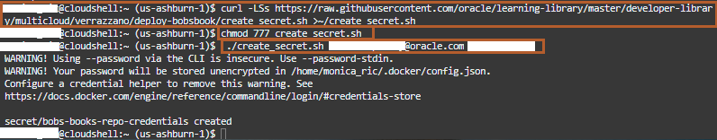
    > Please enter the password in single quotes.
   

4. We need to create several Kubernetes secrets with credentials.  In the Bobby's Books application, we have two WebLogic domains *bobby-front-end* and *bobs-bookstore*. The credentials for the WebLogic domain are kept in a Kubernetes Secret where the name of the secret is specified using *webLogicCredentialsSecret* in the WebLogic Domain resource. Also, the domain credentials secret must be created in the namespace where the domain will be running. We need to create the secrets called *bobbys-front-end-weblogic-credentials* and *bobs-bookstore-weblogic-credentials* used by WebLogic Server domains, with a user name value of `weblogic` and a password which is randomly generated in the bobs-books namespace. Our Bobby's Books application uses a *mysql* database. So, we create a new secret called  *mysql-credentials*, with a user name value of `weblogic`, a password which is randomly generated,  and  JDBC URL, *jdbc:mysql://mysql.bobs-books.svc.cluster.local:3306/books* in the bobs-books namespace. We will use this values in the JDBC connection string in WebLogic DataSource object.
Please copy and paste the block of commands into the *Cloud Shell*.
    ```bash
    <copy>
    export WLS_USERNAME=weblogic
    export WLS_PASSWORD=$((< /dev/urandom tr -dc 'A-Za-z0-9"'\''/<=>?\^_`|~' | head -c10);(date +%S))
    echo $WLS_PASSWORD
    kubectl create secret generic bobbys-front-end-weblogic-credentials --from-literal=password=$WLS_PASSWORD --from-literal=username=$WLS_USERNAME -n bobs-books
    kubectl create secret generic bobs-bookstore-weblogic-credentials --from-literal=password=$WLS_PASSWORD --from-literal=username=$WLS_USERNAME -n bobs-books
    kubectl create secret generic mysql-credentials \
        --from-literal=username=$WLS_USERNAME \
        --from-literal=password=$WLS_PASSWORD \
        --from-literal=url=jdbc:mysql://mysql.bobs-books.svc.cluster.local:3306/books \
        -n bobs-books
    cd ~
    </copy>
    ```
    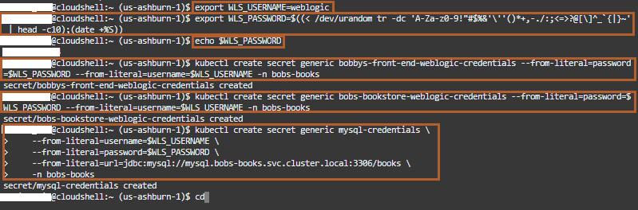

5. We have a Kuberneter cluster, <if type="freetier">*cluster1*</if><if type="livelabs">*verrazzano*</if>, with three nodes. Now, we want to deploy Bobby's Books containerized application on <if type="freetier">*cluster1*</if><if type="livelabs">*verrazzano*</if>. For this, we need a Kubernetes deployment configuration. This deployment instructs the Kubernetes to create and update instances for the Bobby's Books application. Here, we have the `bobs-books-comp.yaml` file, which instructs Kubernetes to deploy the Bobby's Books application. Copy and paste the following two commands as shown. The `bobs-books-comp.yaml` file contains definitions of various OAM components, where, an OAM component is a Kubernetes Custom Resource describing an application’s general composition and environment requirements. To learn more about the `bobs-books-comp.yaml` file, review Verrazzano Components in the Introduction section of this Lab 3.

    ```bash
    <copy>kubectl apply -f ~/bobs-books-comp.yaml -n bobs-books</copy>
    ```

    The output should be similar to the following:

    ```bash
    $ kubectl apply -f ~/bobs-books-comp.yaml -n bobs-books
    component.core.oam.dev/robert-coh created
    component.core.oam.dev/robert-helidon created
    component.core.oam.dev/bobby-coh created
    component.core.oam.dev/bobby-helidon created
    component.core.oam.dev/bobby-wls created
    component.core.oam.dev/bobs-mysql-configmap created
    component.core.oam.dev/bobs-mysql-service created
    component.core.oam.dev/bobs-mysql-deployment created
    component.core.oam.dev/bobs-orders-configmap created
    component.core.oam.dev/bobs-orders-wls created
    $
    ```

6. The `bobs-books-app.yaml` file is a Verrazzano application configuration file, which provides environment specific customizations. To learn more about `bobs-books-app.yaml` file, review Verrazzano Application Configuration in the Introduction section of this Lab 3.

    ```bash
    <copy>kubectl apply -f ~/bobs-books-app.yaml -n bobs-books</copy>
    ```

    The output should be similar to the following:

    ```bash
    $ kubectl apply -f ~/bobs-books-app.yaml -n bobs-books
    applicationconfiguration.core.oam.dev/bobs-books created
    $
    ```
7. Wait for all of the pods in the Bobby’s Books example application to be in the *Running* state. You may need to repeat this command several times before it is successful. The WebLogic Server and Coherence pods may take a while to be created and Ready. This *kubectl* command will wait for all the pods to be in the *Running* state within the bobs-books namespace. It takes around 4-5 minutes. If you are waiting for more then 5 minutes, then you can re-run the command again.

    ```bash
    <copy>kubectl wait --for=condition=Ready pods --all -n bobs-books --timeout=600s</copy>
    ```

    The output should be similar to the following:
    ```bash
      $ kubectl wait --for=condition=Ready pods --all -n bobs-books --timeout=600s
      pod/bobbys-coherence-0 condition met
      pod/bobbys-front-end-adminserver condition met
      pod/bobbys-front-end-managed-server1 condition met
      pod/bobbys-helidon-stock-application-5f74cbcc8b-cw4x4 condition met
      pod/bobs-bookstore-adminserver condition met
      pod/bobs-bookstore-managed-server1 condition met
      pod/mysql-6bc8f9f785-n4qjh condition met
      pod/robert-helidon-65b8874988-7x5vj condition met
      pod/robert-helidon-65b8874988-vnntp condition met
      pod/roberts-coherence-0 condition met
      pod/roberts-coherence-1 condition met
      $
    ```


## Task 3: Verify the successful deployment of the Bobby's Book application

Verify that the application configuration, domains, Coherence resources, and ingress trait all exist.

1. To verify that the *Bobby's Books* application is successfully deployed in the bobs-books namespace.

    ```bash
    <copy>kubectl get ApplicationConfiguration -n bobs-books</copy>
    ```

    The output should be similar to the following:
    ```bash
    $ kubectl get ApplicationConfiguration -n bobs-books
      NAME         AGE
      bobs-books   72m
    $
    ```

2. To verify that both WebLogic domains are created within the bobs-books namespace successfully.

    ```bash
    <copy>kubectl get Domain -n bobs-books</copy>
    ```

    The output should be similar to the following:
    ```bash
    $ kubectl get Domain -n bobs-books
      NAME               AGE
      bobbys-front-end   73m
      bobs-orders-wls    73m
    $
    ```

3. To verify that both Coherence clusters are created within the bobs-books namespace successfully.

    ```bash
    <copy>kubectl get Coherence -n bobs-books</copy>
    ```

    The output should be similar to the following:
    ```bash
    $ kubectl get Coherence -n bobs-books
      NAME                CLUSTER             ROLE                REPLICAS   READY   PHASE
      bobbys-coherence    bobbys-coherence    bobbys-coherence    1          1       Ready
      roberts-coherence   roberts-coherence   roberts-coherence   2          2       Ready
    $
    ```

4. To get the IngressTrait for the Bobby's Book application, run the following command in the *Cloud Shell*.

    ```bash
    <copy>kubectl get IngressTrait -n bobs-books</copy>
    ```

    The output should be similar to the following:
    ```bash
    $ kubectl get IngressTrait -n bobs-books
      NAME                               AGE
      bobby-wls-trait-79b67d9d88         76m
      bobs-orders-wls-trait-57b4d8cb4b   76m
      robert-helidon-trait-54d7bcd54b    76m
    $
    ```

5. Verify that the service pods are successfully created and transition to the *Running* state. Note that this may take a few minutes and that you may see some of the services terminate and restart. Finally, you will observe all the pods associated with the bobs-books namespace are in the *Running* Status. Please copy the pods details for the *bobbys-helidon-stock-application*.

    ```bash
    <copy>kubectl get pods -n bobs-books</copy>
    ```

    ```bash
    $ kubectl get pods -n bobs-books
    NAME                                            READY    STATUS    RESTARTS   AGE
    bobbys-coherence-0                               2/2     Running   0          7m51s
    bobbys-front-end-adminserver                     4/4     Running   0          5m28s
    bobbys-front-end-managed-server1                 4/4     Running   0          4m30s
    bobbys-helidon-stock-application-5f74cbc-cw4x4   2/2     Running   0          7m54s
    bobs-bookstore-adminserver                       4/4     Running   0          4m31s
    bobs-bookstore-managed-server1                   4/4     Running   0          3m41s
    mysql-6bc8f9f785-n4qjh                           2/2     Running   0          5m52s
    robert-helidon-65b8874988-7x5vj                  2/2     Running   0          7m53s
    robert-helidon-65b8874988-vnntp                  2/2     Running   0          7m54s
    roberts-coherence-0                              2/2     Running   0          7m52s
    roberts-coherence-1                              2/2     Running   0          7m51s
    $
    ```

    > Note the pod name for **bobbys-helidon-stock-application**. When we redeploy this component, you will notice that this pod will go into a *Terminating* status and new pod will start and come in the *Running* state in Lab 7.

Leave the *Cloud Shell* open; we will use it for the next labs as well.

## Acknowledgements

* **Author** -  Ankit Pandey
* **Contributors** - Maciej Gruszka, Peter Nagy
* **Last Updated By/Date** - Ankit Pandey, April 2022
