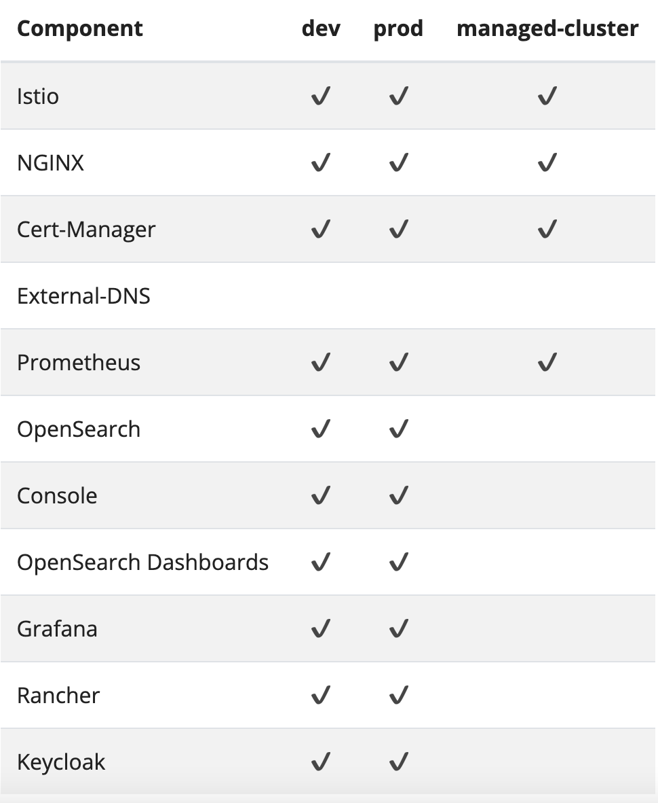

# Install Verrazzano

## Introduction

This lab walks you through the steps to install Verrazzano on a Kubernetes cluster in the Oracle Cloud Infrastructure.

Estimated time: 20 minutes

### About Product/Technology

Verrazzano is an end-to-end enterprise container platform for deploying cloud-native and traditional applications in multicloud and hybrid environments. It is made up of a curated set of open source components – many that you may already use and trust, and some that were written specifically to pull together all of the pieces that make Verrazzano a cohesive and easy to use platform.

Verrazzano includes the following capabilities:

* Hybrid and multicluster workload management
* Special handling for WebLogic, Coherence, and Helidon applications
* Multicluster infrastructure management
* Integrated and pre-wired application monitoring
* Integrated security
* DevOps and GitOps enablement

### Objectives

In this lab, you will:

* Install the Verrazzano platform operator.
* Install the development (`dev`) profile of Verrazzano.
* Verify the successful Verrazzano installation.

### Prerequisites

Verrazzano requires the following:

* A Kubernetes cluster and a compatible `kubectl`.
* At least 2 CPUs, 100GB disk storage, and 16GB RAM available on the Kubernetes worker nodes. This is sufficient to install the development profile of Verrazzano. Depending on the resource requirements of the applications you deploy, this may or may not be sufficient for deploying your applications.

<if type="freetier">
In Lab 1, you created a Kubernetes cluster on the Oracle Cloud Infrastructure. You will use that Kubernetes cluster, *cluster1*, for installing the development profile of Verrazzano.
</if>

<if type="livelabs">
In Lab 1, you created configuration file to access Kubernetes cluster on the Oracle Cloud Infrastructure. You will use that Kubernetes cluster, *cluster1*, for installing the development profile of Verrazzano.
</if>

## Task 1: Install the Verrazzano Platform Operator

Verrazzano provides a platform [operator](https://kubernetes.io/docs/concepts/extend-kubernetes/operator/) to manage the life cycle of Verrazzano installations. You can install, uninstall, and update Verrazzano installations by updating the [Verrazzano custom resource](https://verrazzano.io/docs/reference/api/verrazzano/verrazzano/).

Before installing Verrazzano, we need to install the Verrazzano Platform Operator.

1. Copy the following command and paste it in the *Cloud Shell* to run it.

    ```bash
    <copy>kubectl apply -f https://github.com/verrazzano/verrazzano/releases/download/v1.2.1/operator.yaml</copy>
    ```
    The output should be similar to the following:
    ```bash
    $ kubectl apply -f https://github.com/verrazzano/verrazzano/releases/download/v1.2.1/operator.yaml
    customresourcedefinition.apiextensions.k8s.io/verrazzanomanagedclusters.clusters.verrazzano.io created
    customresourcedefinition.apiextensions.k8s.io/verrazzanos.install.verrazzano.io created
    namespace/verrazzano-install created
    serviceaccount/verrazzano-platform-operator created
    clusterrole.rbac.authorization.k8s.io/verrazzano-managed-cluster created
    clusterrolebinding.rbac.authorization.k8s.io/verrazzano-platform-operator created
    service/verrazzano-platform-operator created
    deployment.apps/verrazzano-platform-operator created
    validatingwebhookconfiguration.admissionregistration.k8s.io/verrazzano-platform-operator created
    $
    ```
    > This `operator.yaml` file contains information about the operator and the service accounts and custom resource definitions. By running this *kubectl apply* command, we are specifying whatever is in the `operator.yaml` file.
    > All deployments in Kubernetes happen in a namespace. When we deploy the Verrazzano Platform Operator, it happens in the namespace called "verrazzano-install".

2. To find out the deployment status for the Verrazzano Platform Operator, copy the following command and paste it in the *Cloud Shell*.

    ```bash
    <copy>kubectl -n verrazzano-install rollout status deployment/verrazzano-platform-operator</copy>
    ```

  The output should be similar to the following:

    ```bash
    $ kubectl -n verrazzano-install rollout status deployment/verrazzano-platform-operator
    deployment "verrazzano-platform-operator" successfully rolled out
    $
    ```

    
    > Confirm that the operator pod associated with the Verrazzano Platform Operator is correctly defined and running. A Pod is a unit which runs containers / images and Pods belong to nodes.

3. To find out the pod status, copy and paste the following command in the *Cloud Shell*.

    ```bash
    <copy>kubectl -n verrazzano-install get pods</copy>
    ```

    The output should be similar to the following:
    ```bash
    $ kubectl -n verrazzano-install get pods
    NAME                                           READY   STATUS    RESTARTS   AGE
    verrazzano-platform-operator-f56788bfc-rgql6   1/1     Running   0          71s
    $
    ```

## Task 2: Installation of the Verrazzano development profile

An installation profile is a well-known configuration of Verrazzano settings that can be referenced by name, which can then be customized as needed.

Verrazzano supports the following installation profiles: development (`dev`), production (`prod`), and managed cluster (`managed-cluster`).

The following image describes the Verrazzano installation profiles.


To change profiles in any of the following commands, set the *VZ_PROFILE* environment variable to the name of the profile you want to install.

For a complete description of Verrazzano configuration options, see the [Verrazzano Custom Resource Definition](https://verrazzano.io/docs/reference/api/verrazzano/verrazzano/).

In this lab, we are going to install the *development profile of Verrazzano*, which has the following characteristics:

* Wildcard (nip.io) DNS
* Self-signed certificates
* Shared observability stack used by the system components and all applications
* Ephemeral storage for the observability stack (if the pods are restarted, you lose all of your logs and metrics)
* It has a lightweight installation.
* It is for evaluation purposes.
* Single-node Opensearch cluster topology.

The following image describes the Verrazzano components that are installed with each profile.



According to our DNS choice, we can use nip.io (wildcard DNS) or [Oracle OCI DNS](https://docs.cloud.oracle.com/en-us/iaas/Content/DNS/Concepts/dnszonemanagement.htm). In this lab, we are going to install using nip.io (wildcard DNS).

An ingress controller is something that helps provide access to Docker containers to the outside world (by providing an IP address). The ingress routes the IP address to different clusters.

1. Install using the nip.io DNS Method. Copy the following command and paste it in the *Cloud Shell* to install Verrazzano.

    ```bash
    <copy>kubectl apply -f - <<EOF
    apiVersion: install.verrazzano.io/v1alpha1
    kind: Verrazzano
    metadata:
      name: example-verrazzano
    spec:
      profile: dev
    EOF
    </copy>
    ```

    The output should be similar to the following:
    ```bash
    $ kubectl apply -f - <<EOF
    apiVersion: install.verrazzano.io/v1alpha1
    kind: Verrazzano
    metadata:
      name: example-verrazzano
    spec:
      profile: dev
    EOF
    verrazzano.install.verrazzano.io/example-verrazzano created
    $
    ```

    <if type="freetier">
    > It takes around 15 to 20 minutes to complete the installation.
    </if>

    <if type="livelabs">
    > It takes around 8 to 10 minutes to complete the installation.
    </if>


2. To verify the successful installation, copy the following command and paste it in the *Cloud Shell*. It checks for the condition, if *InstallComplete* condition is met, and notifies you. Here *example-verrazzano* is the name of the *Verrazzano Custom Resource*.

    ```bash
    <copy>kubectl wait --timeout=20m --for=condition=InstallComplete verrazzano/example-verrazzano</copy>
    ```

    The output should be similar to the following:
    ```bash
    $ kubectl wait --timeout=20m --for=condition=InstallComplete verrazzano/example-verrazzano
    verrazzano.install.verrazzano.io/example-verrazzano condition met
    $
    ```

## Task 3: Verification of a successful Verrazzano installation

Verrazzano installs multiple objects in multiple namespaces. Verrazzano components are installed in the namespace *verrazzano-system*.

1. Please verify that all the pods associated with the multiple objects have a *Running* status. You will have 16 pods in the *Running* state.

    ```bash
    <copy>kubectl get pods -n verrazzano-system</copy>
    ```

    The output should be similar to the following:

    ```bash
    kubectl get pods -n verrazzano-system
    NAME                                           READY STATUS    RESTARTS   AGE
    coherence-operator-dcfb446df-5dckp             1/1   Running   1          8m57s
    fluentd-cgrg5                                  2/2   Running   1          6m22s
    fluentd-jztnn                                  2/2   Running   1          6m22s
    fluentd-n4s95                                  2/2   Running   1          6m22s
    oam-kubernetes-runtime-549db9798b-grxj4        1/1   Running   0          8m50s
    verrazzano-application-operator-54668f668-bng5 1/1   Running   0          8m9s
    verrazzano-authproxy-86fb64c9f-4mffq           2/2   Running   0          6m22s
    verrazzano-console-6c8d4875cf-r6bsv            2/2   Running   0          6m22s
    verrazzano-monitoring-operator-787bfc7f86-p6qb 1/1   Running   0          6m22s
    verrazzano-operator-6cc79dfdcc-6l9lt           1/1   Running   0          6m22s
    vmi-system-es-master-0                         2/2   Running   0          4m37s
    vmi-system-grafana-666f6854b4-xrmwf            2/2   Running   0          4m37s
    vmi-system-kiali-5949966fb8-gczd5              2/2   Running   0          6m17s
    vmi-system-kibana-95d8c5d96-9qr9j              2/2   Running   0          4m37s
    vmi-system-prometheus-0-74478c9d44-gk85g       3/3   Running   0          3m6s
    weblogic-operator-5df5f94bd7-tkg74             2/2   Running   0          8m17s
    $
    ```

Leave the *Cloud Shell* open; we need it for Lab 3.

## Acknowledgements

* **Author** -  Ankit Pandey
* **Contributors** - Maciej Gruszka, Peter Nagy
* **Last Updated By/Date** - Ankit Pandey, May 2022
