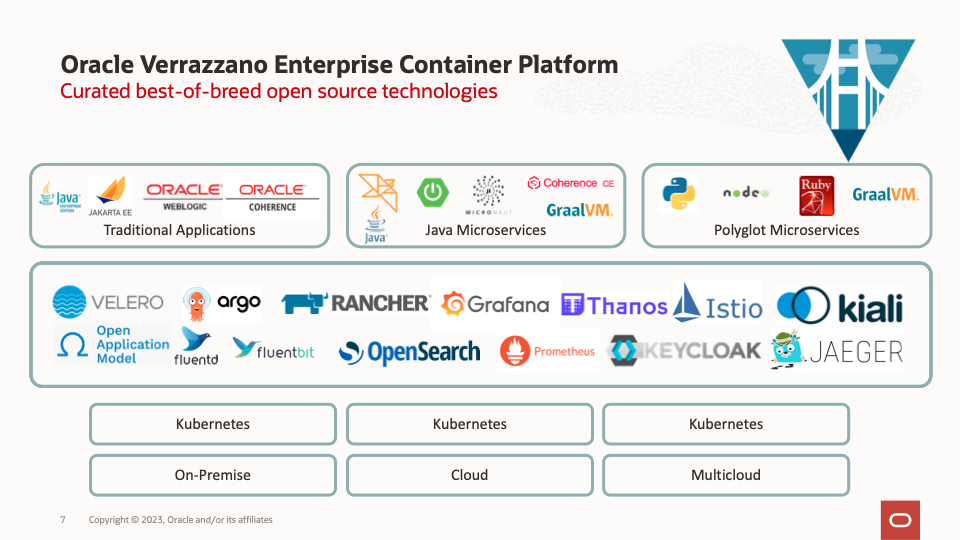

# Introduction

## About this Workshop

This lab shows you how to install the Verrazzano platform on a single Kubernetes cluster and deploy a sample application using Verrazzano concepts.

The [Bobby’s Books](https://verrazzano.io/docs/samples/bobs-books/) sample application consists of three main parts:

- A back-end “order processing” application, which is a Java EE application with REST services and a very simple JSP UI, which stores data in a MySQL database. This application runs on WebLogic Server.
- A front-end web store “Robert’s Books”, which is a general book seller. This is implemented as a Helidon microservice, which gets book data from Coherence, uses a Coherence cache store to persist data for the order manager, and has a React web UI.
- A front-end web store “Bobby’s Books”, which is a specialty children’s book store. This is implemented as a Helidon microservice, which gets book data from a (different) Coherence cache store, interfaces directly with the order manager, and has a JSF web UI running on WebLogic Server.

### About Product/Technology

Verrazzano is an end-to-end enterprise container platform for deploying cloud-native and traditional applications in multicloud and hybrid environments. It is made up of a curated set of open source components – many that you may already use and trust, and some that were written specifically to pull together all of the pieces that make Verrazzano a cohesive and easy to use platform.

Verrazzano includes the following capabilities:
- Hybrid and multicluster workload management
- Special handling for WebLogic, Coherence, and Helidon applications
- Multicluster infrastructure management
- Integrated and pre-wired application monitoring
- Integrated security
- DevOps and GitOps enablement

### Objectives
<if type="freetier">
1. Set up an Oracle Kubernetes Engine instance on the Oracle Cloud Infrastructure.</if>
<if type="livelabs">
1. Configure `kubectl` to interact with the Oracle Kubernetes Engine instance on the Oracle Cloud Infrastructure.
</if>
2. Install and get to know the Verrazzano platform.
3. Deploy the *Bobby’s Books* sample application.
4. Modify and redeploy the Helidon-based *Stock* application component.

## Learn More

* [Verrazzano](https://verrazzano.io/)

## Acknowledgements

* **Author** -  Ankit Pandey
* **Contributors** - Maciej Gruszka, Peter Nagy
* **Last Updated By/Date** - Ankit Pandey, May 2022