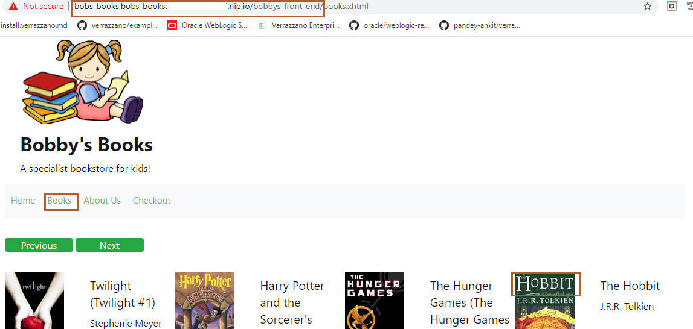
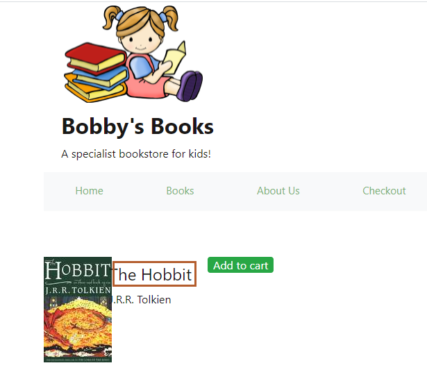
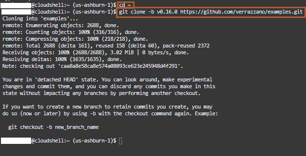
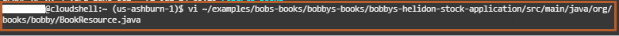
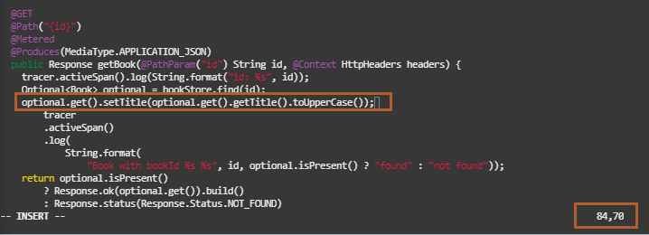
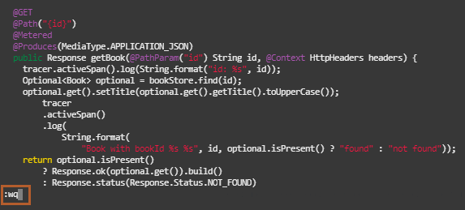
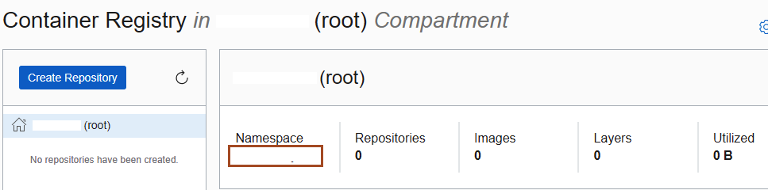
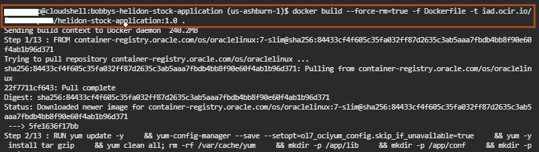
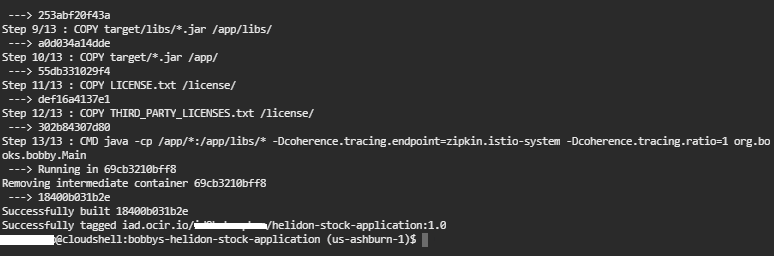

# Modify the Bobby's Book Application and Create a New Application Component Image

## Introduction

In this lab, we will modify bobbys-helidon-stock-application through the *Cloud Shell*. Later, we will create a new Docker image for bobbys-helidon-stock-application. This bobbys-helidon-stock-application image is a component for the Bobby's Books application.

Estimated time: 10 minutes

### Objectives

In this lab, you will:

* Modify bobbys-helidon-stock-application.
* Create a new Docker image for bobbys-helidon-stock-application.

### Prerequisites

You should have a text editor, where you can paste the commands and URLs and modify them, as per your environment. Then you can copy and paste the modified commands for running them in the *Cloud Shell*.

## Task 1: Modify bobbys-helidon-stock-application

1. Select the Bobby's Book tab, then click *Books*, and then click on the image for *The Hobbit* book, as shown:

    

    It shows the book name in the format *The Hobbit*, as shown in the image.

    

2. We want to convert the book name to upper case letters (THE HOBBIT). We need to download the source code for the Bobby's Books application. Make sure, you are in the home folder. Copy the following commands and paste it in the *Cloud Shell*.

    ```bash
    <copy>cd ~
    git clone -b v0.16.0 https://github.com/verrazzano/examples.git</copy>
    ```

    

3. To view the files inside the Bobby's Book application, copy the following command and paste it in the *Cloud Shell*.

    ```bash
    <copy>ls -la ~/examples/bobs-books/</copy>
    ```

    The output should be similar to the following:
        ```bash
        $ ls -la ~/examples/bobs-books/
        total 16
        drwxr-xr-x. 5 user oci  100 May  5 12:49 .
        drwxr-xr-x. 7 user oci 4096 May  5 12:49 ..
        drwxr-xr-x. 5 user oci 4096 May  5 12:49 bobbys-books
        drwxr-xr-x. 5 user oci 4096 May  5 12:49 bobs-bookstore-order-manager
        -rw-r--r--. 1 user oci  942 May  5 12:49 README.md
        drwxr-xr-x. 4 user oci   72 May  5 12:49 roberts-books
        $
        ```

4. Now, we are going to make changes in the relevant JAVA_FILE. To open the file, please copy the following command and paste it in the *Cloud Shell*.

    ```bash
    <copy>vi ~/examples/bobs-books/bobbys-books/bobbys-helidon-stock-application/src/main/java/org/books/bobby/BookResource.java</copy>
    ```

    

5. Press *i*, so that you can modify the code. To add a new line at line number 84, copy the following line and paste it at line number 84 as shown:

    ```bash
    <copy>optional.get().setTitle(optional.get().getTitle().toUpperCase());</copy>
    ```

    

6. Press *Esc* and then *:wq* to save the changes.

    

## Task 2: Create a new Docker image for the bobbys-helidon-stock-application

1. Because we are going to build a new Docker image for *bobbys-helidon-stock-application*, which has dependencies on *bobbys-coherence-application*, we run a *Maven* command to clean the existing bobbys-coherence-application archive and compile, build, package, and install a new bobby-coherence-application archive in a local Maven repository. To change to the *bobbys-coherence* directory folder and to compile, build, and install the *bobbys-coherence* application archive into a local Maven repository, copy the following command and paste it in the *Cloud Shell*.

    ```bash
    <copy>
    cd ~/examples/bobs-books/bobbys-books/bobbys-coherence/
    mvn clean install
    </copy>
    ```

    The resulting output is similar to the following (abbreviated to show only the start and end of output):
        ```bash
        $ cd ~/examples/bobs-books/bobbys-books/bobbys-coherence/
        $ mvn clean install
        [INFO] Scanning for projects...
        [INFO]
        [INFO] ------------------------------------------------------------------------
        [INFO] Building bobbys-coherence 1.0-SNAPSHOT
        [INFO] ------------------------------------------------------------------------

        [INFO]
        [INFO] --- maven-install-plugin:2.4:install (default-install) @ bobbys-coherence ---
        [INFO] Installing /home/user/examples/bobs-books/bobbys-books/bobbys-coherence/target/bobbys-coherence.jar to /home/user/.m2/repository/io/verrazzano/example/books/bobbys-coherence/1.0-SNAPSHOT/bobbys-coherence-1.0-SNAPSHOT.jar
        [INFO] Installing /home/user/examples/bobs-books/bobbys-books/bobbys-coherence/pom.xml to /home/user/.m2/repository/io/verrazzano/example/books/bobbys-coherence/1.0-SNAPSHOT/bobbys-coherence-1.0-SNAPSHOT.pom
        [INFO] ------------------------------------------------------------------------
        [INFO] BUILD SUCCESS
        [INFO] ------------------------------------------------------------------------
        [INFO] Total time: 5.288 s
        [INFO] Finished at: 2022-01-05T12:51:10Z
        [INFO] Final Memory: 25M/199M
        [INFO] ------------------------------------------------------------------------
        $
        ```

2. Because we modified *bobbys-helidon-stock-application*, we need to compile, build, and package this application. To change to the *bobbys-helidon-stock-application* directory and to package *bobbys-helidon-stock-application* into a JAR file, copy the following command and paste it in the *Cloud Shell*.  In the second image, you can see the creation of the `bobbys-helidon-stock-application.jar` file at `~/examples/bobs-books/bobbys-books/bobbys-helidon-stock-application/target`.

    ```bash
    <copy>cd ~/examples/bobs-books/bobbys-books/bobbys-helidon-stock-application/
    mvn clean package
    </copy>
    ```

    The resulting output is similar to the following (abbreviated to show only the start and end of output):
        ```bash
        $ cd ~/examples/bobs-books/bobbys-books/bobbys-helidon-stock-application/
        $ mvn clean package
        [INFO] Scanning for projects...
        [INFO] ------------------------------------------------------------------------
        [INFO] Detecting the operating system and CPU architecture
        [INFO] ------------------------------------------------------------------------

        [INFO]
        [INFO] --- maven-install-plugin:2.4:install (default-install) @ bobbys-coherence ---
        [INFO] Installing /home/user/examples/bobs-books/bobbys-books/bobbys-coherence/target/bobbys-coherence.jar to /home/user/.m2/repository/io/verrazzano/example/books/bobbys-coherence/1.0-SNAPSHOT/bobbys-coherence-1.0-SNAPSHOT.jar
        [INFO] Installing /home/user/examples/bobs-books/bobbys-books/bobbys-coherence/pom.xml to /home/user/.m2/repository/io/verrazzano/example/books/bobbys-coherence/1.0-SNAPSHOT/bobbys-coherence-1.0-SNAPSHOT.pom
        [INFO] ------------------------------------------------------------------------
        [INFO] BUILD SUCCESS
        [INFO] ------------------------------------------------------------------------
        [INFO] Total time: 5.288 s
        [INFO] Finished at: 2022-01-05T12:51:10Z
        [INFO] Final Memory: 25M/199M
        [INFO] ------------------------------------------------------------------------
        $
        ```

3. We are going to create a Docker image for bobby-stock-helidon-application, but this application uses a specific version of JDK and we don't want to change the Docker files which build the new image. So, we download the required JDK. To download the required JDK version, copy the below command and paste it in the *Cloud Shell*.

    ```bash
    <copy>wget https://download.java.net/java/GA/jdk14.0.2/205943a0976c4ed48cb16f1043c5c647/12/GPL/openjdk-14.0.2_linux-x64_bin.tar.gz</copy>
    ```

    The output should be similar to the following:
        ```bash
        $ wget https://download.java.net/java/GA/jdk14.0.2/205943a0976c4ed48cb16f1043c5c647/12/GPL/openjdk-14.0.2_linux-x64_bin.tar.gz
        --2022-01-05 12:54:41--  https://download.java.net/java/GA/jdk14.0.2/205943a0976c4ed48cb16f1043c5c647/12/GPL/openjdk-14.0.2_linux-x64_bin.tar.gz
        Resolving download.java.net (download.java.net)... 23.55.248.91
        Connecting to download.java.net (download.java.net)|23.55.248.91|:443... connected.
        HTTP request sent, awaiting response... 200 OK
        Length: 198606200 (189M) [application/x-gzip]
        Saving to: ‘openjdk-14.0.2_linux-x64_bin.tar.gz’
        100%[==================================================================================================================================================================================================================================>] 198,606,200  135MB/s   in 1.4s
        2022-01-05 12:54:42 (135 MB/s) - ‘openjdk-14.0.2_linux-x64_bin.tar.gz’ saved [198606200/198606200]
        $
        ```

4. We are creating a Docker image, which we will upload to the Oracle Cloud Container Registry in Lab 6. To create the file name, we need the following information:

    * Tenancy Namespace
    * End point for the Region

    You can find out your *Region Name* in top right corner in the Oracle Cloud Console, as shown in following image.
    

5. For finding the Namespace of the tenancy, select the *Hamburger Menu* -> *Developer Services* -> *Container Registry*, as shown. In the compartment, you will find the Namespace. Copy and save it in somewhere in your text editor. Keep it in the text editor, because we will also use it in Lab 6.

    
    

6. To find out the endpoint for your Region, select this URL [https://docs.oracle.com/en-us/iaas/Content/Registry/Concepts/registryprerequisites.htm#Availab](https://docs.oracle.com/en-us/iaas/Content/Registry/Concepts/registryprerequisites.htm#Availab). In my case, it is *US EAST (Ashburn)* as the region name, thus its endpoint is *iad.ocir.io*. Find out your endpoint for your own *Region Name* and save it in the text editor. We will also need it for the next lab.

    

7. Now you have both the Tenancy Namespace and Endpoint for your region. Copy the following command and paste it in your text editor. Then replace the **`END_POINT_OF_YOUR_REGION`** with the endpoint of your region name, **`NAMESPACE_OF_YOUR_TENANCY`** with your tenancy's namespace and **`your_first_name`** with your first name in lower case.

    ```bash
    <copy>docker build --force-rm=true -f Dockerfile -t END_POINT_OF_YOUR_REGION/NAMESPACE_OF_YOUR_TENANCY/helidon-stock-application-your_first_name:1.0 .</copy>
    ```

    

    
 
    > For example, in my case the command is `docker build --force-rm=true -f Dockerfile -t iad.ocir.io/tenancynamespace/helidon-stock-application-ankit`.

This creates the Docker image, which we will push into the Oracle Cloud Container Registry repository in Lab 6. You need to copy the replaced full image name **`END_POINT_OF_YOUR_REGION/NAMESPACE_OF_YOUR_TENANCY/helidon-stock-application-your_first_name:1.0`**  in your text editor.In Lab 6, when you will need to create the repository, you need to give it name **`helidon-stock-application-your_first_name`**.

Leave the *Cloud Shell* open; we need it for next lab.

## Acknowledgements

* **Author** -  Ankit Pandey
* **Contributors** - Maciej Gruszka, Peter Nagy
* **Last Updated By/Date** - Ankit Pandey, April 2022
