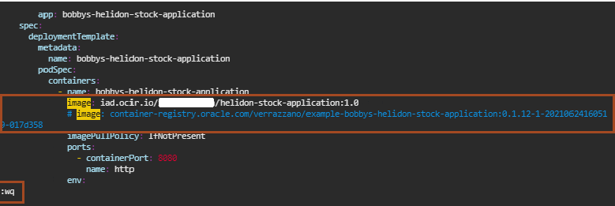

# Modify the Bobby's Books Configuration YAML File

## Introduction

In Lab 6, we pushed the updated Docker image for *bobby-helidon-stock-application*. Now, we want Verrazzano to redeploy the updated application and components without affecting the services. For this, we need to configure the YAML file so that Verrazzano picks up the new image and starts a pod for it. After the pod is in the *Running* state, it terminates the pod associated with the previous application and components.

Estimated time: 10 minutes

### Objectives

In this lab, you will:

* Modify the `bobs-books-comp.yaml` file.
* Apply the changes using `kubectl`.

### Prerequisites

You should have a text editor, where you can paste the commands and URLs and modify them, as per your environment. Then you can copy and paste the modified commands for running them in the *Cloud Shell*.

## Task 1: Modify the bobs-books-comp.yaml file

1. We have an application configuration file, *bobs-books-comp.yaml*. In Lab 2, we downloaded the application yaml files.  To change to the Home directory which contains the yaml file, copy the following command and paste it in the *Cloud Shell*.

    ```bash
    <copy>cd ~</copy>
    ```


2. In this location, we have the configuration file for the bobs-books application. As part of Lab 5, we modified bobbys-helidon-stock-application and built a new Docker image for that component. In Lab 6, we pushed that Docker image to the Oracle Cloud Container Registry repository. Now, in this lab, we will modify the *bobs-books-comp.yaml* file so that it takes the new updated Docker image from the Oracle Cloud Container Registry repository. To modify the *bobs-books-comp.yaml* file, copy the following command and paste it in the *Cloud Shell*.

    ```bash
    <copy>vi bobs-books-comp.yaml</copy>
    ```

    

3. As part of Lab 5, you saved your Docker image full name. You need to copy the following line and paste it in your text editor. Then, you need to replace `docker image full name` with your Docker image name. Then copy the modified line and press *i* to insert the text in the `*bobs-books-comp.yaml*` file. Paste the output at line number 153 (make sure you keep the indentation) and comment out the exiting line with *#* as shown in the following image, then press *Esc* and then type *:wq* to save the file.

    ```bash
    <copy>image:  `docker image full name`</copy>
    ```

    

## Task 2: Apply the Changes using `kubectl`

1. To apply the changes, copy and paste the following command in the *Cloud Shell*. When you will apply the change, a new pod will initialize for serving requests for new component, while the pod associated with the old component will continue serving requests. Later, after the new pod will reaches to the *Running* state, then the old pod will begin being *Terminated*. Eventually, only the new pod will be in the *Running* state.

    ```bash
    <copy>kubectl apply -f bobs-books-comp.yaml -n bobs-books</copy>
    ```

    The output should be similar to the following:
    ```bash
    $ kubectl apply -f ~/bobs-books-comp.yaml -n bobs-books
    component.core.oam.dev/robert-coh unchanged
    component.core.oam.dev/robert-helidon unchanged
    component.core.oam.dev/bobby-coh unchanged
    component.core.oam.dev/bobby-helidon configured
    component.core.oam.dev/bobby-wls unchanged
    component.core.oam.dev/bobs-mysql-configmap unchanged
    component.core.oam.dev/bobs-mysql-service unchanged
    component.core.oam.dev/bobs-mysql-deployment unchanged
    component.core.oam.dev/bobs-orders-configmap unchanged
    component.core.oam.dev/bobs-orders-wls unchanged
    $
    ```

    You can observe in the output; only *component.core.oam.dev/bobby-helidon* is configured and other components are unchanged.

2. To view how the new pod is getting initialized and the old pod gets in the *Terminating* state, copy and paste the following command in the *Cloud Shell*.

    ```bash
    <copy>kubectl get pods -n bobs-books -w</copy>
    ```

    You will see output similar to the following:

    ```bash
    $ kubectl get pods -n bobs-books
    NAME                                         READY  STATUS   RESTARTS  AGE
    bobbys-coherence-0                           2/2    Running      0         130m
    bobbys-front-end-adminserver                 4/4    Running      0         127m
    bobbys-front-end-managed-server1             4/4    Running      0         126m
    bobbys-helidon-stock-application-64fb55-zzp  0/2    PodInitializing  0     10s
    bobbys-helidon-stock-application-77867f-8h5  2/2    Running      0         130m
    bobs-bookstore-adminserver                   4/4    Running      0         127m
    bobs-bookstore-managed-server1               4/4    Running      0         126m
    mysql-65d864bf8c-xf64p                       2/2    Running      0         130m
    robert-helidon-bfdfb58b8-58qfs               2/2    Running      0         130m
    robert-helidon-bfdfb58b8-lkw8m               2/2    Running      0         130m
    roberts-coherence-0                          2/2    Running      0         130m
    roberts-coherence-1                          2/2    Running      0         130m
    bobbys-helidon-stock-application-64fb55-zzp  1/2    Running      0         28s
    bobbys-helidon-stock-application-64fb55-zzp  2/2    Running      0         34s
    bobbys-helidon-stock-application-77867f-8h5  2/2    Terminating  0         130m
    bobbys-helidon-stock-application-77867f-8h5  0/2    Terminating  0         130m
    bobbys-helidon-stock-application-77867f-8h5  0/2    Terminating  0         130m
    bobbys-helidon-stock-application-77867f-8h5  0/2    Terminating  0         130m
    $
    ```

    After you see that all the pods are in the *Running* Status, press *CTRL + C* to kill this command.

Leave the *Cloud Shell* open as we also need it for our last lab.

## Acknowledgements

* **Author** -  Ankit Pandey
* **Contributors** - Maciej Gruszka, Peter Nagy
* **Last Updated By/Date** - Ankit Pandey, May 2022
