# Verifying the changes through application access and Curated stack

## Introduction

In Lab 7, we applied changes in bobbys-helidon-stock-application and the pod for it is in the *Running* state. In this lab, we will verify the changes in the application, the Verrazzano Console, and the Grafana Console.

Estimated time: 05 minutes

### Objectives

In this lab, you will:

* Verify the changes in the Bobby's Books application.
* Verify the changes in the Verrazzano Console.
* Verify the changes in the Grafana Console.

### Prerequisites

* You should have a text editor, where you can paste the commands and URLs and modify them, as per your environment. Then you can copy and paste the modified commands for running them in the *Cloud Shell*.

## Task 1: Verify the Changes in Bobby's Books Application

1. Open the Bobby's Books tab and select Refresh. If you have closed that tab, then copy and paste the following command in the text editor and replace the XX.XX.XX.XX  with the EXTERNAL_IP for the application. You will notice that the Book Name is in all upper case letters.

    ```bash
    <copy>https://bobs-books.bobs-books.XX.XX.XX.XX.nip.io/bobbys-front-end/</copy>
    ```

    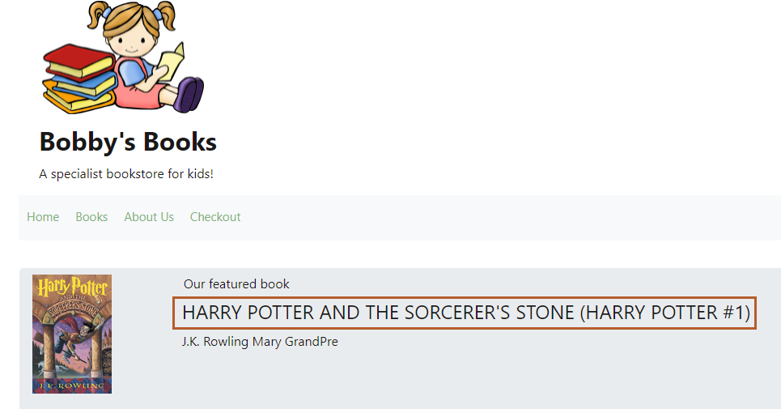

## Task 2: Verify the Changes in the Verrazzano Console

1. You determined the endpoints for the Verrazzano Console as part of Lab 4, but, if you want to get the link for the Verrazzano console, copy the following command and run it in the *Cloud Shell*.

    ```bash
    <copy>kubectl get vz -o jsonpath="{.items[].status.instance}" | jq .</copy>
    ```

    You can see the link for the Verrazzano Console, select it to open the console.

    The output should be similar to the following:
        ```bash
        $ kubectl get vz -o jsonpath="{.items[].status.instance}" | jq .
        {
        "consoleUrl": "https://verrazzano.default.XX.XX.XX.XX.nip.io",
        "elasticUrl": "https://elasticsearch.vmi.system.default.1XX.XX.XX.XX.nip.io",
        "grafanaUrl": "https://grafana.vmi.system.default.XX.XX.XX.XX.nip.io",
        "keyCloakUrl": "https://keycloak.default.XX.XX.XX.XX.nip.io",
        "kialiUrl": "https://kiali.vmi.system.default.XX.XX.XX.XX.nip.io",
        "kibanaUrl": "https://kibana.vmi.system.default.XX.XX.XX.XX.nip.io",
        "prometheusUrl": "https://prometheus.vmi.system.default.XX.XX.XX.XX.nip.io",
        "rancherUrl": "https://rancher.default.XX.XX.XX.XX.nip.io"
        }
        ```

2. In Lab4, if you saved the password for the Verrazzano Console, you can use it to log in to the Verrazzano Console. Otherwise, run the following command in the *Cloud Shell* to get the password and paste it in your text editor.

    ```bash
    <copy>kubectl get secret --namespace verrazzano-system verrazzano -o jsonpath={.data.password} | base64 --decode; echo</copy>
    ```

    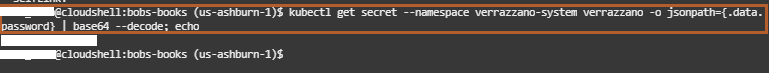

3. Enter *verrazzano* as the user name and use the output of the previous command from the text editor, as the password then click *Sign In*.

    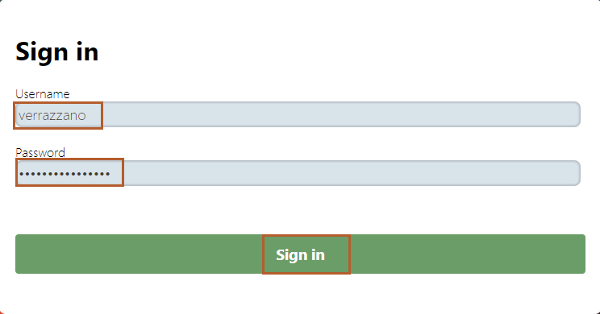

4. Select the application name, 'bobs-books', under OAM Applications as shown below:

    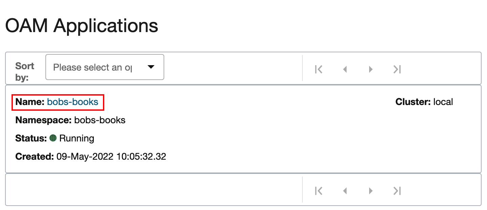

5. Select the drop-down menu to sort by Name and then select the component Name, *bobby-helidon*.

    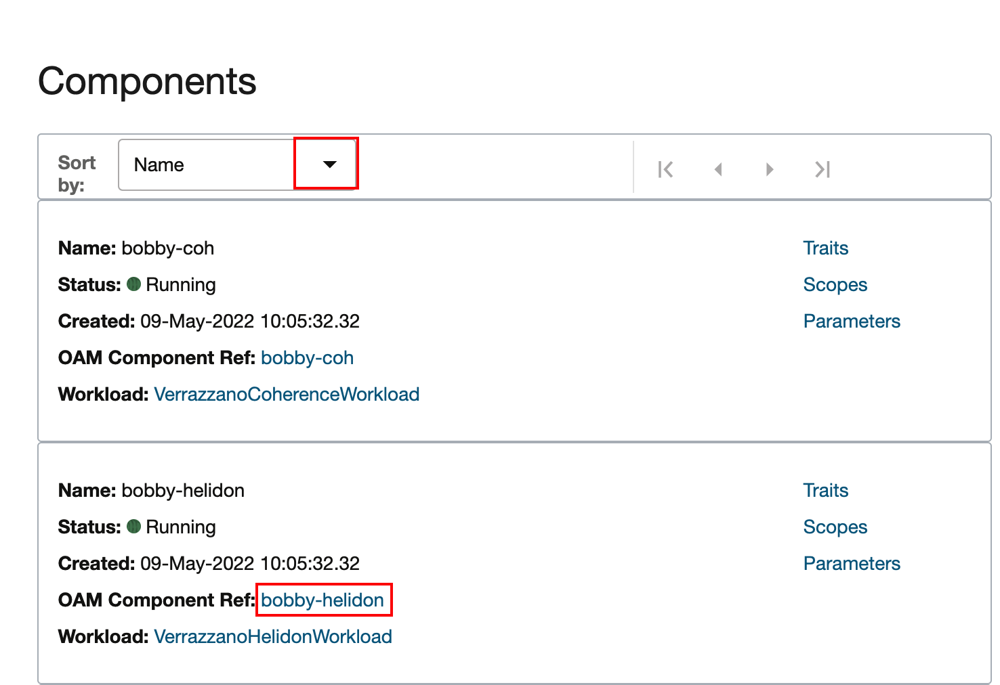

6. In the previous lab, we modified the *bobs-books-comp.yaml* file which provides the specification for every component. Now, in the Verrazzano console, we will verify the changes that we made in Lab 7. Select *bobby-helidon* in *Workload Spec*.

    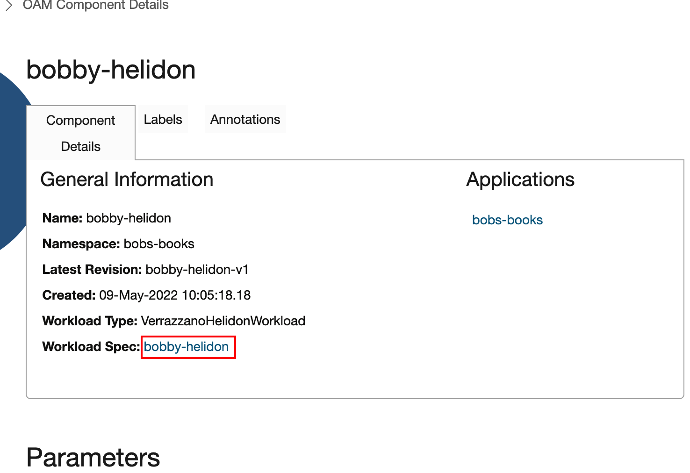

    You will see that this component is using the new Docker image from the Oracle Cloud Container Registery repository.

    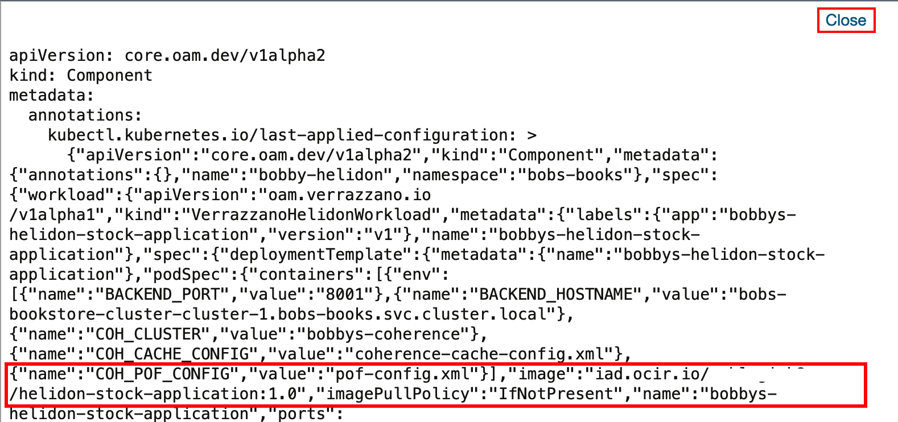

## Task 3: Verify the Changes in the Grafana Console

1. Select *Home* to go back to the Verrazzano Home Page.

    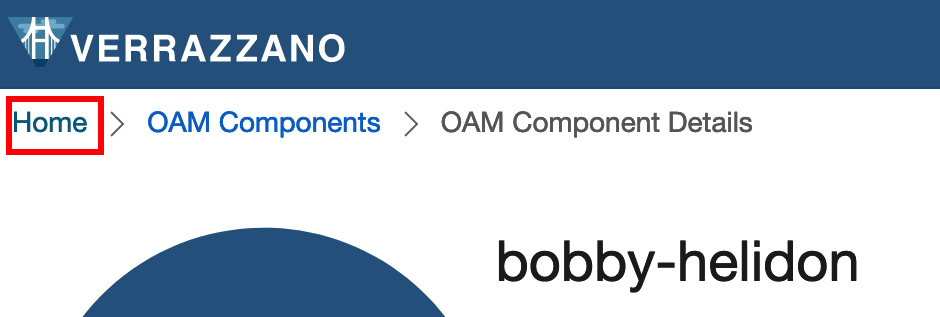

2. Select the link for Grafana to open the *Grafana Console*.

    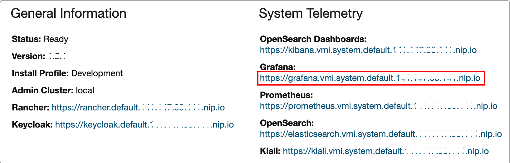

3. Select *Home*, type *Helidon*, and then select *Helidon Monitoring Dashboard*.

    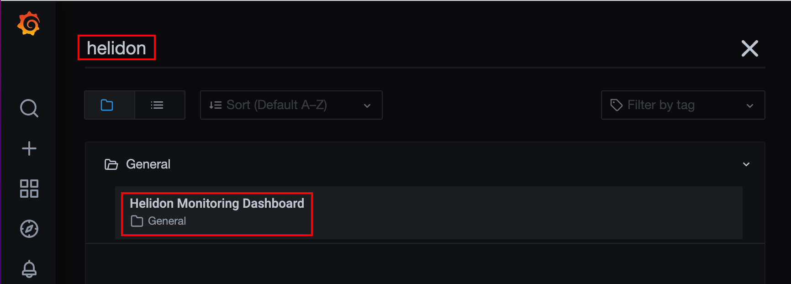


4. In the ServiceID, select *bobs-books_default_bobs-books_bobby-helidon* and in the instance, select the newly created instance. In this case, you will get information for the modified *bobby-helidon-stock-application*.

    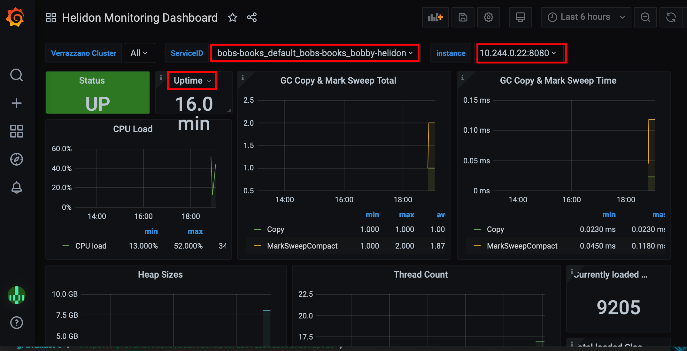

Congratulations! You have successfully completed the labs.

## Acknowledgements

* **Author** -  Ankit Pandey
* **Contributors** - Maciej Gruszka, Peter Nagy
* **Last Updated By/Date** - Ankit Pandey, May 2022
