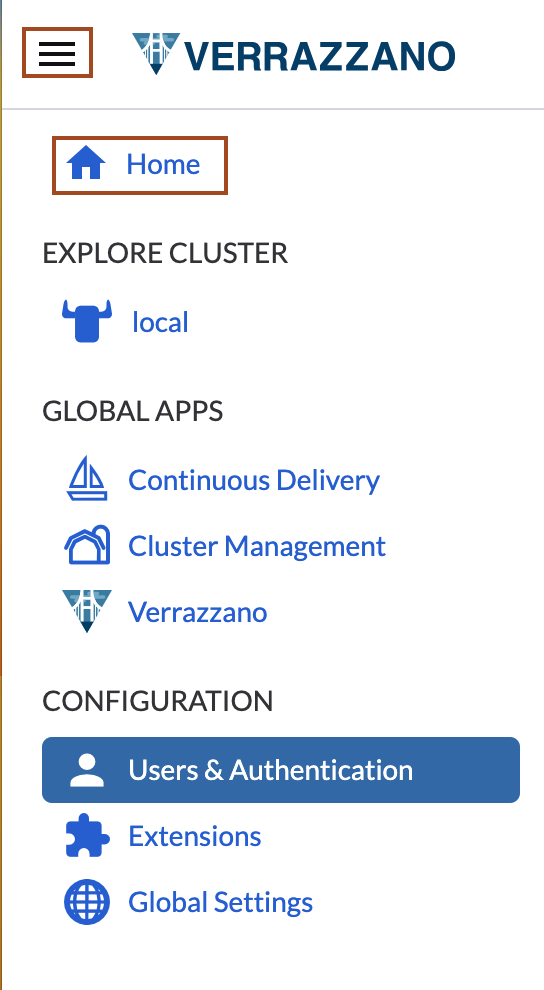

# Verifying the changes through application access and Curated stack

## Introduction

In Lab 7, we applied changes in bobbys-helidon-stock-application and the pod for it is in the *Running* state. In this lab, we will verify the changes in the application, the Verrazzano Console, and the Grafana Console.

Estimated time: 05 minutes

### Objectives

In this lab, you will:

* Verify the changes in the Bobby's Books application.
* Verify the changes in the Grafana Console.

### Prerequisites

* You should have a text editor, where you can paste the commands and URLs and modify them, as per your environment. Then you can copy and paste the modified commands for running them in the *Cloud Shell*.

## Task 1: Verify the Changes in Bobby's Books Application

1. Open the Bobby's Books tab and select Refresh. If you have closed that tab, then copy and paste the following command in the text editor and replace the XX.XX.XX.XX  with the EXTERNAL_IP for the application. You will notice that the Book Name is in all upper case letters.

    ```bash
    <copy>https://bobs-books.bobs-books.XX.XX.XX.XX.nip.io/bobbys-front-end/</copy>
    ```

    


## Task 2: Verify the Changes in the Grafana Console

1. Go back to the Verrazzano Home Page.

    

2. Select the link for Grafana to open the *Grafana Console*.

    

3. Select *Home*, type *Helidon*, and then select *Helidon Monitoring Dashboard*.

    


4. In the ServiceID, select *bobs-books_default_bobs-books_bobby-helidon* and in the instance, select the newly created instance. In this case, you will get information for the modified *bobby-helidon-stock-application*.

    

    Congratulations! You have successfully completed the labs.

## Acknowledgements

* **Author** -  Ankit Pandey
* **Contributors** - Maciej Gruszka, Sid Joshi
* **Last Updated By/Date** - Ankit Pandey, August 2023
