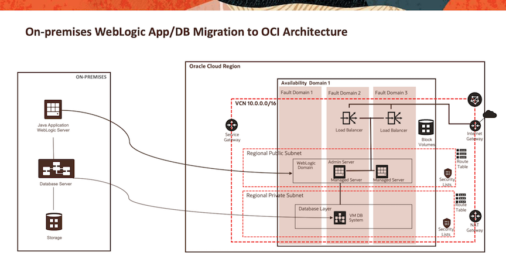

# Introduction

## About this Workshop

We will walk you through the process of migrating an existing on-premises WebLogic domain to WebLogic for Oracle Cloud Infrastructure (OCI). The WebLogic domain we'll migrate contains two Java applications, `opdemo` and `wls-exporter`, and a datasource connecting to a database that will be migrated along with the WebLogic domain.

Attached below is a sample architecture of the final solution:


Estimated Completion Time: 90 minutes

### Objectives

Perform the end-to-end migration of a local WebLogic domain to Oracle Cloud Infrastructure (OCI), provisioning WebLogic on OCI with the Oracle Cloud Marketplace.

- Provision a demo environment to use as the on-premises environment to be migrated.
- Prepare the OCI tenancy to provision WebLogic Server from the marketplace.
- Provision a new empty WebLogic domain on OCI with the marketplace.
- Migrate the WebLogic domain using Weblogic Deploy Tooling (WDT).
- Optionally learn to scale the provisioned domain.
- Tear down the workshop.

### Prerequisites

In order to run this workshop you need:

* A Mac OS X, Windows or Linux machine.
* A private and public SSH key-pair.
* Firefox browser.
* An OCI account with a compartment set up.

If you are not an administrator on your tenancy, you must insure that the following policies have been set for you:

```
<copy>
Allow group MyGroup to manage dynamic-groups in tenancy
Allow group MyGroup to manage policies in tenancy
Allow group MyGroup to manage volume-family in tenancy
Allow group MyGroup to manage instance-family in tenancy

Allow group MyGroup to inspect tenancies in tenancy
Allow group MyGroup to use secret-family in tenancy
Allow group MyGroup to use tag-namespaces in tenancy

Allow group MyGroup to manage all-resources in compartment MyCompartment
</copy>
```


> **Note:** Here we use the WebLogic version 12.2.1.4 stack with a non Java Required Files (JRF) domain. It is similar with version 12.2.1.3, however WebLogic version 10.3.6 requires a JRF domain by default, which requires a database as a backend. The ONLY database versions compatible with WebLogic 10.3.6 on OCI are database version 11.2.0.4 and 12.1.0.2. Note that database 11.2.0.4 requires the Oracle Grid Infrastructure when provisioning, or it will not be visible as an option when selecting the database image version.

## Acknowledgements

* **Author** -  Ankit Pandey
* **Contributors** - Sid Joshi, Maciej Gruszka
* **Last Updated By/Date** - Ankit Pandey, November 2024
