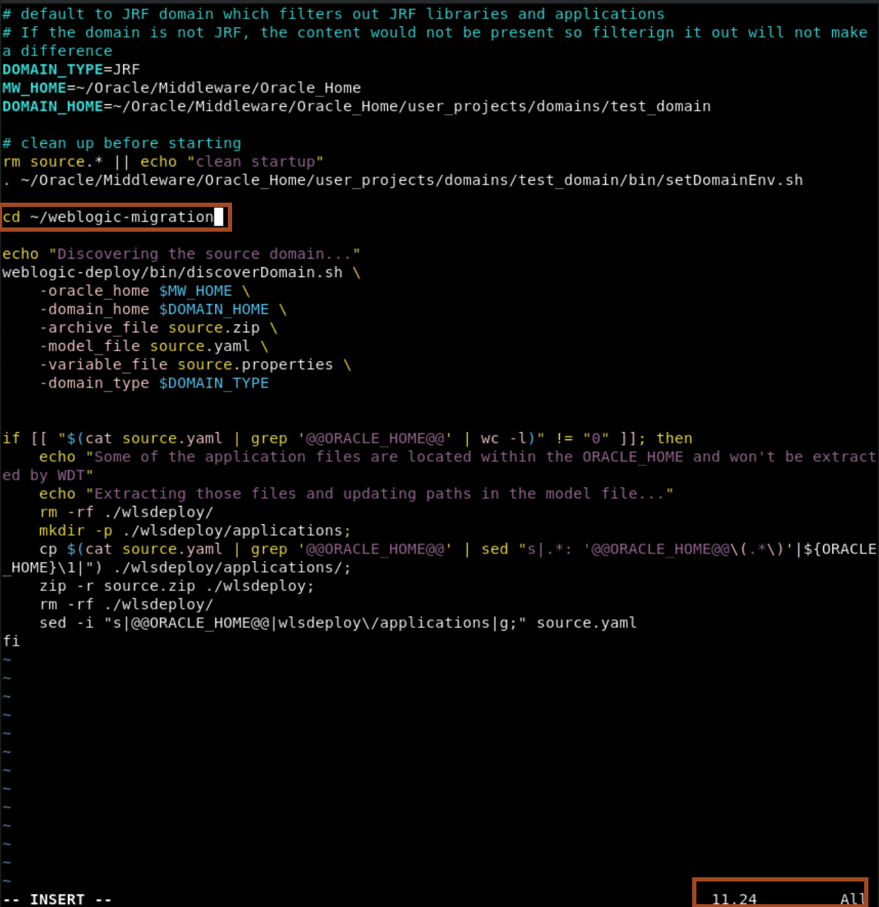
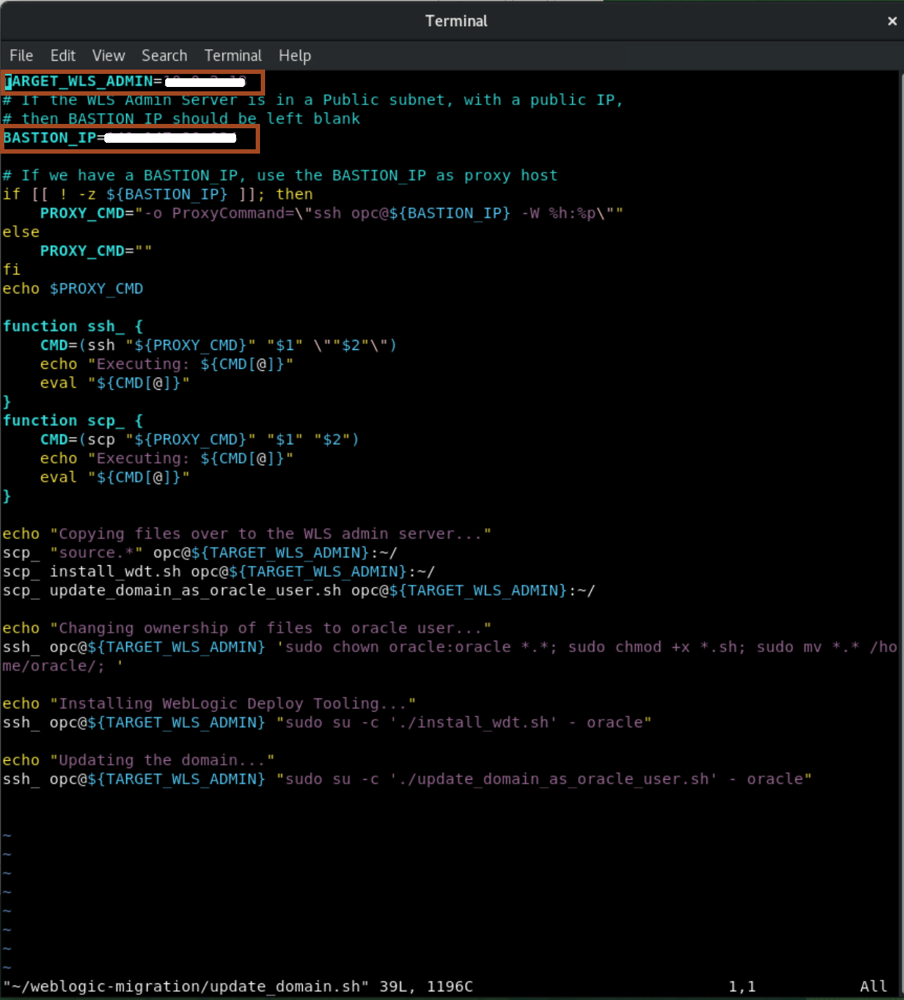
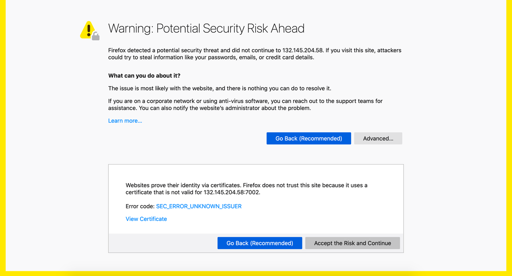
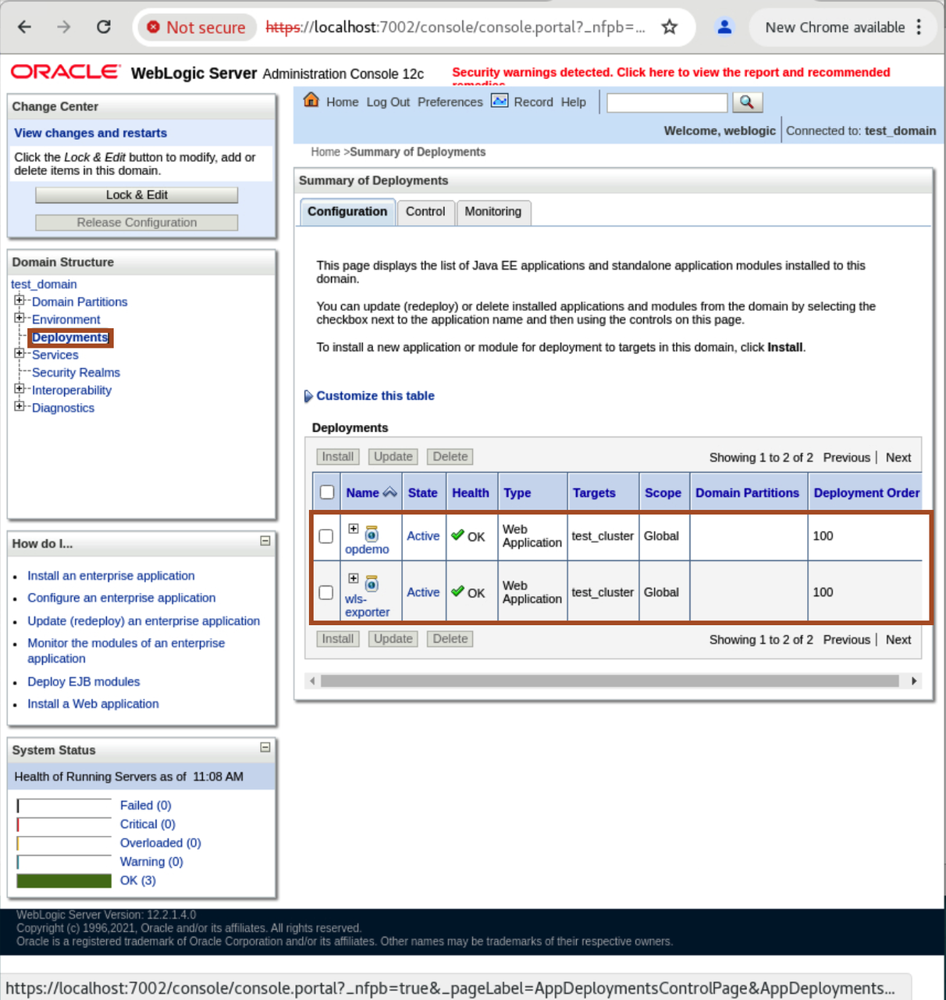
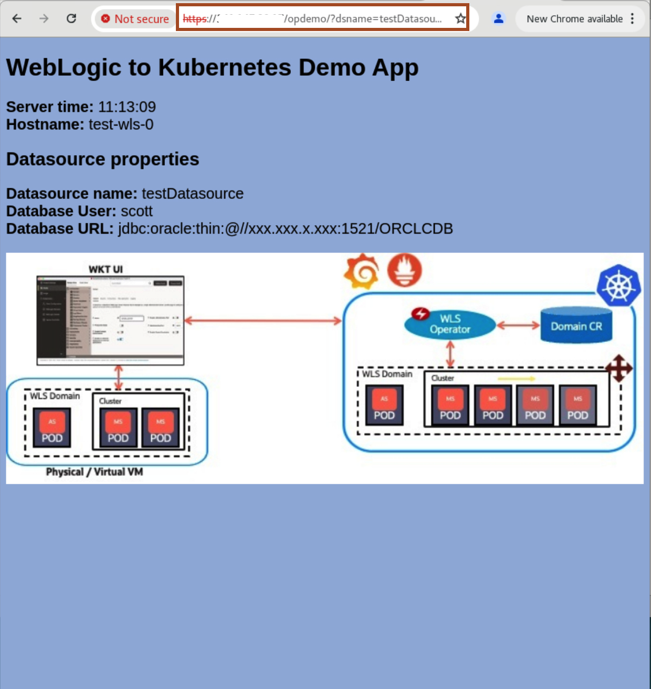

# Migrating the WebLogic Domain

## Introduction

Migrating a WebLogic domain is equivalent to re-deploying the applications and resources to a new domain and infrastructure.

We'll use WebLogic Deploy Tooling to migrate the domain from on-premises and re-deploy it on OCI.

Estimated Completion Time: 15 minutes.

### About Product/Technologies

**WebLogic Deploy Tooling** is an open source tool found on Github at [https://github.com/oracle/weblogic-deploy-tooling](https://github.com/oracle/weblogic-deploy-tooling).

Migration with WebLogic Deploy Tooling (WDT) consists of 3 steps:

- Discover the source domain, and generate a **model** file of the topology, resources and applications, a **variable** file with required credentials, and an **archive** file with the application binaries.
- Edit the **model** file and **variable** file to target the new infrastructure on OCI.
- Copy the files to the target Admin Server, and **update** the clean domain on OCI with the applications and resources discovered on-premises.

### Objectives

- Install WebLogic Deploy Tooling on the source WebLogic domain.
- Discover the source domain.
- Edit the source domain model file.
- Edit the source domain property file.
- Update the target domain on OCI.
- Check migration was successful.

### Prerequisites

- Have set up the demo on-premises environment to use as the source domain to migrate.
- Have deployed a WebLogic on OCI domain using the marketplace.
- Have migrated the application database from the source environment to OCI.

## Task 1: Installing WebLogic Deploy Tooling

1. Copy and paste the following command in the terminal to download the source code required for this workshop.
    ```bash
    <copy>curl -O https://objectstorage.uk-london-1.oraclecloud.com/p/DhsOVeXUC25tU06Lg3BUYtNfOMUnuVI8jpfzxHehkXdBfqKlFa1i-mKxiglaB-7U/n/lrv4zdykjqrj/b/ankit-bucket/o/weblogic-migration.zip
    unzip weblogic-migration.zip</copy>
    ```

1. Run the `install_wdt.sh` script:

    ```bash
    <copy>
    cd ~/weblogic-migration
    ./install_wdt.sh
    </copy>
    ```

    This will install WebLogic Deploy Tooling locally in a folder `weblogic-deploy`.


## Task 2: Discover the On-Premises Domain

The `discover_domain.sh` script wraps the **WebLogic Deploy Tooling** `discoverDomain` script to generate 3 files:

- `source.yaml`: the model file.
- `source.properties`: the variables file.
- `source.zip`: the archive file.

It also takes care of the manual extraction of applications that may be present under the `ORACLE_HOME`.

Applications found under `ORACLE_HOME` will have a path that includes `@@ORACLE_HOME@@` and **will not be included in the archive file**. They need to be extracted manually. The script takes care of this and injects those applications in the `source.zip` file while replacing the path in the `source.yaml` file.

1. copy and paste the following command to open the **discover_domain.sh** file and modify the line number 11 as shown below.
    ```bash
    <copy>vi discover_domain.sh</copy>
    ```
    ```bash
    <copy>cd ~/weblogic-migration</copy>
    ```
    

2. Run the `discover_domain.sh` script:

    ```bash
    <copy>
    ./discover_domain.sh
    </copy>
    ```

    [output of the discover_domain.sh script](https://oracle-livelabs.github.io/multicloud/weblogic-to-oci/workshops/freetier/discover_domain.output.txt)

## Task 3: Edit the `source.yaml` File

The extracted `source.yaml` file looks like the following:

```yaml
# This model was created using the WebLogic Deploy Tooling 4.2.0 discoverDomain tool
# running in OFFLINE mode against a domain using WebLogic Server 12.2.1.4.0.
# 
domainInfo:
    AdminUserName: '@@PROP:AdminUserName@@'
    AdminPassword: '@@PROP:AdminPassword@@'
topology:
    Name: test_domain
    EnableEeCompliantClassloadingForEmbeddedAdapters: true
    AdminServerName: admin-server
    CdiContainer:
        ImplicitBeanDiscoveryEnabled: false
    JMX:
        PlatformMBeanServerUsed: true
    NMProperties:
        JavaHome: /usr/java/jdk1.8.0_321-amd64
    Cluster:
        cluster_1:
            DynamicServers:
                ServerNamePrefix: managed-server
                CalculatedListenPorts: false
                MachineMatchType: name
                MaximumDynamicServerCount: 5
                ServerTemplate: server-template_1
                DynamicClusterSize: 5
    Server:
        admin-server: {}
    ServerTemplate:
        server-template_1:
            ListenPort: 8001
            Cluster: cluster_1
            JTAMigratableTarget:
                Cluster: cluster_1
    Machine:
        machine_1: {}
    SecurityConfiguration:
        NodeManagerPasswordEncrypted: '@@PROP:SecurityConfig.NodeManagerPasswordEncrypted@@'
resources:
    JDBCSystemResource:
        testDatasource:
            Target: cluster_1
            JdbcResource:
                DatasourceType: GENERIC
                JDBCConnectionPoolParams:
                    ConnectionHarvestTriggerCount: -1
                    StatementCacheSize: 10
                    InitialCapacity: 0
                    RemoveInfectedConnections: true
                    CountOfRefreshFailuresTillDisable: 2
                    ConnectionCreationRetryFrequencySeconds: 0
                    MinCapacity: 0
                    LoginDelaySeconds: 0
                    TestTableName: SQL ISVALID
                    TestFrequencySeconds: 120
                    StatementTimeout: 23
                    HighestNumWaiters: 2147483647
                    InactiveConnectionTimeoutSeconds: 0
                    WrapTypes: true
                    SecondsToTrustAnIdlePoolConnection: 10
                    ConnectionReserveTimeoutSeconds: 10
                    ConnectionHarvestMaxCount: 1
                    CountOfTestFailuresTillFlush: 2
                    ShrinkFrequencySeconds: 900
                    StatementCacheType: LRU
                    IgnoreInUseConnectionsEnabled: true
                    MaxCapacity: 15
                JDBCDataSourceParams:
                    JNDIName: jdbc/testDatasource
                JDBCDriverParams:
                    URL: jdbc:oracle:thin:@//xxx.xxx.x.xxx:1521/ORCLCDB
                    PasswordEncrypted: '@@PROP:JDBC.testDatasource.PasswordEncrypted@@'
                    DriverName: oracle.jdbc.OracleDriver
                    Properties:
                        user:
                            Value: '@@PROP:JDBC.testDatasource.user.Value@@'
        TAC-Datasource:
            Target: cluster_1
            JdbcResource:
                DatasourceType: AGL
                JDBCConnectionPoolParams:
                    StatementCacheSize: 0
                    TestTableName: SQL ISVALID
                JDBCDataSourceParams:
                    GlobalTransactionsProtocol: None
                    JNDIName: TAC-Datasource
                JDBCDriverParams:
                    URL: jdbc:oracle:thin:@(DESCRIPTION=(ADDRESS_LIST=(LOAD_BALANCE=on)(ADDRESS=(PROTOCOL=TCP)(HOST=adc2190808)(PORT=1521))(ADDRESS=(PROTOCOL=TCP)(HOST=adc2190909)(PORT=1521)))(CONNECT_DATA=(SERVICE_NAME=otrade)))
                    PasswordEncrypted: '@@PROP:JDBC.TAC-Datasource.PasswordEncrypted@@'
                    DriverName: oracle.jdbc.replay.OracleDataSourceImpl
                    Properties:
                        user:
                            Value: '@@PROP:JDBC.TAC-Datasource.user.Value@@'
                JDBCOracleParams:
                    FanEnabled: true
                    ActiveGridlink: true
appDeployments:
    Application:
        wls-exporter:
            SourcePath: wlsdeploy/applications/wls-exporter.war
            ModuleType: war
            SecurityDDModel: DDOnly
            Target: admin-server,cluster_1
        opdemo:
            SourcePath: wlsdeploy/applications/opdemo.war
            ModuleType: war
            SecurityDDModel: DDOnly
            Target: admin-server,cluster_1


```

1. Edit the `source.yaml`:

    ```bash
    <copy>
    vi ~/source.yaml
    </copy>
    ```

    The `domainInfo` includes basic domain information which we will not change.

    The `topology` section includes the definition of the managed servers, admin server, machines and clusters. The domain is already provisioned on OCI so this will not change.

2.  Remove the entire **`domainInfo`**, **`topology`** section and also **TAC-Datasource**. As one dummy datasource is sufficient to show migration of JDBC resources. 

    The content now looks like:

    ```yaml
    <copy>
    # This model was created using the WebLogic Deploy Tooling 4.2.0 discoverDomain tool
    # running in OFFLINE mode against a domain using WebLogic Server 12.2.1.4.0.
    # 
    resources:
        JDBCSystemResource:
            testDatasource:
                Target: cluster_1
                JdbcResource:
                    DatasourceType: GENERIC
                    JDBCConnectionPoolParams:
                        ConnectionHarvestTriggerCount: -1
                        StatementCacheSize: 10
                        InitialCapacity: 0
                        RemoveInfectedConnections: true
                        CountOfRefreshFailuresTillDisable: 2
                        ConnectionCreationRetryFrequencySeconds: 0
                        MinCapacity: 0
                        LoginDelaySeconds: 0
                        TestTableName: SQL ISVALID
                        TestFrequencySeconds: 120
                        StatementTimeout: 23
                        HighestNumWaiters: 2147483647
                        InactiveConnectionTimeoutSeconds: 0
                        WrapTypes: true
                        SecondsToTrustAnIdlePoolConnection: 10
                        ConnectionReserveTimeoutSeconds: 10
                        ConnectionHarvestMaxCount: 1
                        CountOfTestFailuresTillFlush: 2
                        ShrinkFrequencySeconds: 900
                        StatementCacheType: LRU
                        IgnoreInUseConnectionsEnabled: true
                        MaxCapacity: 15
                    JDBCDataSourceParams:
                        JNDIName: jdbc/testDatasource
                    JDBCDriverParams:
                        URL: jdbc:oracle:thin:@//xxx.xxx.x.xxx:1521/ORCLCDB
                        PasswordEncrypted: '@@PROP:JDBC.testDatasource.PasswordEncrypted@@'
                        DriverName: oracle.jdbc.OracleDriver
                        Properties:
                            user:
                                Value: '@@PROP:JDBC.testDatasource.user.Value@@'
    appDeployments:
        Application:
            wls-exporter:
                SourcePath: wlsdeploy/applications/wls-exporter.war
                ModuleType: war
                SecurityDDModel: DDOnly
                Target: admin-server,cluster_1
            opdemo:
                SourcePath: wlsdeploy/applications/opdemo.war
                ModuleType: war
                SecurityDDModel: DDOnly
                Target: admin-server,cluster_1
    </copy>
    ```

3. Edit each of the 3 `Target` names for `resources` and `appDeployments` from `cluster` (the name of the cluster on-premises) to `test_cluster` (the name of the cluster on the OCI domain):

    * `resources->JDBCSystemResource->JDBCConnection->Target`
    * `appDeployments->Application->opdemo->Target`
    * `appDeployments->Application->wls-exporter->Target`

    The content should look like:

    ```yaml
    <copy>
    # This model was created using the WebLogic Deploy Tooling 4.2.0 discoverDomain tool
    # running in OFFLINE mode against a domain using WebLogic Server 12.2.1.4.0.
    # 
    resources:
        JDBCSystemResource:
            testDatasource:
                Target: test_cluster
                JdbcResource:
                    DatasourceType: GENERIC
                    JDBCConnectionPoolParams:
                        ConnectionHarvestTriggerCount: -1
                        StatementCacheSize: 10
                        InitialCapacity: 0
                        RemoveInfectedConnections: true
                        CountOfRefreshFailuresTillDisable: 2
                        ConnectionCreationRetryFrequencySeconds: 0
                        MinCapacity: 0
                        LoginDelaySeconds: 0
                        TestTableName: SQL ISVALID
                        TestFrequencySeconds: 120
                        StatementTimeout: 23
                        HighestNumWaiters: 2147483647
                        InactiveConnectionTimeoutSeconds: 0
                        WrapTypes: true
                        SecondsToTrustAnIdlePoolConnection: 10
                        ConnectionReserveTimeoutSeconds: 10
                        ConnectionHarvestMaxCount: 1
                        CountOfTestFailuresTillFlush: 2
                        ShrinkFrequencySeconds: 900
                        StatementCacheType: LRU
                        IgnoreInUseConnectionsEnabled: true
                        MaxCapacity: 15
                    JDBCDataSourceParams:
                        JNDIName: jdbc/testDatasource
                    JDBCDriverParams:
                        URL: jdbc:oracle:thin:@//xxx.xxx.x.xxx:1521/ORCLCDB
                        PasswordEncrypted: '@@PROP:JDBC.testDatasource.PasswordEncrypted@@'
                        DriverName: oracle.jdbc.OracleDriver
                        Properties:
                            user:
                                Value: '@@PROP:JDBC.testDatasource.user.Value@@'
    appDeployments:
        Application:
            wls-exporter:
                SourcePath: wlsdeploy/applications/wls-exporter.war
                ModuleType: war
                SecurityDDModel: DDOnly
                Target: test_cluster
            opdemo:
                SourcePath: wlsdeploy/applications/opdemo.war
                ModuleType: war
                SecurityDDModel: DDOnly
                Target: test_cluster
    </copy>
    ```

4. Save the `source.yaml` file by pressing **escape** and  then **:wq**.

## Task 4: Edit the `source.properties` File

  ```bash
  <copy>
  vi ~/source.properties
  </copy>
  ```

  It looks like:

```yaml
    AdminPassword=
    AdminUserName=
    JDBC.TAC-Datasource.PasswordEncrypted=
    JDBC.TAC-Datasource.user.Value=scott
    JDBC.testDatasource.PasswordEncrypted=
    JDBC.testDatasource.user.Value=scott
    SecurityConfig.NodeManagerPasswordEncrypted=
```

1. Delete all lines except for the `JDBC.testDatasource.PasswordEncrypted=`,
    `JDBC.testDatasource.user.Value=scott` line, as these pertain to the `domainInfo`, `topology` and `TAC-Datasource` sections we deleted from the `source.yaml`.

2. Enter the JDBC Connection password for the `scott` user as tiger.

   Although the name is `PasswordEncrypted`, enter the plaintext password and WebLogic will encrypt it when updating the domain.

   The resulting file should look like:

    ```bash
    <copy>
    JDBC.testDatasource.PasswordEncrypted=tiger
    JDBC.testDatasource.user.Value=scott
    </copy>
    ```

3. Save the file by pressing **escape** and  then **:wq**.

## Task 5: Update the WebLogic Domain on OCI

The `update_domain.sh` script updates the target domain.

- It copies the `source.yaml` model file, `source.properties` variable file and the `source.zip` archive fileas well as the `install_wdt.sh` script and the `update_domain_as_oracle_user.sh` script to the target WebLogic Admin Server host.

- It makes sure the files are owned by the `oracle` user and moved to the `oracle` user home.

- It runs the `install_wdt.sh` script through SSH.

- And finally runs the `update_domain_as_oracle_user.sh` through SSH to update the WebLogic domain on OCI with the edited source files.

The `update_domain_as_oracle_user.sh` script runs the **WebLogic Deploy Tooling** script `updateDomain.sh` online, by providing the `-admin_url` flag.

**Note:** The url uses the `t3` protocol which is only accessible through the internal admin server port, which is `9071` on the latest WebLogic marketplace stack, for older provisioning of the stack, the port may be `7001`.

1. Edit the `update_domain.sh` script:

    ```bash
    <copy>
    vi ~/weblogic-migration/update_domain.sh
    </copy>
    ```
2. Provide the `TARGET_WLS_ADMIN`.

    This is the **Admin Server Private IP**

3. You also need to provide a `BASTION_IP` which is the **public IP** of the Bastion Instance.
    

    Furthermore, you'll need to add a **NAT gateway** to the admin server subnet so it is possible to download the required software.

    - Go to **Core Infrastructure -> Networking -> Virtual Cloud Networks**.
    - Select the VCN for the WLS on OCI stack.
    - Click **NAT Gateways** on the left menu.
    - Click **Create NAT Gateway**.
    - Name it **NAT gw**.
    - Click **Create NAT Gateway**.
    - Go to **Subnets**.
    - Select the `test-wl-subnet`.
    - In the Subnet Information, click the **Route Table** (`test-sg-routetable`).
    - Click **Add Route Rules**.
    - Select **NAT Gateway**.
    - Enter **0.0.0.0/0** for the CIDR range.
    - Select the **NAT gw** NAT Gateway created earlier.
    - Click **Add Route Rules**.


4. Save the file by pressing **escape** and  then **:wq**.

5. Run the `update_domain.sh` script:

    ```bash
    <copy>cp ~/source.* ~/weblogic-migration/
    cd ~/weblogic-migration
    ./update_domain.sh
    </copy>
    ```

  You will be prompted to provide the `weblogic admin password` which is `oraclewls1` or the one you have entered.

  [View the output of the update_domain.sh script](https://oracle-livelabs.github.io/weblogic/weblogic-to-oci/workshops/weblogic-on-oci-mp/freetier/update_domain.output.txt)

## Task 6: Check that the app deployed properly

1. Go to the WebLogic Admin console at https://localhost:7002/console as you did earlier.

    Note: If you're using Chrome, you might encounter Self-signed certificate issues. We recommend using Firefox to test.

2. In Firefox you will see the self-certificate warning as below:

    

    Click **Advanced...** and then **Accept the Risk and Continue**

3. Login with the Admin user `weblogic` and password: `oraclewls1`.

4. Go to `deployments`: you should see the 2 applications deployed, and in the **active** state.

  

5. Go to the **opdemo** application URL, which is the Load Balancer IP gathered previously in the **Outputs** of the WebLogic provisioning, with the route `/opdemo/?dsname=testDatasource` like:
https://`LOAD_BALANCER_IP`/opdemo/?dsname=testDatasource

    Making sure you use `https` as scheme and the proper case for `/SimpleDB`.

  

## Acknowledgements

* **Author** - Ankit Pandey
* **Contributors** - Sid Joshi, Maciej Gruszka
* **Last Updated By/Date** - Ankit Pandey, November 2024
