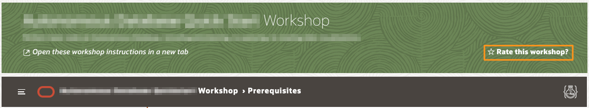

# Need Help?   

Click the *?* in the top right corner to send us an email.

## **How to Format Your Support Email Request**

1. Do not change the subject line. 
2. Include the description of your issue and any pertinent information in the contents on your email.

3. Include the **Lab Number**, **Step Number**, and **Sub-Step Number** where you've encounter the issue. 
4. Attach a **Screenshot** and **Any Troubleshooting Steps** you've tried so we can recreate the issue and provide a timely and accurate solution.

## **Rate This Workshop**
When you are finished please don't forget to rate this workshop!  We rely on this feedback to help us improve and refine our LiveLabs catalog.  Follow the steps to submit your rating. 

1.  Go back to your **Workshop Homepage** in LiveLabs by searching for your workshop and clicking the Launch button.

2.  Click on the **Brown Button** to re-access the workshop.

    

3.  Click **Rate this workshop**.

    

If you still have an active reservation, you can also rate by going to **My Reservations** -> **Launch Workshop**.

## Acknowledgements

* **Author** - Didi Han, Database Product Management
* **Contributors** - Kay Malcolm
* **Last Updated By/Date** - Madhusudhan Rao, Apr 2022