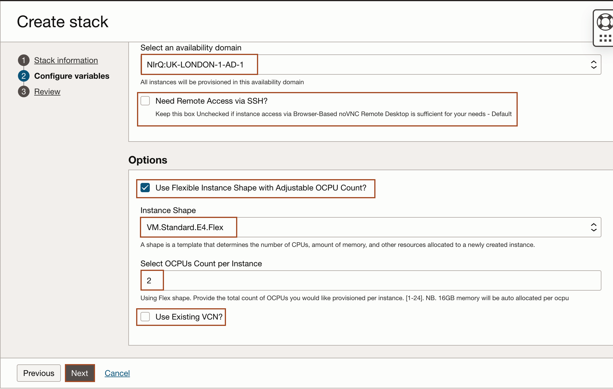
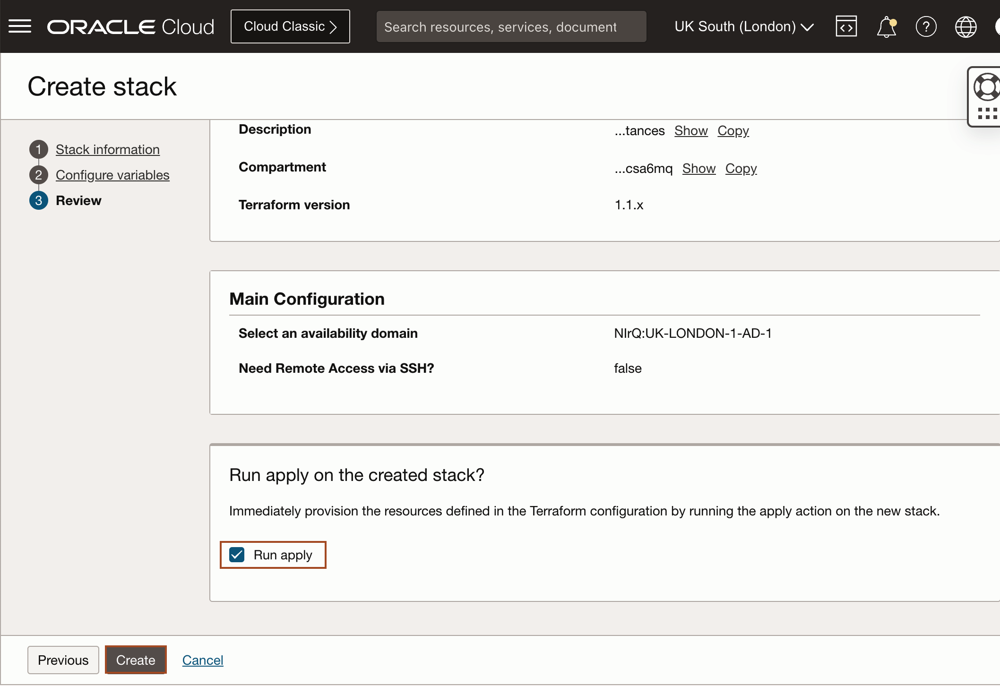
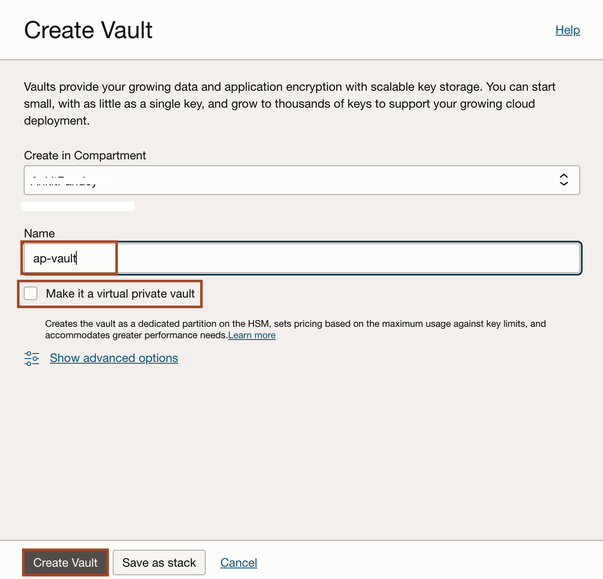
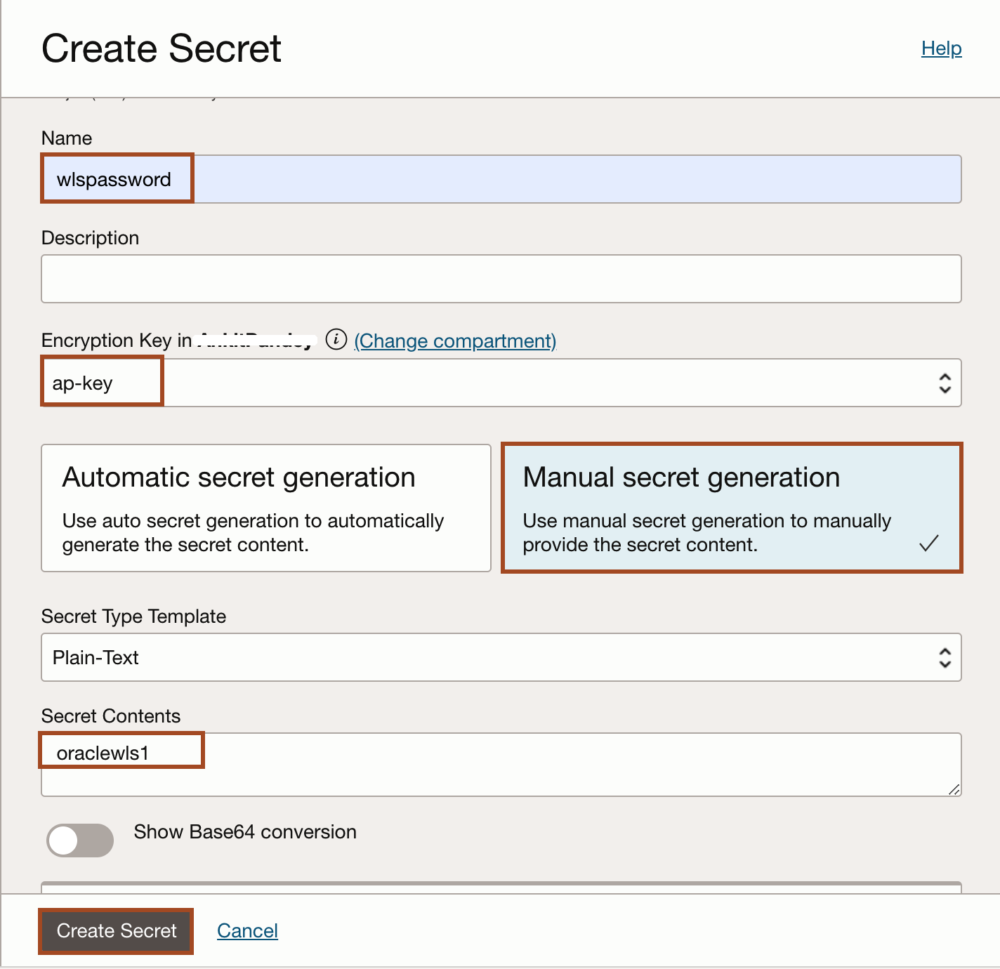

# Prepare Setup

## Introduction
This lab will show you how to download the Oracle Resource Manager (ORM) stack zip file needed to setup the resource needed to run this workshop. This workshop requires a compute instance and a Virtual Cloud Network (VCN).

*Estimated Lab Time:* 15 minutes

### Objectives
- Download ORM stack
- Create Stack: Compute + Networking
- Access the Graphical Remote Desktop

### Prerequisites
This lab assumes you have:
- An Oracle Free Tier or Paid Cloud account

## Task 1: Create Stack: Compute + Networking

1.  Click on the link below to download the Resource Manager zip file you need to build your environment.

    - [wls-to-oci-mkplc-freetier](https://objectstorage.uk-london-1.oraclecloud.com/p/aw2y55KNqgvNR9kB0J-Sspf2F_Sfty_LrxEiSqLnqUlXyxupgPbOtHEXc3dfXURx/n/lrv4zdykjqrj/b/ankit-bucket/o/wls-to-oci-mkplc-freetier.zip )

2.  Save in your downloads folder.

3. Open up the hamburger menu in the top left corner. Click **Developer Services**, and choose **Resource Manager** > **Stacks**. Choose the compartment in which you would like to install the stack. Click **Create Stack**.
    
    

3. Select **My Configuration**, choose the **.Zip** file button, click the **Browse** link, and select the zip file that you downloaded or drag-n-drop for the file explorer. Click **Next**.
    

4. Enter or select the following and click **Next**.

    **Instance Count:** Accept the default, 1.

    **Select Availability Domain:** Select an availability domain from the dropdown list.

    **Need Remote Access via SSH?** Unchecked for Remote Desktop only Access.

    **Use Flexible Instance Shape with Adjustable OCPU Count?:** Keep the default as checked (unless you plan on using a fixed shape).

    **Instance Shape:** Keep the default or select from the list of Flex shapes in the dropdown menu (e.g VM.Standard.E4.Flex).

    **Select OCPUs Count per Instance:** Accept the default shown. e.g. (2) will provision 2 OCPUs and 32GB of memory. 

    **Use Existing VCN?:** Accept the default by leaving this unchecked. This will create a new VCN.
    
    

7. Select **Run Apply** and click **Create**.
    

    > Please wait, until you notice the job has been successfully completed.
        
        

## Task 2: Create a Vault

1. Go to **Identity & Security -> Vault**.

   

2. Make sure you are in the compartment where you want to deploy WebLogic.

3. Click **Create Vault**.

   

4. Name the vault **`ap-vault`** or a name of your choosing. Make sure the **`private`** option is **not checked** and click **Create Vault**.

   

## Task 3: Create a Key in the Vault

1. Once the vault is provisioned, select the vault.

   

2. Click **Create Key**.

   

3. Name the key **`ap-key`** or a name of your choosing and click **Create Key**.

   

## Task 4: Create a Secret for the WebLogic Admin Password

1. Once the key is provisioned, click **Secrets** then **Create Secret**.

   

3. Name the **Secret** as **`wlspasswd`**, select the **`ap-key`** created at the previous step as the **Encryption Key**, select **Manual secret generation** `plaintext` option and type `oraclewls1` or any WebLogic compliant password (at least 8 chars and 1 uppercase or number) in the **Secret Content** text field, and click **Create Secret**.

  

You may now [proceed to the next lab](#next).

## Acknowledgements

* **Author** - Ankit Pandey
* **Contributors** - Sid Joshi, Maciej Gruszka
* **Last Updated By/Date** - Ankit Pandey, November 2024
