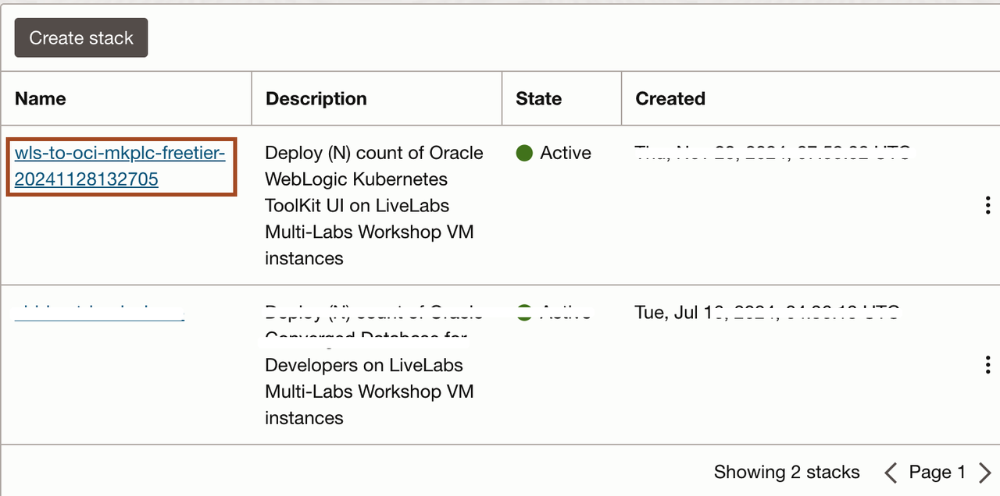
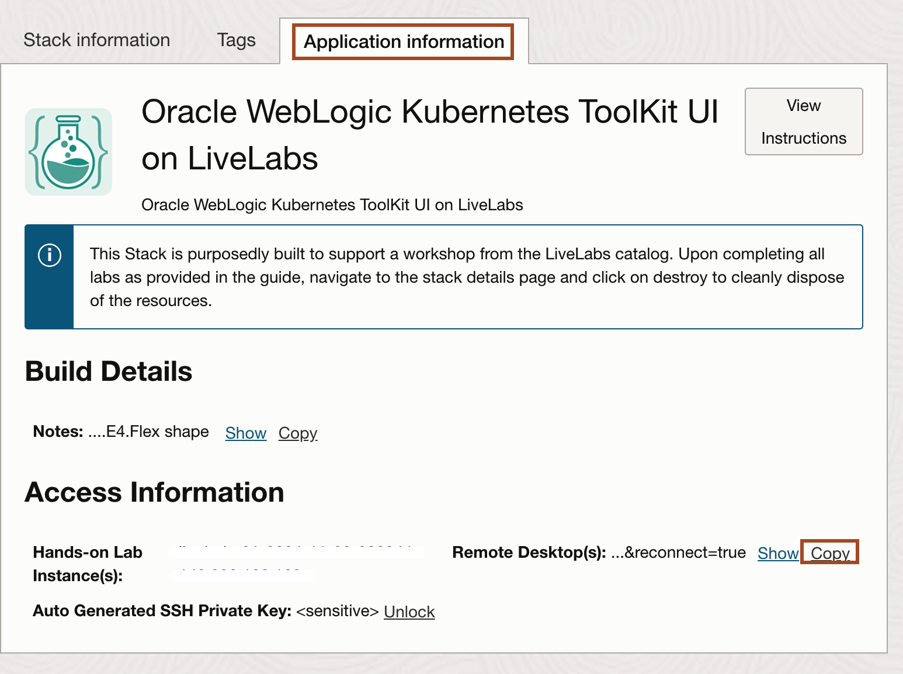
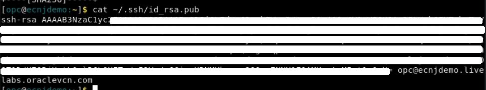

# Prepare the OCI Account

## Introduction

We will prepare the OCI environment to provision WebLogic Server for Oracle Cloud Infrastructure from the marketplace.

Estimated Completion Time: 5 minutes.

### Objectives

- Create a Vault.
- Create a Key.
- Create a Secret to hold the WebLogic Admin password.
- Copy the Secret OCID to use during the provisioning stage.

### Prerequisites

- an OCI account with a compartment created.

## Task 1: Check Policies Needed to Deploy and Create Dynamic Group if needed.

If you don't have the following policy for your group and you are not an admin in your tenancy:

```bash
<copy>
Allow group MyGroup to manage dynamic-groups in tenancy
Allow group MyGroup to manage policies in tenancy
</copy>
```

You will need to create a Dynamic Group and associated Policies:

1. From the navigation menu, select Identity & Security. Under the Identity group, click Compartments.

2. Copy the OCID for the compartment that you plan to use for the Oracle WebLogic Server compute instances.
   
   If you use another compartment just for network resources, copy also the OCID of the network compartment.

3. Click Dynamic Groups.

4. Click Create Dynamic Group.

5. Enter a Name and Description. In the policies below we assume the name is *MyInstancesPrincipalGroup*

6. For Rule 1, create a rule that includes all instances in the selected compartment in this group.

    ```
    <copy>
    ALL {instance.compartment.id = 'WLS_Compartment_OCID'}
    </copy>
    ```

   Provide the OCID for the compartment you copied previously.

7. Click Create Dynamic Group.

8. Create the policy for the dynamic group

    ```bash
    <copy>
    Allow dynamic-group MyInstancesPrincipalGroup to manage all-resources in compartment MyCompartment
    Allow service oke to read app-catalog-listing in compartment MyCompartment
    Allow dynamic-group MyInstancesPrincipalGroup to read secret-bundles in compartment VaultCompartment where target.secret.id = '<OCID for OCIR token secret>'
    Allow dynamic-group MyInstancesPrincipalGroup to inspect subnets in NetworkCompartment
    Allow dynamic-group MyInstancesPrincipalGroup to use dynamic-groups in MyCompartment
    </copy>
    ```

9. To use the OS Management Service, you can add the following policies as well:

    ```bash
    <copy>
    Allow dynamic-group MyInstancesPrincipalGroup to use osms-managed-instances in compartment MyCompartment
    Allow dynamic-group MyInstancesPrincipalGroup to read instance-family in compartment MyCompartment
    </copy>
    ```

## Task 2: Access the Graphical Remote Desktop

For ease of execution of this workshop, your VM instance has been pre-configured with a remote graphical desktop accessible using any modern browser on your laptop or workstation. Proceed as detailed below to log in.

1. Open up the hamburger menu in the top left corner. Click **Developer Services**, and choose **Resource Manager** > **Stacks**.

2. Click on the stack name which you have createed in task 1.
    

3. Navigate to **Application Information** tab, and copy **Remote Desktop URL** and paste it in new browser tab.
    


4. Click **Activities** and select the workshop document from the top left.
    > Now you will need to follow the instruction from this workshop document.


## Task 3: Create an SSH Key

We'll need a SSH key pair to communicate with the WebLogic servers on OCI. The public key will need to be provided when provisioning those resources.

We'll create a SSH key pair in the default folder.

1. Close all open application except **Terminal**, **Browser** and **Workshop Document**. Please follow the Workshop document with in the remote desktop.

1. Copy and paste the following command to create the SSH keypair:

    ```bash
    <copy>ssh-keygen</copy>
    ```
   
    Press `Enter` (default) for all the prompts.
    ![generate key]

2. You will find two files `id_rsa` and `id_rsa.pub` inside the folder `~/.ssh/` or `/home/oracle/.ssh/`. Copy and paste the following command to view the public key as we need it in the next lab.

      ```bash
      <copy>cat ~/.ssh/id_rsa.pub</copy>
      ```
      
      
      `id_rsa` is the private key, which should never be shared, and will be required to connect to any OCI resource provisioned with the corresponding public key `id_rsa.pub`.

      This key will be the default SSH key from the instance used for the on-premises environment.

      > **Note:** This is only to be done once. If you run it again, a new key will overwrite the previous one and you will lose access to any resource provisioned with that key.

You may now [proceed to the next lab](#next).

## Acknowledgements

* **Author** - Ankit Pandey
* **Contributors** - Sid Joshi, Maciej Gruszka
* **Last Updated By/Date** - Ankit Pandey, November 2024
