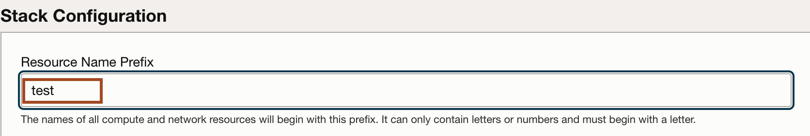
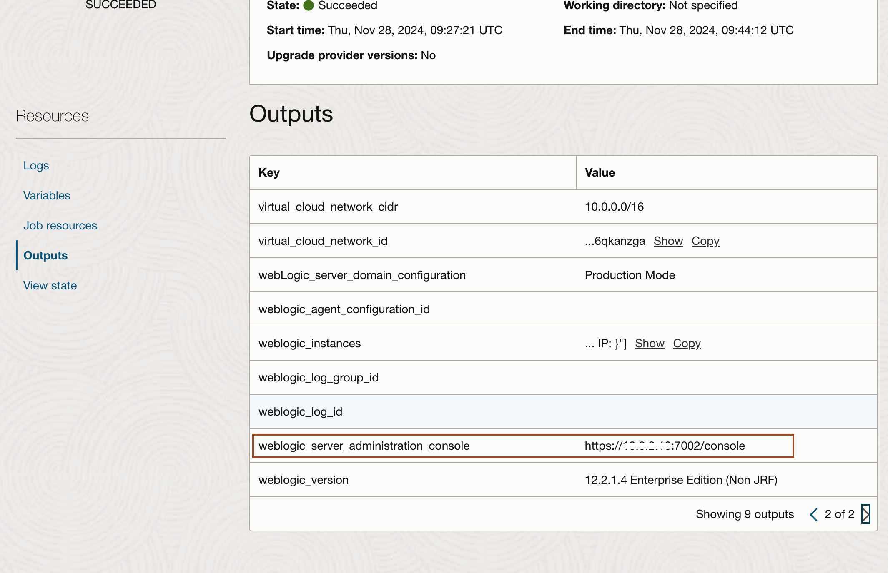

# Provision WebLogic on Oracle Cloud Infrastructure

## Introduction

We will walk you through provisioning the WebLogic infrastructure by leveraging the OCI marketplace image.

Estimated Completion Time: 20 minutes.

### Objectives

- Provision WebLogic Server on Oracle Cloud Infrastructure (WLS on OCI) via the marketplace offering.
- Gather information for further steps.

### Prerequisites

Prepared OCI tenancy with:

- A Vault.
- A Key.
- A Secret for the WebLogic Admin password.

## Task 1: Provision the Stack through the Marketplace

1. Go to **Marketplace** and select **All Applications**.

  

2. In the search input, type `weblogic entreprise edition ucm`. Here, we'll use the **Oracle WebLogic Server Enterprise Edition UCM**.

  *Note:* Make sure you select the tile that is **Oracle WebLogic Server Enterprise Edition UCM**, and NOT the **Oracle WebLogic Server Enterprise Edition UCM Image**, which is just the base image to use for your own cluster deployment.

   

3. Make sure you are in the **Compartment** you want to use, use the **default WebLogic version 12.2.1.4** available, accept the License agreement and click **Launch the Stack**.

   

4. Name the stack and click **Next**.

   

5. Enter **test** as a **Resource Name Prefix**.

  It will be used to prefix the name of all the resources (domain, managed servers, admin server, cluster, machines...).

  The next steps in this workshop assumes the resource name prefix is **`test`**, so it is highly recommended to use this name.

  

6. Provision an **SSH key**

   To connect to the WebLogic servers via SSH, you need to provide a public key the server will use to identify your computer.

   *Since the various commands will be ran from inside the on-premises environment, you will need to provide the key generated in the on-premises environment.*

   To output the public key information, use the following command from inside the on-premises environment.
    ```
    <copy>
    cat ~/.ssh/id_rsa.pub
    </copy>
    ```
    Copy the output of the command (the whole multi-line output) and paste it in the form field for SSH key in the form.
     


7. Select **Create New VCN** and leave the other options in this section as defaults.

  

8. Name the VCN `wls`.

  

9. **Keep the default** VCN CIDR block as-is.

  If you were to migrate from an on-premises domain connected via VPN or FastConnect, you would want to make sure the CIDR block does not conflict with the local network.

10. We'll keep the **WebLogic Server Admin User Name** as the default of `weblogic`.

11. Select the **Secret** generated previously for the **Secret for WebLogic Admin Password**.

  

12. **uncheck** the checkbox to **Provision the Sample Application**: since we will migrate our domain, we want a clean domain to start from.

  

13. Select a **Shape**.

   In a real world situation, choose a shape appropriate to handle the load of a single managed server. Since we're using a trial account, choose the **VM.Standard.E3.Flex** shape, the **VM.Standard.E2.2** shape or a suitable shape that is available in your tenancy.

  

   To check shape availability, you can go to **Governance -> Limits and Quotas** in another tab, and verify you have a specific shape available.

8. Select a **Node count**. Here, we'll provision 2 nodes.

11. Select an Availability Domain for the Weblogic Admin server****

  


12. WebLogic is provisioned in a private Subnet: admin and managed servers will not be accessible directly from the internet. The admin server will be accessible through a bastion host, and the managed servers will only be accessible through a Public Load Balancer

13. Check the box for **Assign Reserved Public IP to Bastion Instance** and keep the rest of the options as default and click **Next**.

  

14. Click **Create**.

  

15. The stack will get provisioned using the **Resource Manager**. This may take 7 to 15minutes.

  

Once the stack is provisioned, you can find the information regarding the URL and IP of the WebLogic Admin server in the logs, or in the **Outputs** left-side menu.

## Task 2: Gather Deployment Information and Check WebLogic Status

1. Go to **Outputs** (or you can find the same information at the bottom of the logs).

- You should see something like the following:

  

  

    - Make a note of the **WebLogic Admin Server Private IP address** from the **WebLogic Admin Server Console URL** for later use.

    - Make a note of the **Load Balancer IP** for later use.

    - Make a note of the Bastion Instance **Public IP address** for later use.

  To access the WebLogic Admin console, you will need to create a tunnel through the bastion host to your local machine.


- In the host deployed as the on-premises environment, export the following variables:

    ```bash
    <copy>
    export BASTION_IP=<BASTION PUBLIC IP>
    </copy>
    ```
    ```bash
    <copy>
    export RHOST=<ADMIN SERVER PRIVATE IP, usually 10.0.3.2>
    </copy>
    ```
    ```bash
    <copy>
    export PORT=7002
    </copy>
    ```
    Then

    We'll need to open up the firewall port 7002 on our demo enviroment VM with:

    ```bash
    <copy>
    sudo firewall-cmd --permanent --zone=public --add-port=7002/tcp
    sudo systemctl restart firewalld
    </copy>
    ```

    Then use the following command to create a tunnel from the WLS admin server to the on-premises instance that is publicly accessible.
    ```bash
    <copy>
    ssh -4 -M -S socket -fnNT -L 0.0.0.0:${PORT}:${RHOST}:${PORT} opc@${BASTION_IP} cat -
    </copy>
    ```
    In this case we use the default ssh key created on that host and we bind the port to 0.0.0.0 so it is accessible outside.

    You can then access the weblogic console provisioned on OCI on port 7002 on `https://localhost:7002/console` with `https://` scheme to access as the WLS on OCI admin server uses SSL.

    You'll be prompted with the SSL self-signed certificate warning: click **Advanced** then **Accept the risk and continue**.

    


## Acknowledgements

* **Author** - Ankit Pandey
* **Contributors** - Sid Joshi, Maciej Gruszka
* **Last Updated By/Date** - Ankit Pandey, November 2024
