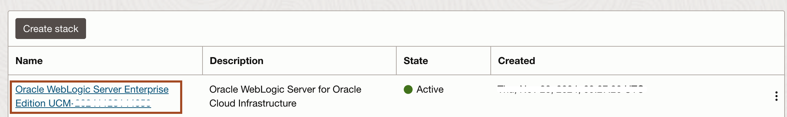
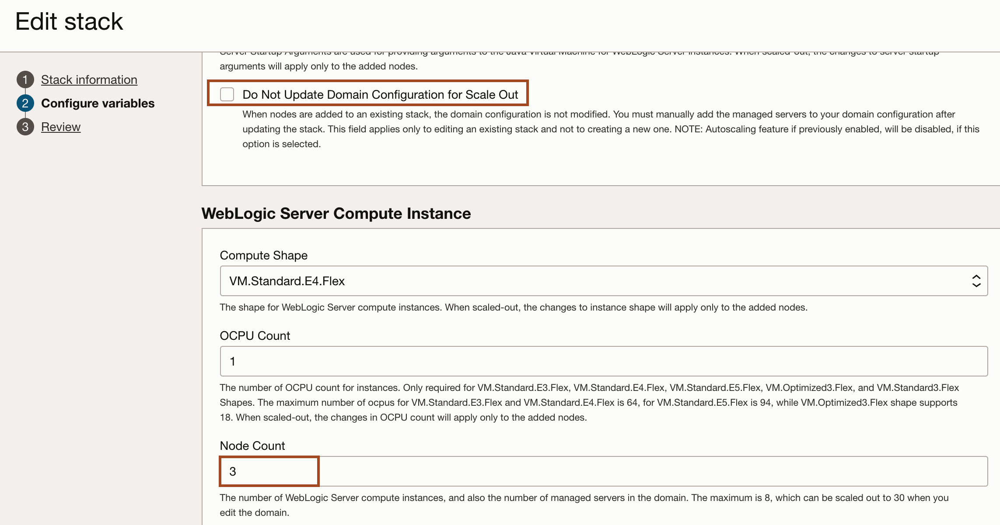
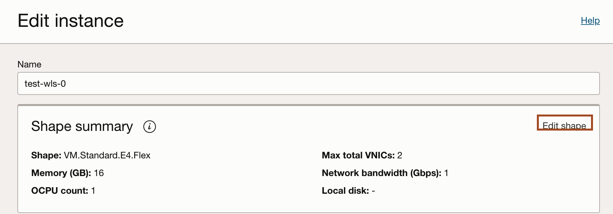

# Scaling the Weblogic Domain

## Introduction

We will look at scaling a WebLogic domain provisioned with the marketplace.

There are 2 ways to scale a domain:

- Change the shape of the WebLogic Server VM to increase or reduce OCPU counts or memory
- Add or remove node by editing the Resource Manager stack

Estimated Completion Time: 20 minutes

### Objectives

- Scale out the WebLogic domain provisioned on OCI using the Resource Manager
- Scale the shape of a single node of the WebLogic deployment.

### Prerequisites

- To have deployed the WebLogic on OCI stack successfully

## Task 1: Scaling the number of nodes

> **Note:** If you changed a node shape manually, any change using the variables and re-applying to the stack will revert node shapes to their original shape defined at provisioning time.

1. To scale the number of nodes, go to **Resources Manager** then **Stacks** and select the stack that was used to provision the WebLogic domain

  

2. Click **Variables** then click **Edit Variables**

  

3. Scroll to the **Weblogic Server Node Count** input and adjust the number of nodes

  

4. Make sure the **Do not update domain configuration** is left **unchecked**. This option is to be used if you want to scale the number of nodes without scaling the cluster

  

5. Click **Next** and then **Save Changes**

6. Then Click **Apply** to make the changes

  

  The new job will update the number of nodes, reverting any manual shape change to the originally provisioned shape. Servers will be restarted and new nodes will join the cluster if there was one defined, unless the **Do not update domain** was checked.

  The load balancer is also updated to take new nodes into account.

7. Go check the Admin Console under **Environment -> Servers** to verify an server was added

## Task 2: Scaling a node by changing shape

> **Note:** Beware that manual node shape changes will be overriden when applying changes through the Resources Manager, like when scaling the number of nodes. It is recommended to scale the number of nodes rather than change the shape of the nodes, but we'll show this process for reference.

1. To scale a node by changing its shape, go to **Compute** then **Instances**

  

2. Click the WebLogic instance to modify

  

3. In the instance details, click **More actions** -> **Edit**

  

4. In the Edit pane, click **Edit Shape**

  

5. Select an new shape and click **Save Changes**

  

  You will be prompted to reboot the instance. The WebLogic servers will be restarted on reboot.

## Acknowledgements

* **Author** - Ankit Pandey
* **Contributors** - Sid Joshi, Maciej Gruszka
* **Last Updated By/Date** - Ankit Pandey, November 2024
