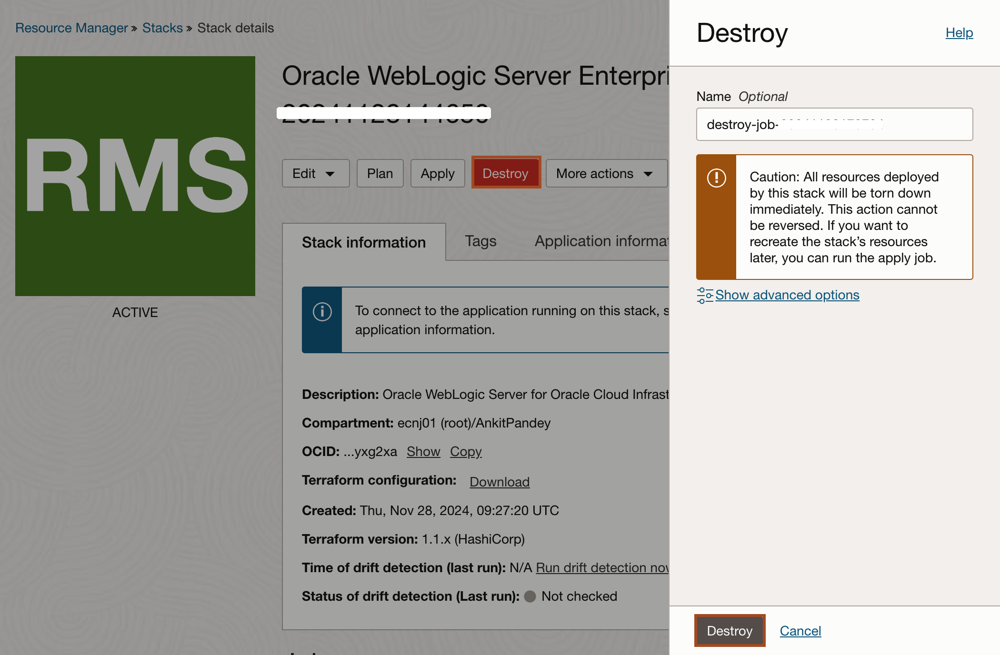

# Tear down the workshop environment

## Introduction

Congratulations! You've come so far and completed the workshop, and you might wonder how to clean up resources.

Estimated Completion Time: 15 minutes

### Objectives

- Tear down the infrastructure provisioned.

## Task 1: Cleaning up the on-premises environment

1. Go to **Resources Manager**.

2. Select the **compartment** where you deployed the stack originally.

3. Click the stack name for the **Workshop on-premises environment**.

   

4. click **Destroy** -> **Destroy**.

   

5. Once the job completed, click **stack details** in the bread-crumbs menu to get back to the stack details.

6. Click **Delete Stack**.

   

## Task 2: Tear down the WebLogic environment

You need to terminate the **NAT GAteway** before you can tear down the WebLogic deployment as Resource Manager will not be able to clean up the VCN until the NAT GAteway is removed.

1. Go to the **Resources Manager**.

2. Click the stack name for the **WebLogic Server deployment**.

3. Click **Destroy** -> **Destroy**.

   

4. Once the job completed, click **stack details** in the bread-crumbs menu to get back to the stack details.

5. Click **Delete Stack**.

   

## Acknowledgements

* **Author** - Ankit Pandey
* **Contributors** - Sid Joshi, Maciej Gruszka
* **Last Updated By/Date** - Ankit Pandey, November 2024
