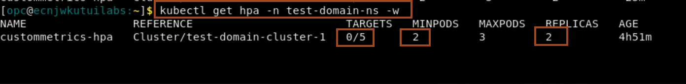
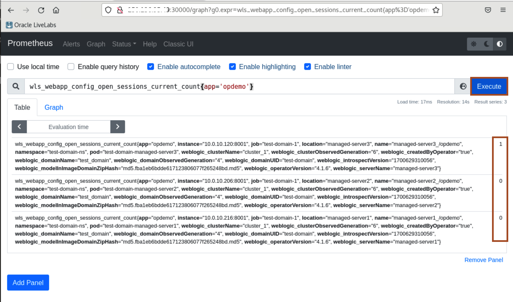
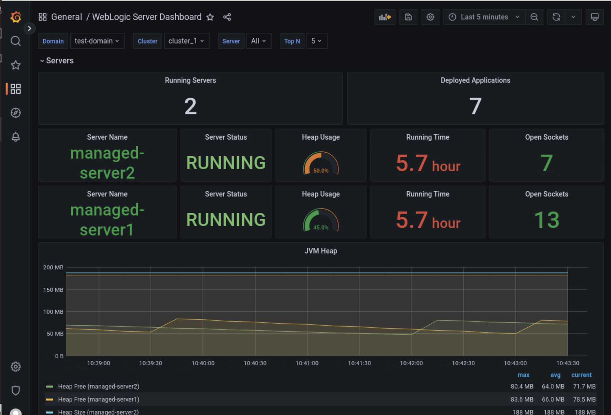

# Setup Prometheus Adaptor and HPA

## Introduction

In this lab, we will demonstrate how to scale a WebLogic cluster, based on WebLogic metrics provided by the Monitoring Exporter, using the Kubernetes Horizontal Pod Autoscaler (HPA). We will use the Prometheus Adapter to gather the names of the available metrics from Prometheus at regular intervals. A custom configuration of the adapter will expose only metrics that follow specific formats.

Estimated Time: 20 minutes

### Objectives

In this lab, you will:

* Install Prometheus Adaptor
* Install Kubernetes Horizontal Pods Autoscaler
* Simulate Auto scaling up and down

### Prerequisites

* Access to noVNC Remote Desktop created in lab 1.

## Task 1: Install Prometheus Adaptor

1. Copy and paste the following command in the terminal to navigate to workshop source code folder.
    ```bash
    <copy>cd ~/hpa-demo/</copy>
    ```

2. Copy and paste the following command in terminal and replace **`PRIVATE_IP_OF_WORKERNODE`** with private ip of worker and then run the command to install the prometheus adaptor.
    ```bash
    <copy>helm install prometheus-adapterhpatest prometheus-community/prometheus-adapter --namespace monitoring --values promadaptervalues.yaml --set "prometheus.port=30000" --set "prometheus.url=http://PRIVATE_IP_OF_WORKERNODE"</copy>
    ```
    

## Task 2: Install Kubernetes Horizontal Pods Autoscaler

1. Copy and paste the following command to the terminal to deploy the Kubernetes Horizontal Pod Autoscaler
    ```bash
    <copy>cd ~/hpa-demo/
    kubectl apply -f customhpa.yaml</copy>
    ```

    


## Task 3: Simulate Auto scaling up and down

1. In the terminal, copy and paste the following command to view running server pods in weblogic domain.  
    ```bash
    <copy>kubectl get pods -n test-domain-ns -w</copy>
    ```

    > you can title this tab as **Server Pods**.

2. Open a new tab in the terminal and copy and paste the following command in the new tab to view hpa running status.
    ```bash
    <copy>kubectl get hpa -n test-domain-ns -w</copy>
    ```

    > you can title this tab as **HPA Pod**.

3. In the Firefox, copy and paste the prometheus URL **http://`PUBLIC_IP_OF_WORKERNODE`:30000** and replace **`PUBLIC_IP_OF_WORKERNODE`** with public IP of worker node.
    

4. Copy and paste the following string in prometheus search box and click **Execute**.
    ```bash
    <copy>wls_webapp_config_open_sessions_current_count{app='opdemo'}</copy>
    ```

    
    > As Application has session time out of 2 minute and as we have not accessed the application in last 2 minutes. so we have session count **0** for both the managed server pods.

5. Open a new tab in the terminal, copy and paste the following commond to view the server pods in WebLogic domain  **test-domain**. 
    ```bash
    <copy>kubectl get pods -n test-domain-ns -w</copy>
    ```

    
    > As we have configure minimum replica **2**, so we have 2 managed server pods are running.

6. Now we are going to increase the application current session count to 20. Which will be equally shared by both the managed server pods. So on average we will have current session count as 10 per managed server pods. We have configure **HPA** to scale out WebLogic Cluster when we have average current session count more then 5 per managed sever pods.</br>
lets verify the HPA configuration by copy and paste the following command in the new tab in the terminal.
    ```bash
    <copy>kubectl get hpa -n test-domain-ns -w</copy>
    ```
    

7. In the browser, click **refresh** button 20 times to access the **opdemo** application 20 times. 
    

8. Go to Prometheus URL and click **Execute** to get the opdemo current session.
    

9. Go to hpa tab in the terminal and view it status. You can view, as it target met, so it increase the replicas from **2** to **3**.
    

10. Go to server pods tab in the terminal and observe **managed-server3** is in **Running** state.
    

11. In the browser, click **refresh** icon to access the application again. Now the application will be served by **managed-server3**
    

12. Now access the Prometheus URL to check the **opdemo** current session count.
    

13. As the application average session count is less the 5 per managed server pods. **HPA** change the replica from **3** to **2**.
    

14. Go to server pods tab in the terminal and observe **managed-server3** is in **terminating** state.
    


15. You can view all these changes in **WebLogic Server Dashboard** in the Grafana console. In the last, we will have two managed-server pods in WebLogic domain.  
    

Congratulation !!!

This is the end of the workshop.

We hope you have found this workshop useful.

## Acknowledgements
* **Author** -  Ankit Pandey
* **Contributors** - Maciej Gruszka, Sid Joshi
* **Last Updated By/Date** - Ankit Pandey, November 2023