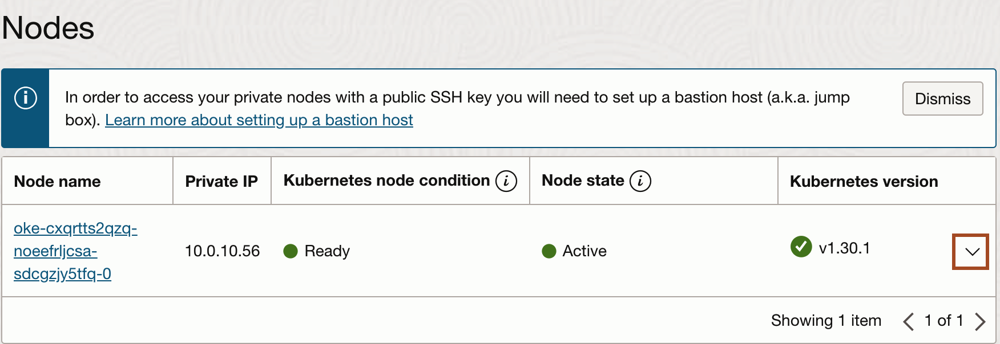
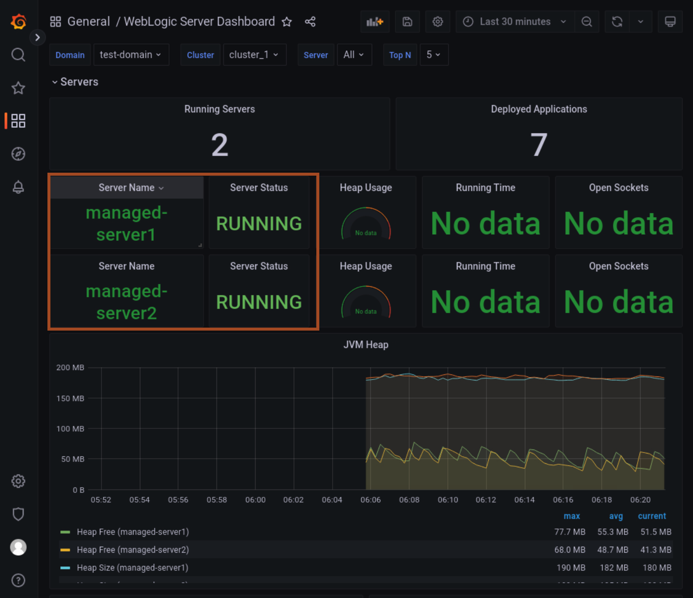

# Configure Prometheus and Grafana 

## Introduction

In this lab, we install the Grafana and Prometheus in the Oracle Kubernetes Cluster and then we add the security rules to access the prometheus and grafana through browser. Later, we add prometheus datasource in grafana dashboard and import the weblogic server dashboard.

Estimated Time: 10 minutes

### Objectives

In this lab, you will:

* Setting the Grafana and Prometheus
* Add Ingress rules inside security rules
* Add the data source and Grafana dashboard


## Task 1: Setting the Grafana and Prometheus


1. In the terminal, copy and paste the following command to view the files we have downloaded for this workshop.
    ```bash
    <copy>cd ~/hpa-demo/
    ls -ltra</copy>
    ```

    

2. Copy and paste the following command in the terminal, it will install Prometheus and Grafana in the Oracle Kubernetes Cluster.
    ```bash
    <copy>chmod +x create-setup.sh
    ./create-setup.sh</copy>
    ```

    


## Task 2: Add Ingress rules inside security rules

As we have install the Grafana and Prometheus in the Oracle Kubernetes Cluster(OKE) in task 1. But to access these tools we need to open the port in Worker node subnet.

1. In Cloud console, Click **navigation menu** -> **Developer Services** -> **Kubernetes Clusters(OKE)**.

2. Click on the Kubernete cluster name **cluster1**, which you created in lab 1.

3. Scroll down in the Cluster details page and then click **Node pools** under **Resources**.
    

4. Click **pool1** in the node pool.

5. In the Nodes, you will notice one node. click the down arrow as shown and note down the worker node public and private IP in the text file. 
    
    

6. In the same page, click on Worker node subnet as shown below.
    

7. In the Security list, click on available security list as shown below.
    

8. Click **Add Ingress Rules**. Enter the following values and then click **Add Ingress Rules**.

    **Source CIDR:**                0.0.0.0/0

    **Destination Port Range:**     80,30000,31000

    

## Task 3: Add the data source and Grafana dashboard

In this task, we add the prometheus datasource in the Grafana and later we import WebLogic Server Dashboard in the Grafana.

1. Copy and paste the following URL in the Browser and replace **`PUBLIC_IP_OF_WORKERNODE`** with the worker node public ip. 

    ```bash
    <copy>http://PUBLIC_IP_OF_WORKERNODE:31000/</copy>
    ```

    

2. Enter **admin**/**12345678** as Username/Password respectively and click **Log in** as shown below.

    

3. In Grafana Home page, click **Add your first datasources** as shown below.

    

4. Click **Prometheus** as datasource.

5. Enter **http://prometheus-server:80** as URL and click **Save & test** as shown below.
    

6. In Grafana, click **dashboard icon** -> **Import** as shown below.
    

7. Click **Upload JSON file** and then select the **weblogic-server-dashboard.json** file from **~/hpa-demo** folder as shown below. Click **Open**.
    

8. Click **Import** to import the WebLogic Server Dashboard.
    

9. You will be able to view the WebLogic Server data in WebLogic Server Dashboard as shown below. 
    

You may now proceed to the next lab.

## Acknowledgements
* **Author** -  Ankit Pandey
* **Contributors** - Maciej Gruszka, Sid Joshi
* **Last Updated By/Date** - Ankit Pandey, November 2023