# Setup the Lab Environment

## Introduction

In this lab, you will create a repository inside Oracle Cloud Container Image Registry. Then, you will generate an authentication token. Further, you will accept the license agreement for WebLogic Server images in Oracle Container Registry.

Estimated Time: 10 minutes

### Objectives

In this lab, you will:

* Create a repository inside Oracle Cloud Container Image Registry.
* Generate an authentication token.
* Accept the license for WebLogic Server Images in Oracle Container Registry.

### Prerequisites

* You must have an [Oracle Cloud Infrastructure](https://cloud.oracle.com/en_US/cloud-infrastructure) enabled account.
* You must have an Oracle Account. 
* You should have a text editor.

## Task 1: Creation of an Repository

In this task, you creates a public repository. In lab 5, we will push Auxiliary Image into this repository.

1. In the Console, select the *Hamburger Menu* -> *Developer Services* -> *Container Registry* as shown.
    

2. Select your compartment, where you are allowed to create the repository. Click *Create repository*.
    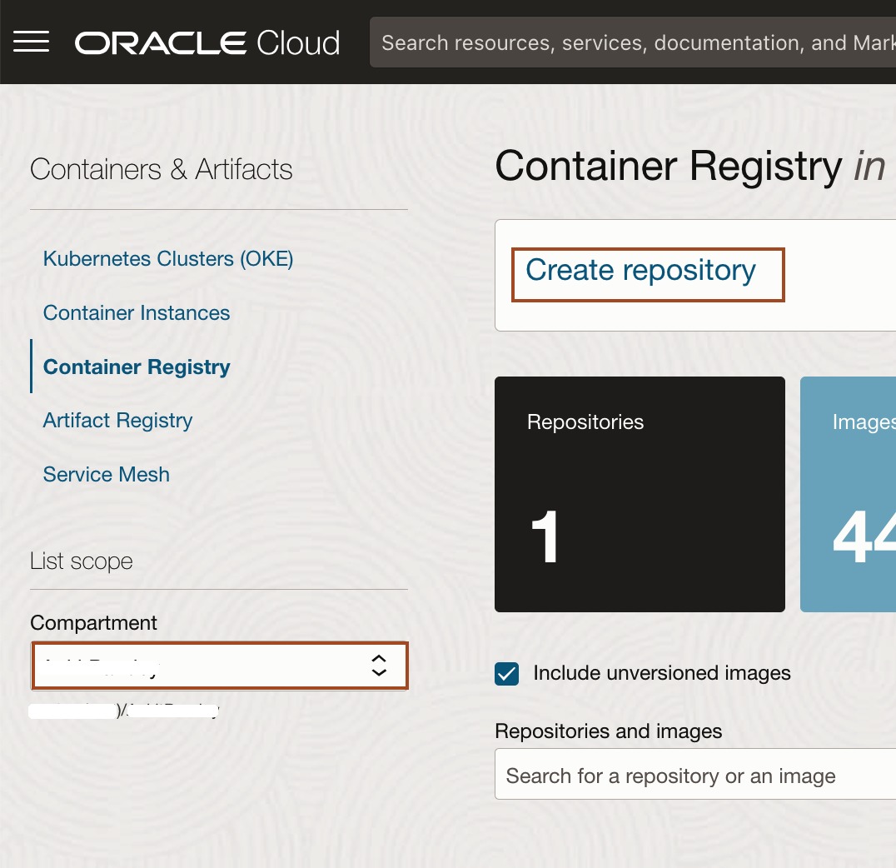

3. Enter *`test-model-your_firstname`* as Repository name and Access as *Public* then click *Create*.
    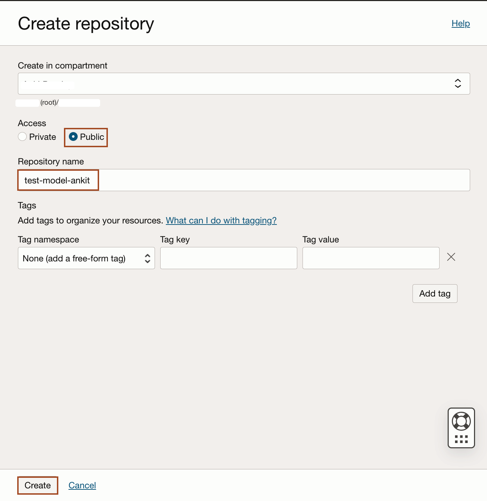

4. Once your repository is ready. Please note down the tenancy namespace in your text file inside the text editor.
    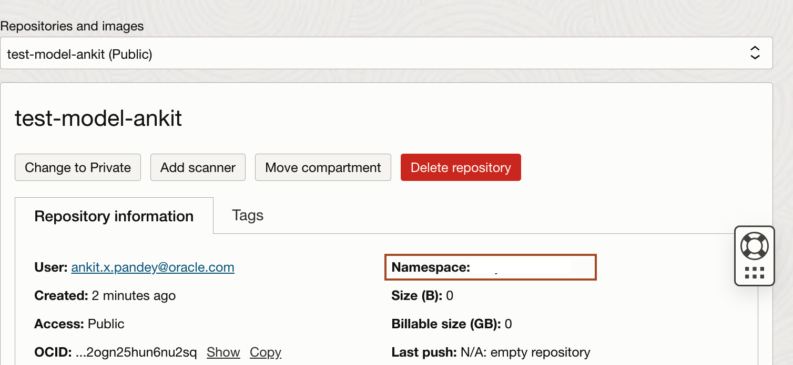

## Task 2: Generate an Authentication Token 

In this task, we will generate an *Authentication Token*. In lab 5, we will use this authentication token to push auxiliary image into the Oracle Cloud Container Registry Repository.

1. Select the User Icon in the top right corner and then select *MyProfile*.

    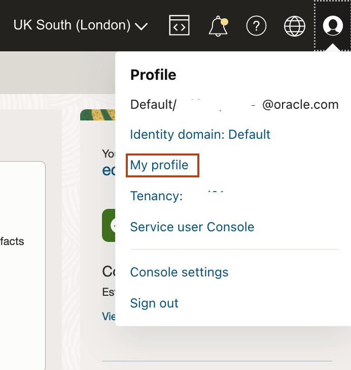

2. Scroll down and select *Auth Tokens* and then click *Generate Token*.

    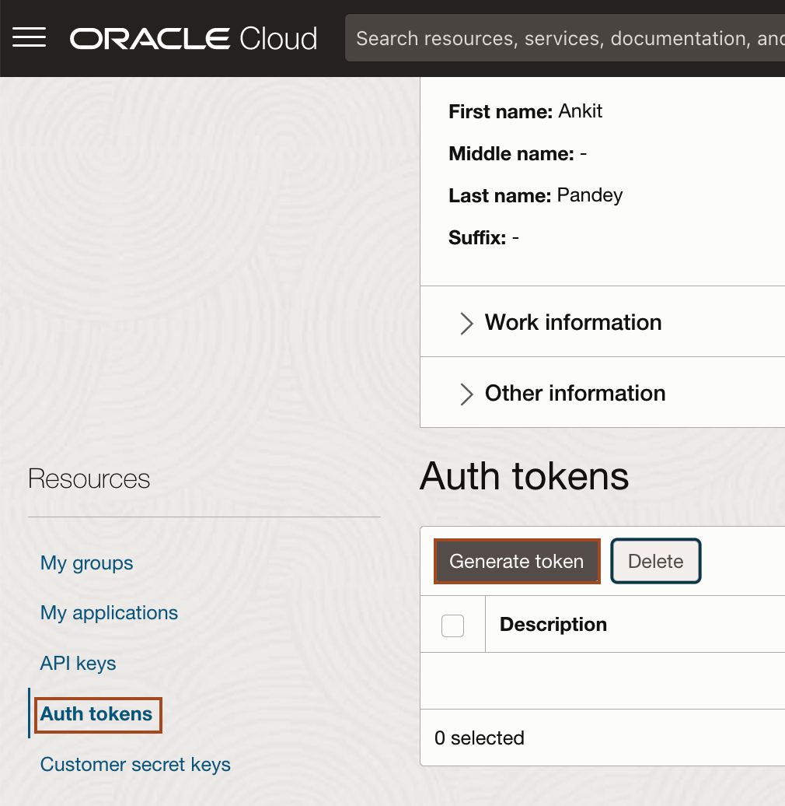

3. Copy *`test-model-your_first_name`* and paste it in the *Description* box and click *Generate Token*.

    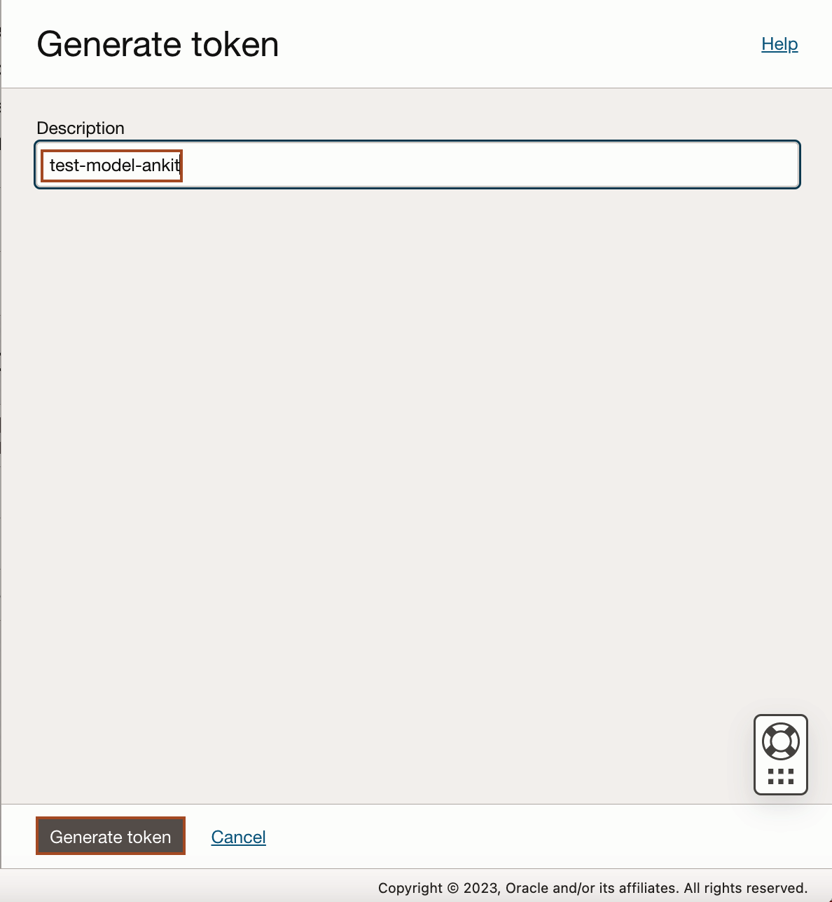

4. Select *Copy* under Generated Token and paste it in your text file. We cannot copy it later. Click *Close*.

    

## Task 3: Accepting the license for WebLogic Server Images 

In this task, we accept the license agreement for WebLogic Server images resides in Oracle Container Registry. As in Lab 6, we will use WebLogic Server 12.2.1.3.0 image as our Primary Image. So, to get access to WebLogic Server Images, we accept the license agreement.

1. Click the link for the Oracle Container Registry [https://container-registry.oracle.com/](https://container-registry.oracle.com/) and sign in. For this, you need an Oracle Account.
    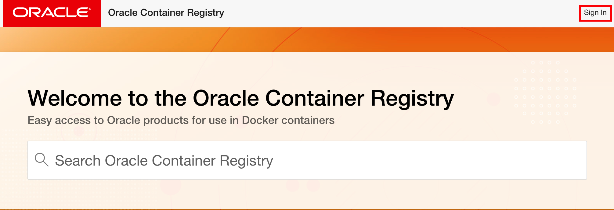
    
2. Enter your *Oracle Account Credentials* in the Username and Password fields, and then click *Sign In*.
    

3. In the Home page of Oracle Container Registry, Search for *weblogic*.
    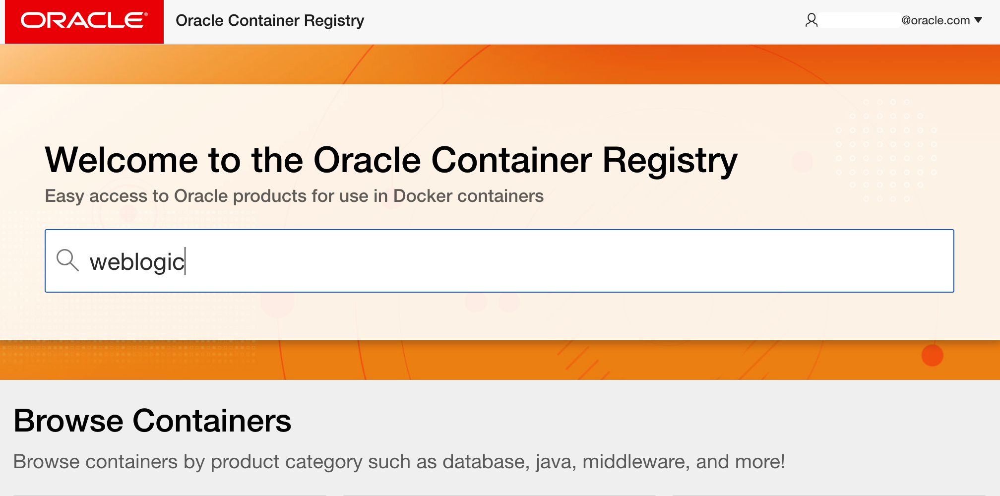

4. Click *weblogic* as shown and select *English* as the language, then click *Continue*.
    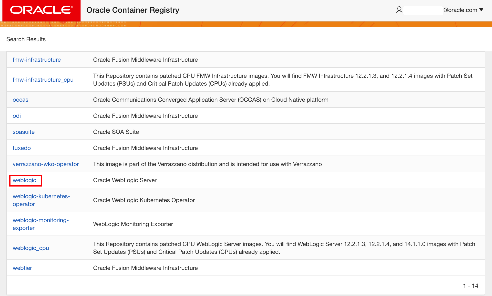
    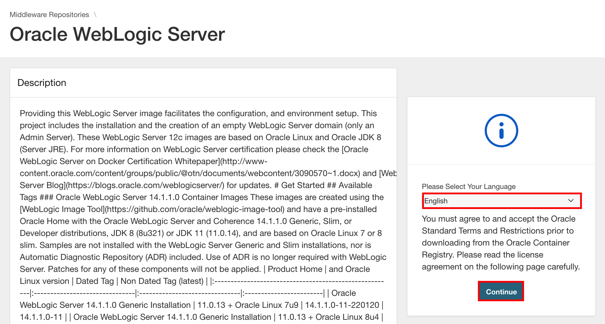

5. Click *Accept* to accept the license agreement.
    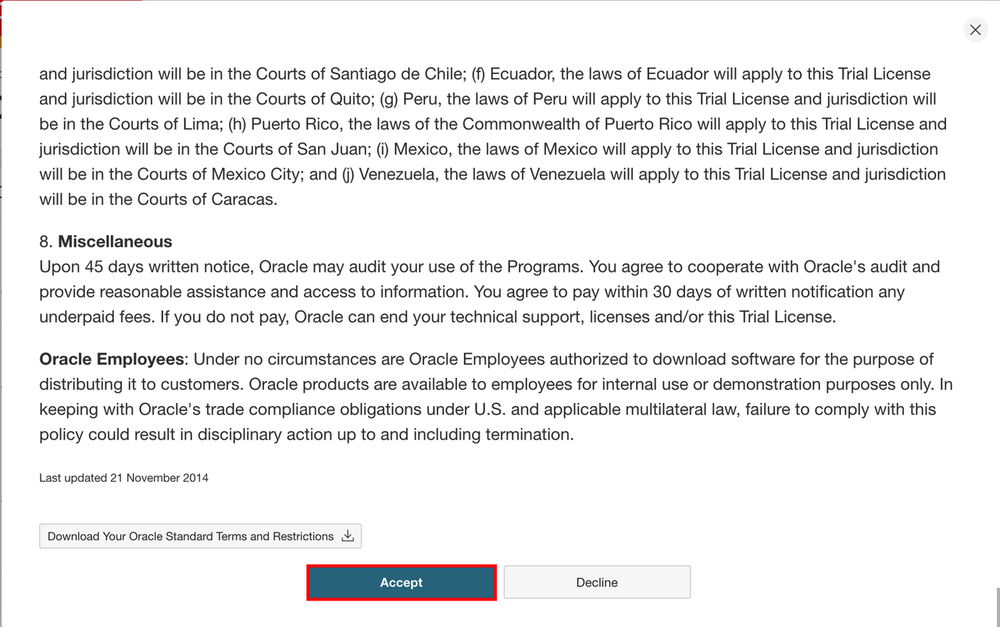

## Task 4: Access the Graphical Remote Desktop

For ease of execution of this workshop, your VM instance has been pre-configured with a remote graphical desktop accessible using any modern browser on your laptop or workstation. Proceed as detailed below to log in.

1. Open up the hamburger menu in the top left corner. Click **Developer Services**, and choose **Resource Manager** > **Stacks**.

2. Click on the stack name which you have createed in lab 1.
    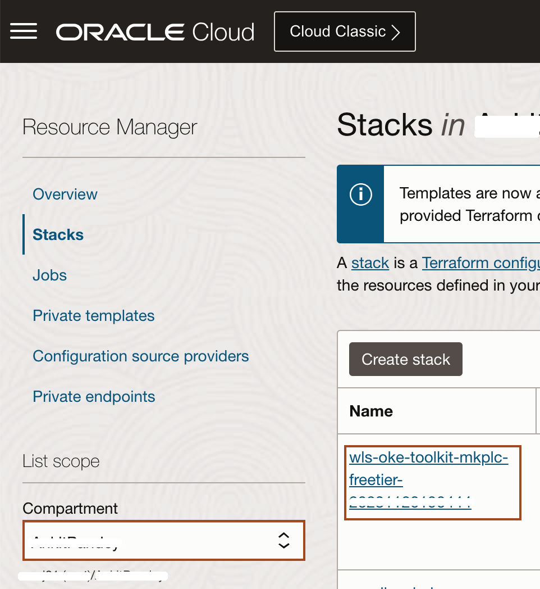

3. Navigate to **Application Information** tab, and copy **Remote Desktop URL** and paste it in new browser tab.
    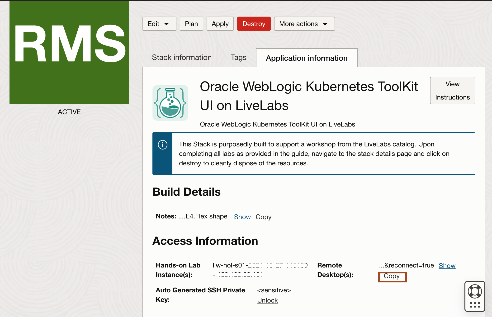
    
    > Now you need to follow all the instruction inside this remote desktop.

You may now proceed to the next lab.

## Learn More

**About Oracle Cloud Infrastructure Container Engine for Kubernetes**

Oracle Cloud Infrastructure Container Engine for Kubernetes is a fully-managed, scalable, and highly available service that you can use to deploy your container applications to the cloud. Use the Container Engine for Kubernetes (sometimes abbreviated OKE) when your development team wants to reliably build, deploy, and manage cloud-native applications. You specify the compute resources that your applications require, and OKE provisions them on the Oracle Cloud Infrastructure in an existing OCI tenancy.

## Acknowledgements
* **Author** -  Ankit Pandey
* **Contributors** - Maciej Gruszka, Sid Joshi
* **Last Updated By/Date** - Ankit Pandey, November 2023
