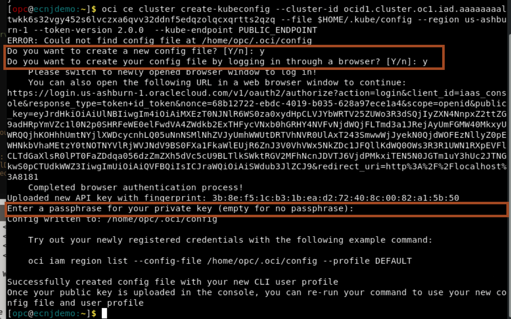
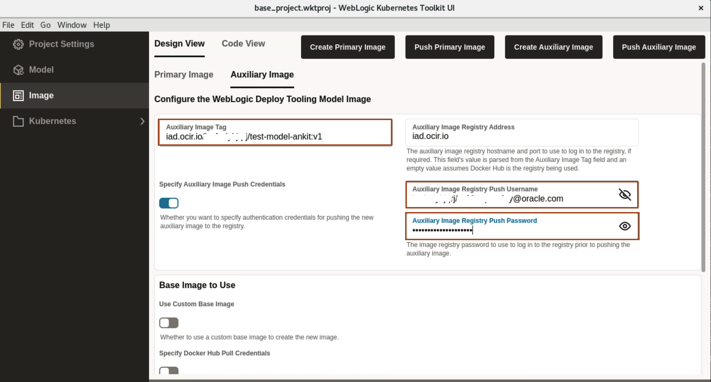
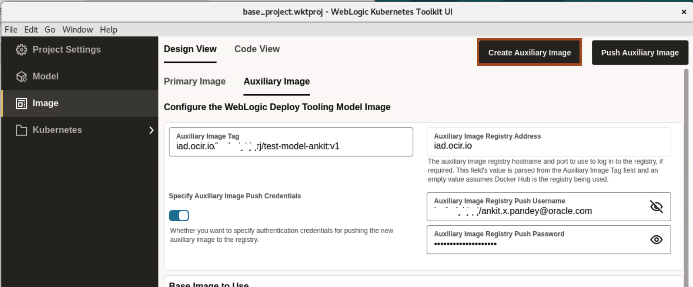

# Create a Auxiliary Image and Push it into Oracle Container Image Registry

## Introduction

In this lab, we authenticate OCI CLI using the browser, which will creates *.oci/config* file. As we will use kubectl to manage the cluster remotely using the *Local Access*. It needs a *kubeconfig* file. This kubeconfig file will be generated using the OCI CLI.

Later, we create an auxiliary image, and push it to Oracle Container Image Registry repository using the generated authentication token. 

Estimated Time: 10 minutes

### Objectives

In this lab, you will:

* Configure kubectl (Kubernetes Cluster CLI) to connect to Kubernetes Cluster.
* Create an Auxiliary Image and push the image to Oracle Cloud Container Image Registry.


## Task 1: Configure kubectl (Kubernetes Cluster CLI) to connect to Oracle Kubernetes Cluster
In this Task, we creats the configuration file *.oci/config* and *.kube/config* in */home/opc* directory. This configuration file allow us to access Oracle Kubernetes Cluster (OKE) from this virtual machine.

1. Click *Activities* and type *Firefox* in search box. Click on the icon for *Firefox*.
    

2. Open the url [https://cloud.oracle.com](https://cloud.oracle.com). Enter your *Cloud Account Name* and then your credential for Oracle Cloud Account and click *Sign In*.

3. In the Console, select the *Hamburger Menu* -> *Developer Services* -> *Kubernetes Clusters (OKE)* as shown.
    

4. Click on the cluster name which your created in lab 1 and then click *Access Cluster*. 
    


5. Select *Local Access* and then click on *Copy* as shown.
    

6. Go back to terminal and open a new tab.

7. Paste the copied command in the new tab. For *Do you want to create a new config file?*, Type *y* then press *Enter*. For *Do you want to create your config file by logging in through a browser?*, Type *y* then press *Enter*.
    

8. In Firefox Browser, click on your active session.
    > You will see *Authorization Completed* as shown.
    

9. In *Enter a passphrase for your private key*, leave it empty and press *Enter*.
    

10. Use the upper arrow key to run the *oce ce ...* command again and re-run it multiple time, until you see the *New config written to the Kubeconfig file /home/opc/.kube/config*.
    

## Task 2: Prepare Auxiliary Image and Push the Auxiliary Image  

In this task, we are creating an Auxiliary image, which we will push to the Oracle Cloud Container Registry.

**Primary Image** - The image containing the Oracle Fusion Middleware software. It is used as the basis of all containers that run WebLogic Servers for the domain.

**Auxiliary Image** - The image that supplies the WebLogic Deploy Tooling software and the model files. At runtime, the auxiliary image’s content is merged with the primary image’s content.
    


1. Click *Image*. For Primary Image, we will use the below *weblogic:12.2.1.3-ol8* from [oracle container registry](http://container-registry.oracle.com) Image.So leave default values under *Primary Image* section as shown 
    
    
    > **For your information only:**<br>
    > The primary image is the one used for running the domain. One primary image can be reused for hundreds of domains. The primary image contains the OS, JDK, and FMW software installations.

2. Click **Auxiliary Image** tab. To create the Auxiliary Image Tag, we need the following information:

    * End point for the Region
    * Tenancy Namespace

    


3. Locate the *Endpoint for Your Region*. Refer to the table documented at this URL [https://docs.oracle.com/en-us/iaas/Content/Registry/Concepts/registryprerequisites.htm#Availab](https://docs.oracle.com/en-us/iaas/Content/Registry/Concepts/registryprerequisites.htm#Availab). In the example shown, the endpoint for the region is *US East(Ashburn)* (as the region name) and its endpoint is **iad.ocir.io**. Locate the endpoint for your own *Region Name* and save it in the text file. You will also need it for the next lab.

    
    

    >Now you have both the tenancy namespace and endpoint for your region.
 

4. In lab 2, you already noted the tenancy namespace in your text file. If not, then for finding the Namespace of the tenancy, select the *Hamburger Menu* -> *Developer Services* -> *Container Registry*, as shown. Select the repository you created, you will find the Namespace as shown.
    

5. Now you have both the Tenancy Namespace and Endpoint for your region. Copy the following command and paste it in your text file. Then replace the `END_POINT_OF_YOUR_REGION` with the endpoint of your region name, `NAMESPACE_OF_YOUR_TENANCY` with your tenancy's namespace. 

    ````bash
    <copy>END_POINT_OF_YOUR_REGION/NAMESPACE_OF_YOUR_TENANCY/test-model-your_first_name:v1</copy>
    ````

> For example, in my case Auxiliary Image tag is `iad.ocir.io/tenancynamespace/test-model-ankit:v1`.

6. In step 4, you also determined the tenancy namespace.
Enter the  Auxiliary Image Registry Push Username as follows: `NAMESPACE_OF_YOUR_TENANCY`/`YOUR_ORACLE_CLOUD_USERNAME`. <br>
* Replace `NAMESPACE_OF_YOUR_TENANCY` with your tenancy's namespace
* Replace `YOUR_ORACLE_CLOUD_USERNAME` with your Oracle Cloud Account user name and then copy the replaced username from your text file and paste it in the *Auxiliary Image Registry Push Username*.
> For example, in my case **Auxiliary Image Registry Push Username** is `tenancynamespace/lab.user@oracle.com`.
* For Password, copy and paste the Authentication Token from your text file(or wherever you saved it) and paste it in the **Auxiliary Image Registry Push Username**.
    

7. Click *Create Auxiliary Image*.
    

8. As we already prepared the model in Lab 2, so click on *No*.
    

9. Select *Downloads* folder where we want to save *WebLogic Deployer* and click *Select* as shown.
    

10. Once Auxiliary images is successfully created, On *Create Auxiliary Image Complete* window, click *Ok*.
    
    > **For your information only:**<br>
    >  An auxiliary image is domain-specific. The auxiliary image contains the data that defines the domain.

11. Click *Push Auxiliary Image* to push the image in repository inside your Oracle Cloud Container Image Registry.
    

12. Once image is successfully pushed, On *Push Image Complete* window, click *Ok*. 
    

You may now proceed to the next lab.

## Acknowledgements
* **Author** -  Ankit Pandey
* **Contributors** - Maciej Gruszka, Sid Joshi
* **Last Updated By/Date** - Ankit Pandey, November 2023