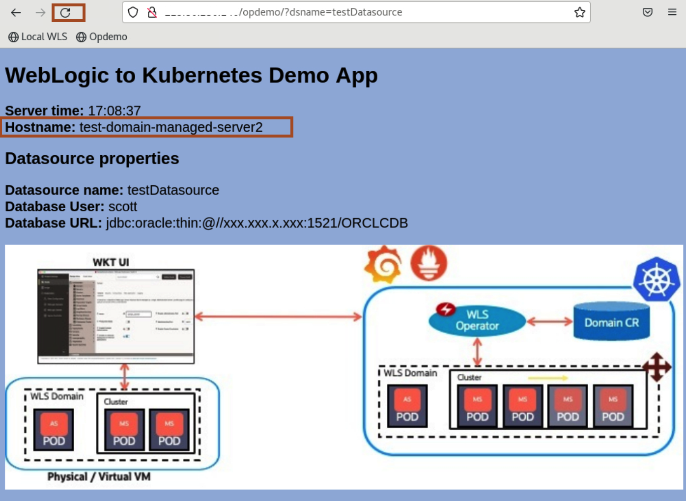

# Deploy Ingress Controller to Oracle Kubernetes Cluster (OKE)

## Introduction

In this lab, we install the *Traefik* Ingress Controller and then, we updates the *Ingress Routes* to access the application and admin server.

Later, we access the application *opdemo* and verify the successful migration of an offline on-premise domain. we also verify the loadbalancing between managed server pods.

Estimated Time: 10 minutes

### Objectives

In this lab, you will:

* Install Ingress Controller on Kubernetes Cluster.
* Update the Ingress Routes.
* Access the Application through the Browser.


## Task 1: Installtion of Ingress Controller to the Oracle Kubernetes Cluster

In this task, we install the *Ingress Controller*.

1. Click *Ingress Controller*. You can see some pre-filled values, let it remain the same and click *Install Ingress Controller*.
    
    > **For your information only:**<br>
    > This successfully install the *traefik-operator* ingress controller to Kubernetes namespace *traefik-ns*. 

2. Once you see *Ingress Controller Installation Complete*, click *Ok*.
    


## Task 2: Update the Ingress Routes to Access the Application

In this task, we add the Ingress routes for Accessing the Admin Console, Application. At the end, we get the accessible endpoints.

1. Scroll down and click on *+* icone to add the *Ingress Route Configuration*. 
    

2. Click on Edit icon as shown to modify the values.
    

3. Enter the following details and click on *OK*.<br>
        Name: console<br> 
        Path Expression: /console<br>
        Target Service Namespace: test-domain-ns<br>
        Target Service: test-domain-admin-server<br>
        Target Port: 7001<br>

    

4. In the similar way, add the following *opdemo* Ingress Routes as well:<br>
        Name: opdemo<br>
        Path Expression: /opdemo<br>
        Target Service Namespace: test-domain-ns<br>
        Target Service: test-domain-cluster-cluster-1 <br>
        Target Port: 8001<br>
    

5. In the similar way, add the following *remote-console* Ingress Routes as well:<br>
        Name: remote-console<br>
        Path Expression: / <br>
        Target Service Namespace: test-domain-ns<br>
        Target Service: test-domain-admin-server<br>
        Target Port: 7001<br>
        

6. To update the Inress Routes, click *Update Ingress Routes*.
    

7. In the *Update Existing Ingress Routes*, Click *Yes*.

8. Once you see *Ingress Routes Update Complete* window, Click *Ok*.
    
    
    > You need to notedown this load balancer public IP and save it in text file.

## Task 3: Access the Application through the Browser

In this task, we access the *opdemo* application. We click on refresh icon to make multiple request to application, to verify loadbalancing between two managed server pods.

1. Copy the below URL and replace *XX.XX.XX.XX* with your load balancer public IP, which you noted down in last task. You can see the below output.
    ```bash
    <copy>http://XX.XX.XX.XX/opdemo/?dsname=testDatasource</copy>
    ```
    


2. If you click on Refresh icon, You can see load balancing between two managed server pods.
    


You may now proceed to the next lab.

## Acknowledgements
* **Author** -  Ankit Pandey
* **Contributors** - Maciej Gruszka, Sid Joshi
* **Last Updated By/Date** - Ankit Pandey, November 2023