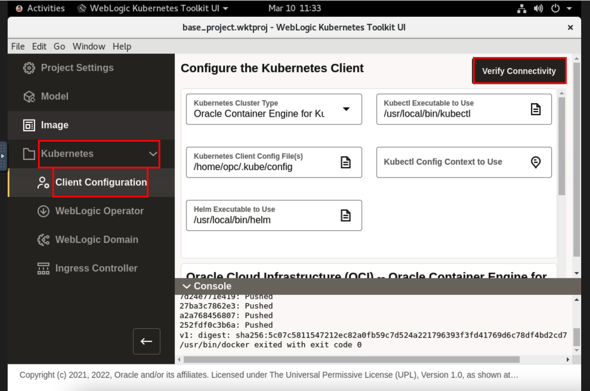
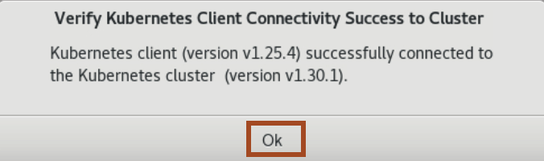
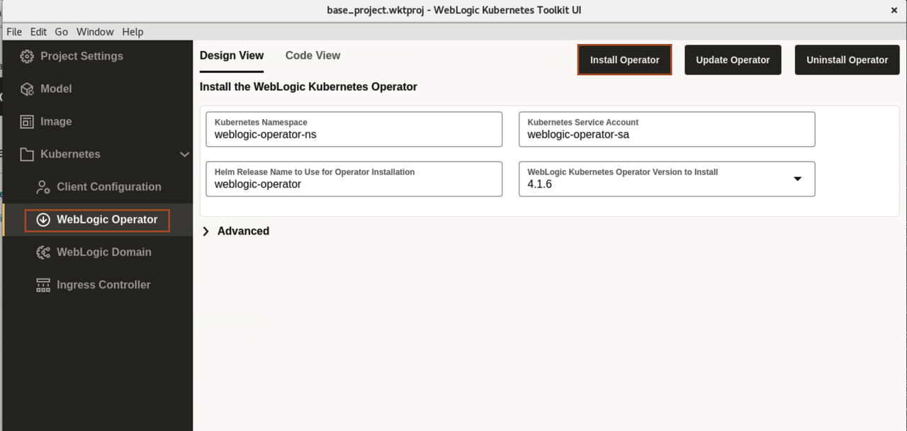
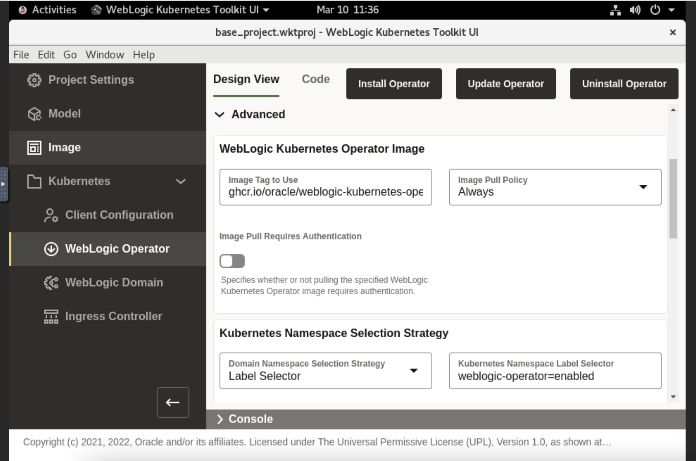
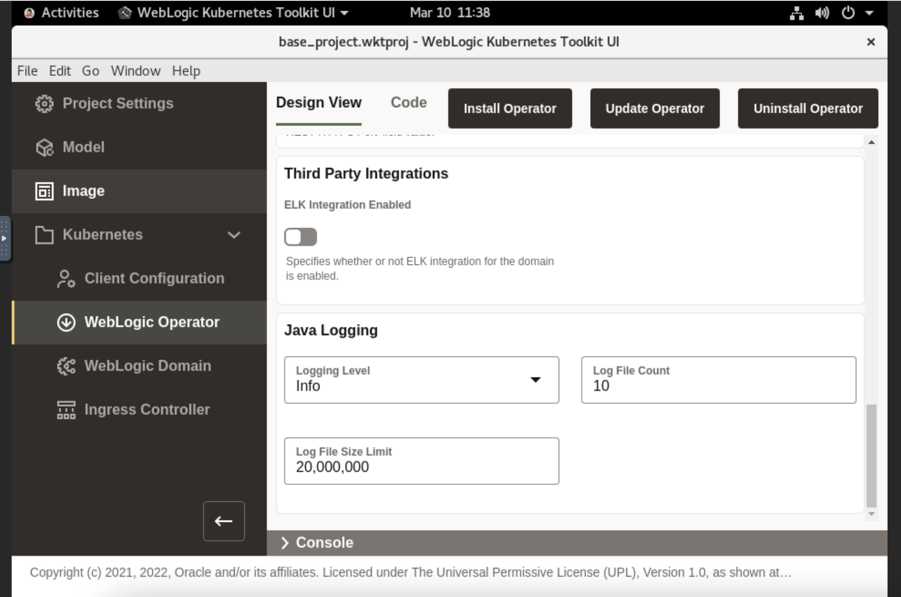
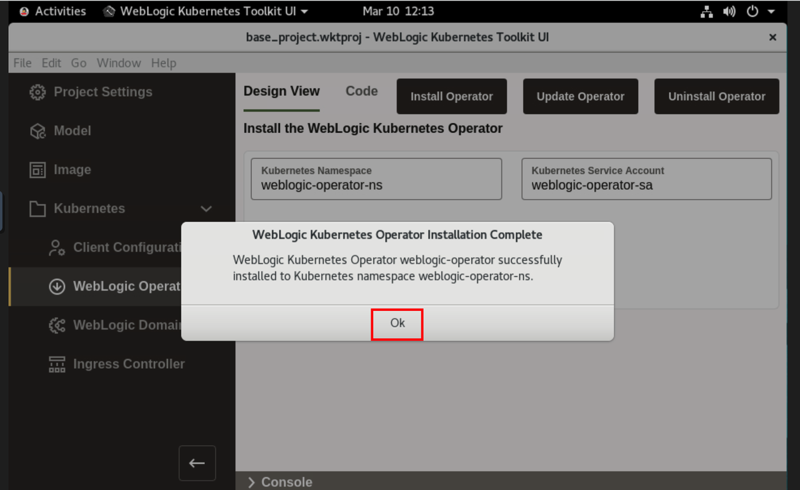

# Deploy WebLogic Operator to Oracle Kubernetes Cluster (OKE)

## Introduction

In this lab, we verify the connectivity to Kubernetes cluster from the WebLogic Kubernetes Toolkit UI. At last, we install the WebLogic Kubernetes Operator to Kubernetes cluster(OKE).

Estimated Time: 05 minutes

### Objectives

In this lab, you will:

* Verify Connectivity of WebLogic Kubernetes Toolkit UI to Kubernetes Cluster.
* Install the WebLogic Kubernetes Operator to Kubernetes Cluster.

## Task 1: Verify Connectivity of WebLogic Kubernetes Toolkit UI to Oracle Kubernetes Cluster
In this task, we verify the connectivity to *Oracle Kubernetes Cluster(OKE)* from the `WebLogic Kubernetes Toolkit UI` application.

1. Go back to WebLogic Kubernetes Tool Kit UI, Click *Activities* and select the WebLogic Kubernetes Tool Kit UI window. 

2. Click  *Kubernetes* ->  *Client Configuration* and then click *Verify Connectivity*.
    

3. Once you see *Verify Kubernetes Client Connectivity Success* window, Click *Ok*.
    

## Task 2: Install the WebLogic Kubernetes Operator to Oracle Kubernetes Cluster
This section provides support for installing the WebLogic Kubernetes Operator (the “operator”) in the target Kubernetes cluster. 

1. Click *WebLogic Operator*. Specify the following configuration details  and click *Install Operator*.

    **Kubernetes Namespace** - The Kubernetes namespace to which to install the operator. Leave the default value. 
    **Kubernetes Service Account** - The Kubernetes service account for the operator to use when making Kubernetes API requests. Leave the default value. 
    **Helm Release Name to Use for Operator Installation** - The Helm release name to use to identify this installation. Leave the default value. 

     
    
    > **For your information only:** 
    > !By default, the operator’s *Image Tag to Use* field is set to the image tag corresponding to the latest operator release version on the GitHub Container Registry. 
    > The operator needs to know which WebLogic domains in the Kubernetes cluster that it will manage. It does this at the Kubernetes namespace level, so any WebLogic domain in a Kubernetes namespace the operator is configured to manage, will be managed by the operator instance being installed. 
    > For *Kubernetes Namespace Selection Strategy* field, we select *Label Selector*, which means any Kubernetes namespace with a *weblogic-operator=enabled* label will be managed by this operator. 
    
   
    > By enabling Enable Cluster Role Binding, the operator installation will create a Kubernetes ClusterRole and ClusterRoleBinding that the operator will use for all managed namespaces. 
    > By default, the operator’s REST API is not exposed outside the Kubernetes cluster. To enable the REST API to be exposed, you can enable *Expose REST API Externally*.
    [Role Binding](images/role-binding.png) 
    
    > This pane lets you override the operator’s Java logging configuration, which can be useful when debugging issues with the operator. 
     
   
    > For more information on *WebLogic Kubernetes Operator Image*, *Kubernetes Namespace Selection Strategy*, *WebLogic Kubernetes Role Bindings*, *External REST API Access*, *Third Party Integrations* and *Java Logging*, see the [WebLogic Kubernetes Operator](https://oracle.github.io/weblogic-toolkit-ui/navigate/kubernetes/k8s-wko/) documentation.

2. Once you see *WebLogic Kubernetes Operator Installation Complete*, Click *Ok*.
    

You may now proceed to the next lab.

## Acknowledgements
* **Author** -  Ankit Pandey
* **Contributors** - Maciej Gruszka, Sid Joshi
* **Last Updated By/Date** - Ankit Pandey, November 2023