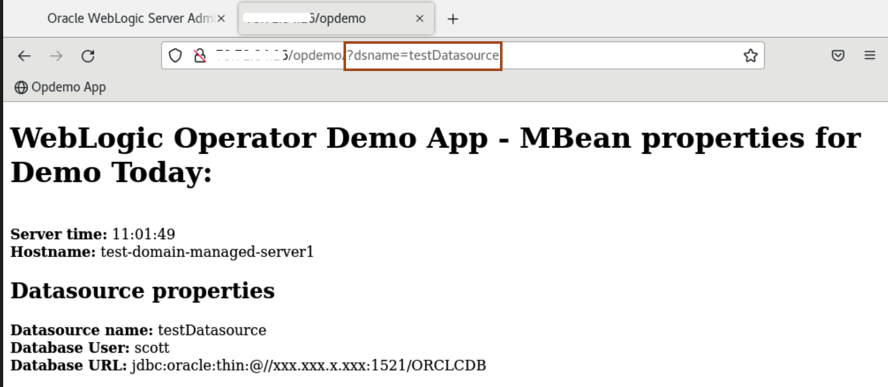
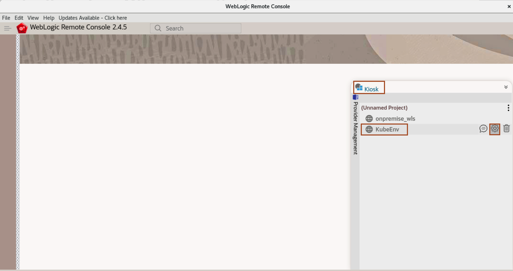

# Test the Application Deployment

## Introduction

### About WebLogic Remote Console

The WebLogic Remote Console is a lightweight, open-source console that you can use to manage your WebLogic Server domain running anywhere, such as on a physical or virtual machine, in a container, Kubernetes, or in the Oracle Cloud. The WebLogic Remote Console does not need to be colocated with the WebLogic Server domain.

You can install and run the WebLogic Remote Console anywhere, and connect to your domain using WebLogic REST APIs. You simply launch the desktop application and connect to the Administration Server of your domain. Or, you can start the console server, launch the console in a browser and then connect to the Administration Server.

The WebLogic Remote Console is fully supported with WebLogic Server 12.2.1.3, 12.2.1.4, and 14.1.1.0.

**Key Features of the WebLogic Remote Console**

* Configure WebLogic Server instances and clusters
* Create or modify WDT metadata models
* Configure WebLogic Server services, such as database connectivity (JDBC), and messaging (JMS)
* Deploy and un-deploy applications
* Start and stop servers and applications
* Monitor server and application performance

In this lab, we access the application **opdemo** and verify the successful migration of an offline on-premise domain. we also verify the load-balancing between managed server pods. Later, we use WebLogic Remote Console, to verify the successful deployment of resources of the test-domain in the Kubernetes environment.

Estimated Time: 10 minutes

Watch the video below for a quick walk-through of the lab.
[Testing Application Deployment](videohub:1_1khcsrbq)

### Objectives

In this lab, you will:

* Access the Application through the Browser.
* Explore the WebLogic Domain using WebLogic Remote Console.


## Task 1: Access the Application through the Browser

In this task, we access the **opdemo** application. We click on the refresh icon to make multiple requests to the application, to verify load-balancing between two managed server pods.

1. click the link for **opdemo** and then add **?dsname=testDatasource** as shown below
 ```bash
    <copy>?dsname=testDatasource</copy>
 ```
 
 


2. If you click on the Refresh icon, You can see load balancing between two managed server pods.
 


## Task 2: Explore WebLogic Domain on Kubernetes Cluster using WebLogic Remote Console

In this task, we explore the WebLogic Remote Console. We create a connection to **Admin Server** in the Remote Console and verify the resources in the WebLogic Domain. This verifies the successful migration of an on-premise domain into the Oracle Kubernetes Cluster. 

1. To open WebLogic Remote Console, Click on **Activities**, type **WebLogic** in search box and click on the **WebLogic Remote Console** Icon.
 

2. In the **Kiosk** and Select **KubeEnv** and click **icon** for settings as shown.
 

3. Enter the **IP** you copied in last lab and click **OK**.<br>
 

4. Click on **Edit Tree** icon, then Select **Services** -> **Data Sources**. You can observe the same Datasouce, which we had seen in the on-premise domain.
 

5. To display what servers are running in your domain. Click on **Monitoring Tree** Icon as shown then select **Environment** -> **Servers**. You can see we have **Admin Server** and 2 Managed Server pods running. 
 

6. Click on **admin-server**, you can see WebLogic Version is **12.2.1.4.0**. 
 
    


## Acknowledgements

* **Author** -  Ankit Pandey
* **Contributors** - Sid Joshi , Maciej Gruszka, 
* **Last Updated By/Date** - Ankit Pandey, July 2024