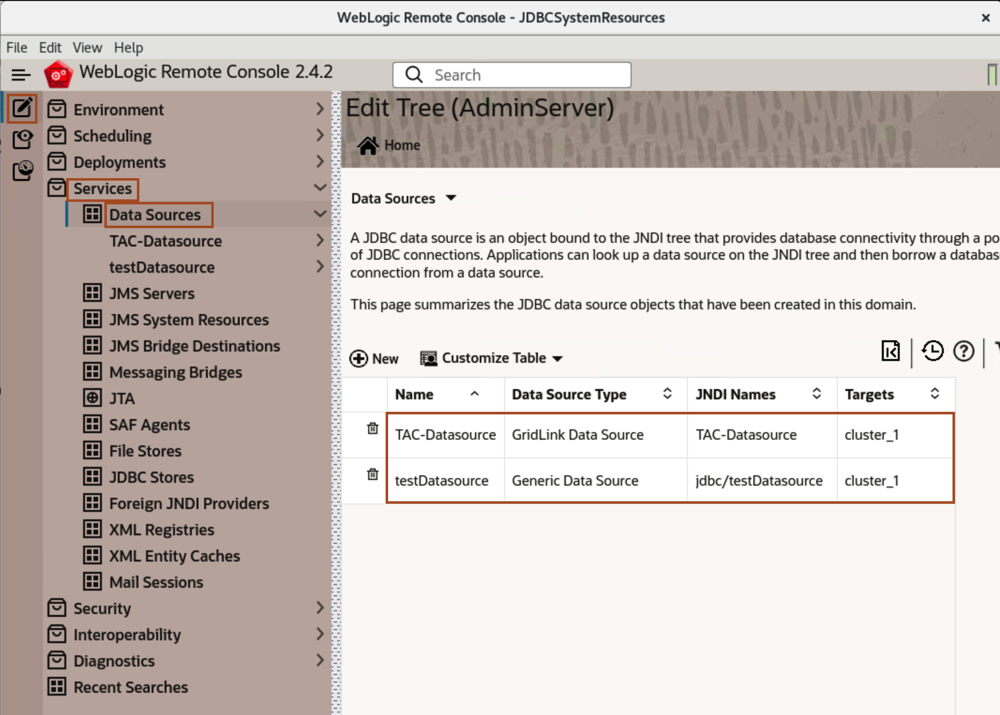

# Testing the Deployment of Application to the Oracle Container Engine for Kubernetes (OKE) on Oracle Cloud Infrastructure (OCI) 

## Introduction

### About WebLogic Remote Console

The WebLogic Remote Console is a lightweight, open source console that you can use to manage your WebLogic Server domain running anywhere, such as on a physical or virtual machine, in a container, Kubernetes, or in the Oracle Cloud. The WebLogic Remote Console does not need to be colocated with the WebLogic Server domain.

You can install and run the WebLogic Remote Console anywhere, and connect to your domain using WebLogic REST APIs. You simply launch the desktop application and connect to the Administration Server of your domain. Or, you can start the console server, launch the console in a browser and then connect to the Administration Server.

The WebLogic Remote Console is fully supported with WebLogic Server 12.2.1.3, 12.2.1.4, and 14.1.1.0.

**Key Features of the WebLogic Remote Console**

* Configure WebLogic Server instances and clusters
* Create or modify WDT metadata models
* Configure WebLogic Server services, such as database connectivity (JDBC), and messaging (JMS)
* Deploy and undeploy applications
* Start and stop servers and applications
* Monitor server and application performance

In this lab, we access the application *opdemo* and verify the successful migration of an offline on-premise domain. we also verify the loadbalancing between managed server pods. Later, we use WebLogic Remote Console, to verify the successful deployment of resources of test-domain in kubernetes environment.


### Objectives

In this lab, you will:

* Access the Application through the Browser.
* Explore the WebLogic Domain using WebLogic Remote Console.


## Task 1: Access the Application through the Browser

In this task, we access the *opdemo* application. We click on refresh icon to make multiple request to application, to verify loadbalancing between two managed server pods.

1. Copy the below URL and replace *XX.XX.XX.XX* with your IP, which you noted down in last lab. You can see the below output.
    ```bash
    <copy>http://XX.XX.XX.XX/opdemo/?dsname=testDatasource</copy>
    ```
    


2. If you click on Refresh icon, You can see load balancing between two managed server pods.
    


## Task 2: Explore WebLogic Domain on Kubernetes Cluster using WebLogic Remote Console

In this task, we explore the WebLogic Remote Console. We create connection to *Admin Server* in Remote Console and verify the resources in WebLogic Domain. This verifies the successful migration of an on-premise domain into the Oracle Kubernetes Cluster. 

1. To open WebLogic Remote Console, Click on *Activities*, type *WebLogic* in search box and click on the *WebLogic Remote Console* Icon.

2. Click on `Three dots` under *Kiosk* and Select *Add Admin Server Connection Provider* and click *Choose*.
    

3. Enter the following data and click *OK*.<br>
    Connection Provider Name: AdminServer<br>
    Username: weblogic<br>
    Password: welcome1<br>
    URL:  `Copy_IP_From_TextFile`</br>
    

4. Click on *Edit Tree* icon, then Select *Services* -> *JDBC System Resources*. You can observe the same Datasouce, which we had seen in on-premise domain.
    

5. Click on **Monitoring Tree** Icon as shown then select **Running Servers**. You can see we have **Admin Server** and 2 Managed Server pods are running. Click on **admin-server**, you can see WebLogic Version is **12.2.1.3.0**.
    

6. To display what servers are running in your domain. Click the **Configuration view Tree** icon, click **Environment** and **Servers**. In the servers drop down box, select **Status- Monitoring Tree**.
    
    


## Acknowledgements

* **Author** -  Ankit Pandey
* **Contributors** - Maciej Gruszka, Sid Joshi
* **Last Updated By/Date** - Kamryn Vinson, March 2022