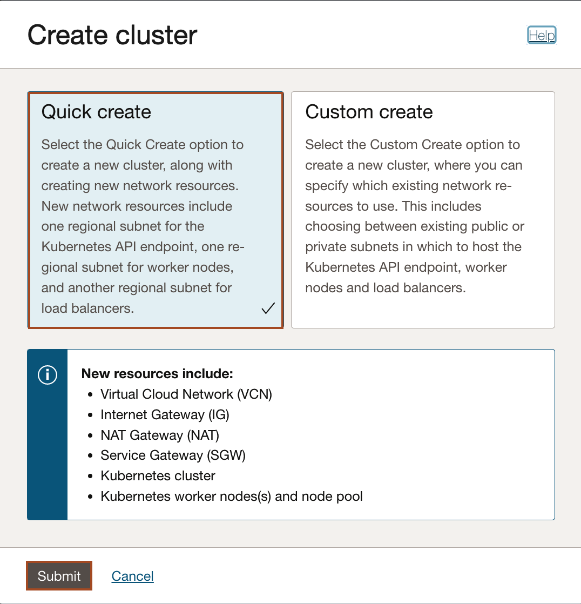
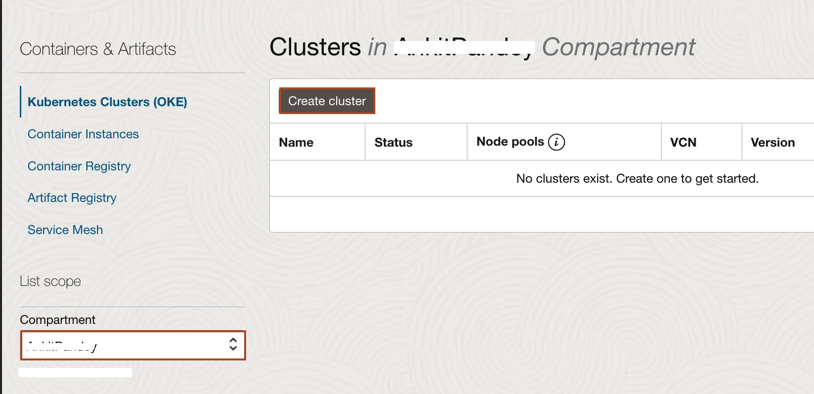

# Setup the Lab Environment

## Introduction

In this lab, you will create a 3-node Kubernetes cluster configured with all of the necessary network resources. Also, you will create a repository inside Oracle Cloud Container Image Registry. Then, you will generate an authentication token. Further, you will accept the license agreement for WebLogic Server images in Oracle Container Registry. 

### Objectives

In this lab, you will:

* Create an Oracle Kubernetes Cluster.
* Create a repository inside Oracle Cloud Container Image Registry.
* Generate an authentication token.
* Accept the license for WebLogic Server Images in Oracle Container Registry.

### Prerequisites

* You must have an [Oracle Cloud Infrastructure](https://cloud.oracle.com/en_US/cloud-infrastructure) enabled account.
* You must have an Oracle Account. 
* You should have a text editor.

## Task 1: Create an Oracle Kubernetes Cluster

The *Quick Create* feature uses the default settings to create a *quick cluster* with new network resources as required. This approach is the fastest way to create a new cluster. If you accept all the default values, you can create a new cluster in just a few clicks. New network resources for the cluster are created automatically, along with a node pool and three worker nodes.

In this task, we uses the *Quick Create* features to create the Oracle Kubernetes Cluster. 

1. In the Console, select the *Hamburger Menu* -> *Developer Services* -> *Kubernetes Clusters (OKE)* as shown.
        

2. In the Cluster List page, select the Compartment of your choice, where you are allowed to create a cluster, and then click *Create Cluster*.
        
> You need to select a compartment in which you are allowed to create a cluster and also, a repository inside the Oracle Container Registry.

3. In the Create Cluster Solution dialog, select *Quick Create* and click *Launch Workflow*. `Quick Create` will create a new cluster with the default settings, along with new network resources for the new cluster.

4. Specify the following configuration details on the Cluster Creation page (please pay attention to the value you place in the *Shape* field):

    * **Name**: The name of the cluster. Leave the default value.
    * **Compartment**: The name of the compartment. Leave the default value.
    * **Kubernetes version**: The version of Kubernetes. Leave the default value which should be *v1.22.5* or select the latest version available.
    * **Kubernetes API Endpoint**: Are the cluster master nodes going to be routable or not. Select the *Public Endpoint* value.
    * **Kubernetes Worker Nodes**: Are the cluster worker nodes going to be routable or not. Leave the default *Private Workers* value.
    * **Shape**: The shape to use for each node in the node pool. The shape determines the number of CPUs and the amount of memory allocated to each node. The list shows only those shapes available in your tenancy that are supported by OKE. Select *VM.Standard2.1* (which is typically available in Oracle Free Tier Account).
    * **Number of nodes**: The number of worker nodes to create. Leave the default value, *3*.

        Click *Next* to review the details you entered for the new cluster.

        
        

5. On the *Review* page, click *Create Cluster* to create the new network resources and the new cluster.
        
    > You see the network resources being created for you. Wait until the request to create the node pool is initiated and then click *Close*.
      

    > Then, the new cluster is shown on the *Cluster Details* page. When the master nodes are created, the new cluster gains a status of *Active* (it takes about 7 minutes). Please don't wait and proceed for the next task.

## Task 2: Creation of an Repository

In this task, you creates a public repository. In lab 5, we will push Auxiliary Image into this repository.

1. In the Console, select the *Hamburger Menu* -> *Developer Services* -> *Container Registry* as shown.
    

2. Select your compartment, where you are allowed to create the repository. Click *Create Repository*.
    

3. Enter *`test-model`* as Repository name and Access as *Public* then click *Create repository*.
    

4. Once your repository is ready. Please note down the tenancy namespace in your text file inside the text editor.
    

## Task 3: Generate an Authentication Token 

In this task, we will generate an *Authentication Token*. In lab 5, we will use this authentication token to push auxiliary image into the Oracle Cloud Container Registry Repository.

1. Select the User Icon in the top right corner and then select *MyProfile*.

    

2. Scroll down and select *Auth Tokens* and then click *Generate Token*.

    

3. Copy *`test-model-your_first_name`* and paste it in the *Description* box and click *Generate Token*.

    

4. Select *Copy* under Generated Token and paste it in your text editor. We cannot copy it later. Click *Close*.

    

## Task 4: Accepting the license for WebLogic Server Images 

In this task, we accept the license agreement for WebLogic Server images resides in Oracle Container Registry. As in Lab 3, we will use WebLogic Server 12.2.1.3.0 image as our Primary Image. So, to get access to WebLogic Server Images, we accept the license agreement.

1. Click the link for the Oracle Container Registry [https://container-registry.oracle.com/](https://container-registry.oracle.com/) and sign in. For this, you need an Oracle Account.
    
    
2. Enter your *Oracle Account Credentials* in the Username and Password fields, and then click *Sign In*.
    

3. In the Home page of Oracle Container Registry, Search for *weblogic*.
    

4. Click *weblogic* as shown and select *English* as the language, then click *Continue*.
    
    

5. Click *Accept* to accept the license agreement.
    

## Learn More

*About Oracle Cloud Infrastructure Container Engine for Kubernetes*

Oracle Cloud Infrastructure Container Engine for Kubernetes is a fully-managed, scalable, and highly available service that you can use to deploy your container applications to the cloud. Use the Container Engine for Kubernetes (sometimes abbreviated OKE) when your development team wants to reliably build, deploy, and manage cloud-native applications. You specify the compute resources that your applications require, and OKE provisions them on the Oracle Cloud Infrastructure in an existing OCI tenancy.

## Acknowledgements

* **Author** -  Ankit Pandey
* **Contributors** - Maciej Gruszka, Sid Joshi
* **Last Updated By/Date** - Kamryn Vinson, March 2022
