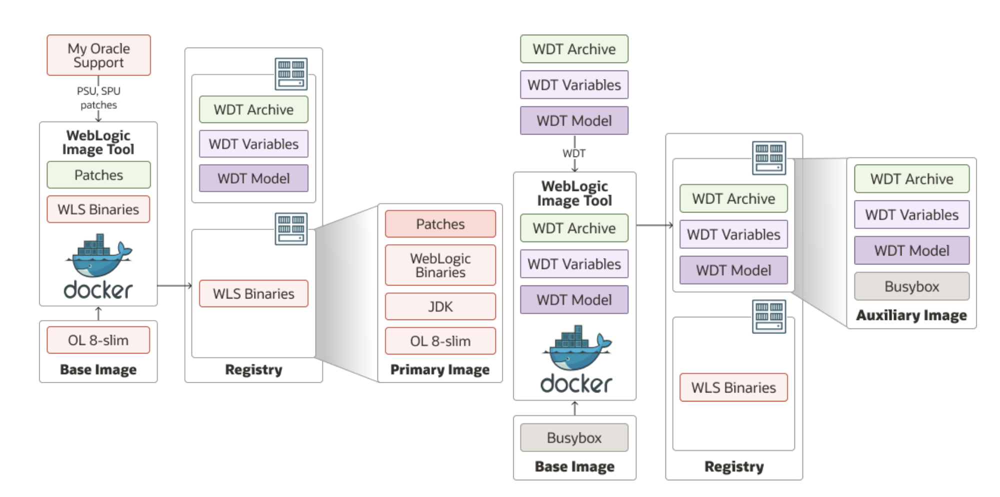
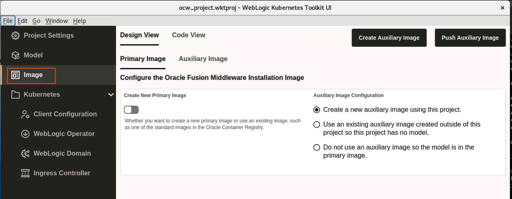

# Create a Auxiliary Image and Push it into Oracle Container Image Registry

## Introduction

**Primary Image** - The image containing the Oracle Fusion Middleware software. It is used as the basis of all containers that run WebLogic Servers for the domain.

**Auxiliary Image** - The image that supplies the WebLogic Deploy Tooling software and the model files. At runtime, the auxiliary image’s content is merged with the primary image’s content.
    

In this Lab, we use WebLogic server **12.2.1.4-slim-ol8** image as Primary Image. Also, we create an auxiliary image, and push it to Oracle Container Image Registry repository using the pre-generated authentication token. 

Estimated Time: 10 minutes

Watch the video below for a quick walk-through of the lab.
[Creation of Images for the OKE on OCI](videohub:1_y5o56oe5)

### Objectives

In this lab, you will:

* Create an Auxiliary Image and push the image to Oracle Cloud Container Image Registry.

## Task 1: Prepare Auxiliary Image and Push the Auxiliary Image  

In this task, we are creating an Auxiliary image, which we will push to the Oracle Cloud Container Registry.

1. Click **Image**. For Primary Image, we will use the below **weblogic Image**.So leave default values under **Primary Image** section as shown 

    ```bash
    <copy>container-registry.oracle.com/middleware/weblogic:12.2.1.4-slim-ol8</copy>
    ```
    
    > **For your information only:**<br>
    > The primary image is the one used for running the domain. One primary image can be reused for hundreds of domains. The primary image contains the OS, JDK, and FMW software installations.

2. Click **Auxiliary Image** tab in Image section. To create the **Auxiliary Image Tag**, we need the following information:

    * End point for the Region
    * Tenancy Namespace
    * OCIR Registry Name

    > We have prefilled the values for you. You need to replace **tag** with your username. For example, user1/user2. 
    
 

5. We have prefilled the values for **Auxiliary Image Registry Push Username** and **Auxiliary Image Registry Push Password**.
    

7. Click **Create Auxiliary Image**.
    

8. As we already prepared the model in previous lab, so click on **No**.
    

9. Select **Downloads** folder where we want to save **WebLogic Deployer** and click **Select** as shown.
    

10. Once Auxiliary images is successfully created, On **Create Auxiliary Image Complete** window, click **Ok**.
    
    > **For your information only:**<br>
    >  An auxiliary image is domain-specific. The auxiliary image contains the data that defines the domain.

11. Click **Push Auxiliary Image** to push the image in repository inside your Oracle Cloud Container Image Registry.
    

12. Once image is successfully pushed, On **Push Image Complete** window, click **Ok**. 
    


 
## Acknowledgements

* **Author** -  Ankit Pandey
* **Contributors** - Sid Joshi , Maciej Gruszka, 
* **Last Updated By/Date** - Ankit Pandey, July 2024