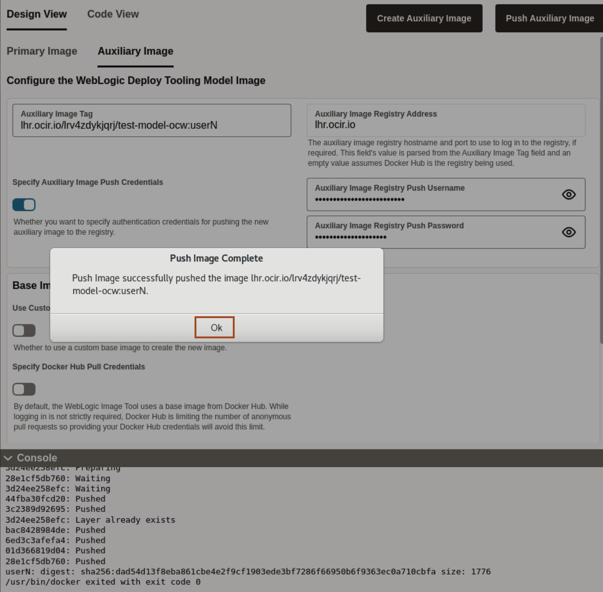

# Create an Auxiliary Image and Push it into the Oracle Container Image Registry

## Introduction

**Primary Image** - The image containing the Oracle Fusion Middleware software. It is used as the basis of all containers that run WebLogic Servers for the domain.

**Auxiliary Image** - The image that contains Application archive, WDT Model and WDT variable files.  At runtime, the auxiliary image’s content is merged with the primary image’s content.
 

In this Lab, we use the WebLogic server **12.2.1.4-slim-ol8** image as the Primary Image. Also, we create an auxiliary image and push it to the Oracle Container Image Registry repository using the pre-generated authentication token. 

Estimated Time: 10 minutes

Watch the video below for a quick walk-through of the lab.
[Creation of Images for the OKE on OCI](videohub:1_y5o56oe5)

### Objectives

In this lab, you will:

* Create an Auxiliary Image and push the image to Oracle Cloud Container Image Registry.

## Task 1: Prepare the Auxiliary Image and Push the Auxiliary Image  

In this task, we are creating an Auxiliary image, which we will push to the Oracle Cloud Container Registry.

1. Click **Image**, then in the image section, click **Auxiliary Image**. Please update the Auxiliary Image **tag** with your user number. The URL has been prepared for you; all you need to do is replace tag with your user number. For example, for user3, replace lhr.ocir.io/lrv4zdykjqrj/test-model-ocw:**tag** with lhr.ocir.io/lrv4zdykjqrj/test-model-ocw:user3.
      

      >  The Auxiliary image tag follows the format `END_POINT_OF_YOUR_REGION`/`NAMESPACE_OF_YOUR_TENANCY`/`OCI_REGISTRY_NAME`:`TAG`. In this case, **lhr.ocir.io** represents the endpoint of the region, **lrv4zdykjqrj** is the tenancy namespace, and **test-model-ocw** is the registry name that we created for you in advance. 
 
 

2. We have prefilled the values for **Auxiliary Image Registry Push Username** and **Auxiliary Image Registry Push Password**. These details are required for pushing the auxiliary image in OCI registry.
    

      >  We have created one shared user for all the participants. **Auxiliary Image Registry Push Username** is formed with tenancy namespace and registed username of shared user. **Auxiliary Image Registry Push Password** is formed with OCI authentication token. 

3. Click **Create Auxiliary Image**.
      

4. As we already prepared the model in the previous lab, so click on **No**.
      

5. Select **Downloads** folder where we want to save **WebLogic Deployer** and click **Select** as shown.
      

6. Once Auxiliary images is successfully created, On **Create Auxiliary Image Complete** window, click **Ok**.
      
      > **For your information only:** 
      > An auxiliary image is domain-specific. The auxiliary image contains the data that defines the domain.

7. Click **Push Auxiliary Image** to push the image in the repository inside your Oracle Cloud Container Image Registry.
      

8. Once image is successfully pushed, On **Push Image Complete** window, click **Ok**. 
      

 
## Acknowledgements

* **Author** -  Ankit Pandey
* **Contributors** - Sid Joshi , Maciej Gruszka
* **Last Updated By/Date** - Ankit Pandey, July 2024