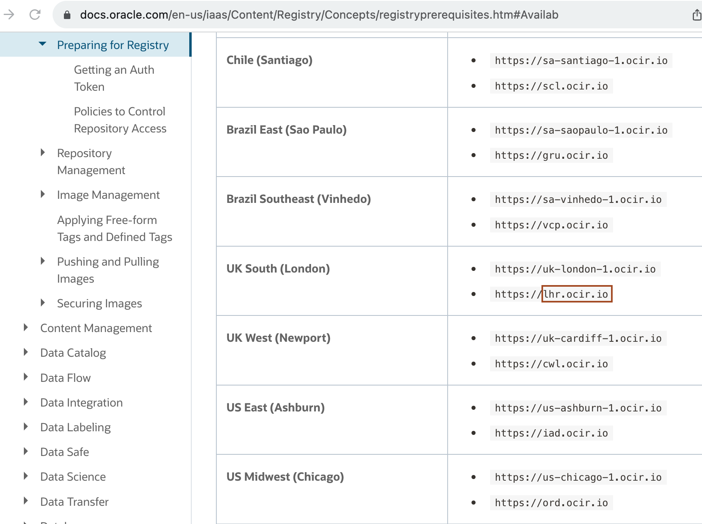
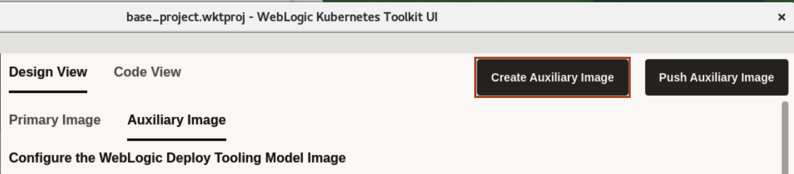
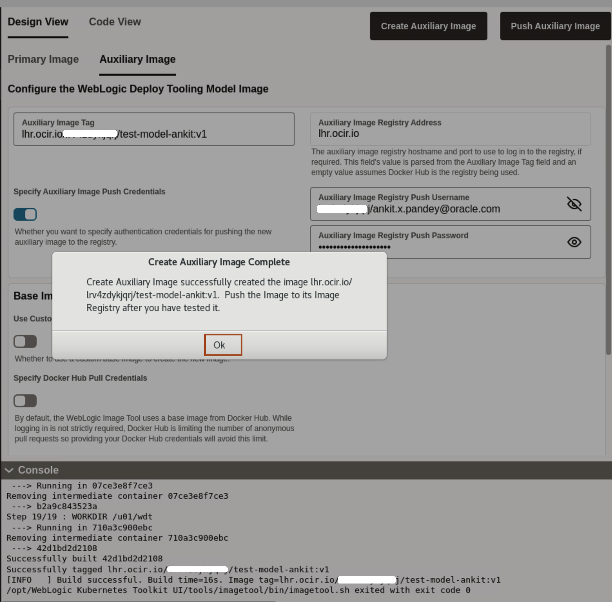

# Create a Auxiliary Image and Push it into Oracle Container Image Registry

## Introduction

**Primary Image** - The image containing the Oracle Fusion Middleware software. It is used as the basis of all containers that run WebLogic Servers for the domain.

**Auxiliary Image** - The image that supplies the WebLogic Deploy Tooling software and the model files. At runtime, the auxiliary image’s content is merged with the primary image’s content.
    

In this Lab, we use WebLogic server 12.2.1.3.0-ol8 image as Primary Image. Also, we create an auxiliary image, and push it to Oracle Container Image Registry repository using the generated authentication token. 

Estimated Time: 10 minutes

Watch the video below for a quick walk-through of the lab.
[Creation of Images for the OKE on OCI](videohub:1_y5o56oe5)

### Objectives

In this lab, you will:

* Create an Auxiliary Image and push the image to Oracle Cloud Container Image Registry.

## Task 1: Prepare Auxiliary Image and Push the Auxiliary Image  

In this task, we are creating an Auxiliary image, which we will push to the Oracle Cloud Container Registry.

1. Click *Image*. For Primary Image, we will use the below *weblogic* Image.So leave default values under *Primary Image* section as shown 

    ```bash
    <copy>container-registry.oracle.com/middleware/weblogic:12.2.1.3-ol8</copy>
    ```
    
    > **For your information only:**<br>
    > The primary image is the one used for running the domain. One primary image can be reused for hundreds of domains. The primary image contains the OS, JDK, and FMW software installations.

2. To create the Auxiliary Image Tag, we need the following information:

    * End point for the Region
    * Tenancy Namespace


3. Locate the *Endpoint for Your Region*. Refer to the table documented at this URL [https://docs.oracle.com/en-us/iaas/Content/Registry/Concepts/registryprerequisites.htm#Availab](https://docs.oracle.com/en-us/iaas/Content/Registry/Concepts/registryprerequisites.htm#Availab). In the example shown, the endpoint for the region is *UK South (London)* (as the region name) and its endpoint is *lhr.ocir.io*. Locate the endpoint for your own *Region Name* and save it in the text file. You will also need it for the next lab.

    

    >Now you have both the tenancy namespace and endpoint for your region.
 

4. In lab 3, you already noted the tenancy namespace in your text file. If not, then for finding the Namespace of the tenancy, select the *Hamburger Menu* -> *Developer Services* -> *Container Registry*, as shown. Select the repository you created, you will find the Namespace as shown.
    

5. Now you have both the Tenancy Namespace and Endpoint for your region. Copy the following command and paste it in your text file. Then replace the `END_POINT_OF_YOUR_REGION` with the endpoint of your region name, `NAMESPACE_OF_YOUR_TENANCY` with your tenancy's namespace. Click on *Auxiliary Image* tab as shown.
    

    ````bash
    <copy>END_POINT_OF_YOUR_REGION/NAMESPACE_OF_YOUR_TENANCY/test-model-your_first_name:v1</copy>
    ````

> For example, in my case Auxiliary Image tag is `lhr.ocir.io/tenancynamespace/test-model-ankit:v1`.

6. In step 4, you also determined the tenancy namespace.
Enter the  Auxiliary Image Registry Push Username as follows: `NAMESPACE_OF_YOUR_TENANCY`/`YOUR_ORACLE_CLOUD_USERNAME`. <br>
* Replace `NAMESPACE_OF_YOUR_TENANCY` with your tenancy's namespace
* Replace `YOUR_ORACLE_CLOUD_USERNAME` with your Oracle Cloud Account user name and then copy the replaced username from your text file and paste it in the *Auxiliary Image Registry Push Username*.
> For example, in my case **Auxiliary Image Registry Push Username** is `tenancynamespace/lab.user@oracle.com`.
* For Password, copy and paste the Authentication Token from your text file(or wherever you saved it) and paste it in the **Auxiliary Image Registry Push Username**.
    

7. Click *Create Auxiliary Image*.
    

8. As we already prepared the model in Lab 2, so click on *No*.
    

9. Select *Downloads* folder where we want to save *WebLogic Deployer* and click *Select* as shown.
    

10. Once Auxiliary images is successfully created, On *Create Auxiliary Image Complete* window, click *Ok*.
    
    > **For your information only:**<br>
    >  An auxiliary image is domain-specific. The auxiliary image contains the data that defines the domain.

11. Click *Push Auxiliary Image* to push the image in repository inside your Oracle Cloud Container Image Registry.
    

12. Once image is successfully pushed, On *Push Image Complete* window, click *Ok*. 
    


## Acknowledgements

* **Author** -  Ankit Pandey
* **Contributors** - Maciej Gruszka, Sid Joshi
* **Last Updated By/Date** - Ankit Pandey, August 2023