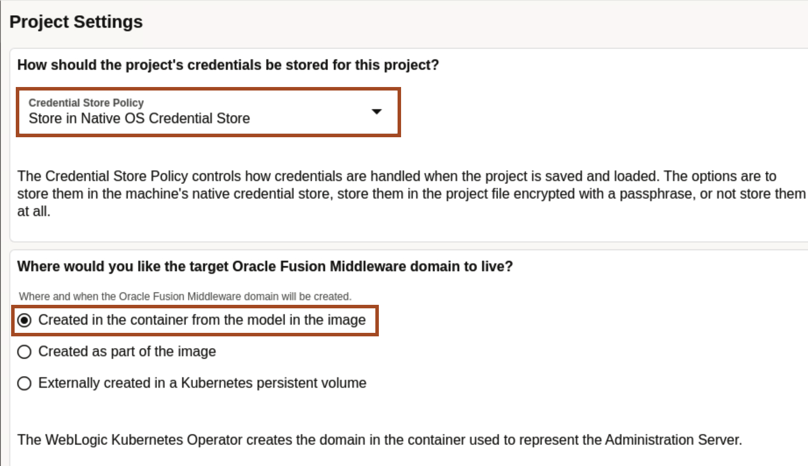
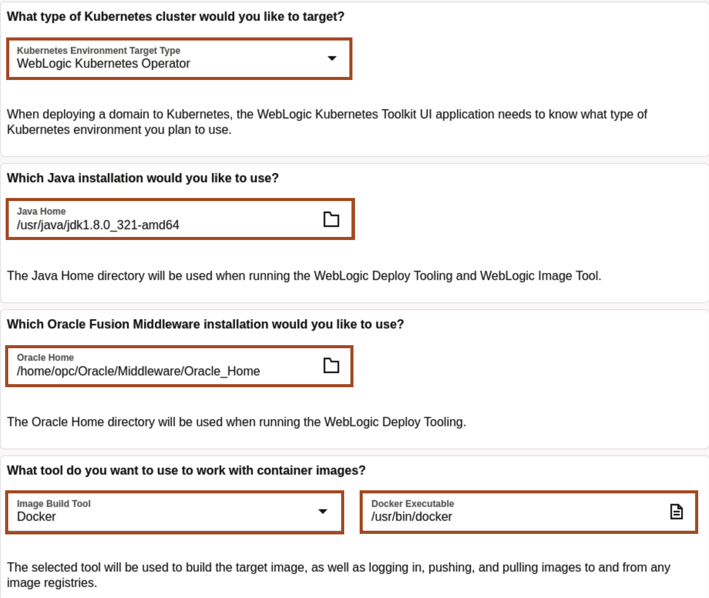
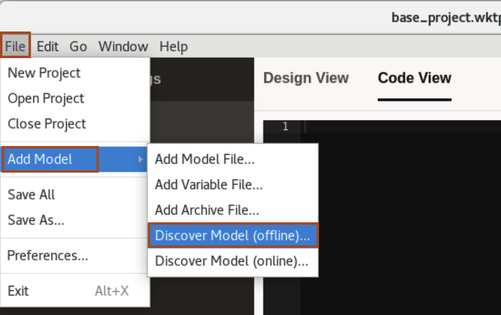
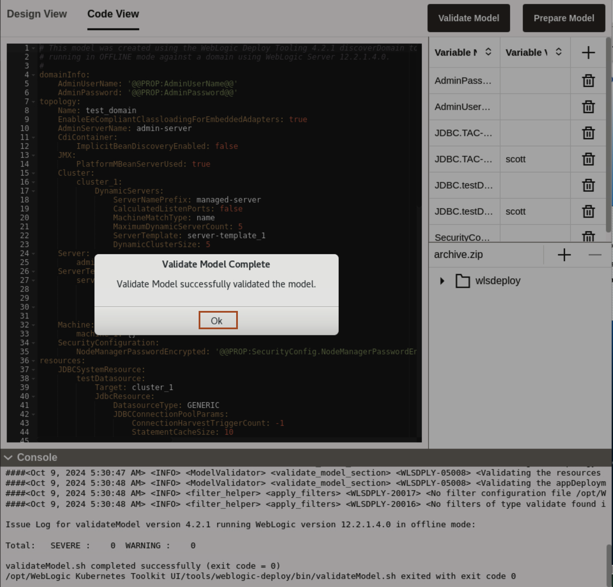

# Creation of Model for the Oracle Container Engine for Kubernetes (OKE) on Oracle Cloud Infrastructure (OCI)
## Introduction

In this lab, we explore the on-premise WebLogic domain. We navigate through the administration console to view the deployed application, datasources and servers in *test-domain*. we also open the pre-created *`base_project.wktproj`*, which already have pre-filled values for *Project Settings* section. Then we create the model file, by introspecting of an offline on-premise domain. At last, we validate the model and prepare the model to be deployed on Oracle Kubernetes Cluster (OKE).

### Objectives

In this lab, you will:

* Explore the on-premise WebLogic domain *test-domain*.
* Open the base WKT project.
* Introspection of an offline on-premise domain.
* Validate and prepare model. 

### Prerequisites

To run this lab, you must have:
* Access to noVNC Remote Desktop created in lab 2.

## Task 1: Explore on-premise domain

In this task, we navigate through the resources in on-premise *test-domain* using WebLogic Administration console.

1. On left side, click *Arrow Icon*. 
    
 > **Important**- You can see the *Clipboard*, for copy and paste between the host machine and remote desktop, we use the *Clipboard*. For example, if you want to copy from the host machine and want to paste it inside the remote desktop, you need to first paste in the clipboard first, then you can paste it in remote desktop. Again click on *Arrow Icon* to hide the *Settings* option.

2. Enter *weblogic/Welcome1%* as `Username/Password`, then click *Login*. You can see, we have WebLogic Server version *12.2.1.3.0*.   
    

3. To view available servers, expand *Environment* and click *Servers*. You can see, we have one dynamic clusters with 5 managed servers. 
    

4. To view the datasources, expand *Services* and click *Data Sources*.
    

5. To view the deployed application, click *Deployment*. You can see, we have *opdemo* as deployed application.
    

## Task 2: Opening the base WKT UI Project

For simplicity of lab, we created *`base_project.wktproj`*, which preset the location of docker, Java, Oracle Home, Primary Image Tag. In this task, we open  *`base_project.wktproj`* project.

1. Click *Activities* and then type **WebLogic** in search box. Click the icon for *WebLogic Kubernetes Toolkit UI*.
    

2. To open *base_project.wktproj* project, click *File* -> *Open Project*. 
    

3. Click *Downloads* in left side, then choose *base_project.wktproj* and click *Open Project*.
    

    > **For your information only:** 
    > As *Credential Story Policy*, we select **Store in Native OS Credentials Store**. It means the credentials (like for WebLogic Server and datasources) are only stored on the local machine. 
    > For *Where would you like the target Oracle Fusion Middleware domain to live?*, we select **Created in the container from the model in the image**. In this case, the set of model-related files are added to the image. So when the WebLogic Kubernetes Operator domain object is deployed, its inspector process runs and creates the WebLogic Server domain inside a running container on-the-fly. 
    
    > As *Kubernetes Environment Target Type*, we select **WebLogic Kubernetes Operator**. This means, you want this domain to be deployed in Kubernetes managed by the WebLogic Kubernetes Operator. This settings also determine what sections and their associated actions within the application, to display. 
    > we also specify the location for *JAVA HOME* and *ORACLE_HOME*. WebLogic Kubernetes Toolkit UI uses this directory when invoking the WebLogic Deployer Tooling and WebLogic Image Tool.  
    > To build new images, inspect images and interact with image repositories, the WKT UI application uses an image build tool, which defaults to docker. 
    
    

4. Enter *welcome1* as **Password** and then click *Unlock*.
    

## Task 3: Introspection of an Offline on-premise domain 

In this task, we perform introspection of an on-premise domain, which creates a model file consisting of the domain configuration.

1. In WebLogic Kubernetes Toolkit UI, Click *Model*.
    

2. Click *File* -> *Add Model* -> *Discover Model(offline)*.
    

3. Click Open folder *icon* to open the *Domain Home*.
    

4. In the Home folder, navigate to *`/home/opc/Oracle/Middleware/Oracle_Home/user_projects/domains/`* directory and select *test-domain* folder then  click *Select*. Click *OK*.
    
    
    > If you look in the console, you will see that this invokes WebLogic Deployer Tool to introspect the domain configuration in offline mode. 

5. You can see the window as shown below, at the end, you will have model ready for you.
    

    > The result of this WDT introspection are model(a metadata representation of your domain configuration), placeholder, where you can specify the values (like password for datasource) and application in the application archive.

## Task 4: Validate and Prepare Model 

In this task, we validate the model and prepare the model to be deployed on Oracle Kubernetes Cluster (OKE).

1. To Validate the model, click *Validate Model*.
    
    > **For your information only:** 
    > Validate model invokes the WDT [Validate Model Tool](https://oracle.github.io/weblogic-deploy-tooling/userguide/tools/validate/), which validates that the model and its related artifacts  are well-formed and provides help on the valid attributes and subfolder for a particular model location.

2. Once you see *Validate Model Complete* window, click *Ok*.
    

3. To prepare the model, to be deployed on Kubernetes cluster, click *Prepare Model*
    
    > **For your information only:** 
    > Prepare model invokes the WDT [Prepare Model Tool](https://oracle.github.io/weblogic-deploy-tooling/userguide/tools/prepare/) to modify the model to work in a Kubernetes cluster with WebLogic Kubernetes Operator or Verrazzano installed. 
    > Prepare Model does the following:
    * Removes model sections and fields that are not compatible with the target environment.
    * Replaces endpoint values with model tokens that reference variables.
    * Replaces credential values with model tokens that reference either a field in a Kubernetes secret or a variable.
    * Provides default values for fields displayed in the application’s variable, variable overrides, and secret editors.
    * Extracts topology information to the application that it uses to generate the resource file used to deploy the domain.

4. Once you see *Prepare Model Complete* window,click *Ok*.
    

## Acknowledgements

* **Author** -  Ankit Pandey
* **Contributors** - Maciej Gruszka, Sid Joshi
* **Last Updated By/Date** - Kamryn Vinson, May 2022