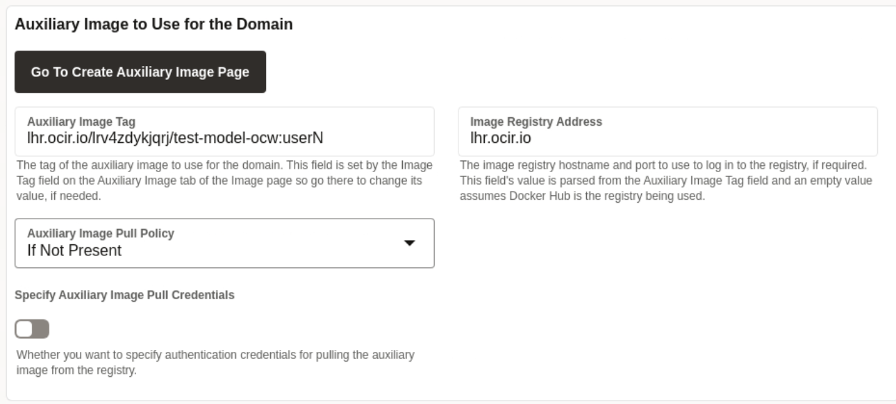

# Deploy WebLogic Domain to Oracle Kubernetes Cluster (OKE)

## Introduction

In this lab, we deploy the WebLogic Domain to kubernetes cluster. Here we also specify the replica for the cluster.

Estimated Time: 10 minutes

Watch the video below for a quick walk-through of the lab.
[Deploy WebLogic Domain to OKE Cluster](videohub:1_wz94de1l)

### Objectives

In this lab, you will:

* Deploy the WebLogic Domain to Kubernetes Cluster.

## Task 1: Deploy the WebLogic Domain to the Oracle Kubernetes Cluster

In this task, we deploy the Kubernetes custom resource for the WebLogic domain to Kubernetes Cluster.

1. Click **WebLogic Domain**. For **Define the Operator Domain**, we have prefilled value for you. 
    

2. For **Primary Image**, we have prefilled the value with WebLogic **12.2.1.4-slim-ol8**. 
    

3. For **Auxiliary Image**, leave the default value.
    


4.  In **Clusters** section, we have set the **Replicas** value to **2**. 


5. In Datasources section, double click to edit **passwords** for two datasource. You can give **tiger** as password in both the datasources. Once done, click **Deploy Domain**.
    
    > This deploy WebLogic Domain test-domain to Kubernetes namespace **test-domain-ns**.

6. Once you see **WebLogic Domain Deployment to Kubernetes Complete** window, Click **OK**.
    

7. Go back to terminal, Click **Activities** and select the **Terminal** window. Copy the following command and paste it terminal. You should see the similar output, where pod for introspector run first then for the Admin Server and later pods for managed server goes in the **Running** state.

    ````bash
    <copy>kubectl get pods -n test-domain-ns -w</copy>
    ````

    

8. You can also get the domain status through **WebLogic Kubernetes Toolkit UI**. Go back to **WebLogic Kubernetes Toolkit UI** and click **Get Domain Status**.
    

9. In Domain Status window, Scroll down to see status of all server pods then click **OK**.
    


## Acknowledgements

* **Author** -  Ankit Pandey
* **Contributors** - Sid Joshi , Maciej Gruszka, 
* **Last Updated By/Date** - Ankit Pandey, July 2024