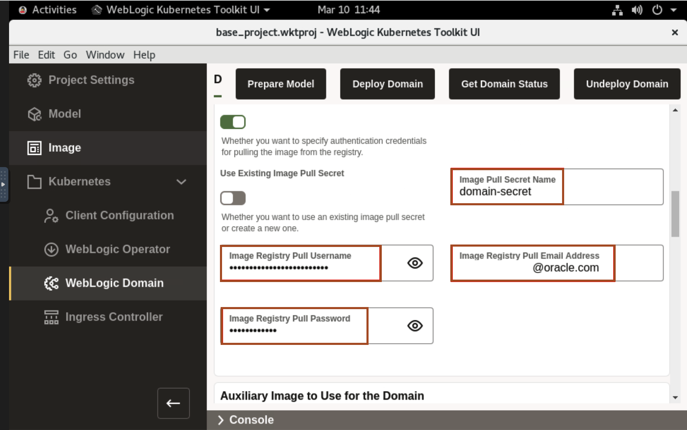
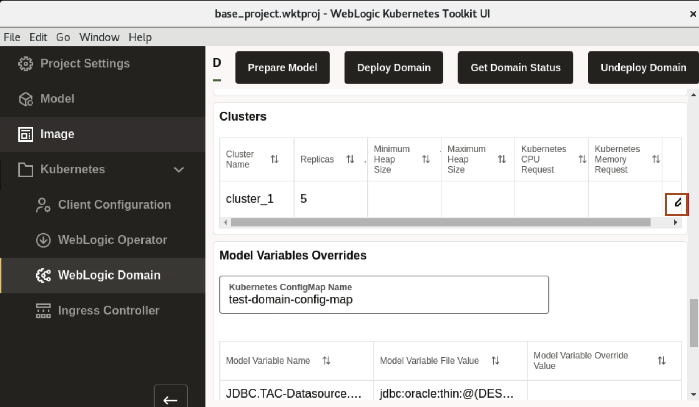
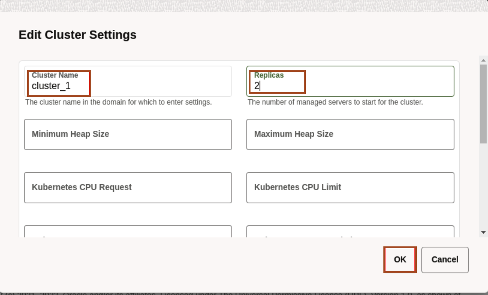
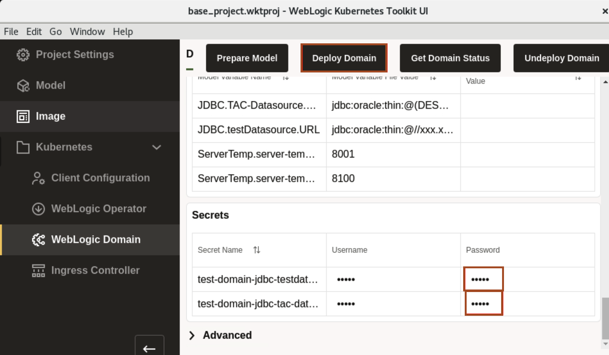
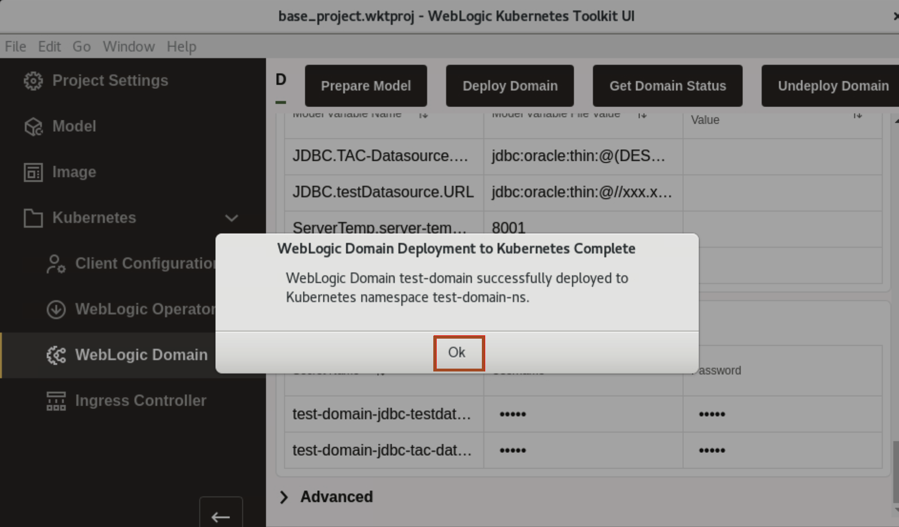
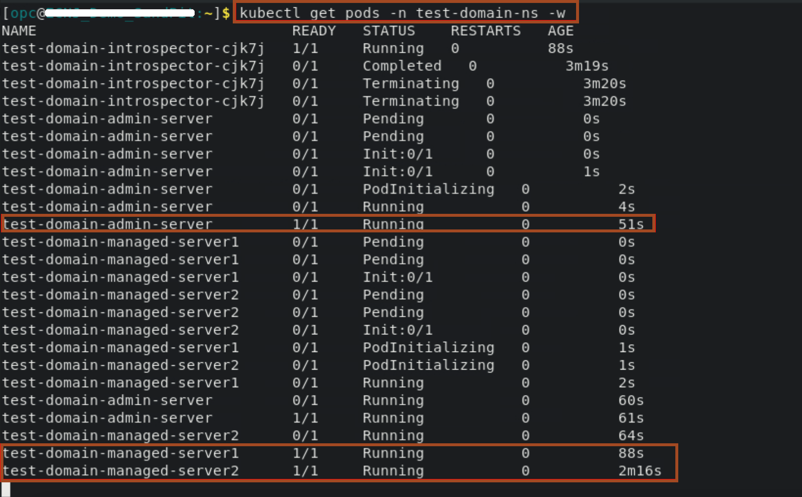
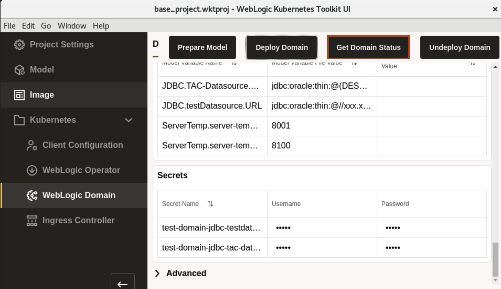
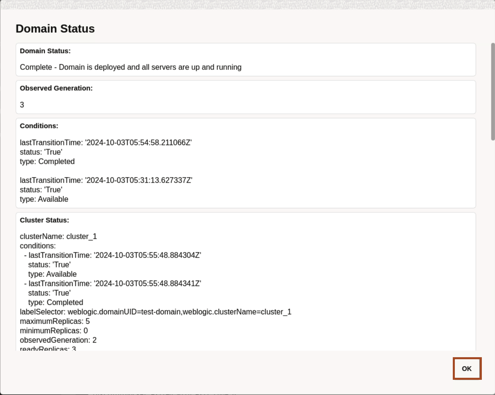

# Deployment of WebLogic Domain to the Oracle Container Engine for Kubernetes (OKE) on Oracle Cloud Infrastructure (OCI) From WebLogic Kubernetes Toolkit UI

## Introduction

In this lab, we deploy the WebLogic Domain to kubernetes cluster. In primary image section, we specify the oracle account credential. In auxiliary image section, we specify oracle cloud account credential. Here we also specify the replica for the cluster.

### Objectives

In this lab, you will:

* Deploy the WebLogic Domain to Kubernetes Cluster.

## Task 1: Deploy the WebLogic Domain to the Oracle Kubernetes Cluster

In this task, we deploy the Kubernetes custom resource for the WebLogic domain to Kubernetes Cluster.

1. Scroll down, enter the following in Primary Image section, Enter *domain-secret* as *Image Pull Secret Name*, and Use Oracle account username and password in *Image Registry Pull Username* and *Image Registry Pull Password*. Enter your Oracle email id in *Image Registry Pull Email Address*. These are the same credential which you used to accept license for *weblogic* images in Oracle Container Registry.
    
    > **For your information only:**<br>
    > We are pulling the image from the Oracle Container Registry, so we are specifying the credential, which we used to accept the license agreement for WebLogic Server Images.


2. Scroll down, in Auxiliary Image section, uncheck the box for **Specify Auxiliary Image Pull Credentials**.

3.  In *Clusters* section, click on *Edit* icon as shown.
    

4. Enter *2* as *Replicas* and then Click *OK*. The size of replica decides the number of managed server in the *Running* state after successfull deployment of WebLogic Domain to Kubernetes cluster.
    

5. In Datasources section, double click to edit *passwords* for two datasource. You can give *tiger* as password in both the datasources. Once done, click *Deploy Domain*.
    
    > This deploy WebLogic Domain test-domain to Kubernetes namespace *test-domain-ns*.

6. Once you see *WebLogic Domain Deployment to Kubernetes Complete* window, Click *OK*.
    

7. Go back to terminal, Click *Activities* and select the *Terminal* window. Copy the following command and paste it terminal. You should see the similar output, where pod for introspector run first then for the Admin Server and later pods for managed server goes in the *Running* state.

    ````bash
    <copy>kubectl get pods -n test-domain-ns -w</copy>
    ````

    

8. You can also get the domain status through *WebLogic Kubernetes Toolkit UI*. Go back to *WebLogic Kubernetes Toolkit UI* and click *Get Domain Status*.
    

9. In Domain Status window, Scroll down to see status of all server pods then click *OK*.
    


## Acknowledgements

* **Author** -  Ankit Pandey
* **Contributors** - Maciej Gruszka, Sid Joshi
* **Last Updated By/Date** - Kamryn Vinson, March 2022