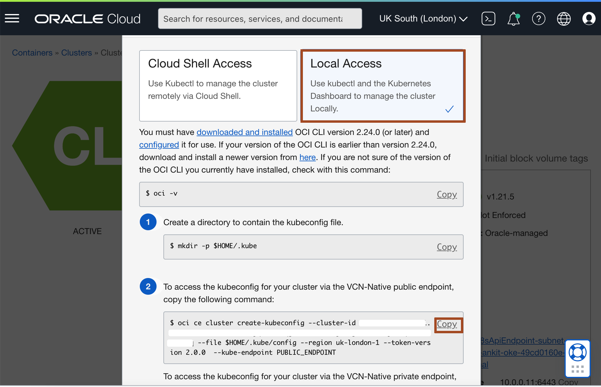
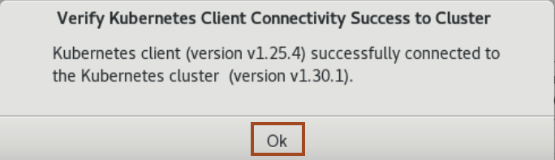
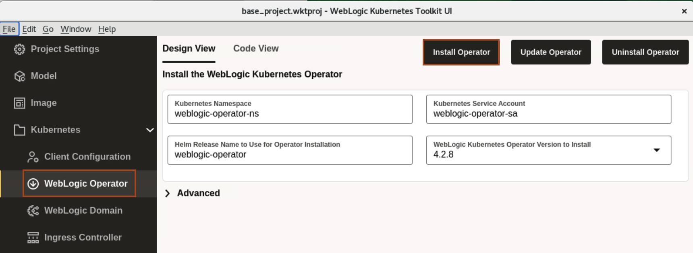

# Deployment of WebLogic Kubernetes Operator to the Oracle Container Engine for Kubernetes (OKE) on Oracle Cloud Infrastructure (OCI) From WebLogic Kubernetes Toolkit UI

## Introduction

In this lab, we authenticate OCI CLI using the browser, which will creates *.oci/config* file. As we will use kubectl to manage the cluster remotely using the *Local Access*. It needs a *kubeconfig* file. This kubeconfig file will be generated using the OCI CLI. Then we verify the connectivity to Kubernetes cluster from the WebLogic Kubernetes Toolkit UI. At last, we install the WebLogic Kubernetes Operator to Kubernetes cluster(OKE).

### Objectives

In this lab, you will:

* Configure kubectl (Kubernetes Cluster CLI) to connect to Kubernetes Cluster.
* Verify Connectivity of WebLogic Kubernetes Toolkit UI to Kubernetes Cluster.
* Install the WebLogic Kubernetes Operator to Kubernetes Cluster.

## Task 1: Configure kubectl (Kubernetes Cluster CLI) to connect to Oracle Kubernetes Cluster
In this Task, we creats the configuration file *.oci/config* and *.kube/config* in */home/opc* directory. This configuration file allow us to access Oracle Kubernetes Cluster (OKE) from this virtual machine.

1. Click *Activities* and type *Firefox* in search box. Click on the icon for *Firefox*.
    

2. Open the url [https://cloud.oracle.com](https://cloud.oracle.com). Enter your *Cloud Account Name* and then your credential for Oracle Cloud Account and click *Sign In*.

3. In the Console, select the *Hamburger Menu* -> *Developer Services* -> *Kubernetes Clusters (OKE)* as shown.
    

2. Click on the cluster name which your created in lab 3. and then click *Access Cluster*. 
    

3. Select *Local Access* and then click on *Copy* as shown.
    

4. Click on *Activities* and select the *Terminal*.
    

5. Paste the copied command in the terminal. For *Do you want to create a new config file?*, Type *y* then press *Enter*. For *Do you want to create your config file by logging in through a browser?*, Type *y* then press *Enter*.
    

6. In Firefox Browser, click on your active session.
    > You will see *Authorization Completed* as shown.
    

9. In *Enter a passphrase for your private key*, leave it empty and press *Enter*.
    

10. Use the upper arrow key to run the *oce ce ...* command again and re-run it multiple time, until you see the *New config written to the Kubeconfig file /home/opc/.kube/config*.
    

## Task 2: Verify Connectivity of WebLogic Kubernetes Toolkit UI to Oracle Kubernetes Cluster
In this task, we verify the connectivity to *Oracle Kubernetes Cluster(OKE)* from the `WebLogic Kubernetes Toolkit UI` application.

1. Go back to WebLogic Kubernetes Tool Kit UI, Click *Activities* and select the WebLogic Kubernetes Tool Kit UI window. 

2. Click  *Kubernetes* ->  *Client Configuration* and then click *Verify Connectivity*.
    

3. Once you see *Verify Kubernetes Client Connectivity Success* window, Click *Ok*.
    

## Task 3: Install the WebLogic Kubernetes Operator to Oracle Kubernetes Cluster
This section provides support for installing the WebLogic Kubernetes Operator (the “operator”) in the target Kubernetes cluster. 

1. Click *WebLogic Operator*. Specify the following configuration details  and click *Install Operator*.

    **Kubernetes Namespace** - The Kubernetes namespace to which to install the operator. Leave the default value. 
    **Kubernetes Service Account** - The Kubernetes service account for the operator to use when making Kubernetes API requests. Leave the default value. 
    **Helm Release Name to Use for Operator Installation** - The Helm release name to use to identify this installation. Leave the default value. 

     
    
    > **For your information only:** 
    > !By default, the operator’s *Image Tag to Use* field is set to the image tag corresponding to the latest operator release version on the GitHub Container Registry. 
    > The operator needs to know which WebLogic domains in the Kubernetes cluster that it will manage. It does this at the Kubernetes namespace level, so any WebLogic domain in a Kubernetes namespace the operator is configured to manage, will be managed by the operator instance being installed. 
    > For *Kubernetes Namespace Selection Strategy* field, we select *Label Selector*, which means any Kubernetes namespace with a *weblogic-operator=enabled* label will be managed by this operator. 
    
   
    > By enabling Enable Cluster Role Binding, the operator installation will create a Kubernetes ClusterRole and ClusterRoleBinding that the operator will use for all managed namespaces. 
    > By default, the operator’s REST API is not exposed outside the Kubernetes cluster. To enable the REST API to be exposed, you can enable *Expose REST API Externally*.
    [Role Binding](images/role-binding.png) 
    
    > This pane lets you override the operator’s Java logging configuration, which can be useful when debugging issues with the operator. 
     
   
    > For more information on *WebLogic Kubernetes Operator Image*, *Kubernetes Namespace Selection Strategy*, *WebLogic Kubernetes Role Bindings*, *External REST API Access*, *Third Party Integrations* and *Java Logging*, see the [WebLogic Kubernetes Operator](https://oracle.github.io/weblogic-toolkit-ui/navigate/kubernetes/k8s-wko/) documentation.

2. Once you see *WebLogic Kubernetes Operator Installation Complete*, Click *Ok*.
    

## Acknowledgements

* **Author** -  Ankit Pandey
* **Contributors** - Maciej Gruszka, Sid Joshi
* **Last Updated By/Date** - Kamryn Vinson, March 2022