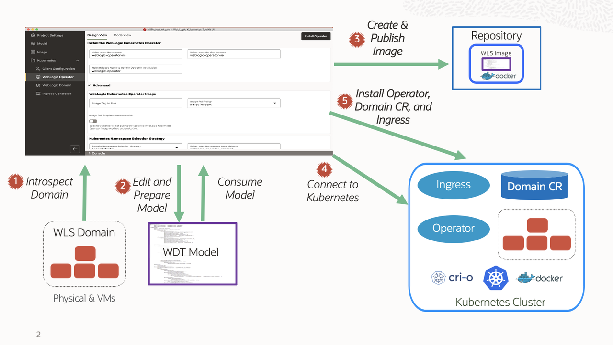

# Introduction

## About this Workshop

This workshop shows an end to end migration of an on-premise WebLogic Server Domain into the containers and makes it runable in OCI with Oracle Container Engine for Kubernetes (OKE). We demonstrate the graphical interface of WebLogic Kubernetes Toolkit UI as well as WebLogic Deployer Tool and Weblogic Kubernetes Operator. We demonstrate how the migration process could be simplified and accelerated by using a DevOps-oriented set of tooling.

### About Product/Technology

The WebLogic Kubernetes Toolkit (WKT) is a collection of open source tools that help you provision WebLogic-based applications to run in Linux containers on a Kubernetes cluster. WKT includes the following tools: 

* [WebLogic Deploy Tooling (WDT)](https://github.com/oracle/weblogic-deploy-tooling) - A set of single-purpose, lifecycle tools that operate off of a single metadata model representation of a WebLogic domain.
* [WebLogic Image Tool (WIT)](https://github.com/oracle/weblogic-image-tool) - A tool for creating Linux container images for running WebLogic domains.
* [WebLogic Kubernetes Operator (WKO)](https://github.com/oracle/weblogic-kubernetes-operator) - A Kubernetes operator that allows WebLogic domains to run natively in a Kubernetes cluster.

The WKT UI provides a graphical user interface that wraps the WKT tools, Docker, Helm, and the Kubernetes client (kubectl) and helps guide you through the process of creating and modifying a model of your WebLogic domain, creating a Linux container image to use to run the domain, and setting up and deploying the software and configuration necessary to deploy and access the domain in your Kubernetes cluster.

### Objectives

* Creation of Virtual Machine From Marketplace image
* Set up an Oracle Kubernetes Engine Instance on the Oracle Cloud Infrastructure
* Modifying a WKT UI Project and Creation of Model file
* Creation of Auxiliary Image and Pushing it in Oracle Container Image Registry
* Deploy WebLogic Operator to Oracle Kubernetes Cluster (OKE)
* Deploy WebLogic Domain to Oracle Kubernetes Cluster (OKE)
* Deploy Ingress Controller to Oracle Kubernetes Cluster (OKE)
* Showing Load balancing between Managed Server pods and exploring WebLogic-Remote-Console
* Scale a WebLogic Cluster
* Update a deployed application by a rolling restart of the new image

           

## Learn More

* [WebLogic Kubernetes Toolkit UI](https://oracle.github.io/weblogic-toolkit-ui/)

## Acknowledgements

* **Author** -  Ankit Pandey
* **Contributors** - Maciej Gruszka, Sid Joshi
* **Last Updated By/Date** - Kamryn Vinson, April 2022