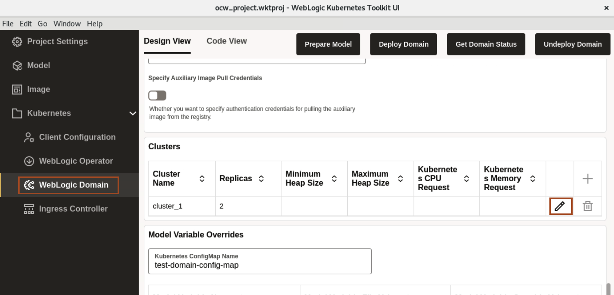
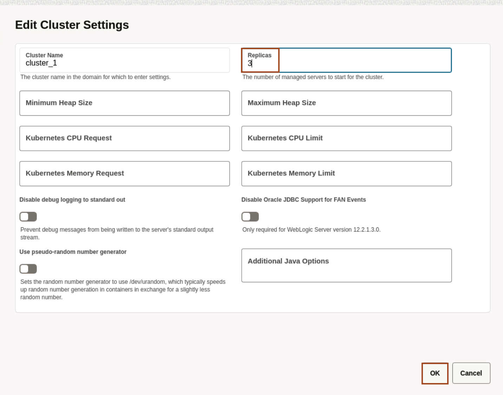
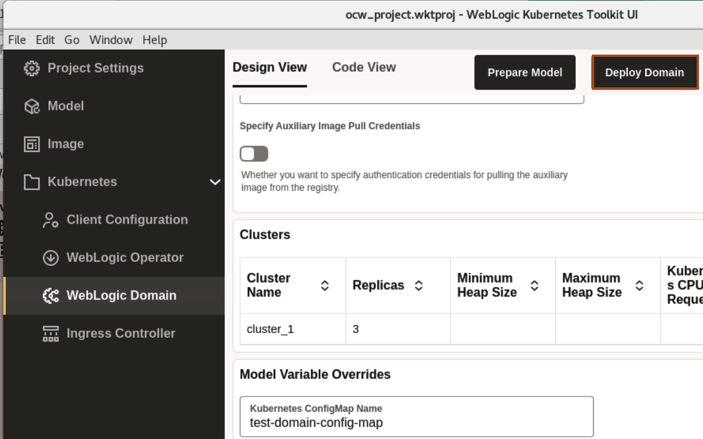
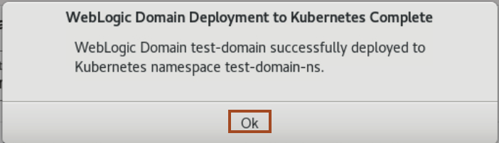
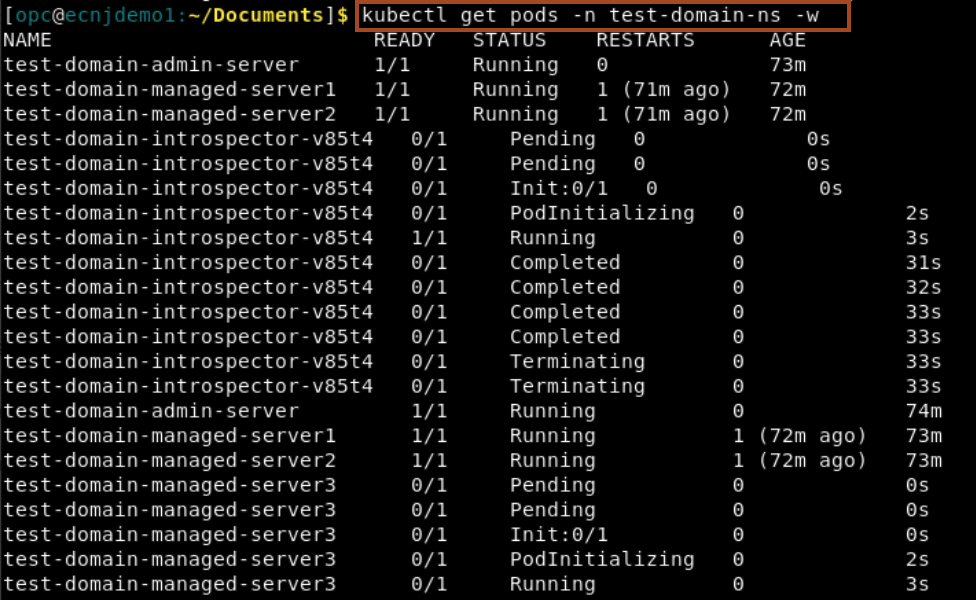
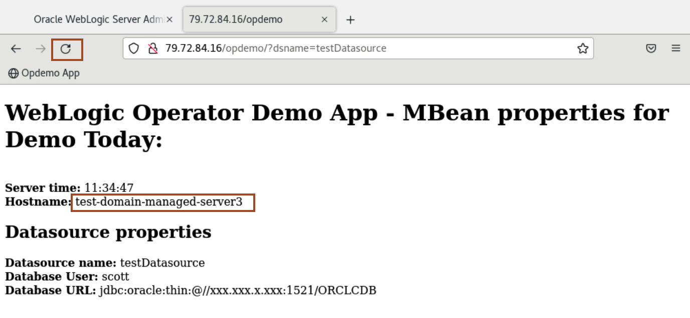
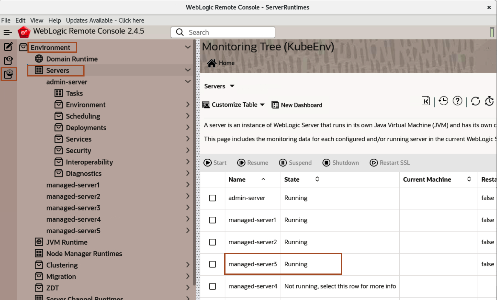

# Scale a WebLogic Cluster (Optional) 

## Introduction

In this lab, we scale a WebLogic Cluster. Here, we modify the value to **3** and re-deploy the domain.

Estimated Time: 5 minutes

Watch the video below for a quick walk-through of the lab.
[Scaling a WebLogic Cluster](videohub:1_mcl3p6td)

### Objectives

In this lab, you will:

* Scale a WebLogic Cluster.


## Task 1: Scaling a WebLogic Cluster using WebLogic Kubernetes Toolkit UI

In this task, you just need to modify the **Replica** value from 2 to 3 and re-deploy the domain again. 

1. Go back to WebLogic Kubernetes Toolkit UI, and Click **WebLogic Domain**. Go to the **Clusters** section and click on the **Edit** icon.  
 

2. Change the Replicas from **2** to **3**, and click **OK**. 
 

3. To Re-deploy the domain, click **Deploy Domain**.
 

4. Once you see **WebLogic Domain Deployment to Kubernetes Complete** window, click **Ok**.
 

5. Go back to **Terminal** window, Click **Activities** and select the **Terminal** window. Copy the following command and paste in the terminal.
 ```bash
    <copy>kubectl get pods -n test-domain-ns -w</copy>
 ```
 
    > You can see, that the re-deployment of the domain starts the introspection job, which starts the process of creating a pod for test-domain-managed-server3 and in some time, this pod gets into **Running** status.

6. Go back to the browser, where you have the application page open. Click the Refresh button, you will see the load balancing between three managed servers now.
 

7. Go back to WebLogic Remote Console, and click on **Monitoring Tree** -> **Environment** -> **Servers**. You will notice managed-server3 here also.
 


## Acknowledgements

* **Author** -  Ankit Pandey
* **Contributors** - Sid Joshi , Maciej Gruszka, 
* **Last Updated By/Date** - Ankit Pandey, July 2024