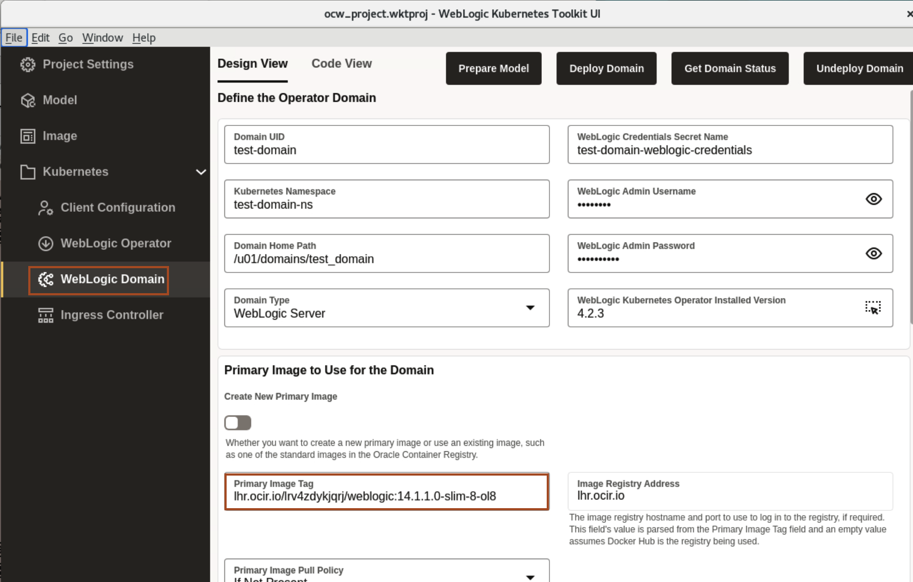
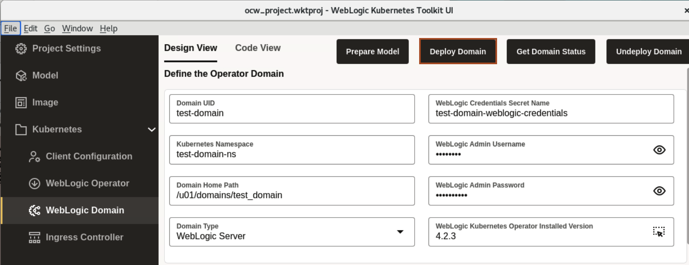
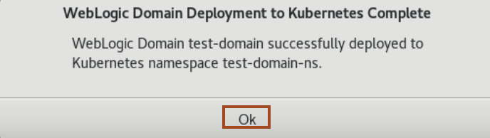
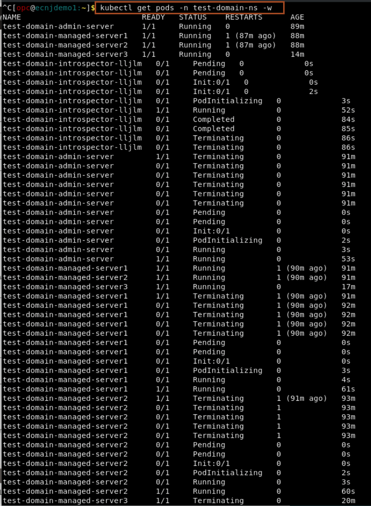
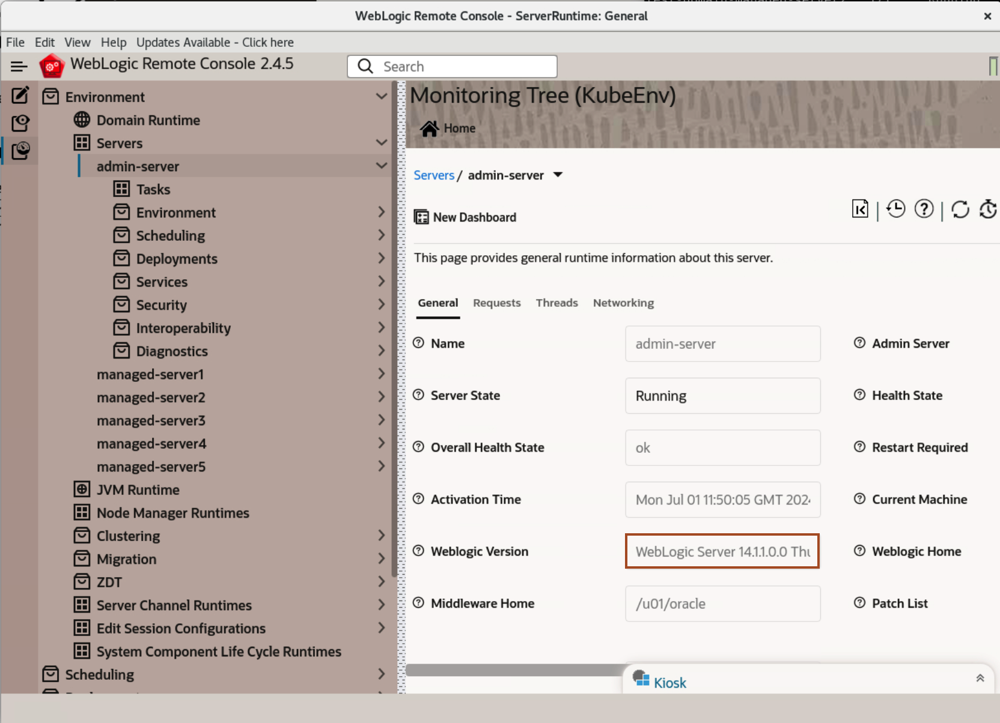

# Make an upgrade in WebLogic Server Version (Optional) 

## Introduction

In this lab, we modify the primary image, we use WebLogic Server Image with **14.1.1.0-slim-8-ol8** tag. Then we redeploy the domain using WebLogic Kubernetes Toolkit UI. At last, we verify that newly managed server pods are using the updated WebLogic Server images through WebLogic Remote Console.

Estimated Time: 10 minutes

Watch the video below for a quick walk-through of the lab.
[Upgrade WebLogic Server Version](videohub:1_5vonezmn)

### Objectives

In this lab, you will:

* Use WebLogic Server Image (14.1.1.0-slim-8-ol8) as Primary Image.
* Redeploy WebLogic Domain.

### Prerequisites

* Access to noVNC Remote Desktop.

## Task 1: Enter the detail of the new WebLogic Server Image as Primary Image

In this task, we update the primary image to use the upgraded WebLogic Server 14.1.1.0-slim-8-ol8 image.

1. Go back to WebLogic Kubernetes Toolkit UI, and click **WebLogic Domain**. Change the WebLogic Server Tag to **14.1.1.0-slim-8-ol8**.

      ```bash
         <copy>14.1.1.0-slim-8-ol8</copy>
      ```
      

## Task 2: Update a deployed application by a rolling restart of the server pods

In this task, we redeploy the WebLogic Domain. Later, we use the WebLogic Remote Console, to verify that server pods are using the updated WebLogic Server 14.1.1.0-slim-8-ol8 Image.

1. Click **Deploy Domain**. This will redeploy the domain.
 
    > **For your information only:**<br>
    > As we changed our primary image, so we will notice a rolling restart of the servers one by one. As you click on **Deploy Domain**, it starts an **Introspector job**, which terminates the running admin server pods, and creates a new pod for the admin server which uses WebLogic Server 14.1.1.0-slim-8-ol8 image. Introspector does the same process with both the managed servers.

2. Once you see **WebLogic Domain Deployment to Kubernetes Complete** window, Click **Ok**.
 

3. Go back to **Terminal** copy the below command and paste it into the terminal. You will notice a rolling restart of servers one by one. First, Admin Server pods terminate and come in a **Running** state.
      ```bash
         <copy>kubectl get pods -n test-domain-ns -w</copy>
      ```
      

4. To Verify that the Admin Server and Managed Server pods are using the updated WebLogic Server image, click the Monitoring Tree icon and then select **Environment** -> **Servers** -> **admin-server**. You can see, it is using 14.1.1.0.
 

      Congratulation !!!

      This is the end of the workshop.

      We hope you have found this workshop useful.

## Acknowledgements

* **Author** -  Ankit Pandey
* **Contributors** - Sid Joshi , Maciej Gruszka, 
* **Last Updated By/Date** - Ankit Pandey, July 2024