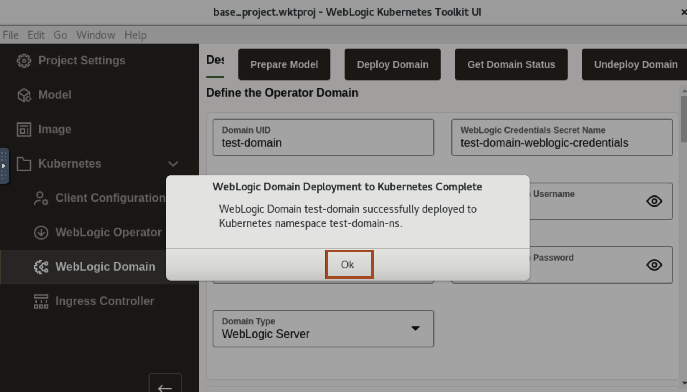
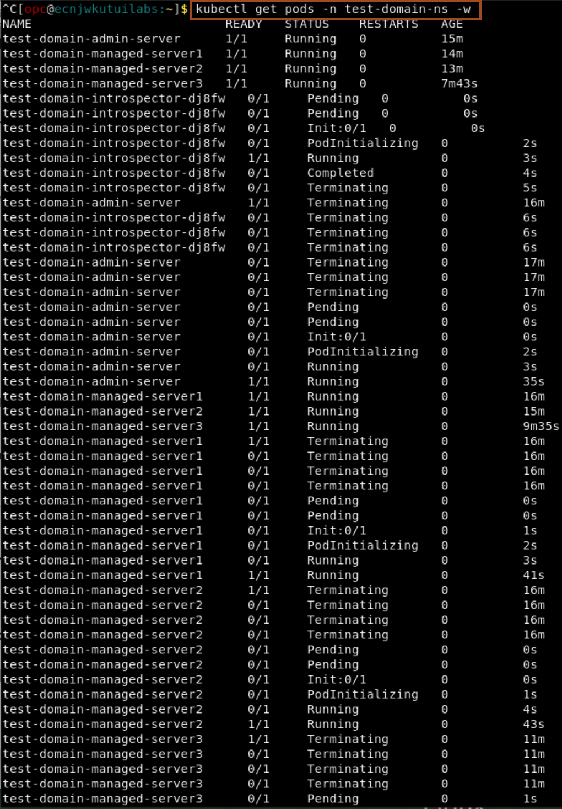

# Using the Upgrade WebLogic Server Image as Primary Image 

## Introduction

In this lab, we modify the primary image, we use WebLogic Server Image with *12.2.1.4-slim-ol8* tag. Then we re-deploy the domain using WebLogic Kubernetes Toolkit UI. At last, we verify that newly managed server pods are using the updated WebLogic Server images through WebLogic Remote Console.

### Objectives

In this lab, you will:

* Use WebLogic Server Image (12.2.1.4) as Primary Image.
* Redeploy WebLogic Domain.

### Prerequisites

* Access to noVNC Remote Desktop created in lab 1.

## Task 1: Enter detail of new WebLogic Server Image as Primary Image

In this task, we update the primary image to use upgraded WebLogic Server 12.2.1.4.0 image.

1. Go back to WebLogic Kubernetes Toolkit UI, click *Image*. Changed the WebLogic Server Tag to *12.2.1.4-slim-ol8*.
    

## Task 2: Update a deployed application by a rolling restart of the server pods

In this task, we re-deploy the WebLogic Domain. Later, we use the WebLogic Remote Console, to verify that server pods are using the updated WebLogic Server 12.2.1.4.0 Image.

1. Click *WebLogic Domain* -> *Deploy Domain*. This will re-deploy the domain.
    
    > **For your information only:**<br>
    > As we changed our primary image, so we will notice rolling restart of the servers one by one. As you click on *Deploy Domain*, it start an *Introspector job*, which terminates the running admin server pods, and creates a new pod for admin server which uses WebLogic Server 12.2.1.4.0 image. Introspector do the same process with both the managed servers.

2. Once you see *WebLogic Domain Deployment to Kubernetes Complete* window, Click *Ok*.
    

3. Go back to *Terminal* and copy the below command and paste in terminal. You will notice rolling restart of servers one by one. First, Admin Server pods terminates and comes in *Running* state.
    ```bash
    <copy>kubectl get pods -n test-domain-ns -w</copy>
    ```
    

4. To Verify that Admin Server and Managed Server pods are using updated WebLogic Server image, click Monitoring Tree icon and then select Running Servers -> admin-server. You can see, it is using 12.2.1.4.0.
    

Congratulation !!!

This is the end of the workshop.

We hope you have found this workshop useful.

## Acknowledgements

* **Author** -  Ankit Pandey
* **Contributors** - Maciej Gruszka, Sid Joshi
* **Last Updated By/Date** - Ankit Pandey, May 2022