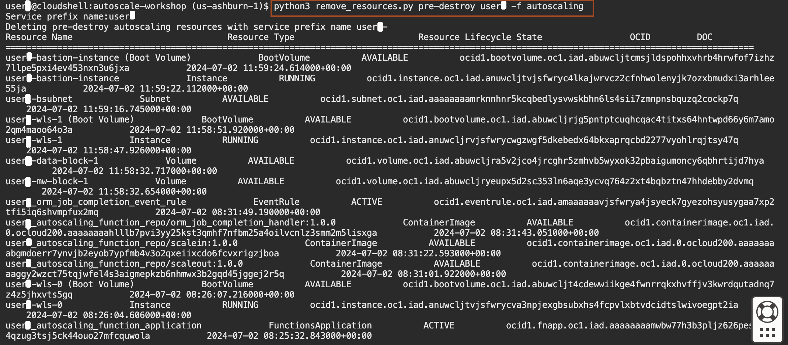
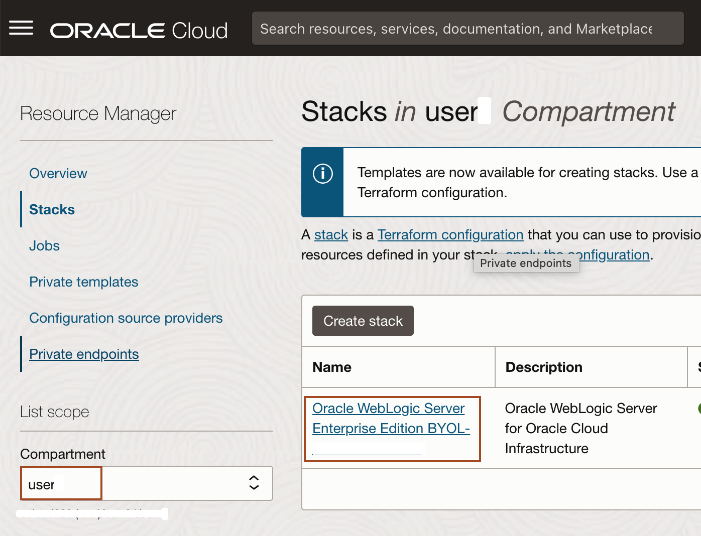
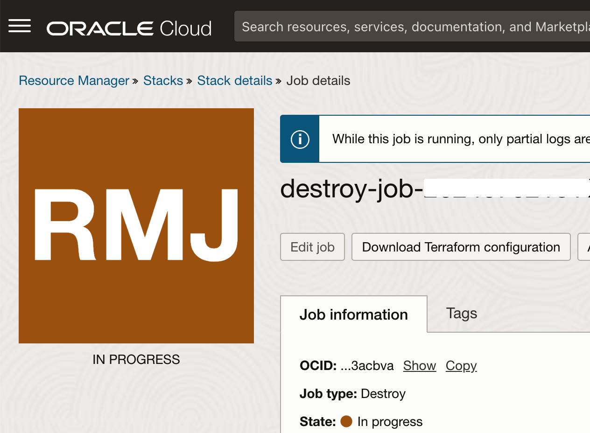
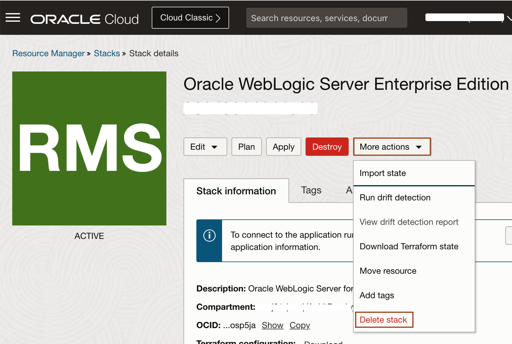

# Clean up the OCI resources

## Introduction

This lab will walk you through the process of deleting autoscaling resources and destroying the stack resources associated with your WebLogic for OCI stack. 

Estimated Time: 10 minutes

### Objectives

In this lab, you will:

* Delete Autoscaling Resources
* Destroy Stack Resources and delete stack


### Prerequisites
This lab assumes you have the following:

* An Oracle Cloud account
* Created Stack: Oracle WebLogic Server Enterprise Edition BYOL


## Task 1: Delete Autoscaling Resources

The autoscaling resources, Functions, Event Rule, and Notification Subscriptions are created using Oracle Cloud Infrastructure SDK APIs from WebLogic Administration instance during provisioning. So, you must destroy these autoscaling resources before destroying the stack. In this task, we destroy the Autoscaling resources within the Oracle Cloud Infrastructure.

1. Copy and paste the following command in the text file and replace **`RESOURCE_PREFIX`** with your resource prefix. Then, run the command in Cloud Shell to destroy autoscaling resources using remove_resources.py script.
      ```bash
      <copy>cd ~/autoscale-workshop
      python3 remove_resources.py pre-destroy RESOURCE_PREFIX -f autoscaling</copy>
      ```

2. Paste the modify command in the Cloud Shell as shown.
 


## Task 2: Destroy Stack Resources and delete stack

In this task, we create the destroy job which deletes the OCI resources created by the stack. Later, we delete the stack.

1. In OCI Console, Click **Hamburger menu** -> **Developer Services** -> **Stacks**.
 

2. Select your compartment and click on the Stack name you created in lab 2 as shown below.
 

3. In the Stack Details page, click **Destroy**, It will open a page, Click **Destroy** on this page as shown.
 

4. You will see **destroy job** is created and moved to **IN PROGRESS** state.
 

    > Wait till you see Job state changes to **SUCCEEDED**
    
5. Once you see the Job status as **SUCCEEDED**, Click **Stack details** as shown.
 

6. Click **More actions** -> **Delete stack** to delete the stack. Click **Delete**.
 


Congratulation !!!

This is the end of the workshop.

We hope you have found this workshop useful.


## Acknowledgements

## Acknowledgements
* **Author** -  Ankit Pandey
* **Contributors** - Adrian Padilla Duarte , Sid Joshi
* **Last Updated By/Date** - Ankit Pandey, July 2024