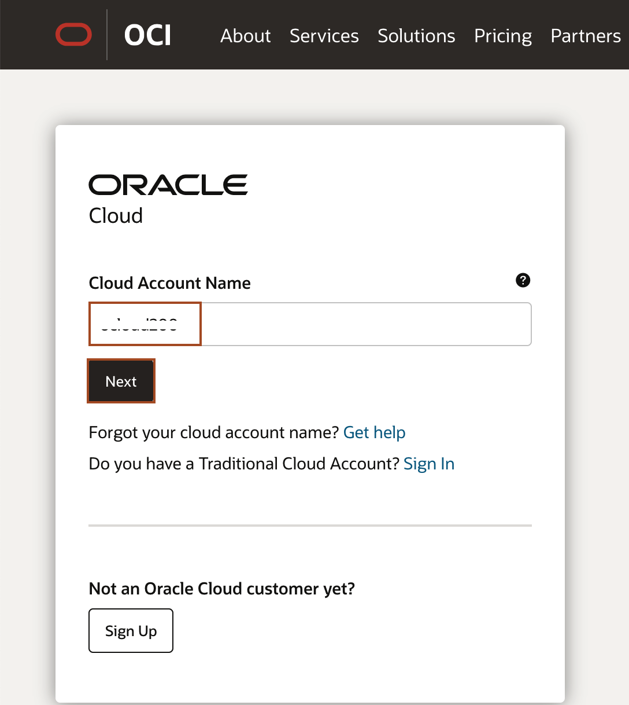
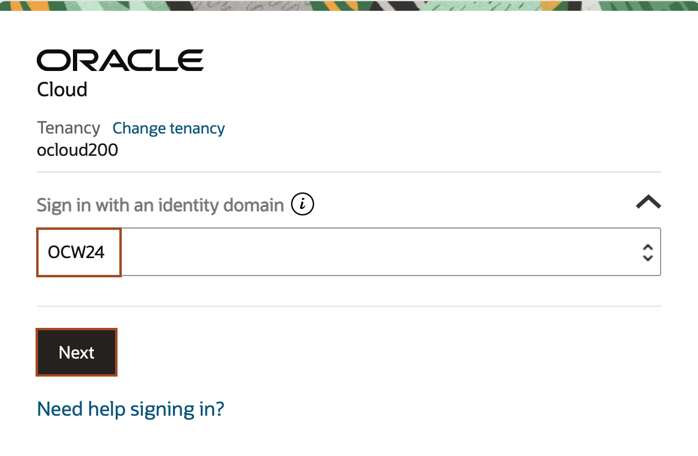
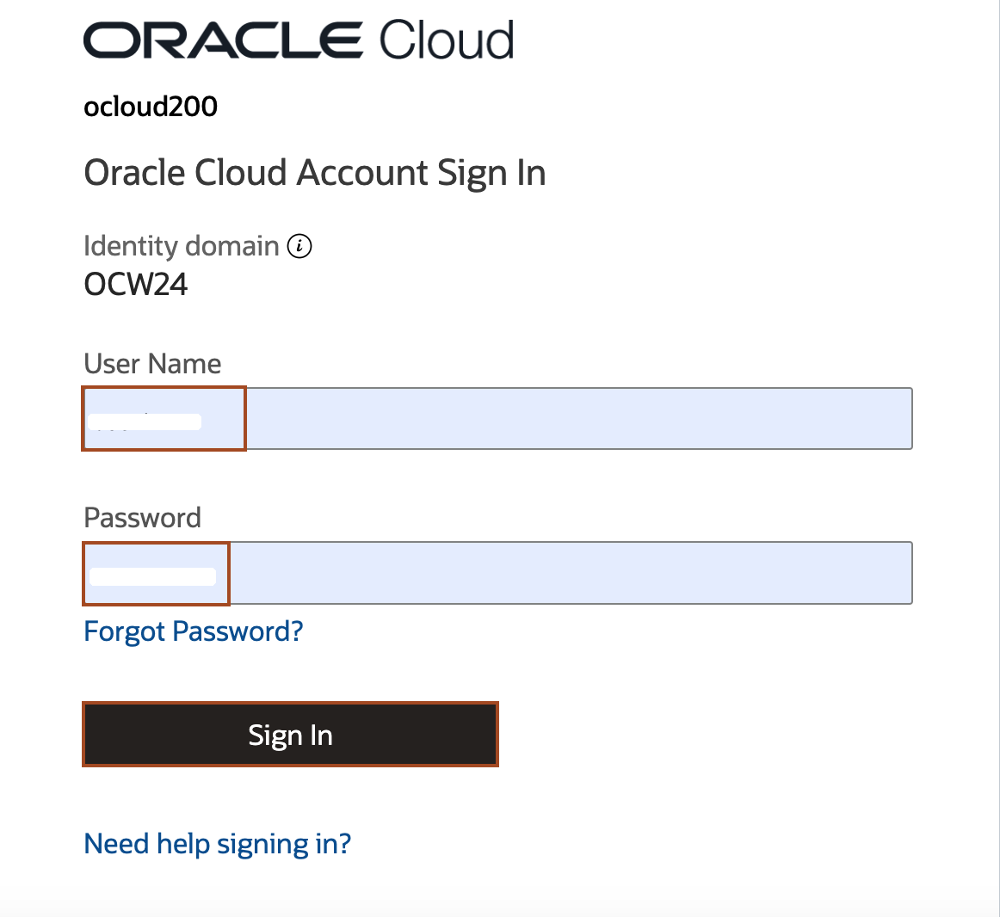

# Get started -Cloud login

## Introduction
Oracle Cloud is the industry's broadest and most integrated cloud provider, with deployment options ranging from the public cloud to your data center. Oracle Cloud offers best-in-class services across Software as a Service (SaaS), Platform as a Service (PaaS), and Infrastructure as a Service (IaaS).

Estimated Time: 05 minutes

### Objectives
* Learn how to log in to your Oracle Cloud Account

### Prerequisites
The cloud environment & credential provided by lab instructor:
* Cloud Account Name/Tenancy
* Username: userX
* Password: xxxx
* WebLogic Password: xxxx

## Task 1: Log in to Oracle Cloud 

In this task, you will login to Oracle Cloud console using the credentials shared with you.

1. Go to [cloud.oracle.com](https://cloud.oracle.com/) and enter your Cloud Account Name and click Next. You should have received the Cloud account name from your lab instructor.
   

2. From the dropdown, select **OCW24** as **Sign in with an identity domain** and then click **Next**. 
   

3. Enter the **User Name** and **Password** shared with you by your HOL lead and click **Sign In**. You should have received the Username and Password from your lab instructor.
   

You may now proceed to the next lab.

## Acknowledgements
* **Author** -  Ankit Pandey
* **Contributors** - Adrian Padilla Duarte , Sid Joshi
* **Last Updated By/Date** - Ankit Pandey, July 2024
