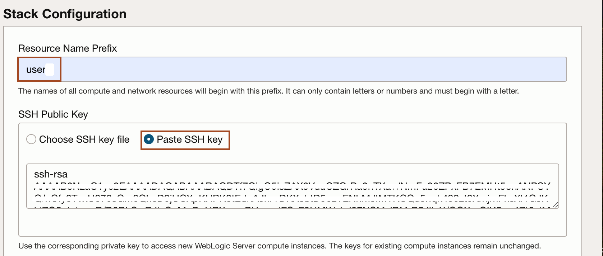
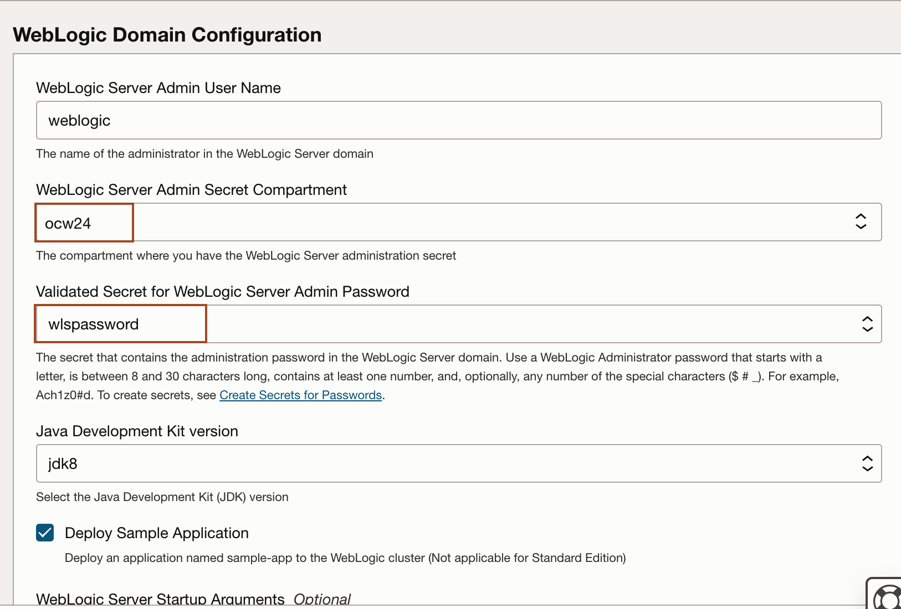
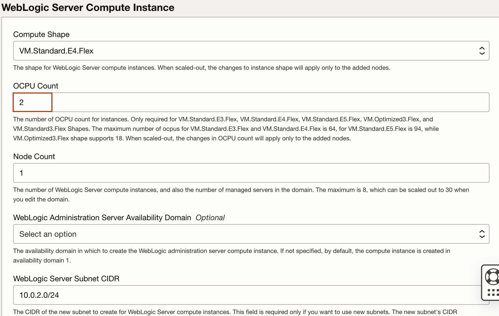
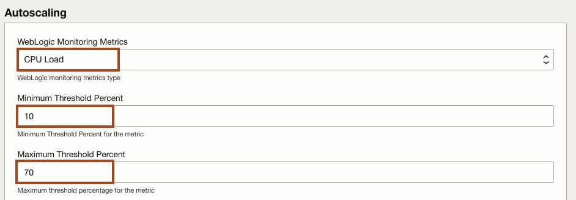
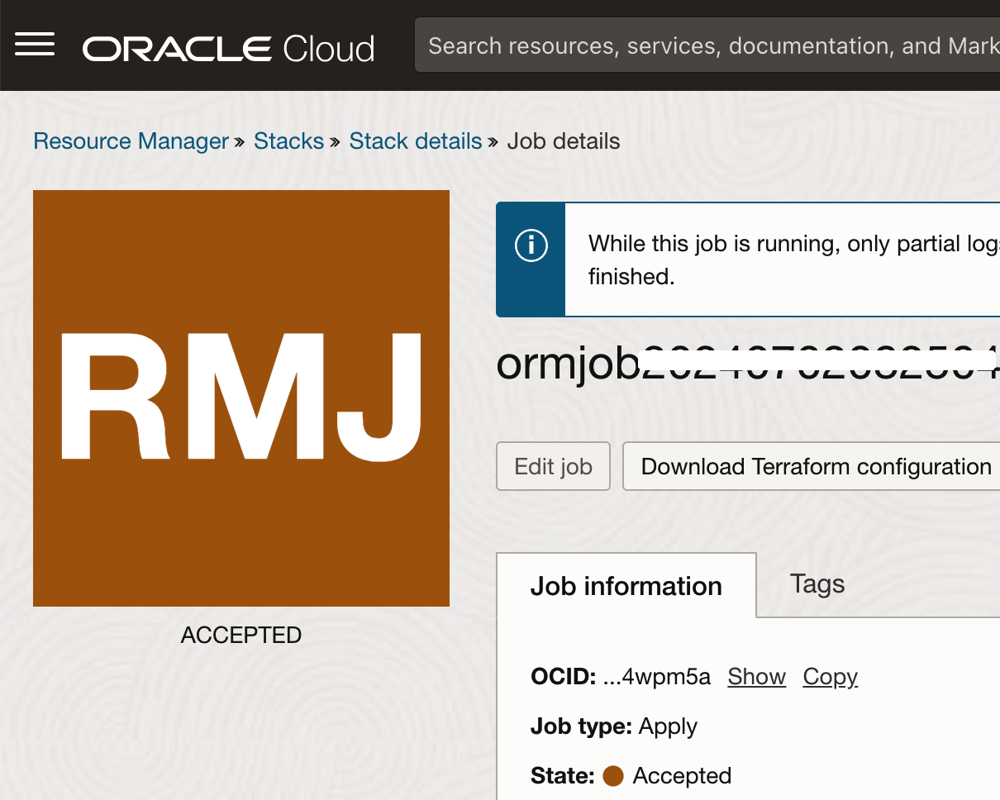

# Create a WebLogic for OCI stack from the Marketplace

## Introduction

Setting up the Oracle WebLogic Server Enterprise Edition BYOL stack in Oracle Cloud Infrastructure (OCI) involves several key steps. This guide will help you create the stack, validate its deployment, and extract essential IP addresses for the Bastion, Load Balancer, and WebLogic Server (WLS) Node. These steps are crucial for ensuring a functional and accessible WebLogic environment.

Estimated Time: 15 minutes

### Objectives

In this lab, you will:
* Create Stack: Oracle WebLogic Server Enterprise Edition BYOL
* Validate the stack and copy the IP of BASTION, LOAD BALANCER and WLS NODE

### Prerequisites
This lab assumes you have:

* An Oracle Cloud account
* You have generated the pair of SSH keys.
* You have completed: **Lab: Prepare Setup**

## Task 1: Create Stack: Oracle WebLogic Server Enterprise Edition BYOL

In this task, we create WebLogic for OCI stack using **Oracle WebLogic Server Enterprise Edition BYOL** image in the OCI Marketplace.

1. In the new tab, open the [OCI Console](http://cloud.oracle.com). In OCI Console, click **Hamburger menu** -> **Marketplace** -> **All Applications**.
    

2. Type **WebLogic** in the search box and then click **Oracle WebLogic Server Enterprise Edition BYOL** as shown below.
    

3.  Select the latest version available and choose your compartment and check the box for accepting the terms and condition. Click **Launch Stack**.
    

4. In **Stack information** section, leave everything default and click **Next**.
    

5. Enter your username as **Resource Name Prefix** and Click **Paste SSH key** and paste the content of **id_rsa.pub** file as shown below.
    
    > Make sure you use your username as prefix, as we will use this in further labs.

6. Check the box for the **OCI Policies**, **Create a Virtual Cloud Network**, **Provision Load Balancer**, **Enable Exporting Logs to OCI Logging Service**, **Enable Application Performance Monitoring**, **Enable Autoscaling** as shown below.
    

7. In **Virtual Cloud Networking** section, enter the name for Virtual Cloud Networking Name as shown below.
    

8. In **WebLogic Domain Configuration** section, select the secret where we have stored the WebLogic Admin Server Password in **Validated Secret for WebLogic Server Admin Password** and leave other defaults as shown below.
    

9. In **WebLogic Server Compute Instance** section, select any availability domain in **WebLogic Administration Server Availability Domain** and leave other defaults as shown below.
    

10. In **Bastion Instance** section, check the box for **Assign Reserved Public IP to Bastion Instance** and leave other defaults as shown below.
    

11. In **Load Balancer** section, keep the defaults as shown below.
    

12. In **Application Performance Monitoring** section, select the apm domain we created in lab 1 for **Application Performance Monitoring Domain** and leave other defaults as shown below. 
    

13. In **Autoscaling** section,select the following values as shown below.  
    **WebLogic Monitoring Metrics**:    CPU Load 
    **Minimum Threshold Percent**:      10 
    **Maximum Threshold Percent**:      60 
    **Registry User Name**:             tenancynamespace/username 
    **Validated Secret for OCIR Auth Token**: secret for auth token created in lab 1 
    **Notification Email**:             email id where you want to receive the notification 
    
    

14. Click **Next**.
    

15. Review the stack information and click **Create**.
    

    > This will start a job as shown below.
        
        You will also receive notification from OCI for subscription confirmation as shown below. Click **confirm subscription** as shown below.
        
        You will see the following messages for subscription confirmation.  
        

## Task 2: Validate the stack and copy the IP of BASTION, LOAD BALANCER and WLS NODE

In this task, we verify the creation of the stack and save IP of Bastion, Load Balancer and WebLogic Node. We will use Bastion IP to connect to WebLogic Node from the Cloud Shell and WebLogic Node IP will be used to deploy the sample application **RCMWeb** to WebLogic Cluster later. 

1. Once you see the screen similar to below, it means your stack is successfully created.Click **Stack details** as shown below. 
    

2. In the stack details page, click on **Application information** tab as shown below.
    

3. From **WebLogic** section, copy the IP for WebLogic Server node from the **WebLogic Server Administration Console:** URL. for example in my case, IP is **10.0.2.202**. Also copy the IP for Load Balancer as shown below.
    

4. Copy the public IP for Bastion node as shown below.
    

You may now proceed to the next lab.

## Acknowledgements

* **Author** -  Ankit Pandey
* **Contributors** - Sid Joshi, Maciej Gruszka
* **Last Updated By/Date** - Ankit Pandey, June 2024