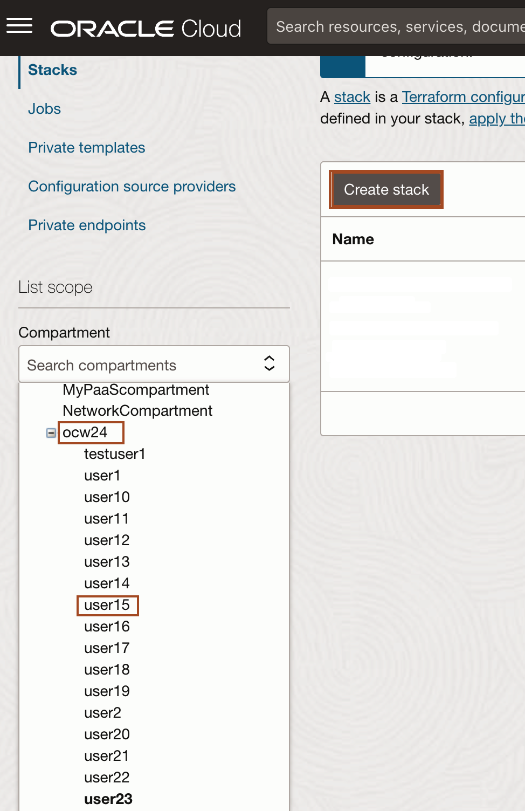
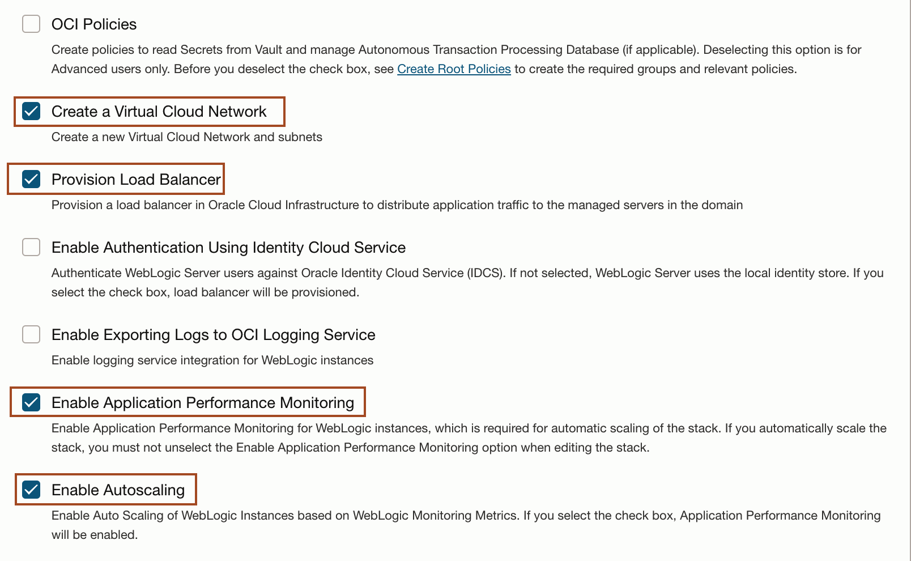
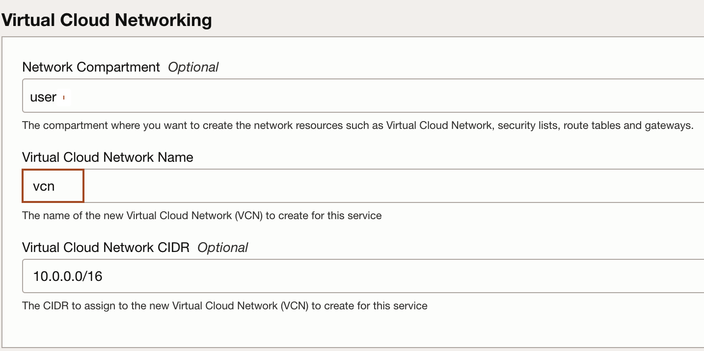
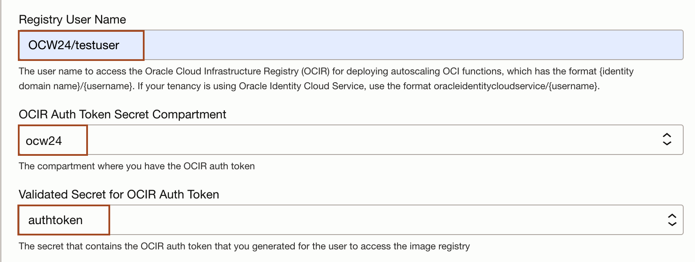
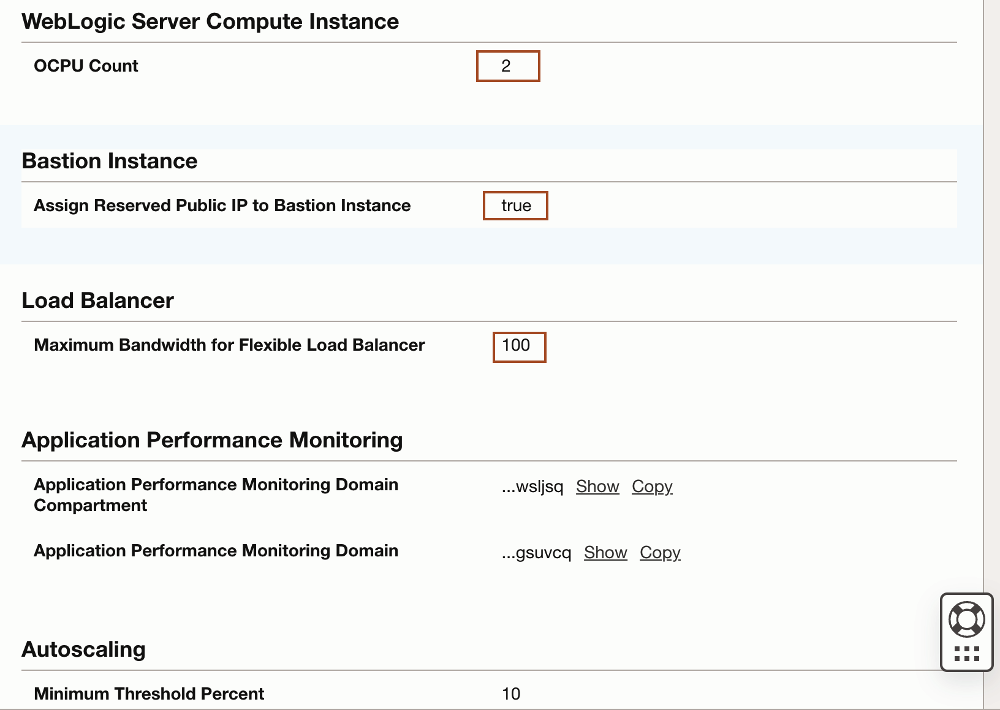

# Create a WebLogic for OCI stack from the Marketplace

## Introduction

Setting up the Oracle WebLogic Server Enterprise Edition BYOL stack in Oracle Cloud Infrastructure (OCI) involves several key steps. This guide will help you create the stack, download and configure JMeter within the Cloud Shell environment, and obtain the load-generating configuration file. These preparations are essential for effectively simulating and observing autoscaling behavior.

Estimated Time: 15 minutes

### Objectives

In this lab, you will:
* Create Stack: Oracle WebLogic Server Enterprise Edition BYOL
* Download and configure the JMeter for the Cloud Shell
* Download Load generatings configuration file

### Prerequisites
This lab assumes you have:

* An Oracle Cloud account.
* This lab requires completion of all of the preceding labs.

## Task 1: Create Stack: Oracle WebLogic Server Enterprise Edition BYOL

In this task, we create WebLogic for OCI stack using **Oracle WebLogic Server Enterprise Edition BYOL** image in the OCI Marketplace.

1.  Click on the link below to download the Resource Manager zip file you need to build your environment.

    - [wlsoci-resource-manager-ee-byol-mp-14.1.1.0.240416-24.2.1-240418031026.zip](https://github.com/oracle-quickstart/oci-weblogic-server/releases/download/v24.2.1/wlsoci-resource-manager-ee-byol-mp-14.1.1.0.240416-24.2.1-240418031026.zip)

2.  Save in your downloads folder.

3. Open a new tab in the browser, and then copy and paste the below URL in the URL bar. You will use this tab for navigating the OCI console.
    ```bash
    <copy>https://cloud.oracle.com/</copy>
    ```

4. Open up the hamburger menu in the top left corner. Click **Developer Services** -> **Stacks** as shown below. 
    
    
5. Select the **comparment** which has same name as **your username**. For example if your username is user1, then select user1 as your compartment. Click **Create Stack**.
    

6. Select **My Configuration**, choose the **.Zip** file button, click the **Browse** link, and select the zip file that you downloaded or drag-n-drop for the file explorer. Click **Next**.
    

7. Enter your username as **Resource Name Prefix**. For example, if your username is user1, then enter user1 as your Resource Name Prefix. Select **Paste SSH key** and paste the content of **id_rsa.pub** file as shown below. 
    

8. *Uncheck* the box for **OCI Policies** and *Check* the box for the **Create a Virtual Cloud Network**, **Provision Load Balancer**, **Enable Application Performance Monitoring**, **Enable Autoscaling** as shown below.
    
    

9. In **Virtual Cloud Networking** section, enter **vcn** in the Virtual Cloud Networking Name as shown below. 
    
   

10. In **WebLogic Domain Configuration** section, select the secret already pre-created. Select **ocw24** in compartment and **wlspassword** in **Validated Secret for WebLogic Server Admin Password** and leave other defaults as shown below. It will be same for every user.
    

11. In **WebLogic Server Compute Instance** section, enter **2** as **OCPU Count** and leave other defaults as shown below.
    

12. In **Bastion Instance** section, check the box for **Assign Reserved Public IP to Bastion Instance** and leave other defaults as shown below.
    

13. In **Load Balancer** section, change **Maximum Bandwidth for Flexible Load Balancer** to **100** and  keep other defaults as shown below.
    

14. In **Application Performance Monitoring** section select **ocw24** compartment and **user2apm** as apm domain, leave other defaults as shown below 
    

15. In **Autoscaling** section,select the following values as shown below. </br>
    **WebLogic Monitoring Metrics**:    CPU Load</br>
    **Minimum Threshold Percent**:      10</br>
    **Maximum Threshold Percent**:      80</br>
    **Registry User Name**:             OCW24/testuser [To access image in the OCI registry to deploy autoscaling function, we have created this shared user.]</br>
    **OCIR Auth Token Secret Compartment**: ocw24</br>
    **Validated Secret for OCIR Auth Token**:  authtoken </br>
    
    
    

16. Click **Next**.
    

17. Review the stack information and *ensure you have OCPU Count 2 and 100 as Maximum Bandwidth for Flexible Load Balancer and checked the reserve public IP to bastion instance true*.  
    
    

18. Check the box for **Run apply** than click **Create**. Leave this browser tab open, we will comeback to check the status of running job.
    
    > This will start a job as shown below.
        
        


## Task 2: Download and configure the JMeter for the Cloud Shell

In this task, We download Apache Jmeter and Configure PATH varibale in the Cloud Shell. We use Jmeter for simulating the CPU Load in the WebLogic Cluster.

1. Go back to the browser tab where you have open the Cloud Shell, and than copy and paste the following command to download the Jmeter and unzip it as shown below.
    ```bash
    <copy>cd ~
    wget https://dlcdn.apache.org//jmeter/binaries/apache-jmeter-5.6.3.zip
    unzip apache-jmeter-5.6.3.zip</copy>
    ```

## Task 3: Download Load generating files

In this task, We download the files in the Cloud Shell.

1. Copy and paste the following command in the Cloud Shell to download the load generating files. The JMX file contains the test plan, defining the parameters and behavior of the load test, while the Python (py) file will be used to increase the ProcessCpuLoad.

    ```bash
    <copy>curl -O https://objectstorage.uk-london-1.oraclecloud.com/p/efQcFhIIGIGAUeiBmC2KWJnmDS8a34GQkLaln4lSEIghkkZ0jyvgNqwIjrnBuj4b/n/lrv4zdykjqrj/b/ankit-bucket/o/autoscale-workshop.zip   
    unzip autoscale-workshop.zip</copy>
    ```

    You may now proceed to the next lab.

## Acknowledgements
* **Author** -  Ankit Pandey
* **Contributors** - Adrian Padilla Duarte , Sid Joshi
* **Last Updated By/Date** - Ankit Pandey, July 2024