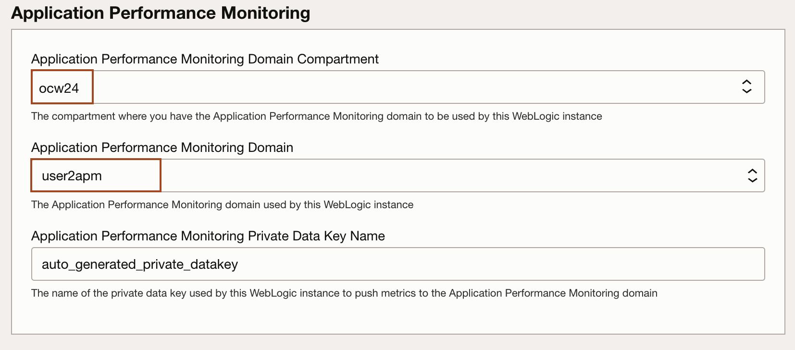

# Create a WebLogic for OCI stack from the Marketplace

## Introduction

Setting up the Oracle WebLogic Server Enterprise Edition BYOL stack in Oracle Cloud Infrastructure (OCI) involves several key steps. This guide will help you create the stack, download and configure JMeter within the Cloud Shell environment, and obtain the load-generating configuration file. These preparations are essential for effectively simulating and observing autoscaling behavior.

Estimated Time: 15 minutes

### Objectives

In this lab, you will:
* Create Stack: Oracle WebLogic Server Enterprise Edition BYOL
* Download and configure the JMeter for the Cloud Shell
* Download Load generatings configuration file

### Prerequisites
This lab assumes you have:

* An Oracle Cloud account.
* You have generated the pair of SSH keys.

## Task 1: Create Stack: Oracle WebLogic Server Enterprise Edition BYOL

In this task, we create WebLogic for OCI stack using **Oracle WebLogic Server Enterprise Edition BYOL** image in the OCI Marketplace.

1. In the new tab, open the [OCI Console](http://cloud.oracle.com). In OCI Console, click **Hamburger menu** -> **Marketplace** -> **All Applications**.
    

2. Type **WebLogic** in the search box and then click **Oracle WebLogic Server Enterprise Edition BYOL** as shown below.
    

3.  Select the latest version available and choose your **compartment** name from the data sheet and check the box for accepting the terms and condition. Click **Launch Stack**.
    

4. In **Stack information** section, leave everything default and click **Next**.
    

5. Enter your username as **Resource Name Prefix** and Click **Paste SSH key** and paste the content of **id_rsa.pub** file as shown below. Make sure you use your username as prefix, as we will use this in further labs. For example, if your username is userN, then your Resource Name Prefix will be userN.
    

6. Check the box for the  **Create a Virtual Cloud Network**, **Provision Load Balancer**,  **Enable Application Performance Monitoring**, **Enable Autoscaling** as shown below.
    
    > Make sure the box for **OCI Policies**, **Enable Authentication Using Identity Cloud Service**, **Enable Exporting Logs to OCI Logging Service** are unchecked.

7. In **Virtual Cloud Networking** section, enter the name for Virtual Cloud Networking Name as shown below. If your username is userN, then enter the name as **userNvcn**.
    
    > If your username is userN, then enter the name **userNvcn**.

8. In **WebLogic Domain Configuration** section, select the secret where we have stored the WebLogic Admin Server Password in **Validated Secret for WebLogic Server Admin Password** and leave other defaults as shown below. It will be same for everyone.
    

9. In **WebLogic Server Compute Instance** section, select any availability domain in **WebLogic Administration Server Availability Domain** and leave other defaults as shown below.
    

10. In **Bastion Instance** section, check the box for **Assign Reserved Public IP to Bastion Instance** and leave other defaults as shown below.
    

11. In **Load Balancer** section, keep the defaults as shown below.
    

12. In **Application Performance Monitoring** section, select the apm domain from the compartment **ocw24** and leave other defaults as shown below. 
    

13. In **Autoscaling** section,select the following values as shown below. </br>
    **WebLogic Monitoring Metrics**:    CPU Load</br>
    **Minimum Threshold Percent**:      10</br>
    **Maximum Threshold Percent**:      80</br>
    **Registry User Name**:             OCW24/testuser. To access image in the OCI registry to deploy autoscaling function, we have created this shared user.</br>
    **Validated Secret for OCIR Auth Token**: select secret **authtoken** from **ocw24** compartment</br>
    
    
    

14. Click **Next**.
    

15. Review the stack information and click **Create**.
    

    > This will start a job as shown below.
        
        


## Task 2: Download and configure the JMeter for the Cloud Shell

In this task, We download Apache Jmeter and Configure PATH varibale in the Cloud Shell. We use Jmeter for simulating the CPU Load in the WebLogic Cluster.

1. Copy and paste the following command in the Cloud Shell to download the Jmeter and unzip it as shown below.
    ```bash
    <copy>cd ~
    wget https://dlcdn.apache.org//jmeter/binaries/apache-jmeter-5.6.3.zip
    unzip apache-jmeter-5.6.3.zip</copy>
    ```

## Task 3: Download Load generating files

In this task, We download the files in the Cloud Shell. Thi

1. Copy and paste the following command in the Cloud Shell to download the load generating files. The JMX file contains the test plan, defining the parameters and behavior of the load test, while the Python (py) file will be used to increase the CpuLoad.

    ```bash
    <copy>curl -O https://objectstorage.uk-london-1.oraclecloud.com/p/efQcFhIIGIGAUeiBmC2KWJnmDS8a34GQkLaln4lSEIghkkZ0jyvgNqwIjrnBuj4b/n/lrv4zdykjqrj/b/ankit-bucket/o/autoscale-workshop.zip   
    unzip autoscale-workshop.zip</copy>
    ```

You may now proceed to the next lab.

## Acknowledgements
* **Author** -  Ankit Pandey
* **Contributors** - Adrian Padilla Duarte , Sid Joshi
* **Last Updated By/Date** - Ankit Pandey, July 2024