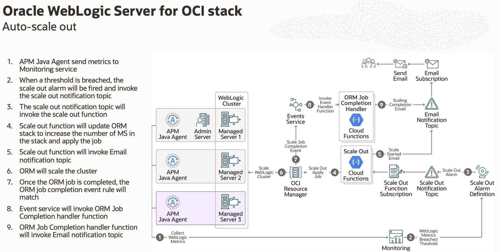

# Introduction

## About this Workshop

Welcome to the workshop on autoscaling in the WebLogic for Oracle Cloud Infrastructure (OCI) stack. This workshop is designed to provide you with a comprehensive understanding of how to deploy, monitor, and manage the autoscaling capabilities of WebLogic applications within OCI. Through a series of hands-on labs, you will gain practical experience in optimizing resource utilization and ensuring robust application performance.

In this workshop, you will create and validate the WebLogic Server Enterprise Edition BYOL stack, ensuring you can successfully deploy and access your WebLogic environment. This phase sets the stage for the core focus of the workshop: understanding and implementing autoscaling.

In the final part of the workshop, you will observe the autoscaling process in action. By generating CPU loads and monitoring the corresponding scaling activities, you will see firsthand how WebLogic for OCI dynamically adjusts resources to meet application demands. Additionally, you will learn how to clean up and delete autoscaling and stack resources when they are no longer needed. By the end of this workshop, you will have a solid grasp of deploying, managing, and optimizing autoscaling for WebLogic applications on OCI.

Estimated Time: 90 minutes

### Objectives

* Create Stack: Oracle WebLogic Server Enterprise Edition BYOL
* Download and configure the JMeter for the Cloud Shell
* Download the Load generating configuration file
* Validate the stack and copy the IP of Bastion, Load balancer and WLS Node
* Observe the Alarms created by WebLogic for the OCI stack
* Generate the CPU Load on WebLogic Server to view scaleout
* Delete Autoscaling Resources
* Destroy Stack Resources and delete stack
           

## About Product/Technology
### About Oracle WebLogic Server for OCI
Use Oracle WebLogic Server for OCI to quickly create your Java Enterprise Edition (Java EE) application environment in Oracle Cloud Infrastructure, including an Oracle WebLogic Server domain, in a fraction of the time it would normally take on-premises.

Oracle WebLogic Server for OCI is available as a set of applications in the Oracle Cloud Infrastructure Marketplace. After launching one of these applications, you use a simple wizard interface to configure and provision your domains along with any supporting cloud resources like compute instances, networks and load balancers.

You can track and monitor the progress of an Oracle WebLogic Server for OCI stack in Resource Manager. As your workload requirements change, you can use Resource Manager to scale the domain by adding or removing managed servers. A stack also provides a convenient method of deleting the cloud resources for a domain when you no longer require them.

After creating an Oracle WebLogic Server domain, you can administer the domain and deploy Java EE applications to it just like on-premises domains. Use standard Oracle WebLogic Server tools like the administration console and WebLogic Scripting Tool (WLST). You can also administer the operating system on the compute instances using a secure shell (SSH) client and standard Linux tools.

## Learn More

* [Using Oracle WebLogic Server for OCI](https://docs.oracle.com/en/cloud/paas/weblogic-cloud/user/oracle-weblogic-server-oracle-cloud-infrastructure.html)

* [Auto-scaling in Oracle WebLogic Server for OCI](https://blogs.oracle.com/weblogicserver/post/auto-scaling-in-oracle-weblogic-server-for-oci)

## Acknowledgements

* **Author** -  Ankit Pandey
* **Contributors** - Sid Joshi, Maciej Gruszka
* **Last Updated By/Date** - Ankit Pandey, July 2024